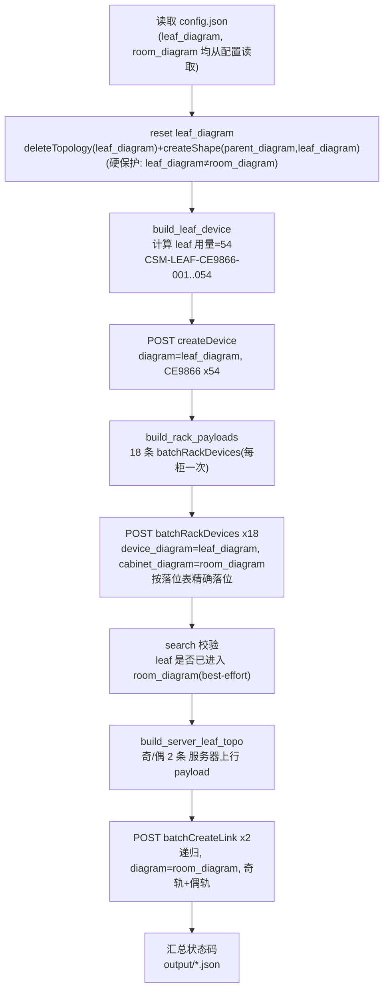

# csm-rack · 参数面 Leaf 跨视图上架 skill

本 skill 把 leaf **建在「参数面」视图（`leaf_diagram`）**，再**跨视图上架到 config.json 指定的 `room_diagram` 视图**（已预建 server、机柜、组合模型；视图名由配置决定，可以是"机房视图"、"JDJL1"等任意名称），依次完成：

1. **重置参数面**：`deleteTopology(leaf_diagram)` → `createShape(parent_diagram, leaf_diagram)`，得到干净空视图
2. **建设备**：在 `leaf_diagram` 批量创建 54 台参数面接入交换机（CE9866）
3. **上架**：按落位表把 54 台 Leaf 每柜一次（共 18 次）精确上架到 `room_diagram` 视图的 401/402/403 机柜
4. **建拓扑**：在 `room_diagram` 视图内用 `batchCreateLink` 递归连线，生成 server→leaf 双轨拓扑

**硬性约束：`deleteTopology` 只作用于 `leaf_diagram`（参数面），绝不作用于 `room_diagram`；编排层有断言保护，配置或参数误将二者设为相同值会立即中止。**

---

## 业务流



为什么顺序是 **建 leaf → 上架 → 连线**：跨视图连线只能在单个视图内进行；leaf 建在 `leaf_diagram`、server 在 `room_diagram`，必须先上架把 leaf 带进 `room_diagram`，再在 `room_diagram` 内连线。

---

## 输入 / 输出 / 配置

- **输入**：`DataGrid.xlsx`（`D:\Project\AIDA\相关文件\DataGrid.xlsx`），含 432 台智算服务器名、机柜、机房信息。
- **配置**：`config.json`，关键项：
  - `base_url`：`http://100.102.191.17:9091`
  - `leaf_diagram`：`参数面`（建 leaf + 重置的视图，**绝不能与 `room_diagram` 相同**）
  - `room_diagram`：上架目标 + 连线视图（**名称可自由修改**，如 `"机房视图"`、`"JDJL1"` 等；该视图须已预建机柜/server/组合模型，绝不删除）
  - `parent_diagram`：`顶层`（createShape 创建 leaf_diagram 时的父视图）
  - `reset_leaf_view`：`true`（运行前重置参数面，保证干净 54 台）
  - `auth.token`：Bearer Token
  - `server_source`：DataGrid.xlsx 路径
  - `plane`：leaf 型号/角色/命名/端口策略
  - `rack`：上架参数（startU/interval/installationDirection/allocationDirection/call_mode=per_cabinet）
  - `topo`：`endpoint=batchCreateLink`、`diagram` 留空则自动取 `room_diagram`
- **输出**（`output/`）：
  - `resetView.result.json`：重置 leaf_diagram 结果（delete + createShape）
  - `createDevice.params.json`：建 leaf 设备接口参数（diagram=leaf_diagram）
  - `batchRackDevices.params.json`：上架接口参数（18 条，跨视图）
  - `batchCreateLink.params.json`：建拓扑接口参数（奇/偶双轨）
  - `execution-result.json`：每步调用的 HTTP 状态码 + ok + 摘要

---

## 运行

```powershell
pip install -r requirements.txt

# 修改 config.json 中的 room_diagram 为目标视图名（如"机房视图"、"JDJL1"等），填入 auth.token
cd D:\Project\AIDA\A3\csm-rack
python scripts/run_device_install.py

# 可选：跳过已完成步骤
python scripts/run_device_install.py --skip-reset            # 跳过重置参数面
python scripts/run_device_install.py --skip-device           # 跳过建设备
python scripts/run_device_install.py --skip-rack             # 跳过上架
python scripts/run_device_install.py --skip-topo             # 跳过连线
```

---

## 目录结构

```
csm-rack/
  SKILL.md                   # 本文件
  config.json                # 实际配置（base_url / leaf_diagram / room_diagram / token）
  config.example.json        # 配置模板
  requirements.txt           # requests + openpyxl
  reference/
    rack-mounting-rules.md        # leaf 落位规则 + 跨视图 batchRackDevices（18 次每柜）
    leaf-cabinet-allocation.md    # 每机房每机柜放哪几台 leaf（401/402/403 完整落位表）
    server-leaf-interconnect.md   # server→leaf 拓扑连线规则（A3 双轨 + batchCreateLink）
    api-reference.md              # API 端点速查（deleteTopology/createShape/createDevice/batchRackDevices/batchCreateLink）
  scripts/
    sim_api_client.py        # HTTP 客户端（Bearer Token + GET 支持）
    read_servers.py          # 读 DataGrid.xlsx -> 有序 server 名列表
    build_leaf_device.py     # 生成 createDevice payload（54台 CE9866，diagram=leaf_diagram）
    build_server_leaf_topo.py# 生成 server→leaf 双轨拓扑 payload（diagram=room_diagram）
    build_rack_payloads.py   # 生成 18 条 batchRackDevices payload（每柜一次，跨视图）
    run_device_install.py    # 编排入口（reset leaf_diagram -> 建leaf -> 上架 -> 连线）
  output/                    # 运行时生成
```

---

## 关键参数说明

### Leaf 命名规则

`CSM-LEAF-CE9866-001` ... `CSM-LEAF-CE9866-054`（3位补零序号）

- createDevice、batchRackDevices、batchCreateLink 三处设备名必须完全一致。

### Leaf 数量推导

```
server_uplink_ports = 8（A3 每台 8×400GE）
rail_ports_per_server = 8 / 2 = 4（双轨每轨 4 口）
leaf_downlink_pool = 64（CE9866 128口，前半下联）
block_size = 64 / 4 = 16（每台 leaf 接 16 台 server）
block_count = ceil(432 / 16) = 27
leaves_used = 27 × 2 = 54（双轨）
```

### 上架规则（每柜一次，共 18 次）

- 起始 U 位：41；方向：由上向下（allocationDirection=1）；间隔：3U；安装面：正面（F）。
- 奇数编号 Leaf → 17 柜；偶数编号 Leaf → 18 柜。
- 401 机房 leaf 001-024，402 机房 leaf 025-048，403 机房 leaf 049-054。
- **跨视图**：`device_diagram=leaf_diagram`、`cabinet_diagram=room_diagram`（由 config.json 配置，名称可变）。
- 详见 `reference/rack-mounting-rules.md` 与 `reference/leaf-cabinet-allocation.md`。

### 拓扑连线（batchCreateLink 递归）

- server 嵌套在组合模型内、leaf 上架后嵌套在机柜内，须用 `batchCreateLink`（递归 type_group=7）而非 `createTopoLink`（仅直接子节点）。
- 连线视图 = `room_diagram`（由 config.json 配置，名称可变）；奇/偶双轨各 1 条 payload。
- 业务码 `800114`（线缆规格不匹配）视为成功告警，不中止流程。

---

## 假设与风险

| 风险 | 说明 | 缓解方案 |
|------|------|---------|
| 上架是否真把 leaf 移入 room_diagram 树 | 若 batchRackDevices 仅逻辑挂载、leaf 仍归属 leaf_diagram，则 batchCreateLink(room_diagram) 可能找不到 leaf | 上架后 `search` 校验 leaf 落位（best-effort 告警）；必要时改连线视图 |
| server 名匹配 | 拓扑 source 用 DataGrid 名，须与 room_diagram 组合模型内实际 server 名一致（组合导入可能按 sp_num 改名） | 用 `childNode`/`search` 导出 room_diagram 真实设备名比对 |
| 参数面父视图非 parent_diagram | createShape 父节点不存在会失败 | 调整 `config.parent_diagram` |
| Leaf 设备名冲突 | 重复运行时若未重置参数面，createDevice 可能报同名错 | 默认 `reset_leaf_view=true` 重置参数面；或用 `--skip-device` |
| **误删 room_diagram** | **绝对禁止** 对 `room_diagram` 调用 deleteTopology | 编排层断言 `leaf_diagram != room_diagram`，reset 仅作用于 leaf_diagram |
| room_diagram 视图名变更 | 换视图后旧 leaf/拓扑仍留在旧视图 | 修改 config.json 的 `room_diagram` 后全量重跑（--skip-reset 保留参数面 leaf 可选） |

---

## 与 csm-analysis 的关系

| 项目 | csm-analysis | csm-rack（本 skill） |
|------|-------------|--------------------------|
| 建 leaf 视图 | 参数面（先删后建） | 参数面（先删后建） |
| 上架/连线视图 | 无（仅参数面建模） | room_diagram（由 config.json 配置，已存在，绝不删除） |
| 建设备 | Spine + Leaf + Server（全量） | 仅 Leaf（54台） |
| Server 来源 | 按命名规则自动生成 | DataGrid.xlsx 真实设备名 |
| Leaf 序号 | 2位（01..76） | 3位（001..054，仅实际用量） |
| 拓扑 | server→leaf + leaf→spine（createTopoLink） | 仅 server→leaf（batchCreateLink 递归） |
| 上架 | 不含 | 含（跨视图 batchRackDevices 18 次） |
| deleteTopology 作用域 | 参数面 | 参数面（room_diagram 绝不删除） |
