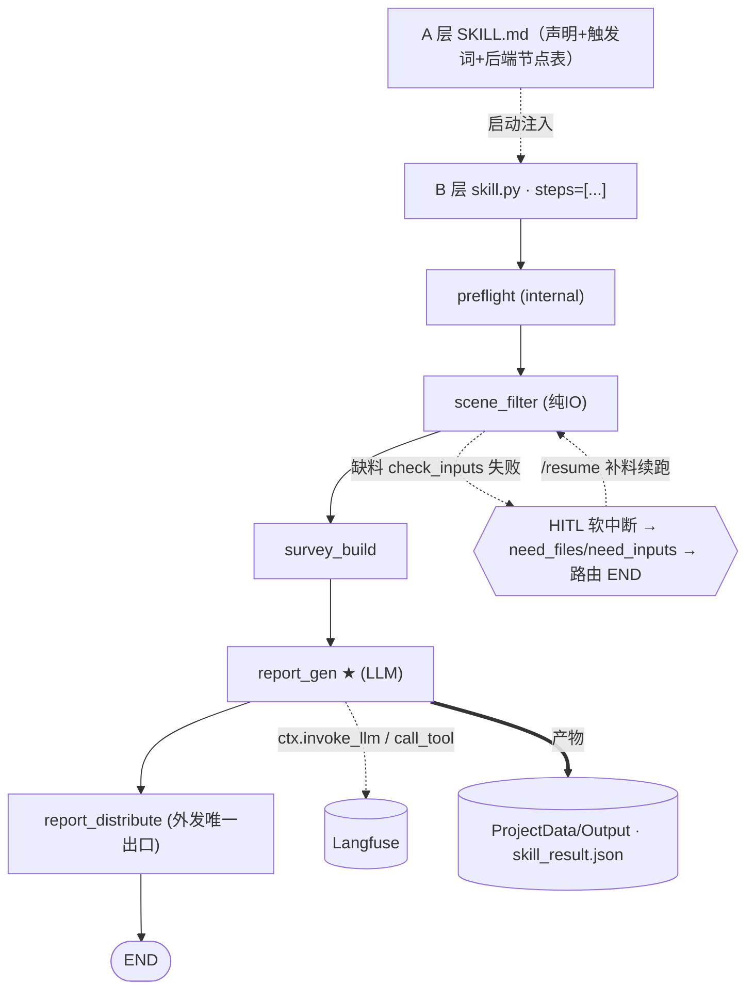

# 业务场景 Skill · 开发起手式（START_HERE）

> **本文是写给 AI agent（Claude Code / Cursor）的执行流程**，也供人对照"agent 会怎么干"。
> **触发**：当开发者说「开发 / 迁移一个业务场景 skill」时，你（agent）**先完整读本文，按流程执行，不要自由发挥**。
> **本文只管「抽象模型 + 执行流程」**——每步的契约细则点链接，本文不复制（契约只有一份真相）。
> 🖱️ **想要人点击式逐步引导 + 每步可直接复制的 AI 提示词？** 开 [团队门户 · 模块开发者门](../site/portal.html)（本文的 clickable 伴随版，每步附 prompt）。源在 [`docs/onboarding/portal.json`](../onboarding/portal.json)。

| 本文（抽象 + 编排） | 权威细则（契约，被本文引用） |
|---|---|
| 业务抽象模型 · 交互采集 · 执行流程 · 守门 | [AGENT_QUICKSTART](AGENT_QUICKSTART.md) · [SKILL-DEVELOPMENT](../30_skill开发/31_手写规范/SKILL-DEVELOPMENT.md) · [SDUI](../30_skill开发/31_手写规范/SDUI.md) · [接入规范](../30_skill开发/31_手写规范/接入/接入-Skill与LangGraph接入规范.md) |

---

## §1 · 你的位置（30 秒）

你要写的是四层架构**执行层**的**业务场景 Skill**，运行时 ← 数据中心取数 / ← Manager 拉容器 / → 前端推进度。

> **不分「从头写 / 迁移」两条路** —— 都从写业务逻辑书（Raw Skill）开始走 §4 同一条流水线；有现成 skill/脚本时只是 §4① 多一个动作（先读它、抽取信息、补 Raw Skill）。

**本系统对 skill 有 A 层 / B 层 双层硬要求**（和普通 LangGraph 项目最大的不同）：
- **A 层** = `skills/<name>/SKILL.md`：声明/触发器（给 agent 看的"说明书 + 触发词 + 后端节点表"）
- **B 层** = `agent/skills/<name>/`：真实执行（`skill.py` + `steps/*.py` + `sdui.py`）
- **lint 卡死**：A 层「后端节点」表 ≡ B 层 `step.key`（顺序+内容），改一层不改另一层提交失败。
> 一个 skill 横跨哪些文件，看 [00 开发者地图 §2 那张图](../00_开发者地图.md)。

---

## §2 · 业务场景 Skill 的抽象模型 ★（先理解这个，再套你的业务）

> ⚠️ zhgk（智慧工勘）和 guihua（规划设计/建模仿真）**不是两个让你照抄的特例，而是同一个抽象的两个实例**。
> **你的任务不是模仿某一个，而是把开发者的新业务映射到下面的抽象骨架上。**

### 2.1 业务通用形态（业务特点抽象）

任何业务场景 skill 都是这条管道的实例：
```
初始数据包(上传文件) → [路由] → 阶段1: LLM 识别/抽取
   → HITL 确认门 → 阶段2..N: AI 计算/生成 → [HITL 最终确认]
   → 多制品产出（JSON / XLSX / Word / Markdown）
```

| 抽象槽位 | zhgk 实例 | guihua 实例 | 你的业务填什么 |
|---|---|---|---|
| 输入件 | BOQ 表 + 评估底表 | BOQ 表 + 资料包 | ？ |
| 处理阶段 | 场景筛选→勘测汇总→评估→分发 | BOQ抽取→建设备→建拓扑 | ？ |
| LLM 判断点 | 代际识别 / 风险评估 | 设备抽取 | ？ |
| HITL 介入点 | 意图选 / 代际定 / 表确认 / 现场上传 / 复勘决策 | 设备确认 / 拓扑确认 | ？ |
| 产物 | 报告.docx + 5 张 Excel | 设备清单.json + 拓扑.md | ？ |

> 采集业务（§3）的本质，就是把开发者的场景**填满这张表**。

### 2.2 选编排原型（决定 steps 怎么串）

| 原型 | 何时选 | 样板 | 机制 |
|---|---|---|---|
| **纯线性流水线** | 单一业务流、步骤必经 | guihua（5 步必经） | steps 顺序执行 |
| **意图驱动线性** | 多业务流共享步骤、按意图跳步 | zhgk（4 意图共享一条线） | step 内 `should_skip(key, intent)` |
| **命令分发 dispatch** | 菜单式、各能力独立任意顺序触发 | xtsj | `dispatch_mode=True`，每命令一 step |

"意图驱动线性"实例（zhgk）——注意它本质仍是一条线性 step 链，只是按意图跳步：


### 2.3 开发骨架：必有 vs 按需（开发流程抽象）

| 层 | **必有**（每个 skill 都要） | **按需**（按业务选，zhgk/guihua 的差异都在这一列） |
|---|---|---|
| Skill 类 | `name` · `description` · `steps[]` · `sdui_projector` | `file_handler`（有文件型 HITL）· `step_retry_keys`（有"易变 LLM 步"要单步重试）· `initial_project`（补默认）· `apply_resume_payload`（HITL 续跑写回）· `_intent_guard`（意图驱动才要） |
| Step 类 | `key` · `name` · `check_inputs()` · `run()` | `artifacts_pattern` · `should_skip()`（意图驱动）· 缓存检查（幂等步避免重复调 LLM） |
| HITL | `check_inputs` 返回 `missing`（文件型→FilePicker）或 `need_inputs`（确认型→ChoiceCard） | `redo` 语义 / `confirm` 写回 / 缓存跳重复 LLM |

差异即"按业务做的选择题"，例：
- 多业务流 → 意图驱动（zhgk）；单一流程 → 纯线性（guihua）
- LLM 推理步易变 → 进 `step_retry_keys`（zhgk 的 `assess`）；规定性强 → 不需要（guihua）
- 幂等抽取 + 可能 redo → 缓存（guihua `boq_extract` 缓存 device_list）；否则每次重推（zhgk）

### 2.4 调用骨架（调用流程抽象 · 注册即得，你零改）

```
POST /start ─初始化 run+project(initial_project)→ {run_id}
GET  /stream/{run_id} (SSE) ─逐 step：
        check_inputs ok → run(emit 日志 + 写产物)
        check_inputs 缺料/待确认 → HITL 软中断（SSE event: hitl）
POST /resume {choice|files} ─ apply_resume_payload 写回 project → 续跑
        默认 full_restart（新 thread；缓存命中则跳重复 LLM）
        step_retry_keys 命中 → 仅重跑该 step
GET  /artifact?path=… 下载产物   GET /ui/{run_id} → sdui_projector(state) 渲染界面
→ 产物落 ProjectData/Output → eval（质量/成功率/成本/延迟 + golden）
```
> 全套 `/agent/{skill}/{start,stream,resume,ui,artifact,runs}` **注册一行即得**——`main.py`/`graph.py` 已泛化，你**零改**。

参考源码：[`agent/skills/zhgk/`](../../agent/skills/zhgk/) · [`agent/skills/guihua/`](../../agent/skills/guihua/) · 基类 [`agent/skills/base.py`](../../agent/skills/base.py)。

---

## §3 · 通用前置（动手前必做）

**① 环境就绪**（一次）：`python -m venv agent/.venv` → `pip install -r agent/requirements.txt`；`agent/.env` 配 `ZHIPU_API_KEY`（缺 key 仍可搭骨架，lint 显 SKIP）。详见 [AGENT_QUICKSTART §0](AGENT_QUICKSTART.md)。

**② 交互采集业务场景（铁律：禁止凭空假设业务）。**
动手前，向开发者问全 §2.1 那张表 + 选定 §2.2 编排原型，**缺哪问哪、一次问一组**，采集完用一段话**回显确认**，批准后落成 §4① 的 Raw Skill（业务逻辑书）再开编译：
```
· skill 名(英文小写下划线) · 触发词
· 输入件 → 产物 · 处理阶段序列
· 每阶段：要不要 HITL（缺料/确认）？ 有没有 LLM 判断点 / 业务规则？
· 编排原型：线性 / 意图驱动 / dispatch？ · 要不要界面(SDUI)？
· 〔有现成 skill/脚本时〕现有代码在哪、入口怎么跑、产物长什么样（用于抽取补 Raw Skill）
```

---

## §4 · 开发流程（= 把业务逻辑「编译」成 skill 模块 · 从头写 / 迁移既有都走这一条）

> 本质是一条流水线（skill2langgraph 的本地手做版 · 现状🟡：业务专家引导编写 / 全自动编译程序并行在建，当前你带 coding agent 手做，产物与全自动版同构）：
> **① 业务逻辑(Raw Skill) → ② 编译·执行支线(steps/skill.py) ‖ ③ 编译·呈现支线(SDUI)〔两条并行〕 → ④ 本地跑通 → ⑤ 注册回流**
> 角色：**业务专家**(写 Raw Skill) · **你 + AI**(编译) · **组件管家（金涛）**(补缺的 SDUI 组件)

**① 写业务逻辑书（Raw Skill）** —— 把 §3 采集的内容落成业务语言文档（不写代码）：输入/输出/步骤/规则/LLM 判断点/HITL 点；每处「拿不准 → 定下来」记进 assumptions 清单；写完过自检（HARD-GATE）。
> **有现成 skill / 脚本 / 原型？不分支** —— 先读它、按 Raw Skill 目标抽取信息（输入/步骤/规则/判断点），据此**补全 Raw Skill**，之后照 ②~⑤ 同走。迁移既有代码额外守四大保真红线（子脚本**真实调起**不占位 · 意图**不降级** · SDUI **phase 渐进** · **零 mock**），见 [接入规范](../30_skill开发/31_手写规范/接入/接入-Skill与LangGraph接入规范.md) · [SDUI 接入规范](../30_skill开发/31_手写规范/接入/接入-SDUI接入规范.md)。
→ [可编译业务 Skill 编写规范](../30_skill开发/39_编译路线_skill2langgraph/可编译业务Skill编写规范.md)（§22 模板 / §21 清单）· [交付契约](../30_skill开发/39_编译路线_skill2langgraph/contracts/交付契约.md) · [校验规则集](../30_skill开发/39_编译路线_skill2langgraph/contracts/校验规则集.md) · [assumptions 清单 schema](../30_skill开发/39_编译路线_skill2langgraph/contracts/assumptions-schema.md)　🟡 引导编写程序在建，当前手写。

**② 编译 · 执行支线**（steps + skill.py，与 ③ 并行）—— 复制 `_template`，把 Raw Skill 每步翻成一个 `BaseStep`（`check_inputs` 定 HITL + `run`），skill.py 声明 `steps[]`，`build_graph` 自动成图（**别手写 graph.py**）。再写 A 层 SKILL.md（节点表 ≡ `step.key`）+ 注册一行 + 按需钩子。
⚠️ **对齐运行时真身**（不对就跑不起来）：节点返 **state 差量** · steps/logs 走 reducer 累加 · HITL = **软中断**（写 `state['hitl']` → END → resume，**非** `interrupt()`）· 工具失败返回 `Error:` 字符串**不抛异常** · 大模型**无原生结构化输出** → 适配层注 schema + 解析 JSON。
⚠️ `check_inputs` 的必填路径必须 = `run` 真正读的路径，否则 HITL 缺料清单漂移。
→ 脚手架 [`agent/skills/_template/`](../../agent/skills/_template/) · 样板 [`agent/skills/zhgk/skill.py`](../../agent/skills/zhgk/skill.py) · [SKILL-DEVELOPMENT §3 BaseStep](../30_skill开发/31_手写规范/SKILL-DEVELOPMENT.md) · [AIDA-RUNTIME-CONTRACT §5/§0](../30_skill开发/31_手写规范/AIDA-RUNTIME-CONTRACT.md) · [skill 打包契约](../30_skill开发/39_编译路线_skill2langgraph/contracts/skill打包契约.md) · [SkillIR-schema](../30_skill开发/39_编译路线_skill2langgraph/contracts/SkillIR-schema.md) · [执行手册](../30_skill开发/39_编译路线_skill2langgraph/skill2langgraph执行手册.md)
> 命令（venv 下）：`python agent/scripts/lint_skill_contract.py` · `python agent/scripts/lint_runtime_contract.py` · `python agent/scripts/lint_tools.py`

**③ 编译 · 呈现支线**（SDUI，与 ② 并行）—— 把界面设计 + Raw Skill 的「要展示什么」写成 `sdui.py` 的 `project(state)`：通用段（stepper/进度/HITL/artifacts）复用 `projector_base`，业务段（KPI/告警）投影 metrics。**只用现有组件**；真缺组件 → 生成一段「组件需求」发给**组件管家（金涛）**统一补，本处先用最接近的现成组件顶着。
⚠️ 投影器只能读 step 真写进 `metrics`/`state` 的键（要展示的数据 step 必须写进去，别只落磁盘）。
→ [SDUI §3.2 投影器](../30_skill开发/31_手写规范/SDUI.md) · **视觉组件库 [SDUI 组件库 v4](../30_skill开发/31_手写规范/SDUI%20组件库%20v4.html)**（对照可用组件）· 组件清单 [`agent/sdui/builder.py`](../../agent/sdui/builder.py) · 样例 [`agent/skills/zhgk/sdui.py`](../../agent/skills/zhgk/sdui.py) · [SDUI 组件库需求](../30_skill开发/39_编译路线_skill2langgraph/requirements/SDUI组件库需求.md)
> 命令：`python -c "from agent.skills.<name>.sdui import project; print(project({}))"`（空态自检）· `python agent/scripts/lint_sdui_contract.py`

**④ 本地跑通**（端到端到 done）—— `POST /start` → 订阅 stream 跑到 done；缺料 HITL 软中断 → `/upload` + `/resume` 续跑；产物落 `ProjectData/Output`；写 2-3 条 eval 阈值断言。
🟡→🔴 当前本地 `work_root` 占位；目标形态 = 真机容器 + 数据中心 files API + 三类验证（行为 ∧ 契约 ∧ 运行稳定）。
→ [AGENT_QUICKSTART §7 端到端自检](AGENT_QUICKSTART.md) · [SKILL-DEVELOPMENT §5 HITL/resume](../30_skill开发/31_手写规范/SKILL-DEVELOPMENT.md) · eval 模板 [`agent/evals/eval_skill.template.py`](../../agent/evals/eval_skill.template.py)
> 命令：`uvicorn agent.main:app --host 127.0.0.1 --port 7401 --reload` · `curl -X POST http://127.0.0.1:7401/agent/<name>/start -d '{}'` · `npm run eval`

**⑤ 注册上线 + 回流** —— `agent/skills/__init__.py` 注册一行；`skills/<name>/SKILL.md` 部署两处（仓库 + `~/.claude/skills/`）；通过验证的新工具回流公共工具库；金涛补的组件合进组件库。🔴 镜像 digest 钉死 / 无头重验待建，当前注册即生效。**别动 `main.py`/`graph.py`**（已泛化）。
→ [流水线 README §6 工具回流](../30_skill开发/39_编译路线_skill2langgraph/README.md) · [测试底座对齐方案（digest 钉死）](../30_skill开发/39_编译路线_skill2langgraph/测试底座对齐方案.md)
> 命令：`curl http://127.0.0.1:7401/agent/skills`（看到 `<name>` = 注册成功）

**⑥ 守门全绿** → §5。
> 机械细节（碰哪 9 个文件 / step 代码骨架 / 钩子全集）见 [AGENT_QUICKSTART](AGENT_QUICKSTART.md)；**每步可直接复制的 AI 提示词**见 [portal · 模块开发者门](../site/portal.html)（提示词单一真相在 portal，本文不复制）。

---

## §5 · 守门收尾（全绿才算完成）

声称"做完"前，**必须在 venv 下跑并确认全绿**（有证据再说完成）：
```bash
python agent/scripts/lint_no_naked_llm.py      # 禁裸 LLM
python agent/scripts/lint_no_naked_send.py     # 禁裸外发
python agent/scripts/lint_skill_contract.py    # A 层节点 ≡ steps[].key
python agent/scripts/lint_tools.py             # 工具契约（若加了工具）
python agent/scripts/lint_sdui_contract.py     # SDUI 三方一致（若做了界面）
python agent/scripts/lint_runtime_contract.py  # 运行时契约 ≡ 代码（DEFAULT_TOOLS/is_tool_error）
python agent/scripts/lint_module_boundaries.py # 跨 skill 零横向依赖 + 已入边界图
python agent/evals/eval_zhgk.py --fixture      # 评测回归（或你的 eval_<name>）
```
> 守门红 = 没做完。别跳过、别注释掉 lint。

---

## §6 · 不要做（红线）

- ❌ 裸调 LLM（`import openai/anthropic/litellm`、`requests/httpx` 直打端点）→ 走 `ctx.invoke_llm`
- ❌ 绕过 registry 调工具 → 走 `ctx.call_tool`
- ❌ 改 `agent/main.py` / `agent/graph.py`（已泛化，注册即得端点）
- ❌ 复制契约正文（只链接，单一真相）
- ❌ 裸外发邮件/IM → 走 `agent/mailer.py` / `notifier.py`
- ⚠️ A 层 SKILL.md 两处就绪：仓库 `skills/<name>/SKILL.md`（唯一真相）+ `~/.claude/skills/<name>/SKILL.md`（运行时副本；loader 未部署时自动回退到仓库副本）

---

## 按需深读

| 想知道 | 看 |
|--------|-----|
| 规范条文（六铁律 + §0 守门） | [03 · 团队 Agent 开发范式](../20_架构与范式/03_团队Agent开发范式.md) |
| zhgk / guihua 怎么落地 | [02 · 交付 Claw 工程范式](../20_架构与范式/02_交付Claw_Agent工程范式.md) · [样板盘点](../30_skill开发/样板盘点_智慧工勘zhgk.md) |
| 系统全貌（四层架构） | [01 · 系统架构梳理](../20_架构与范式/01_AI智能化系统架构梳理.md) |
| 写 Skill / 工具细则 | [SKILL-DEVELOPMENT](../30_skill开发/31_手写规范/SKILL-DEVELOPMENT.md) · [TOOL-DEVELOPMENT](../30_skill开发/31_手写规范/TOOL-DEVELOPMENT.md) |
| 做界面（SDUI） | [SDUI](../30_skill开发/31_手写规范/SDUI.md) |
| 既有模块合入红线 | [接入规范](../30_skill开发/31_手写规范/接入/接入-Skill与LangGraph接入规范.md) |
| 编译路线：业务专家产线化产 skill（并行开发中） | [39_编译路线 skill2langgraph](../30_skill开发/39_编译路线_skill2langgraph/README.md) |
| 测什么 / 怎么跑评测 | [METRICS](../40_评测/METRICS.md) · [评测操作手册](../40_评测/README.md) |
| 为什么这么定（ADR） | [decisions/](../90_决策ADR/README.md) |

---

> **维护**：本文件是开发起手式唯一真相（`docs/10_快速开始/START_HERE.md`），直接改源。
