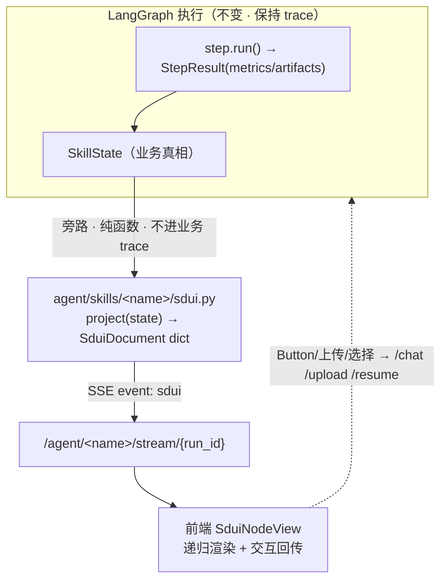

# SDUI 开发规范（Skill Declarative UI）

> 对应团队范式（[03](../../20_架构与范式/03_团队Agent开发范式.md)）：**§3.3 SDUI 灯塔**、**§5 契约先行**、**§6 可观测**。
> 样板：智慧工勘 `zhgk`（作业界面已全量 SDUI 化）。
> 一句话：**后端把 `SkillState` 投影成一棵 UI 树（JSON），前端通用渲染器递归渲染——新模块只写后端投影器，前端零改动。**
> 🎨 **写 `sdui.py` 前先看现成组件**：[SDUI 组件库 v4](SDUI%20组件库%20v4.html)（视觉版目录 · 浏览器打开，对照可用组件再投影；契约目录另见 builder 派生的 [`sdui-gallery.html`](../../site/sdui-gallery.html)）。

---

## 1. 为什么是 SDUI

多个业务场景 Skill要「统一风格界面 + 交互」，传统做法是每个模块各写一套前端。SDUI 把界面变成**后端数据的投影**：

```
模式 A（旧）：SkillState → 每模块各写 React 界面（风格难统一、改动要动前端）
SDUI（新） ：SkillState → SduiNode 树（通用 JSON）→ SduiNodeView 通用渲染（前端零改）
```

三个核心红利：

| 诉求 | SDUI 为什么是正解 |
|------|------------------|
| 数据全进数据中心 | SDUI 是「后端数据 → UI 树」的投影，数据在哪不重要，投影器把它变成树即可 |
| 多模块统一风格 | 所有模块共用一套组件库 + 渲染器，新模块只写后端 builder，风格交互天然一致 |
| 随数据产生呈现 | 投影器是 `SkillState` 的纯函数，每个 step 完成后 SSE 推一棵新树，前端整渲染 |

---

## 2. 架构：投影器模式（不侵入 LangGraph）

**关键设计**——SDUI 作为「读模型投影」旁路存在，完整保留可观测性：



**为什么是投影器而非 step 内产 UI**：step 只管业务（产 `SkillState` + 写产物），UI 投影集中在一个 `sdui.py`——step 零 UI 耦合、投影逻辑可单测、新 skill 照抄投影器即可。投影器在 SSE 层调用，**不改 step 的 LLM/工具调用，LangGraph trace 完全不变**。

---

## 3. 后端

### 3.1 协议层 · `agent/sdui/builder.py`

纯 Pydantic 模型，与前端 `frontend/src/lib/sdui.ts` 一一对齐。`model_dump(mode="json")` 产出前端 `parseSduiDocument` 兼容的 camelCase JSON。

```python
from agent.sdui.builder import SduiDocument, SduiStackNode, SduiTextNode, dump_sdui_json

doc = SduiDocument(root=SduiStackNode(gap="sm", children=[SduiTextNode(content="Hello")]))
ui_json = dump_sdui_json(doc)   # → dict，直接 SSE 推送
```

<a id="sdui-projector"></a>

### 3.2 投影器 · `agent/skills/<name>/sdui.py`

唯一要写的文件。签名固定：

```python
def project(state: dict[str, Any]) -> dict[str, Any]:
    """SkillState → SduiDocument JSON-compatible dict（纯函数 · 无副作用 · 可单测）"""
    nodes = [_build_header(state), _build_stepper(state), ...]
    doc = SduiDocument(root=SduiStackNode(children=nodes), meta={"skill": "<name>"})
    return dump_sdui_json(doc)
```

参考 [`agent/skills/zhgk/sdui.py`](../../../agent/skills/zhgk/sdui.py)：七段式（header / stepper / golden-metrics / alerts / artifacts / summary / hitl），每段一个 `_build_*` 子函数，按 state 当前值决定是否产出。

<a id="sdui-metrics"></a>

### 3.3 ⚠️ 投影器 ↔ step metrics 契约（最容易踩的坑）

**投影器只能读 step 真正写进 `metrics` / `state` 的字段。** 读不存在的键 → 那段 UI 永远不渲染（且不报错，最难发现）。

zhgk v4 各 step 的真实 metrics schema（投影器据此读，新 skill 照此自查）：

| step | 写入 `metrics` 的键 | 写入 `state` 的键 |
|------|---------------------|-------------------|
| `preflight` | `ai_summary` | — |
| `determine_gen` | `generation_cooling` · `gen_cooling_source` | `project{generation_cooling}` |
| `filter_build` | `filtered_count` · `sub_scenes` | — |
| `wait_survey` | `fill_pct` · `filled` · `total` · `todo_client` · `todo_image` · `todo_supplement` | `files{boq_xlsx}` |
| `assess` | `assess_total` · `assess_满足` · `assess_不满足` · `assess_不涉及` · `assess_未勘测` · `assess_无法识别` | — |
| `issue_list` | `issue_list_path` | — |
| `resurvey_gate` | — | `project{resurvey_decision}` |
| `report_gen_run` | `risk_hit` · **`risks[]`**(level/title/trigger) | — |
| `report_distribute` | `recipients` · `attachments` · `email_sent` | — |
| `scene_suggest_run` | `scene_suggestion` | — |
| `supplement_run` | `supplement_rows` | — |

> ⚠️ **收集规则**：`collect_metrics()` 做扁平 merge（后写覆盖先写）。
> 若两个 step 写了同名键（如都写 `total`）后者会覆盖前者。
> **命名约定**：用 `<step_key>_<metric>` 前缀避免碰撞（如 `assess_total` 不写 `total`）。
>
> 教训：**要在 SDUI 展示的业务数据，step 必须把它放进 `metrics` 或 `state`**（投影器不做磁盘 IO，以保持纯函数可测）。风险明细若只落磁盘而不进 metrics，告警表永远空。

### 3.4 SSE 推送 + 端点 · `agent/main.py`

```python
# _run_graph_streaming：每个 node_update 后投影一次
from .skills.zhgk.sdui import project as _sdui_project
sdui_doc = _sdui_project(RUNS[run_id]["state"])
await queue.put({"event": "sdui", "data": sdui_doc})
```

| 事件 / 端点 | 说明 |
|-------------|------|
| SSE `sdui` on `/agent/zhgk/stream/{run_id}` | 每个 step 完成后推一棵完整 SduiDocument；首屏也带一份快照 |
| `GET /agent/zhgk/ui/{run_id}` | REST 拉当前 UI 树（首屏 / 断线重连） |

> 初期**全量推**（每次推完整树，前端整渲染）——简单可靠；step 粒度下树不大。增量 patch（`_partial`）留后续优化。

---

## 4. 前端

| 文件 | 职责 |
|------|------|
| [`src/lib/sdui.ts`](../../../frontend/src/lib/sdui.ts) | 协议 TS 类型 + `parseSduiDocument` 校验 |
| [`src/lib/sduiKeys.ts`](../../../frontend/src/lib/sduiKeys.ts) | 递归列表稳定 React key（优先 `node.id`） |
| [`src/components/sdui/SduiNodeView.tsx`](../../../frontend/src/components/sdui/SduiNodeView.tsx) | **核心递归渲染器**：`node.type` 分发到组件，未知类型降级 |
| `src/components/sdui/Sdui*.tsx` | 复杂节点组件（Stepper / DonutChart / ArtifactGrid / FilePicker / ChoiceCard） |
| [`src/components/sdui/SduiContext.tsx`](../../../frontend/src/components/sdui/SduiContext.tsx) | 运行时 Context：`onAction` / `onUpload` / `onChoiceSubmit` |
| [`src/hooks/useSduiStream.ts`](../../../frontend/src/hooks/useSduiStream.ts) | SSE 订阅 + `startZhgkRun` / `resumeZhgkRun` / `uploadZhgkBatch` |
| [`src/components/screens/survey-agent.tsx`](../../../frontend/src/components/screens/survey-agent.tsx) | zhgk 作业界面：`<SduiNodeView node={doc.root}/>` |

**支持的节点类型**（builder union ↔ sdui.ts union ↔ NodeView case **三方一致**，由 `agent/scripts/lint_sdui_contract.py` 守门 —— 新增节点须三处同步，漏一处即 prebuild 阻断）：

> 📖 **完整组件目录** → [`sdui-gallery.html`](../../site/sdui-gallery.html)：每个节点的 `type` / props / 枚举 / 样例 JSON，自包含单文件可双击打开、可分享。由 [`gen_sdui_gallery.py`](../../../agent/scripts/gen_sdui_gallery.py) 从 `builder.py` **内省派生**、[`lint_sdui_gallery.py`](../../../agent/scripts/lint_sdui_gallery.py) 守新鲜度（CI 阻断）。
>
> **此处不再手抄节点清单**——手抄即第 4 份会漂的副本（前端 `sdui.ts`、`NodeView` 之外又一份）；改契约后跑 `gen_sdui_gallery.py` 重新生成即可。

> 样式走 aida-vite 设计 token（`var(--blue-600)` / `var(--text-primary)` 等），与 `primitives.tsx`（Panel/Badge/Button）共用，风格自然统一。

---

## 5. 交互回传与 HITL

| 节点 | 用户操作 | 回传通道 |
|------|---------|---------|
| `Button`（action=`post_user_message`） | 点击 | 前端拦截内置指令（`/start_zhgk` 等）或转 `/agent/chat/stream` |
| `Button`/`ArtifactGrid`（action=`open_preview`） | 点击 | 侧栏预览产物（path 相对 `ProjectData/`） |
| `FilePicker` | 选文件 | **`POST /agent/zhgk/upload/batch`**（多文件，后端按文件名推断 kind）→ 再 `/resume` |
| `ChoiceCard` / `HitlTextInput` | 提交 | `POST /agent/zhgk/resume`（payload 带选择/文本） |

> ⚠️ **HITL 上传必须走 `/upload/batch`**（按文件名 `infer_upload_kind` 自动路由），**不要**用 `/upload` + `kind=<purpose>`——`purpose` 形如 `hitl_scene_filter` 不是合法 kind，会 500。真正的门禁是 resume 重跑时 `step.check_inputs` 重校验，不是上传本身。

---

## 6. 新 skill 接 SDUI · 三步

```
① agent/skills/<name>/sdui.py   写 project(state) -> dict
                                 复用 agent.sdui.projector_base 通用构件，只写 _kpi_items /
                                 摘要 bits（照 _template/sdui.py 改）
② skill.py 设 sdui_projector = staticmethod(project)
                                 SSE 层经 BaseSkill.sdui_projector 钩子自动路由，main.py 零改动
③ 前端零改动                     SduiNodeView 自动渲染那棵树
```

自查清单：
- ☐ 投影器读的每个 metrics / state 键，对应 step 确实写了（§3.3 契约）
- ☐ 业务要展示的数据，step 已放进 `metrics` 或 `state`（不是只落磁盘）
- ☐ 投影器是纯函数：不读磁盘、不调 LLM、给定 state 输出确定
- ☐ `python -c "from agent.skills.<name>.sdui import project; project({...})"` 能产出合法树

---

## 7. 反模式（不要做）

- ❌ 投影器读 step 没写的 metrics 键（UI 静默空白，最难查）—— 先对齐 §3.3 契约
- ❌ 投影器里做磁盘 IO / 调 LLM（破坏纯函数，无法单测；要展示的数据让 step 写进 state）
- ❌ HITL 上传用 `/upload` + `kind=<purpose>`（必 500）—— 用 `/upload/batch`
- ❌ 在 step.run 里直接拼 UI 树（UI 与业务耦合）—— 集中到 `sdui.py` 投影器
- ❌ 前端为某 skill 写专属界面分支（背离 SDUI）—— 差异化靠后端吐不同的树

---

## 8. collect_metrics 命名规范与命名空间读取

### 8.1 last-write-wins 问题

`collect_metrics(state)` 做扁平 merge：若两个 step 都写 `total`，后者覆盖前者。常见碰撞：

```
filter_build.total = 80   →  merged["total"] = 80
assess.total = 72         →  merged["total"] = 72  ← 覆盖！
```

### 8.2 命名约定（强制）

**每个 step 在写 metrics 时，键必须以自己的 `step_key` 作为前缀**：

```python
# assess.py — 正确
return {"metrics": {
    "assess_total": 72,
    "assess_满足": 45,
    "assess_不满足": 8,
}}

# assess.py — 错误（会与其他 step 的 "total" 碰撞）
return {"metrics": {"total": 72, "satisfied": 45}}
```

一条例外：`project["intent"]` / `project["generation_cooling"]` 等跨步骤的业务语境值直接挂在 `project` 字典上（不走 metrics），通过 `state["project"]` 读取。

### 8.3 按命名空间读（collect_metrics_ns）

```python
from agent.sdui.projector_base import collect_metrics_ns

# 读 assess 步骤的所有 metrics（自动去掉 "assess_" 前缀）
m = collect_metrics_ns(state, "assess")
total     = m.get("total", 0)       # 等价于 collect_metrics(state)["assess_total"]
satisfied = m.get("满足", 0)        # 等价于 collect_metrics(state)["assess_满足"]
```

直接用 `collect_metrics()` 读全量扁平表也完全可以（保持向后兼容），`collect_metrics_ns` 仅在需要精确隔离同名键时使用。

---

## 9. 意图感知 Stepper（多意图 Pipeline）

当一个 Skill 有多个意图（intent）分支，将 15 步全展示给用户是信息过载。
使用 `build_stepper_for_intent()` 根据当前 intent 过滤步骤：

```python
# agent/skills/<name>/sdui.py
from agent.sdui.projector_base import build_stepper_for_intent
from .steps._intent_guard import STEP_INTENTS

intent = (state.get("project") or {}).get("intent", "")
nodes.append(build_stepper_for_intent(
    state,
    step_names=ZHGK_STEP_NAMES,    # 全量步骤表（过滤前）
    intent=intent,                  # 当前意图（空则展示全量）
    intent_step_map=STEP_INTENTS,   # {step_key: frozenset(allowed_intents)}
    always_show={"preflight", "intent_select"},
    orientation="vertical",
))
```

`intent` 为空（preflight 阶段 intent 未确定）时自动展示全量，让用户看到完整流程结构。

**HITL 置顶约定**：有 HITL 挂起时，HITL 卡应置于 Stepper **上方**（用户无需滚动即见确认入口）：

```python
nodes.append(build_header(...))
hitl = build_hitl(state)
if hitl:
    nodes.append(hitl)          # ← HITL 在 Stepper 上方
nodes.append(build_stepper(...))
```

---

## 10. 已知 gap（演进路线）

- ~~**SSE 投影器对 zhgk 写死**~~ ✅ 已泛化：`BaseSkill.sdui_projector` 钩子 + `_get_sdui_projector(skill_id)` 动态路由。新 skill 只需在 `skill.py` 设 `sdui_projector = staticmethod(project)` 即可，`main.py` 零改动。
- **全量推**，未做增量 patch（`_partial` / `sdui-patch-target`）。step 粒度够用；token 级流式再上增量。
- **会话卡（ClawRail 内）尚未 SDUI 化**，当前仅作业界面（`/module/survey`）。进度卡 → SDUI 渲染是下一步。

---

## 11. 参考实现

- 后端协议：[`agent/sdui/builder.py`](../../../agent/sdui/builder.py)
- 通用底座：[`agent/sdui/projector_base.py`](../../../agent/sdui/projector_base.py)
- 模板投影器：[`agent/skills/_template/sdui.py`](../../../agent/skills/_template/sdui.py)（含示例注释）
- zhgk 投影器（完整示例）：[`agent/skills/zhgk/sdui.py`](../../../agent/skills/zhgk/sdui.py)
- xtsj 投影器（dispatch 模式）：[`agent/skills/xtsj/sdui.py`](../../../agent/skills/xtsj/sdui.py)
- SSE 集成：[`agent/main.py`](../../../agent/main.py)（搜 `sdui`）
- 前端渲染：`frontend/src/components/sdui/SduiNodeView.tsx`
- 作业界面：`frontend/src/components/screens/survey-agent.tsx`
