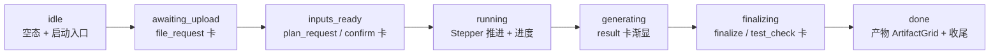
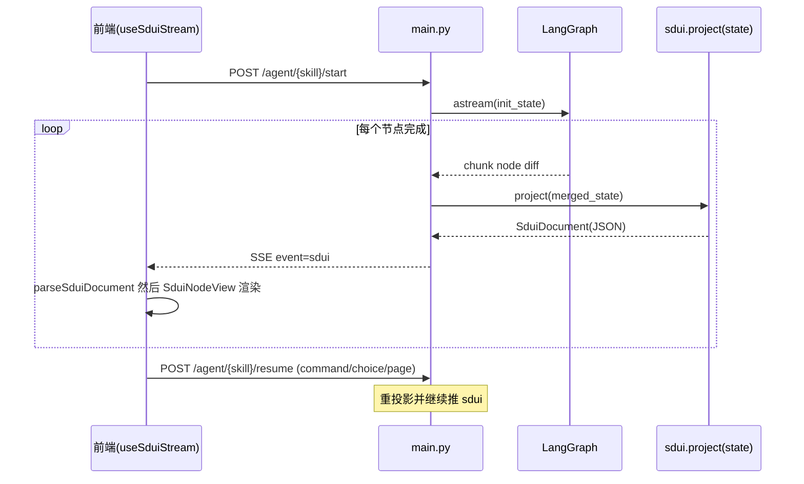

# 模块接入对接规范 · SDUI 接入面

> 主权归属：**SDUI 树是业务模块的唯一界面事实源**。后端投影器（`project(state)`）输出纯 JSON 文档，宿主（前端）只做递归渲染与原样回传，**不解释业务、不拼装界面、不推断下一步**。
>
> 本文是规范，不是建议。
>
> 派生自 `接入对接元范式.md`（元范式源 · 未随本集导入）；严格套用其 Canonical Skeleton、契约定式库、强制七要素、增强项规约、收口三件套。
>
> **本版融合**：在"纯函数投影 + 节点白名单"目标态契约之上，并入"既有模块合入（HTML 原型 → SDUI）"路径与**四大保真红线**中的界面面红线③（HTML 业务流 → 渐进展现）、红线④（零 mock 直连真实数据），新增 phase 渐进投影契约（§3.7）、零 mock 直连契约（§3.8）。执行面红线①②见 [`接入-Skill与LangGraph接入规范.md`](接入-Skill与LangGraph接入规范.md)。

**schemaVersion**：`1`（与 `agent/sdui/builder.py::SduiDocument.schemaVersion` 及 `frontend/src/lib/sdui.ts` 对齐）。破坏性变更须升版并同步"三方"（见 §3.2 / 版本治理）。

> 🔧 **落仓核对（2026-06-08 · 对齐当前实现）**：本文由两天前版本撰写，部分内容描述**目标态**（系统设计相完整形态）。当前参考实现 [`agent/skills/xtsj/`](../../../../agent/skills/xtsj/) 是 `dispatch_mode` 命令分发 PoC（投影器 `_build_*_view` + 2 命令），尚未实装的段落已就地标 ⏳：**§3.3 页面分派**、**§3.6 meta.conversation / intentDebug**（`dump_node_json` 亦不存在）、**附录 A 系统设计相示例**。硬事实已改正：节点白名单 **24→26**、SSE 补 `heartbeat`。

---

## 目录

- [第一章　定位与边界](#第一章定位与边界)
  - [两大保真红线（合入路径强制 · 界面面）](#两大保真红线合入路径强制--界面面)
- [第二章　接入最小闭环（步骤）](#第二章接入最小闭环步骤)
  - [HTML → SDUI 渐进投影路径（phase 时序）](#html--sdui-渐进投影路径phase-时序)
- [第三章　原语契约群](#第三章原语契约群)
  - [3.1 投影器契约](#31-投影器契约)
  - [3.2 节点白名单与样式边界契约](#32-节点白名单与样式边界契约)
  - [3.3 页面分派与跳转契约](#33-页面分派与跳转契约)
  - [3.4 SSE 下行事件契约](#34-sse-下行事件契约)
  - [3.5 上行回流契约](#35-上行回流契约)
  - [3.6 meta 附带子树契约](#36-meta-附带子树契约)
  - [3.7 phase 渐进投影契约（合入红线③）](#37-phase-渐进投影契约合入红线)
  - [3.8 零 mock 直连真实数据契约（合入红线④）](#38-零-mock-直连真实数据契约合入红线)
- [第四章　配置契约表](#第四章配置契约表)
- [第五章　增强项](#第五章增强项)
- [收口](#收口)
- [附录 A　系统设计相最小合法投影示例](#附录-a系统设计相最小合法投影示例)
- [附录 B　节点白名单速查](#附录-b节点白名单速查)
- [附录 C　phase 渐进投影速查](#附录-cphase-渐进投影速查)

---

## 第一章　定位与边界

### 定位

SDUI（Skill Declarative UI）接入面规定：业务模块如何把运行时状态 `SkillState` 投影为一棵 `SduiDocument` JSON 树，经 SSE 下发给前端渲染，并把用户在树上的操作原样回流到后端路由。系统设计相的工作台（Hero 头 + 交付流程 Stepper + 进度/输入件/输出件 Tabs + 左栏会话流）即由此契约产出。

合入路径额外规定：把既有 HTML 原型的 `reducer` 状态机翻译为 SDUI 投影器时，必须**按 phase 渐进展现**且**零 mock 直连真实数据**（见 §3.7 / §3.8）。

### 负责

- 后端投影器：把 `SkillState` → `SduiDocument`（纯函数，无副作用）。
- 节点白名单：仅使用 `agent/sdui/builder.py` 已登记的节点类型。
- 下行通道：每个 LangGraph 节点完成后整树重投影，经 SSE `sdui` 事件下发。
- 上行通道：树上交互收敛为 `post_user_message` / `open_preview` 两类动作。
- 合入路径：按 HTML `reducer` 的 phase 序列渐进派生对话卡与右栏内容。

### 不负责

- 不解释业务语义（缺件判断、下一步、路由分支由 step / 投影器逻辑决定，非宿主）。
- 不在前端推断或拼装业务界面（前端只认 `sdui` 事件给的树）。
- 不承载业务状态真源（节点不是状态机；状态在 `SkillState` / `project`）。
- 不控制最终视觉样式（无 `className` / `style`；间距只用语义档位）。
- 不自造假数据撑界面（数据缺失渲染空态，由真实 step 执行后填充）。

### 硬规则

- 投影器必须是 `staticmethod` 纯函数，输入 `state` dict、输出 `dump_sdui_json(doc)` 的 JSON dict。
- 生成侧 JSON **禁止**出现样式逃逸键（§3.2 黑名单）与物理路径（用逻辑路径/相对 `work_root`）。
- 任何新增节点类型必须"三方同步"（builder.py ↔ sdui.ts ↔ SduiNodeView.tsx），否则 `lint_sdui_contract` 阻断。
- `sdui` 事件是界面**唯一主数据源**；`snapshot` / `node_update` 仅供调试，前端不得据其驱动 UI。
- **（合入）** 投影器只读 step **真写进** `metrics`/`state` 的键；要展示的业务数据 step 必须写进去（见 §3.7）。
- **（合入）** HTML 原型里的 mock / demo / 占位假数据**一行都不带进** SDUI；缺数据渲染空态（见 §3.8）。

### 两大保真红线（合入路径强制 · 界面面）

合入路径的四大保真红线中，**红线③④属界面面（本文）**，红线①②属执行面（见 [Skill 接入面](接入-Skill与LangGraph接入规范.md)）：

| 红线 | 必须 | 禁止 | 对应踩坑 | 守门 |
|------|------|------|---------|------|
| **③ HTML 业务流 → SDUI 渐进展现** | SDUI 按 **phase 渐进显隐**（对齐 HTML reducer 时序）；对话卡内容齐全（引导/上传/选择/确认/结果/收尾） | 初始就把所有步骤 / 全部规划项一次性罗列；把 HTML 的对话交互丢成静态表；**留死代码卡片** | 坑②（§收口） | §3.7 + `project({})` 空态自检 |
| **④ SDUI 零 mock 直连真实数据** | 投影器**只读 step 真写进 `metrics`/`state` 的字段**；交互回传走真实端点（`/agent/<name>/start｜resume｜upload/batch`） | 把 HTML 原型的 mock/demo/占位假数据（自动"就绪"文件、写死示例行/进度/产物）搬进 SDUI；前端自造假数据撑界面 | 坑②衍生 | §3.8 + 人工审 |

---

## 第二章　接入最小闭环（步骤）

> 接入一个模块的 SDUI，最少改动 4 处、按序 5 步。**通常不改 `main.py` HTTP 层**——它已按 `skill_id` 泛化。

### 落点清单（文件级）

- `agent/skills/<name>/sdui.py` —— 投影器 `project(state)`（系统设计相：`_project_sysdesign`）
- `agent/skills/<name>/skill.py` —— 绑定 `sdui_projector = staticmethod(_sdui_project)`
- `agent/skills/__init__.py` —— `registry.register("<name>", get_<name>_skill)`
- `frontend/src/routes/module.tsx` —— `MODULE_TO_SKILL` 前端模块 → skill_id 映射
- （仅当新增节点类型时）`agent/sdui/builder.py` + `frontend/src/lib/sdui.ts` + `frontend/src/components/sdui/SduiNodeView.tsx`

### 步骤序列

1. **写投影器**：在 `sdui.py` 实现 `project(state) -> dict`，内部用 `agent/sdui/builder.py` 的节点类构树，末尾 `return dump_sdui_json(doc)`。系统设计相在 `project()` 内按 `project.page` 分派到 `_project_sysdesign`。
2. **复用通用段**：头/步进/指标/产物/HITL/摘要优先调 `agent/sdui/projector_base.py` 的 `build_*`；模块只填自有 KPI 与节点顺序（系统设计相另有 `_sd_build_header / _sd_build_stepper / _sd_build_inputs / _sd_build_catalog / _sd_build_tabs / _sd_build_conversation`）。
3. **绑定钩子**：在 `skill.py` 设 `sdui_projector = staticmethod(_sdui_project)`；`main.py::_get_sdui_projector(skill_id)` 自动读取，无需改 HTTP 层。
4. **注册 skill**：`agent/skills/__init__.py` 注册工厂；`/agent/<name>/*` 端点即自动可用。
5. **前端挂载**：`MODULE_TO_SKILL` 加映射；`SkillAgentScreen` + `useSduiStream(skillId, runId)` 订阅 `/agent/<name>/stream/{run_id}` 的 `sdui` 事件并渲染。

### HTML → SDUI 渐进投影路径（phase 时序）

> 合入既有模块时，SDUI 不是凭空设计，而是**翻译 HTML 原型的 `reducer` 状态机**。先画 phase 时序，再按 phase 派生卡片（详见 §3.7）。

1. **提取 phase 序列**：从 HTML `reducer` 抽出 phase（如 `idle → awaiting_upload → inputs_ready → running → generating → finalizing → done`）与每个 phase 该出现的卡片。
2. **对话卡按 phase 派生**：HTML 每个对话卡（guidance / file_request / plan_request / disambiguate / confirm / result / finalize / test_check）在投影器里按 phase 派生进 `meta.conversation`，**当前 phase 该出现什么才出现什么**。
3. **右栏内容随 phase 演化**：骨架可常驻，但 Stepper 状态读 `metrics.step_status`；规划矩阵/输入槽按"是否启动 / 输入是否就绪 / 当前 `kind`"决定显隐，不初始全量铺开。
4. **零 mock**：HTML 原型的假数据全部剥掉，缺数据渲染空态（见 §3.8）。
5. **空 state 自检**：`project({})` 必须冷启空态——只有空态 + 启动入口，不吐全量步骤/规划项，不出现任何示例/占位假数据。

#### phase 时序图



### 时序图（运行时下行/上行）



---

## 第三章　原语契约群

### 3.1 投影器契约

**定位**：模块界面的唯一生成入口；纯函数，状态进、JSON 树出。

**正反边界**
- 负责：读 `SkillState`（`project` / `metrics` / `steps` / `hitl` / `files`）构 `SduiDocument`。
- 不负责：发起 IO、写状态、调 LLM（投影器须无副作用，可单测）。
- 硬规则：必须返回 `dump_sdui_json(doc)` 的 dict；根节点单根；不得抛异常击穿 SSE。

**契约表（端点式）**

| 维度 | 内容 |
|------|------|
| 签名 | `def project(state: dict) -> dict` |
| 入参 | `state`：`SkillState`（含 `project`/`metrics`/`steps`/`hitl`/`run_id`） |
| 出参 | `SduiDocument` JSON dict：`{schemaVersion, type:"SduiDocument", root, meta?}` |
| 绑定 | `skill.sdui_projector = staticmethod(project)` |
| 幂等 | 是（同 state 同输出，纯函数） |
| 错误/降级 | 不得抛栈；缺字段走默认值（如进度回退 0） |

**示例（页面分派）**

```python
def project(state: dict) -> dict:
    state = enrich_state_from_disk(state, get_<name>_root())
    page = (state.get("project") or {}).get("page") or "modeling"
    if page == "sysdesign":
        return _project_sysdesign(state)
    return _project_modeling(state)

def _project_sysdesign(state: dict) -> dict:
    doc = SduiDocument(
        root=SduiStackNode(id="sysdesign-root", gap="sm", children=[
            _sd_build_header(state),
            _sd_build_schedule(state),
            _sd_build_tabs(state),
        ]),
        meta={
            "skill": "<name>", "page": "sysdesign", "run_id": state.get("run_id", ""),
            "conversation": _sd_build_conversation(state),
            "intentDebug": _build_intent_debug(state),
        },
    )
    return dump_sdui_json(doc)
```

**枚举**：`SduiDocument.type` 固定 `"SduiDocument"`；`schemaVersion` 当前 `1`。

**禁止项**：投影器内禁止读 env 决定结构、禁止物理路径、禁止把大文件内容塞进节点（产物用 `ArtifactGrid` 引相对路径）；禁止读 step 没写进 `metrics`/`state` 的"想象字段"（见 §3.7）。

> 锚点：`agent/skills/<name>/sdui.py` · `project` / `_project_sysdesign` · 改 meta 结构须同步前端对 `meta.conversation` / `meta.intentDebug` 的消费。

---

### 3.2 节点白名单与样式边界契约

**定位**：限定投影器可用的节点类型与禁止的样式逃逸键。

**正反边界**
- 负责：仅使用 `builder.py::SduiNode` union 中登记的 26 类节点。
- 不负责：自定义视觉（颜色/像素/类名由宿主主题映射）。
- 硬规则：节点 `type` 必须在白名单内；前端 `SduiNodeView` 无对应 case 时降级 `UnknownNode`（不报错但不可见）。

**契约（封闭枚举 · 节点 type 白名单 26 类）**

`Stack`、`Card`、`Row`、`Divider`、`Skeleton`、`Stepper`、`Text`、`Markdown`、`Badge`、`Statistic`、`StatisticRow`、`KeyValueList`、`Table`、`Button`、`Link`、`DonutChart`、`BarChart`、`GoldenMetrics`、`ArtifactGrid`、`Alert`、`Timeline`、`NumberCard`、`PlaneMatrix`、`FilePicker`、`ChoiceCard`、`HitlTextInput`。

> 节点 type 以 `agent/sdui/builder.py::SduiNode` union 为准；可双击 [`sdui-gallery.html`](../../../site/sdui-gallery.html) 看每节点 props/枚举/样例（由 `gen_sdui_gallery.py` 派生、`lint_sdui_gallery` 守门）。**无** `Tabs`/`Collapsible`（曾误列）。

**枚举（语义档位，禁自由值）**
- 间距 `gap`：`SpacingToken = "none"|"xs"|"sm"|"md"|"lg"|"xl"`（禁数字像素）。
- 文本 `variant`：`"caption"|"body"|"heading"|"mono"`；`color`：`"success"|"warning"|"error"|"accent"|"subtle"`。
- 按钮 `variant`：`"primary"|"secondary"|"ghost"|"outline"`。
- 徽标 `tone`：`"default"|"success"|"warning"|"danger"`。
- 步骤 `status`：`"waiting"|"running"|"done"|"error"`。

**逃逸黑名单（禁止键）**：`className`、`style`、`styles`、`css`，以及任意自由像素（数字 `gap`、`width:"120px"`、`minHeight` 等）。

**合法 vs 非法对照**

```jsonc
// 合法：语义档位
{ "type": "Stack", "gap": "sm", "children": [] }

// 非法（必须拒绝）：数字间距 + 样式逃逸
{ "type": "Stack", "gap": 12, "className": "p-4", "style": {"color":"red"} }
```

**禁止项**：新增节点类型而未三方同步；用 `Text.content` 塞 HTML 充当结构（结构用结构节点，富文本用 `Markdown`）。

> 锚点：`agent/sdui/builder.py::SduiNode` ↔ `frontend/src/lib/sdui.ts` 的 `SduiNode` ↔ `frontend/src/components/sdui/SduiNodeView.tsx` 的 `case`；三方一致由 `agent/scripts/lint_sdui_contract.py` 守门。

---

### 3.3 页面分派与跳转契约

> ⏳ **目标态 · 当前未实装**：当前**无** `/agent/{skill}/page` 端点、`set_page`、`project.page` 机制。xtsj 用 `dispatch_mode` 按 `project["command"]` 分发命令（见 [Skill 接入面 §3.4/§3.5](接入-Skill与LangGraph接入规范.md)），单页不分页。本节为多页工作台（系统设计相/建模相同流切换）的目标态设计，待实装。

**定位**：一个 skill 一条 SDUI 流内承载多页（系统设计相 `sysdesign` / 建模相 `modeling`），由 `project.page` 状态驱动跳转。

**正反边界**
- 负责：投影器按 `project.page` 分派不同子树；跳转按钮发内置命令切页。
- 不负责：SDUI 无原生导航 action；跳转一律状态驱动（写 `project.page` 后重投影）。
- 硬规则：跳转按钮只能用 `post_user_message` 发约定命令；后端写 `project.page` 后重投影，不跑业务图。

**契约（语义块）**

```
跳转命令（封闭）：
- "/sysdesign"  → 切到系统设计相（常量 PAGE_TO_SYSDESIGN）
- "/modeling"   → 切回仿真建模相（常量 PAGE_TO_MODELING）
分派键：project.page ∈ {"modeling"(默认), "sysdesign"}
端点：POST /agent/{skill}/page （写 project.page → 重投影 → 可选推 sdui）
```

**示例**

```python
SduiButtonNode(id="back-modeling", label="← 返回仿真建模",
               variant="ghost", action=SduiPostUserMessage(text=PAGE_TO_MODELING))
```

**禁止项**：在节点里写死页面状态；用 `open_preview` 冒充页面跳转。

> 锚点：`agent/skills/<name>/sdui.py` · `PAGE_TO_SYSDESIGN` / `PAGE_TO_MODELING` / `project` 分派；`agent/main.py` · `set_page`（`/agent/{skill}/page`）。

---

### 3.4 SSE 下行事件契约

**定位**：投影结果如何经 SSE 推到前端。

**正反边界**
- 负责：每个 LangGraph 节点完成后整树重投影，推 `sdui` 事件；首屏先推 `snapshot` + `sdui` 快照。
- 不负责：增量 patch（当前为整树重投影；增量见 §5 增强项）。
- 硬规则：前端 UI 只认 `sdui`；其余事件仅调试。

**契约（事件式）**

| 事件名 | 触发点 | data | 消费方 / 主数据源 |
|--------|--------|------|-------------------|
| `snapshot` | `_sse_generator` 首帧 / demo 快照 | 完整 `SkillState` | 调试，**非**主源 |
| `sdui` | 每 `node_update` 后 / 首屏 / step_retry / set_page | 完整 `SduiDocument` | **UI 主数据源** |
| `node_update` | 每节点 diff | `{node, diff}` | 调试 |
| `done` | 图跑完 / step_retry 完 / demo 完 | `{run_id, mode?}` | （增强：前端可收尾） |
| `error` | 异常 / run 不存在 | `{error}` | （增强：前端提示） |
| `close` | SSE 结束 | `{ok:true}` | EventSource 关闭 |
| `heartbeat` | 周期保活帧 | `{}` | 连接保活，UI 忽略 |

**示例（前端订阅）**

```ts
// useSduiStream：仅 sdui 事件驱动界面
es.addEventListener("sdui", (e) => setDoc(parseSduiDocument(JSON.parse(e.data))));
```

**禁止项**：用 `snapshot`/`node_update` 渲染界面；在 `sdui` 之外另开业务事件通道。

> 锚点：`agent/main.py` · `_run_graph_streaming` / `_sse_generator` / `_get_sdui_projector`；`frontend/src/hooks/useSduiStream.ts`。

---

### 3.5 上行回流契约

**定位**：用户在 SDUI 树上的操作如何回到后端。

**正反边界**
- 负责：所有交互收敛为两类动作 `post_user_message` / `open_preview`；HITL 卡片回流走 `/resume`，上传走 `/upload(/batch)`。
- 不负责：宿主不翻译业务语义（命令文本、选项 value 原样回传给后端路由）。
- 硬规则：`SduiAction.kind` 仅 `"post_user_message"|"open_preview"` 两值；ChoiceCard 提交以 `value`（回退 `id`）为提交值；**交互一律回传真实端点，不走前端 stub**（红线④）。

**契约（封闭动作枚举）**

| 动作 | 字段 | 语义 |
|------|------|------|
| `post_user_message` | `text` | 发命令/页面跳转/HITL 选择文本给后端（系统设计相：规划命令即按钮 text） |
| `open_preview` | `path` | 打开产物预览（相对 `work_root` 或 synthetic path，禁物理路径） |

**HITL 节点回流字段**

| 节点 | 关键字段 | 回流端点 |
|------|----------|----------|
| `ChoiceCard` | `options[].value`、`hitlRequestId`、`stepId` | `POST /agent/{skill}/resume`（`payload.choice`/`command`） |
| `FilePicker` | `purpose`、`accept`、`multiple`、`hitlRequestId`、`stepId` | `POST /agent/{skill}/upload(/batch)` → `/resume` |
| `HitlTextInput` | `purpose`、`submitLabel`、`hitlRequestId`、`stepId` | `/resume`（`payload`） |

**合法 vs 非法对照**

```jsonc
// 合法：命令按钮（系统设计相规划任务）
{ "type":"Button","label":"计算带外管理面地址规划",
  "action":{"kind":"post_user_message","text":"计算带外管理面地址规划"} }

// 非法（必须拒绝）：自造动作类型 / 预览物理路径
{ "type":"Button","label":"打开",
  "action":{"kind":"download","path":"C:\\out\\a.xlsx"} }
```

**枚举（ChoiceCard options 构造）**：统一经 `builder.py::choice_options()` 转换，禁各投影器自造 str/dict 漂移。

**禁止项**：新增 `action.kind`；ChoiceCard 选项无意义 `value`；上传回传物理路径（只回 `workspace://` 逻辑 URI）；交互走前端 stub 不回真实端点。

> 锚点：`agent/sdui/builder.py` · `SduiAction` / `choice_options`；`agent/main.py` · `resume_run` / `upload_batch`；`frontend/src/components/sdui/SduiContext.tsx`（注入 `onAction`/`onUpload`/`onChoiceSubmit`）。

---

### 3.6 meta 附带子树契约

> ⏳ **目标态 · 当前未实装**：`dump_node_json` 在 `agent/sdui/builder.py` 当前**不存在**；xtsj 的 `meta` 仅 `{skill, run_id, command}`，无 `conversation`/`intentDebug`。本节为左栏会话流 + 意图调试的目标态设计；当前整树用 `dump_sdui_json(doc)` 序列化。

**定位**：把"非主树"信息（左栏会话流、意图调试）挂在 `SduiDocument.meta`，不新增节点类型。

**正反边界**
- 负责：`meta.conversation` 携派生会话子树（`dump_node_json` 序列化的节点）；`meta.intentDebug` 携意图识别过程。
- 不负责：meta 不得承载业务状态真源（仅渲染派生）。
- 硬规则：`meta` **同样**禁样式逃逸键；前端按约定 key 读取，改 key 须同步前端。

**契约（字段式）**

| 字段 | 类型 | 必填 | 说明 |
|------|------|------|------|
| `skill` | `string` | 是 | skill_id（如 `"<name>"`） |
| `page` | `string` | 是 | 当前页（`"sysdesign"`/`"modeling"`） |
| `run_id` | `string` | 是 | 当前 run |
| `conversation` | `SduiNode`(子树) | 否 | 左栏会话流（`dump_node_json` 产出，按 phase 派生，见 §3.7） |
| `intentDebug` | `object` | 否 | 意图识别调试（matched_by/candidates 等） |

**禁止项**：在 meta 里塞大对象/物理路径；用 meta 绕过节点白名单渲染界面。

> 锚点：`agent/skills/<name>/sdui.py` · `_project_sysdesign` 的 `meta` / `_sd_build_conversation` / `_build_intent_debug`；`agent/sdui/builder.py::dump_node_json`。

---

### 3.7 phase 渐进投影契约（合入红线③）

**定位**：把 HTML 原型 `reducer` 状态机的"phase 渐进"语义落进投影器——**当前 phase 该出现什么才出现什么**，不初始全量罗列。路径 B（合入 HTML 原型）必备。

**正反边界**
- 负责：按 `metrics`/`project` 里的 phase 状态（如 `sd_started` / `inputs_ready` / `kind` / `step_status`）派生对话卡与右栏内容。
- 不负责：把全部步骤 / 全部规划项一次性铺满；把 HTML 的对话交互降成静态表。
- 硬规则：右栏骨架可常驻，但内容必须随 phase 演化；对话卡按 phase 派生进 `meta.conversation`；**实现了的卡片必须接进 `project()`，否则删除（不留死代码卡片）**。

**契约（语义块 · phase → 卡片派生）**

```
phase 状态来源：metrics.phase / metrics.step_status / project.sd_started / project.kind / files 就绪度
对话卡按 phase 派生（齐全，缺一即业务流丢失）：
  guidance（引导） / file_request（上传） / plan_request（规划选择）
  / disambiguate（消歧） / confirm（确认门） / result（结果）
  / finalize（收尾） / test_check（自测）
右栏随 phase 演化：
  - Stepper 步骤状态 ← metrics.step_status（非写死 waiting）
  - 规划矩阵 / 输入槽 ← 按"是否启动 / 输入就绪 / 当前 kind"决定显隐与展开
冷启（空 state）：只有空态 + 启动入口
```

**空 state 自检（硬性）**

```bash
python -c "from agent.skills.<name>.sdui import project; print(project({}))"
# 期望：空 state 不吐全量步骤/规划项，不出现任何示例/占位假数据，只有空态 + 启动入口
```

**禁止项**：一进页面就把 6 步 Stepper（全 waiting）+ ~20 项规划矩阵（全 ○）+ 4 个输入槽一次性铺满；右栏内容不随 phase 变化；实现了 `_sd_build_guidance` / `_sd_build_quick_commands` 等卡片却不接进 `project()`（死代码 = HTML 流程丢失）。

> 锚点：`agent/skills/<name>/sdui.py` · `_project_sysdesign`（按 phase 组织）/ `_sd_build_conversation`（对话卡派生）；反面案例见收口坑②。

---

### 3.8 零 mock 直连真实数据契约（合入红线④）

**定位**：HTML 原型为演示往往内置假数据（自动"就绪"文件、写死示例行/进度/产物）——**翻译进 SDUI 时必须全部剥掉**，每个字段都来自 skill 真实执行写入的 `metrics`/`state`。路径 B 必备。

**正反边界**
- 负责：投影器字段全部来自真实 `metrics`/`state`；数据缺失渲染空态；交互回传真实端点。
- 不负责：替 step 凑数据（step 没写就显示空态，不是投影器编一个）。
- 硬规则：mock 只能留在原型，**合入后一行都不带进后端投影器/前端渲染**；按钮/上传/选择等交互一律回传 `/agent/<name>/start｜resume｜upload/batch`，不走前端 stub。

**契约（语义块）**

```
数据来源：SDUI 每个字段 ⟸ step 真写进的 metrics/state（见 Skill §3.2 “要展示的数据 step 必须写进去”）
缺数据策略：渲染空态（empty state），不编造、不沿用 HTML 示例值
交互回传：post_user_message / open_preview / upload → 真实端点；禁前端 stub
红线检查：grep 投影器/前端，确认无 HTML 原型搬来的 mock/demo/占位常量
```

**合法 vs 非法对照**

```python
# 合法：直连真实 metrics，缺则空态
rows = (state.get("metrics") or {}).get("plan_matrix") or []
if not rows:
    return _empty_state("规划矩阵将在启动后生成")

# 非法（必须拒绝）：搬 HTML 原型的写死示例
rows = [{"name": "示例行A", "status": "就绪"}, {"name": "007", "ready": True}]  # mock
```

**禁止项**：把 HTML 的 mock/demo/占位假数据（自动 mock 就绪 007/001/004、写死示例行/进度/产物）搬进 SDUI；前端自造假数据撑界面；交互走前端 stub 不回真实端点。

**验证**：`project({})` 空 state 不得出现任何示例/占位假数据；grep 确认投影器无 HTML mock 常量。

> 锚点：`agent/skills/<name>/sdui.py`（字段全部读真实 `metrics`/`state`）；交互端点见 §3.5；反面案例见收口坑②衍生。

---

## 第四章　配置契约表

> SDUI 接入面以代码契约为主，配置项少。涉及的稳定常量与映射如下。

| 项 | 取值 | 作用 | 落点 |
|----|------|------|------|
| `PAGE_TO_SYSDESIGN` | `"/sysdesign"` | 切系统设计相命令 | `agent/skills/<name>/sdui.py` |
| `PAGE_TO_MODELING` | `"/modeling"` | 切建模相命令 | `agent/skills/<name>/sdui.py` |
| `MODULE_TO_SKILL` | `{<module>: "<name>", ...}` | 前端模块 → skill_id | `frontend/src/routes/module.tsx` |
| `schemaVersion` | `1` | 协议版本（三方对齐） | `builder.py` / `sdui.ts` |

（SDUI 接入面无专属 env；服务端口等见中间件/总纲面。）

---

## 第五章　增强项

> 按元范式增强项规约：与已落地硬规则物理分区，每条六字段；状态为 `建议`/`已排期`/`已落地`。

| 现状 | 缺口 | 建议方案 | 落点文件 | 优先级 | 风险 / 状态 |
|------|------|----------|----------|--------|-------------|
| 每节点完成后整树重投影并 `sdui` 全量下发 | 高频更新有重渲染/闪烁开销 | 引入增量 patch（仅叶子字段 by id，带 revision 单调递增） | `main.py` + `useSduiStream.ts` + 新增 patch schema | P2 | 需 revision 乱序/基线刷新处理；建议 |
| 前端仅消费 `sdui`，`done`/`error` 未专门处理 | run 结束/失败无显式收尾与提示 | `useSduiStream` 监听 `done`/`error`，做完成态与错误 toast | `frontend/src/hooks/useSduiStream.ts` | P1 | 兼容现有流程；建议 |
| `claw-rail.tsx` 仍写死单一模块的 start/stream/resume | 新模块走不到通用路径，易漂移 | 收口为 `useSduiStream` + `SkillAgentScreen`，删硬编码 | `frontend/src/components/claw-rail.tsx` | P1 | 影响旧入口；建议 |
| 投影器异常被 `main.py` 静默吞 | 投影 bug 难定位 | dev 模式下推 `error` 事件 + 服务端日志 | `agent/main.py` | P2 | 仅开发态；建议 |
| `meta.conversation`/`intentDebug` 约定 key 无校验 | 前后端 key 漂移无守门 | 扩展 `lint_sdui_contract` 校验 meta 约定 key | `agent/scripts/lint_sdui_contract.py` | P2 | lint 复杂度上升；建议 |
| phase 渐进 / 零 mock 仅靠人工审与 `project({})` 自检 | 死代码卡片、mock 混入无机器守门 | `lint_sdui_contract` 增"空 state 非空树 / 未接入卡片 / 可疑 mock 常量"启发式 | `agent/scripts/lint_sdui_contract.py` | P1 | 误报风险；建议 |

---

## 收口

### 自检清单（投影器上线前必过）

**通用契约（路径 A/B 共同）**
- [ ] `project(state)` 为纯函数，返回 `dump_sdui_json(doc)`，单根。
- [ ] 仅使用 26 类白名单节点；新增类型已三方同步并过 `lint_sdui_contract`。
- [ ] 全文无 `className`/`style`/`styles`/`css`；`gap` 仅语义档位、无数字。
- [ ] 所有 `action.kind` ∈ {`post_user_message`,`open_preview`}。
- [ ] ChoiceCard 选项经 `choice_options()` 构造，`value` 有意义。
- [ ] 产物/预览只用相对 `work_root` 或 synthetic path，无物理路径。
- [ ] 多页用 `project.page` 分派，跳转走 `/page` 命令而非自造导航。
- [ ] 界面仅依赖 `sdui` 事件；未用 `snapshot`/`node_update` 驱动 UI。
- [ ] `meta` 无样式逃逸键；约定 key 与前端消费一致。

**合入路径附加（四红线 · 界面面③④）**
- [ ] 红线③：右栏内容按 phase 渐进显隐，冷启只给空态 + 启动入口。
- [ ] 红线③：对话卡（引导/上传/选择/确认/结果/收尾/自测）按 phase 派生进 `meta.conversation`，无缺漏。
- [ ] 红线③：无死代码卡片（实现了的卡片都接进 `project()` 或删除）。
- [ ] 红线④：投影器每个字段都来自真实 `metrics`/`state`，缺数据渲染空态。
- [ ] 红线④：无 HTML 原型搬来的 mock/demo/占位假数据；交互回传真实端点不走前端 stub。
- [ ] `project({})` 空态自检通过：不吐全量步骤/规划项，无任何示例/占位假数据。

### 禁止事项

- 在前端拼装/推断业务界面或下一步。
- 节点承载业务状态真源。
- 新增节点类型而不三方同步。
- 协议中出现物理磁盘路径、像素、类名、行内样式。
- 新增 `action.kind` 或业务私有 SSE 事件通道。
- 用 `snapshot`/`node_update` 驱动渲染。
- **（合入）** 初始全量罗列步骤/规划项；右栏内容不随 phase 变化；留死代码卡片。
- **（合入）** 把 HTML 原型 mock/假数据搬进 SDUI；前端自造假数据；交互走前端 stub。

### 反面案例 · 坑②（HTML 业务流 → 初始全量罗列 + mock 混入）

**现象**：一进系统设计页，右栏就把 6 步交付 Stepper（全 waiting）+ ~20 项规划覆盖矩阵（全 ○）+ 4 个输入槽一次性铺满；对话框内容缺失，业务流程感消失；部分数据还是 HTML 原型搬来的写死示例。

**根因**：
- `_project_sysdesign` 固定渲染 `header + schedule + tabs`，右栏内容**不随 phase 变化**（违反红线③）。
- `_sd_build_guidance` / `_sd_build_quick_commands` / `_sd_build_catalog` 实现了却**没接进 `project()`**（死代码），等于 HTML 的渐进引导流程丢失。
- HTML 原型为演示内置的 mock（自动"就绪"文件、写死示例行/进度）被直接搬进投影器（违反红线④）。

**正确做法**：
- 右栏内容按 phase（`sd_started` / `inputs_ready` / `kind`）渐进显隐，冷启只给空态 + 启动入口。
- 把对话卡（引导/上传/选择/确认/结果/收尾）按 phase 派生进 `meta.conversation`，补齐 HTML 里缺失的收尾交互（finalize / test_check / 改名跳过）。
- 删除或接入死代码卡片。
- 剥掉所有 mock，字段直连真实 `metrics`/`state`，缺数据渲染空态。

> 执行面坑①（意图识别降级）见 [`接入-Skill与LangGraph接入规范.md`](接入-Skill与LangGraph接入规范.md) 收口。

### 版本治理 / 变更记录

- 破坏性变更定义：新增/删除节点类型、改字段必填性、改枚举含义、改 `action.kind`、改 `meta` 约定 key、改 SSE 事件语义、改 phase 渐进契约（§3.7）或零 mock 契约（§3.8）。
- 升版流程：升 `schemaVersion` → 同步 `builder.py` / `sdui.ts` / `SduiNodeView.tsx` → 跑 `lint_sdui_contract` → 本节登记。
- v1（初版）：确立投影器纯函数契约、24 节点白名单、样式黑名单、page 分派、SSE 主数据源、上行两类动作、meta 子树、五项增强。
- v1.1（融合合入面）：并入 HTML → SDUI 渐进投影路径（phase 时序）、四大保真红线③④、phase 渐进投影契约（§3.7）、零 mock 直连真实数据契约（§3.8）、坑②反面案例、`project({})` 空态自检、附录 C。
- v1.2（落仓核对 2026-06-08 · 对齐当前实现）：节点白名单 24→26（去 `Tabs`/`Collapsible`，补 `Alert`/`Timeline`/`NumberCard`/`PlaneMatrix`）；SSE 补 `heartbeat`；§3.3 页面分派、§3.6 meta.conversation/`dump_node_json`、附录 A sysdesign 示例标记为目标态（当前 xtsj 为 `dispatch_mode` PoC，未实装）。

---

## 附录 A　系统设计相最小合法投影示例

```json
{
  "schemaVersion": 1,
  "type": "SduiDocument",
  "root": {
    "type": "Stack",
    "id": "sysdesign-root",
    "gap": "sm",
    "children": [
      {
        "type": "Card",
        "id": "sd-header",
        "children": [
          { "type": "Text", "content": "系统设计 · 集群 LLD 设计", "variant": "heading" },
          { "type": "Badge", "text": "进行中", "tone": "success" },
          { "type": "Button", "id": "back-modeling", "label": "← 返回仿真建模",
            "variant": "ghost",
            "action": { "kind": "post_user_message", "text": "/modeling" } }
        ]
      },
      {
        "type": "Card",
        "id": "sd-stepper",
        "title": "交付流程",
        "children": [
          { "type": "Stepper", "id": "sd-steps", "steps": [
            { "id": "s1", "title": "输入件准备", "status": "done" },
            { "id": "s2", "title": "输入件检查", "status": "running" },
            { "id": "s3", "title": "LLD 生成", "status": "waiting" }
          ] }
        ]
      },
      {
        "type": "Card",
        "id": "sd-catalog",
        "title": "规划任务目录",
        "children": [
          { "type": "Button", "id": "sd-cmd-c0", "label": "计算带外管理面地址规划",
            "action": { "kind": "post_user_message", "text": "计算带外管理面地址规划" } }
        ]
      }
    ]
  },
  "meta": {
    "skill": "<name>",
    "page": "sysdesign",
    "run_id": "run-xxxxxxx"
  }
}
```

---

## 附录 B　节点白名单速查

- 结构层：`Stack`、`Row`、`Card`、`Divider`、`Skeleton`、`Stepper`
- 内容层：`Text`、`Markdown`、`Badge`、`Statistic`、`StatisticRow`、`KeyValueList`、`Table`、`GoldenMetrics`
- 展示层 v1.1：`Alert`、`Timeline`、`NumberCard`、`PlaneMatrix`
- 图表层：`DonutChart`、`BarChart`
- 交互层：`Button`、`Link`
- 产物/HITL：`ArtifactGrid`、`FilePicker`、`ChoiceCard`、`HitlTextInput`
- 动作枚举：`post_user_message`(text) / `open_preview`(path)
- 间距枚举：`none|xs|sm|md|lg|xl`
- 序列化：`dump_sdui_json(doc)` / `choice_options(raw)`（在 `agent/sdui/builder.py`；按节点序列化用节点 `.model_dump(mode="json")`，无 `dump_node_json`）

---

## 附录 C　phase 渐进投影速查

### phase → 该出现的卡片（对齐 HTML reducer）

| phase | 右栏 | 对话卡（`meta.conversation`） |
|-------|------|------------------------------|
| `idle`（冷启） | 空态 + 启动入口 | guidance（引导） |
| `awaiting_upload` | 输入槽（待上传高亮） | file_request（上传请求） |
| `inputs_ready` | 输入槽（就绪）+ 规划目录 | plan_request / disambiguate / confirm |
| `running` | Stepper 推进 + 进度 | result（阶段结果渐显） |
| `generating` | 规划矩阵按 kind 展开 | result |
| `finalizing` | 产物预览 | finalize / test_check |
| `done` | ArtifactGrid（真实产物） | finalize（收尾 + 改名跳过） |

### 合入界面面双红线自检（③④）

| 红线 | 一句话自检 |
|------|-----------|
| ③ SDUI 渐进 | `project({})` 是否冷启空态？对话卡是否按 phase 出现而非初始全量罗列？有无死代码卡片？ |
| ④ 零 mock 直连 | SDUI 字段是否全部来自真实 `metrics`/`state`？有无从 HTML 搬进来的假数据？交互是否回传真实端点？ |

> 执行面红线①②自检见 [`接入-Skill与LangGraph接入规范.md`](接入-Skill与LangGraph接入规范.md) 附录 C。
