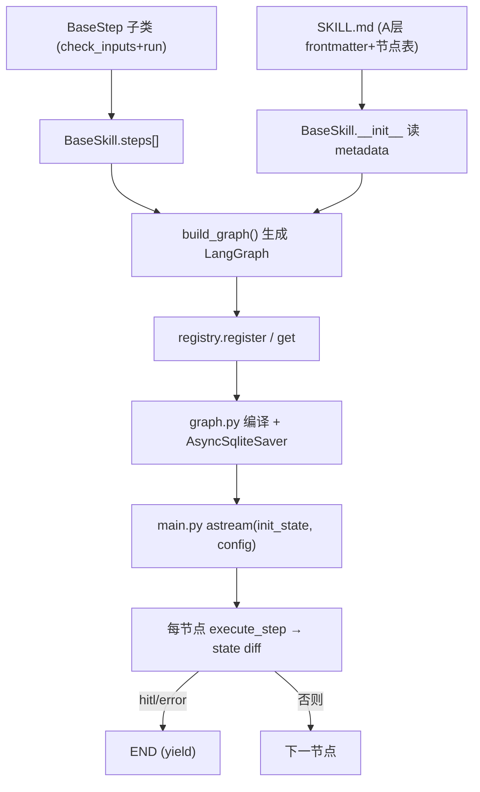
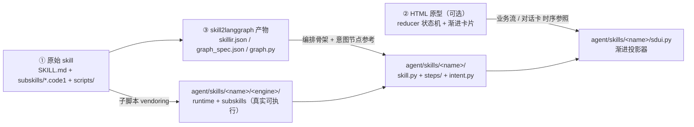

# 模块接入对接规范 · Skill 与 LangGraph 接入面

> 主权归属：**业务模块以 Skill 自描述、以 BaseStep 承载业务、以 SkillState 承载状态**。LangGraph 只提供编排与 checkpoint 运行时，**不持有业务语义**。SKILL.md（A 层）是元数据唯一真源，代码（B 层）只写实现。
>
> 本文是规范，不是建议。
>
> 派生自 `接入对接元范式.md`（元范式源 · 未随本集导入）；严格套用其 Canonical Skeleton、契约定式库、强制七要素、增强项规约、收口三件套。
>
> **本版融合**：在"从零新建"目标态契约之上，并入"既有模块合入（`skill2langgraph`）"路径与**四大保真红线**中与执行面相关的红线①（意图不降级）、红线②（子脚本真执行），新增意图识别契约（§3.8）、子脚本 vendoring 与桥接层契约（§3.9）。SDUI 相关红线③④见 [`接入-SDUI接入规范.md`](接入-SDUI接入规范.md)。

**schemaVersion**：`1`（与 `agent/skills/base.py` 抽象、`agent/graph.py` 编译层对齐）。破坏性变更须升版并同步代码与契约 lint。

> 🔧 **落仓核对（2026-06-08 · 对齐当前实现）**：本文由两天前版本撰写，部分内容描述**目标态**（系统设计相完整形态）。当前参考实现 [`agent/skills/xtsj/`](../../../../agent/skills/xtsj/) 是 `dispatch_mode` 命令分发 PoC（2 命令 `input_check`/`address_plan`，简单 `SD_TO_COMMAND` 归一化），尚未实装的段落已就地标 ⏳：**§3.5 覆盖建图**（自定义 `_entry_router`/`_intent_router`/6 节点）、**§3.8 LLM 意图识别 `intent.py`**、**附录 B**。硬事实已改正：§3.4 钩子表补 `dispatch_mode`/`default_command`。

---

## 目录

- [第一章　定位与边界](#第一章定位与边界)
  - [两条接入路径](#两条接入路径)
  - [四大保真红线（合入路径强制）](#四大保真红线合入路径强制)
- [第二章　接入最小闭环（步骤）](#第二章接入最小闭环步骤)
  - [路径 A　从零新建（6 步）](#路径-a从零新建6-步)
  - [路径 B　既有模块合入（6 阶段）](#路径-b既有模块合入6-阶段)
- [第三章　原语契约群](#第三章原语契约群)
  - [3.1 SkillState 状态契约](#31-skillstate-状态契约)
  - [3.2 BaseStep 节点契约](#32-basestep-节点契约)
  - [3.3 SkillContext 上下文契约](#33-skillcontext-上下文契约)
  - [3.4 BaseSkill 编排契约](#34-baseskill-编排契约)
  - [3.5 建图与路由契约](#35-建图与路由契约)
  - [3.6 HITL yield/resume 契约](#36-hitl-yieldresume-契约)
  - [3.7 注册与 A+B 同步契约](#37-注册与-ab-同步契约)
  - [3.8 意图识别契约（合入红线①）](#38-意图识别契约合入红线)
  - [3.9 子脚本 vendoring 与桥接层契约（合入红线②）](#39-子脚本-vendoring-与桥接层契约合入红线)
- [第四章　配置契约表](#第四章配置契约表)
- [第五章　增强项](#第五章增强项)
- [收口](#收口)
- [附录 A　最小可运行 Skill 骨架](#附录-a最小可运行-skill-骨架)
- [附录 B　覆盖建图速查（系统设计相）](#附录-b覆盖建图速查系统设计相)
- [附录 C　合入路径速查与"待补真实能力清单"模板](#附录-c合入路径速查与待补真实能力清单模板)

---

## 第一章　定位与边界

### 定位

本面规定：一个业务模块如何以"Skill = 一组 Step"的形式定义业务，并被自动/手动编排为 LangGraph 图、注册进运行时、由 FastAPI 异步驱动。它是各业务模块的执行骨架。

### 负责

- 业务模块：定义 `SkillState` 用键、实现 `BaseStep`（check_inputs + run）、组装 `BaseSkill.steps[]`。
- 编排层：`BaseSkill.build_graph()` 把 steps 生成 LangGraph（默认线性，可覆盖）。
- 运行时：`registry` 注册、`graph.py` 编译 + checkpointer、`main.py` `astream` 驱动。
- 合入路径：把既有外部 skill 的**意图识别**与**子脚本**重新接回真实实现（不降级）。

### 不负责

- LangGraph 运行时不持有业务语义（缺件/下一步/路由由 step 与 build_graph 决定）。
- 平台不替模块保存业务状态（跨 step 数据走 `SkillState` 与磁盘产物，不靠进程内存）。
- 编排层不直接调 LLM/外发/工具（统一走 `SkillContext` 入口）。

### 硬规则

- 每个 Step 必须是 LangGraph 一个节点：入 `state`、出 state diff（`StepResult`）。
- 状态只走 `SkillState`，禁全局变量；跨 step 共享放 `state["files"]/["metrics"]/["project"]`。
- LLM 调用只走 `ctx.invoke_llm` / `agent.llm`（`lint_no_naked_llm` 守门）。
- A 层 SKILL.md 流程节点表与 B 层 `step.key` 必须逐一一致（`lint_skill_contract` 守门）。
- FastAPI 异步路径必须用 `AsyncSqliteSaver`（同步 SqliteSaver 不支持 `astream`）。
- **（合入）** 自由自然语言主入口必须保留 `ctx.invoke_llm`（经 `intent.classify(..., invoke_llm=...)`）；关键词/精确表只作快路径。
- **（合入）** 原 skill 的 `subskills/*.code1` / `scripts/` 必须 vendoring 并由桥接层真实调起；占位产物只能是依赖缺失时的临时兜底且必须 `emit` 告警。

### 两条接入路径

本规范同时覆盖两条接入路径，**共用同一套运行时契约（第三章 §3.1–§3.7）与守门 lint**，差异只在前置工作量与红线约束：

| 路径 | 适用 | 起点 | 额外约束 | 参考实现 |
|------|------|------|----------|----------|
| **A · 从零新建** | 全新业务模块 | 复制 `agent/skills/_template/` | 仅契约一致性（§3.1–§3.7） | `agent/skills/<name>/` |
| **B · 既有模块合入** | 搬迁外部 skill（+ 可选 HTML 原型）经 `skill2langgraph` 合入 | 三来源汇聚（见第二章） | 契约一致性 **+ 四大保真红线** | `agent/skills/<name>/` |

> 路径 B 的难点**不在搭骨架，而在迁移中容易把原 skill 能力悄悄降级**。`skill2langgraph` 产出的 `graph.py` 是**声明性骨架 + 占位，不是可直接上线的实现**——它**有意**把 LLM 意图识别折叠成「关键词为主、LLM 兜底」，把子脚本折叠成占位节点（`unimplementable` warning）。**合入不是"把 graph.py 抄进来"，而是以 skillir/graph_spec 为蓝图，把被折叠的 LLM 与子脚本能力重新接回真实实现。**

### 四大保真红线（合入路径强制）

合入路径只要守住四条红线就不会塌方。其中**红线①②属执行面（本文）**，红线③④属界面面（见 SDUI 接入面）：

| 红线 | 必须 | 禁止 | 对应踩坑 | 守门 |
|------|------|------|---------|------|
| **① 意图识别不降级** | 自由 NL 入口保留 `ctx.invoke_llm`（经 `intent.classify(..., invoke_llm=...)`）；关键词/精确表只作快路径 | 把 LLM 意图识别整体替换为纯关键词/纯逻辑；把 `invoke_llm=None` 用在面向用户自由输入的归一化上 | 坑①（§收口） | §3.8 + 人工审 |
| **② 子脚本真实可执行** | 原 `subskills/*.code1` / `scripts/` vendoring 进 `<engine>/`，桥接层 `subprocess`/import 真实调起，产物落 `ProjectData/Output/` | 把 `graph.py` 占位节点当交付；用占位产物冒充真实产物；**死 import 静默降级** | 坑①衍生 | §3.9 + `lint_no_naked_llm` |
| ③ HTML 业务流 → SDUI 渐进展现 | 见 [SDUI 接入面 §3.7](接入-SDUI接入规范.md) | 初始全量罗列；死代码卡片 | 坑② | `lint_sdui_contract` |
| ④ SDUI 零 mock 直连真实数据 | 见 [SDUI 接入面 §3.8](接入-SDUI接入规范.md) | 把 HTML 原型 mock/假数据搬进 SDUI | 坑②衍生 | 人工审 |

---

## 第二章　接入最小闭环（步骤）

### 落点清单（文件级）

- `~/.claude/skills/<name>/SKILL.md` —— A 层 frontmatter（name/description/触发词）+ 流程节点表（默认路径，见第四章配置表；统一约定见第五章增强项 P1）
- `agent/skills/<name>/skill.py` —— `BaseSkill` 子类 + 工厂 `get_<name>_skill`
- `agent/skills/<name>/steps/` —— 各 `BaseStep` 实现
- `agent/skills/<name>/sdui.py` —— 投影器（见 SDUI 接入面）
- `agent/skills/<name>/intent.py` —— 意图识别分层（路径 B 必备，见 §3.8）
- `agent/skills/<name>/<engine>/` + `<engine>_runtime.py` —— vendored 引擎 + 桥接层（路径 B 必备，见 §3.9）
- `agent/skills/__init__.py` —— `registry.register("<name>", get_<name>_skill)`

### 路径 A　从零新建（6 步）

> 接入一个新业务场景 Skill，最少改动 3 处、按序 6 步。复制 `agent/skills/_template/` 起手。

1. **复制模板**：`agent/skills/_template/` → `agent/skills/<name>/`，按头注释替换占位符（`xxx`/`Xxx`/`get_xxx_skill`/`XXX_ROOT`）。
2. **写 Step**：每个业务环节继承 `BaseStep`，设 `key`/`name`，实现 `check_inputs()`（决定是否 HITL）与 `run(ctx, state, emit)`（返回 `StepResult`）。
3. **组装 Skill**：`<Name>Skill(BaseSkill)` 设 `name`（与 SKILL.md frontmatter 一致）、`steps=[...]`（顺序即 DAG 顺序）、`sdui_projector`，按需加钩子。
4. **写 A 层 SKILL.md**：frontmatter `name/description/触发词` + 一张含"节点"列的流程表（节点名 = step.key）。
5. **注册**：`agent/skills/__init__.py::_register_all` 加 `registry.register("<name>", get_<name>_skill)`。
6. **（可选）覆盖建图**：若拓扑非线性（如意图路由子图），重写 `build_graph(checkpointer=None)`，复用 `_make_router`/`_route_map`/checkpointer 选择逻辑。

#### 数据流图



### 路径 B　既有模块合入（6 阶段）

> 把外部 skill（+ 可选 HTML 原型）经 `skill2langgraph` 合入，最难的是**不丢业务保真度**。共 6 阶段，每阶段对照红线勾选。

| 阶段 | 动作 | 守红线 | 验证 |
|------|------|--------|------|
| **0 摸清三来源** | 定位 ① 原始 skill（`SKILL.md`+`subskills/*.code1`+`scripts/`）② HTML 原型（`reducer` 状态机 + phase 序列）③ `skill2langgraph` 产物（`artifacts/<run_id>/`+`outputs/<run_id>/`） | — | 认知校准：`graph.py` 是骨架+占位，非可上线实现 |
| **1 抄"待补真实能力清单"** | 读 `skillir.json`：记 `steps[]`/`routing[]`/`hard_gates`/`human_confirmation_points`；把所有 `uses_llm:true` 的 step、`graph_spec.json` 的 `warnings` 逐条抄出；读 `verification.json`/`*-report.json` 看 fail 行为（多为"真实产物落盘"） | ①② | 这张清单 = 合入核心工作量，**不要把"抄骨架"当完成** |
| **2 搭骨架** | 复制 `_template/`；写 A 层 SKILL.md（含后端节点表，逐行对应 skillir `steps[]`）+ B 层 `skill.py`（steps 顺序/互斥对照 `graph_spec.json`）+ `steps/*.py` | — | `lint_skill_contract` 双向校验节点表 ↔ `step.key` |
| **3 vendoring 子脚本** | 原 `subskills/`+`runtime/` → `<engine>/`；写桥接层 `<engine>_runtime.py`（数据根/代码根解耦、`sys.path` 挂载 + `AGENT_SKILL_ROOT` 兜底、`run()` 委托 `execute_*` 真调子脚本） | ② | 真跑一个 L3 子脚本，产物落 `ProjectData/Output/`（非占位 JSON） |
| **4 意图识别移植** | vendoring `intent-taxonomy.md`/`intent-keywords.md`/`intent-aliases.md`；写 `intent.py` `classify()` 分层；主入口 step 调 `classify(..., invoke_llm=ctx.invoke_llm)` | ① | 一句口语化非精确命令应走到 `matched_by="llm"` |
| **5 HTML → SDUI 渐进投影** | 见 [SDUI 接入面 §3.7/§3.8](接入-SDUI接入规范.md) | ③④ | `project({})` 冷启空态 |
| **6 接运行时 + 验收** | 注册 + 钩子 + 守门三 lint 全绿 + 端到端 | 全部 | `POST /agent/<name>/start` → 自由 NL 走 LLM 意图 → 渐进 SDUI → 真实产物落盘 |

#### 合入全景图（三来源 → 一落点）



> ⚠️ **重点动作**：把 `graph_spec.json` 的 `warnings` 与 `uses_llm:true` 的 step 逐条抄成"待补真实能力清单"（模板见附录 C）。这张清单是合入的核心工作量，**不是骨架**。

---

## 第三章　原语契约群

### 3.1 SkillState 状态契约

**定位**：LangGraph 在节点间传递的状态，所有 skill 共用一套 schema。

**正反边界**
- 负责：承载 run 元信息、业务 project、步骤记录、指标、HITL、产物索引。
- 不负责：承载大文件内容（用磁盘产物 + 相对路径引用）。
- 硬规则：`steps`/`logs` 用 `add` reducer（累加而非覆盖）；其余键覆盖语义。

**契约表（字段式 · 核心键）**

| 字段 | 类型 | 必填 | 说明 |
|------|------|------|------|
| `run_id` | `string` | 是 | 本次运行 ID |
| `skill_id` | `string` | 是 | 模块 ID |
| `project` | `dict` | 是 | 业务参数 + 跨 step 业务态（命令/确认/页面/phase…） |
| `steps` | `list[StepRecord]` (add) | 是 | 步骤记录，reducer 累加 |
| `logs` | `list[str]` (add) | 否 | 流式日志，reducer 累加 |
| `current_step` | `string` | 否 | 当前/下一步 key |
| `overall_progress` | `int` | 否 | 总进度 % |
| `files` | `dict` | 否 | 产物/输入件元数据（非内容） |
| `metrics` | `dict` | 否 | 自由业务指标（KPI/路由目标 sd_route/step_status/phase…） |
| `hitl` | `HitlRequest` | 否 | 软中断请求（step/reason/need_files/need_inputs） |
| `error` | `string` | 否 | 错误信息（非空→路由 END） |

**示例（StepResult 即 state diff）**

```python
return {
    "artifacts": ["ProjectData/Output/A3计算带外管理地址规划_20260606.xlsx"],
    "metrics": {"sd_route": "l3_direct_exec", "design_progress": 45},
    "logs": ["[l3_direct_exec] 完成"],
}
```

**禁止项**：把整份 DataFrame / 大 JSON 塞进 state；用模块级全局变量替代 state。

> 锚点：`agent/skills/base.py` · `SkillState` / `StepRecord` / `HitlRequest` / `StepResult`。

---

### 3.2 BaseStep 节点契约

**定位**：一个业务环节 = 一个 LangGraph 节点。

**正反边界**
- 负责：`check_inputs()` 判前置（缺件/待确认→HITL）；`run()` 执行业务并返回 diff。
- 不负责：决定自己在图中的后继（由 build_graph 的边决定）。
- 硬规则：`run` 必须返回 `StepResult`；副作用经 `ctx`（LLM/工具/路径），禁裸调；要在 SDUI 展示的业务数据必须真写进 `metrics`/`state`（见 SDUI §3.8）。

**契约表（语义块）**

```
key: str          节点 ID（小写下划线），= SKILL.md 节点表的"节点"列
name: str         中文显示名
internal: bool    True=基础设施步（如 intent_recognition/preflight），豁免 SKILL.md 契约
artifacts_pattern 产物匹配（合入路径用于校验真实产物落盘）
check_inputs(ctx) -> CheckResult
    {ok: True}                                  → 放行
    {ok: False, missing:[...]}                  → 文件型 HITL（FilePicker）
    {ok: False, need_inputs:[NeedInput,...]}    → 确认型 HITL（ChoiceCard）
run(ctx, state, emit) -> StepResult             业务执行，emit("...") 推流式日志
```

**示例（确认型 HITL 触发）**

```python
def check_inputs(self, ctx):
    if outcome.status == "clarifying":
        return {"ok": False, "missing": [], "need_inputs": [{
            "id": "sd_command", "label": "请选择规划任务",
            "options": [{"label": c, "value": c} for c in candidates],
        }]}
    return {"ok": True, "missing": [], "found": [command], "note": ""}
```

**枚举**：`StepStatus = "pending"|"running"|"completed"|"failed"|"hitl"`。

**禁止项**：在 `run` 内调 `import openai` 等裸 LLM；阻塞等待用户输入（用 HITL yield）；用占位 JSON 冒充真实产物（合入红线②）。

> 锚点：`agent/skills/base.py` · `BaseStep` / `CheckResult` / `NeedInput`；参考实现 `agent/skills/<name>/steps/sysdesign.py`。

---

### 3.3 SkillContext 上下文契约

**定位**：每个节点执行时拿到的运行时上下文（路径 + LLM + 工具 + run 元信息）。

**正反边界**
- 负责：注入 `work_root`/`run_id`/`project`/`llm_factory`，提供统一 LLM/工具入口与目录属性。
- 不负责：跨节点持久化（context 每节点重建；持久化走 state/磁盘）。
- 硬规则：LLM 走 `invoke_llm`、工具走 `call_tool`，自动打 Langfuse trace。

**契约表（语义块）**

```
路径属性：start_dir / input_dir / runtime_dir / output_dir / images_dir
        （= work_root/ProjectData/{Start,Input,RunTime,Output,Images}）
ctx.invoke_llm(messages, *, step_key, run_name?, extra_metadata?, extra_tags?)
        → 打 metadata{skill,step,run_id}、tags[skill:..,step:..]、run_name
ctx.call_tool(name, params, *, step_key, emit?)
        → 受控执行 + Langfuse span（DEFAULT_TOOLS / execute_traced）
ctx.rel(path) → 绝对路径转相对 work_root
```

**示例**

```python
resp = ctx.invoke_llm(messages, step_key=self.key, run_name="<name>.intent")
text = ctx.call_tool("doc_read_xlsx", {"path": p}, step_key=self.key, emit=emit)
```

**禁止项**：绕过 `invoke_llm`/`call_tool` 直接 new 客户端；把 `ctx` 当跨节点存储。

> 锚点：`agent/skills/base.py` · `SkillContext.invoke_llm` / `call_tool` / 路径属性；`llm_factory` 注入见各 `skill.py::get_<name>_skill`。

---

### 3.4 BaseSkill 编排契约

**定位**：一组 Step 的编排单元 + 运行时分派钩子。

**正反边界**
- 负责：声明 `name`/`description`/`steps[]`，绑定钩子，构图。
- 不负责：硬编码进 main.py（钩子让 HTTP 层通用化）。
- 硬规则：`name` 与 A 层 SKILL.md frontmatter.name 一致；`description` 由 SKILL.md 覆盖（A 层唯一真源）。

**契约表（字段式 · 类属性与钩子）**

| 成员 | 类型 | 必填 | 说明 |
|------|------|------|------|
| `name` | `str` | 是 | 运行时 skill_id |
| `description` | `str` | 是 | 启动时被 SKILL.md frontmatter 覆盖 |
| `steps` | `list[BaseStep]` | 是 | 顺序即默认 DAG 顺序 |
| `dispatch_mode` | `bool` | 否 | `True`=命令分发图（菜单式 · a3 系统设计）：START→`_dispatch`→按 `project["command"]` 选中 handler→END；`False`(默认)=线性 DAG |
| `default_command` | `str` | 否 | dispatch 模式下 `project` 未带 command 时的兜底命令（默认 `steps[0].key`） |
| `sdui_projector` | `staticmethod` | 否 | SDUI 投影器（见 SDUI 接入面） |
| `file_handler` | 模块 | 否 | 文件型 HITL 处理器（鸭子类型四函数） |
| `step_retry_keys` | `list[str]` | 否 | 支持单步重试的 step；不可与确认型 HITL 同用 |
| `initial_project(payload)` | 方法 | 否 | start 请求体 → `project`（补默认值） |
| `apply_resume_payload(project,payload,hitl_step)` | 方法 | 否 | HITL 回复并入 project（跨重跑存活） |
| `build_graph(checkpointer=None)` | 方法 | 否 | 默认线性建图；非线性须覆盖 |

**禁止项**：在 main.py 写 `if skill == "xxx"` 业务分支；`name` 与 SKILL.md 不一致还硬跑。

> 锚点：`agent/skills/base.py` · `BaseSkill`；参考实现 `agent/skills/<name>/skill.py::<Name>Skill`；模板 `agent/skills/_template/skill.py`。

---

### 3.5 建图与路由契约

**定位**：steps[] 如何变成可运行的 LangGraph，以及节点出口如何路由。

**正反边界**
- 负责：默认线性链（START→steps[0]→…→END）；`execute_step` 统一执行模板；条件边处理 HITL/error。
- 不负责：把路由语义写进 LangGraph 运行时（路由函数读 state 自决）。
- 硬规则：节点出口统一——`error` 或 `hitl.step` 非空 → END；否则下一节点（或路由目标）。

**契约表（端点式 · 默认建图）**

| 维度 | 内容 |
|------|------|
| 节点 | 每个 `step.key` 一个 LangGraph 节点，闭包内构 `SkillContext` 调 `execute_step` |
| 入边 | `START → steps[0].key` |
| 出边 | `add_conditional_edges(key, _make_router, _route_map(next))` |
| 路由 | `_make_router`：error→`__end__`；hitl.step→`__end__`；否则 next_key |
| 推进 | `execute_step` 默认 `current_step=_next_step_key`、`overall_progress=_step_progress_pct` |

**命令分发图（`dispatch_mode=True` · 当前 a3/xtsj 实现）**
- 设 `dispatch_mode=True`，基类内置生成：START → `_dispatch` →（`_dispatch_router` 按 `project["command"]` 选中的 handler step）→ END；每个 handler = `steps[]` 里一个 step（key=命令 id），HITL/error 同样 → END。
- 命令归一化在 `initial_project`（把 start 的 command/action/text 映射成 `project["command"]`，见 xtsj `SD_TO_COMMAND`）；**无需自写 `build_graph`**。
- 锚点：`agent/skills/base.py::_dispatch_router` / `build_graph`(dispatch 分支)；`agent/skills/xtsj/skill.py`。

**覆盖建图（自定义 `build_graph` · ⏳ 目标态示例）** —— 下列 `_entry_router`/`_intent_router`/`SD_EXEC_KEYS`/6 执行节点为系统设计相**目标态**；当前 xtsj 用 `dispatch_mode` 未自定义建图：
- 入口路由：`page==sysdesign` → `intent_recognition`，否则 → 建模首步。
- 路由分发：`intent_recognition` 读 `metrics.sd_route` → 6 互斥执行节点之一 / END。
- 各执行节点完成即 END（命令驱动单次执行）。
- 复用基类 `_make_router`/`_route_map`/checkpointer 选择逻辑。

**路由收敛（合入红线①衍生）**：若并存多套路由（`intent.classify` / registry 字符串匹配 / 纯关键词 `decide_sd_route`），必须让它们**收敛到同一 canonical 命令**——否则同一句话经不同路径会得到不同目标节点（坑①根因之一）。

**示例（覆盖建图骨架）**

```python
def build_graph(self, checkpointer=None):
    g = StateGraph(SkillState)
    for step in self.steps:
        g.add_node(step.key, make_node(step))
    g.add_conditional_edges(START, _entry_router,
                            {"intent_recognition": "intent_recognition",
                             "boq_extract": "boq_extract"})
    g.add_conditional_edges("intent_recognition", _intent_router, intent_map)
    # … 建模链 + 各执行节点 → END …
    return g.compile(checkpointer=checkpointer or _choose_saver())
```

**禁止项**：FastAPI 路径用同步 `SqliteSaver`（astream 会 NotImplementedError）；路由函数产生副作用；多套路由不收敛。

> 锚点：`agent/skills/base.py` · `build_graph` / `execute_step` / `_make_router` / `_route_map`；覆盖建图参考实现 `agent/skills/<name>/skill.py::<Name>Skill.build_graph`；编译/checkpointer `agent/graph.py`。

---

### 3.6 HITL yield/resume 契约

**定位**：业务需要人介入时如何挂起与恢复。

**正反边界**
- 负责：`check_inputs` 不通过 → `execute_step` 产 `hitl` diff → 路由 END（yield）；`/resume` 把回复并入 project → 重跑（resume）。
- 不负责：进程内阻塞等待；平台替模块决定恢复分支。
- 硬规则：确认型 HITL 走 full_restart（新 thread_id），确认状态写进 `project` 以跨重跑存活；step_retry 仅用于"前置产物已落盘"的单步。

**契约表（语义块）**

```
yield：check_inputs → {ok:False, missing|need_inputs} → hitl={step,reason,need_files,need_inputs} → END
resume（full_restart）：apply_resume_payload(project,payload,hitl_step) → 新 thread_id=run_id-r{attempt} → 从 START 重跑
resume（step_retry）：仅当 hitl_step ∈ step_retry_keys → _run_single_step_streaming，不重跑前序
```

**示例（确认状态跨重跑存活）**

```python
def apply_resume_payload(self, project, payload, hitl_step):
    p = dict(project)
    if payload.get("command"):
        p["command"] = canonical_command(payload["command"]); p["page"] = "sysdesign"
    # 确认门：把 ChoiceCard 选择写进 confirmations，full_restart 保留
    return p
```

**禁止项**：依赖进程内存保存唯一业务态；resume 后命中已 END 的旧 checkpoint（必须换 thread_id）。

> 锚点：`agent/skills/base.py` · `execute_step`(hitl 分支) / `apply_resume_payload`；`agent/main.py` · `resume_run` / `_run_graph_streaming` / `_run_single_step_streaming`。

---

### 3.7 注册与 A+B 同步契约

**定位**：模块如何被运行时发现，以及 A 层元数据如何注入 B 层。

**正反边界**
- 负责：lazy 工厂注册；启动读 SKILL.md frontmatter 注入 `self.metadata`。
- 不负责：注册时实例化拉网络/读盘（工厂 lazy，`get` 时才建）。
- 硬规则：工厂的 root 解析**不得 raise**（`/agent/skills` 会实例化每个 skill，抛错则 500，用 mkdir 兜底）。

**契约表（语义块）**

```
注册：registry.register("<name>", get_<name>_skill)   # agent/skills/__init__.py::_register_all
取用：registry.get(name) → 缓存实例化；registry.list_metadata() → 仅 name+description（渐进式暴露）
A+B 同步：BaseSkill.__init__ 调 load_skill_md(default_skill_md_path(name)) → self.metadata
         description 以 SKILL.md 为准；name 不一致仅 warn 不阻断
契约校验：SKILL.md 流程表"节点"列 ⟷ steps[].key（lint_skill_contract）
```

**示例**

```python
def get_<name>_skill():
    from ...llm import get_llm
    return <Name>Skill(work_root=_get_<name>_root(), llm_factory=get_llm)
```

**禁止项**：工厂内 `raise`；新增 step 不同步 SKILL.md 节点表；name 与 frontmatter 不一致。

> 锚点：`agent/skills/__init__.py` · `_register_all`；`agent/skills/_registry.py` · `SkillRegistry`；`agent/skills/_loader.py` · `load_skill_md` / `default_skill_md_path`；`agent/scripts/lint_skill_contract.py`。

---

### 3.8 意图识别契约（合入红线①）

> ⏳ **目标态 · 当前 xtsj 未实装**：xtsj PoC 暂用 `skill.py` 的简单 dict `SD_TO_COMMAND`（a3 action / 中文 → 命令）做归一化，**尚无 LLM 分层 `intent.py`/`classify()`**。本节是「自由 NL 入口不得降级为纯关键词」的目标契约，待 xtsj 接入自由 NL 主入口时实装。

**定位**：把用户自由自然语言输入解析为 taxonomy 内标准命令；**LLM 必须真实可达，不得降级为纯关键词**。路径 B（合入）必备；路径 A 若有自由 NL 入口同样适用。

**正反边界**
- 负责：词表驱动 + 分层匹配 + LLM 语义消歧；输出唯一 canonical 命令供路由（§3.5）消费。
- 不负责：执行业务（仅识别）；替代标准命令校验器（`intent_router.recognize` 是校验器，不是识别器）。
- 硬规则：自由 NL 主入口必须 `classify(..., invoke_llm=ctx.invoke_llm)`；`_match_llm` 须**回校验** LLM 输出确在词表内（只能输出标准命令或 `CLARIFY`/`NONE`）。

**契约表（语义块 · 分层匹配）**

```
classify(text, *, invoke_llm=None, with_llm=False) -> Match{command, matched_by, candidates}
分层顺序（前层命中即返回，未命中下沉）：
  1 精确匹配      text 与标准命令字面一致 → matched_by="exact"
  2 特殊规则      模块自定规则（如 guide 横条点击）→ "rule"
  3 别名          intent-aliases.md → "alias"
  4 关键词        intent-keywords.md → "keyword"
  5 目录模糊      taxonomy 目录近似 → "catalog"
  6 LLM 语义      _match_llm(invoke_llm) 回校验 → "llm"     ← 红线①核心
  7 歧义/失败     CLARIFY（消歧卡）/ NONE（兜底）
快路径（合理跳 LLM，invoke_llm=None）：
  - 精确命中 / guide 横条点击 / 存在 pending_command 的确定性归一化
```

**关键约束（红线①）**
- **keyword-tie / catalog 歧义不要立即 `return clarifying`**——先让 LLM 语义消歧，LLM 解析成功即采用，LLM 不可用/无法定夺才回落规则候选。否则自由 NL 被规则判成"多候选"就跳过 LLM，意图识别在歧义场景降级为纯规则（坑①直接成因）。
- **`invoke_llm=None` 的使用面要审**：仅限对**已确定命令**的确定性归一化（确认门对齐 / 时间线归一化 / 矩阵比对）；**绝不能**用于解析用户自由输入的主入口。
- **角色注释**：桥接层（§3.9）的 `intent_router.recognize` 是 vendored 引擎里的**标准命令校验器**，NL 的 LLM 归一化在上游 `IntentRecognitionStep`/`intent.classify`；二者职责必须注释清楚，避免被误判为"死 import 静默降级"。

**示例（主入口调用）**

```python
# 主入口 step：自由 NL 必须带 LLM
m = classify(user_text, invoke_llm=ctx.invoke_llm, with_llm=True)
if m.matched_by == "llm":
    emit(f"[intent] LLM 语义命中：{m.command}")
# 确认门归一化：已确定命令，可 invoke_llm=None
cmd = canonical_command(payload["command"], invoke_llm=None)
```

**禁止项**：把 LLM 意图识别整体替换为纯关键词/纯逻辑；歧义分支直接 clarify 让 LLM 永远轮不到；`invoke_llm=None` 用于自由输入主入口；多套路由不收敛到同一 canonical（见 §3.5）。

**验证**：用一句口语化、非精确匹配的自由 NL 命令测试，确认走到 `matched_by="llm"`。

> 锚点：`agent/skills/<name>/intent.py` · `classify`（分层）/ `_match_llm`（回校验）/ `canonical_command`；详见 `接入2 手册（MODULE-INTEGRATION-PLAYBOOK · 未随本集导入）` 坑①。

---

### 3.9 子脚本 vendoring 与桥接层契约（合入红线②）

**定位**：把原 skill 的 `subskills/*.code1` / `scripts/` 真实可执行地接进 AIDA；**桥接层负责"数据根/代码根解耦"与"真实调起"**，杜绝占位冒充。路径 B 必备。

**正反边界**
- 负责：vendoring 引擎代码到 `<engine>/`；桥接层 `subprocess`/import 调真实子脚本；产物复制回 `ProjectData/Output/`。
- 不负责：把 `graph.py` 占位节点当交付；在桥接层解析用户意图（意图归一化在 §3.8 上游）。
- 硬规则：**禁止死 import**——引用未 vendoring 的模块会被 `try/except` 静默吞掉并悄悄降级；要么真 vendoring，要么删除并注释能力归属。占位产物只能是依赖缺失时的临时兜底，且必须 `emit` 告警。

**契约表（语义块）**

```
目录：agent/skills/<name>/<engine>/            # vendored 子脚本 + runtime（执行器/注册表/输入检查器）
     agent/skills/<name>/<engine>_runtime.py   # 桥接层（契约见 §3.9）
解耦：数据根 = ctx.work_root/ProjectData/       # 产物落点
     代码根 = get_engine_root()                 # vendored 引擎；sys.path 挂载 + AGENT_SKILL_ROOT env 兜底
调用：step.run() → 委托桥接层 execute_*(...) → subprocess/import 真实子脚本 → 产物复制回 ProjectData/Output/
降级：仅依赖缺失时回落声明性占位，且 emit 明确告警（不是交付状态）
```

**示例（桥接层骨架）**

```python
# agent/skills/<name>/<engine>_runtime.py
def get_engine_root() -> Path:
    # sys.path 挂载 vendored 引擎；AGENT_SKILL_ROOT 兜底
    root = Path(os.environ.get("AGENT_SKILL_ROOT", _default_root()))
    if str(root) not in sys.path:
        sys.path.insert(0, str(root))
    return root

def execute_l3(ctx, command, emit) -> dict:
    out_dir = ctx.output_dir          # 数据根：ProjectData/Output
    engine = get_engine_root()        # 代码根：vendored 引擎
    # subprocess / import 真实子脚本，产物复制回 out_dir
    ...
    return {"artifacts": [...], "metrics": {...}}
```

**禁止项**：死 import（引用未 vendoring 的模块）；`try/except` 静默吞 import 失败并回落；用占位 JSON 冒充真实产物；把数据根与代码根混在一起。

**验证**：真实跑一次某个 L3 子脚本，确认产物落 `ProjectData/Output/`（不是占位 JSON）；grep 桥接层确认无未 vendoring 的引用。

> 锚点：`agent/skills/<name>/<engine>_runtime.py`（桥接层参考实现）；`agent/skills/<name>/<engine>/`（vendored 引擎）；配置见第四章 `AGENT_SKILL_ROOT`。

---

## 第四章　配置契约表

| 变量 | 作用 | 默认 | 必填 | 落点 |
|------|------|------|------|------|
| `AIDA_CHECKPOINT` | checkpointer 选择（`memory`/`sqlite`） | `sqlite` | 否 | `graph.py` / `base.py` |
| `AIDA_CHECKPOINT_DB` | sqlite checkpoint 路径 | `agent/runtime/checkpoints.db` | 否 | `base.default_checkpoint_db` |
| `<MODULE>_ROOT` | 模块数据根 | 见各模块 | 否 | 各 `skill.py::get_<name>_skill` |
| `AGENT_SKILL_ROOT` | vendored 引擎代码根兜底（合入路径） | 桥接层 `_default_root()` | 否 | 各 `<engine>_runtime.py::get_engine_root` |
| SKILL.md 路径 | A 层 frontmatter 位置 | `~/.claude/skills/<name>/SKILL.md` | 否 | `_loader.default_skill_md_path` |

---

## 第五章　增强项

> 与已落地硬规则物理分区，每条六字段；状态 `建议`/`已排期`/`已落地`。

| 现状 | 缺口 | 建议方案 | 落点文件 | 优先级 | 风险 / 状态 |
|------|------|----------|----------|--------|-------------|
| `_loader._parse_yaml_lite` 仅支持单行 key:value | 触发词/复杂 frontmatter 解析弱 | 引入轻量 YAML 或受控多行解析 | `agent/skills/_loader.py` | P2 | 增依赖风险；建议 |
| SKILL.md 默认在 `~/.claude/skills/<name>/` | 与仓库内 `skills/<name>/` 双源易漂移 | 统一 `skill_md_path` 指向仓库内 A 层并文档化 | `_loader.default_skill_md_path` / 各 skill.py | P1 | 路径迁移；建议 |
| 覆盖建图模块重复基类 checkpointer 选择逻辑 | 复制粘贴易漂移 | 抽公共 `_choose_saver()` 供基类与覆盖共用 | `agent/skills/base.py` | P2 | 小重构；建议 |
| `internal=True` 步豁免契约，仅靠约定 | 滥用 internal 绕过 SKILL.md | lint 增"internal 步白名单"校验 | `agent/scripts/lint_skill_contract.py` | P2 | lint 复杂度；建议 |
| step 间数据靠磁盘产物约定，无 schema | 跨 step 契约隐性 | 为关键中间产物定 JSON schema 并校验 | 各 `steps/` + 新增校验 | P2 | 工作量；建议 |
| 死 import / 占位冒充仅靠人工审与红线 | `lint_no_naked_llm` 不覆盖"静默降级" | lint 增"桥接层未 vendoring 引用 / 占位产物"启发式检测 | `agent/scripts/lint_no_naked_llm.py` 或新增 | P1 | 误报风险；建议 |
| 意图路由多套（classify/registry/关键词）易漂移 | 同句不同路径得不同目标 | 统一收敛到 `intent.classify` 单一 canonical 出口 | 各 `intent.py` / `skill.py` | P1 | 重构；建议 |

---

## 收口

### 自检清单（新模块上线前必过）

**通用契约（路径 A/B 共同）**
- [ ] 每个 Step 有 `key`/`name`，`run` 返回 `StepResult`。
- [ ] `check_inputs` 正确区分文件型（missing）与确认型（need_inputs）HITL。
- [ ] 状态只走 `SkillState`，无全局变量；大文件走磁盘产物。
- [ ] LLM 走 `ctx.invoke_llm`/`agent.llm`；工具走 `ctx.call_tool`（过 `lint_no_naked_llm`）。
- [ ] `BaseSkill.name` 与 SKILL.md frontmatter.name 一致；流程表节点 = step.key（过 `lint_skill_contract`）。
- [ ] 工厂 root 解析不 raise（mkdir 兜底）。
- [ ] 已在 `agent/skills/__init__.py` 注册。
- [ ] 非线性拓扑已覆盖 `build_graph`，出口路由统一 error/hitl→END。
- [ ] FastAPI 路径用 `AsyncSqliteSaver`；resume 用新 thread_id。

**合入路径附加（四红线 · 执行面①②）**
- [ ] 红线①：自由 NL 主入口带 `ctx.invoke_llm`；歧义不立即 clarify；无死 import 静默降级；多套路由收敛同一 canonical。
- [ ] 红线①：一句口语化非精确命令实测走到 `matched_by="llm"`。
- [ ] 红线②：原 `subskills/scripts` 已 vendoring；桥接层真实调起；产物落 `ProjectData/Output/`（非占位 JSON）。
- [ ] 红线②：桥接层无未 vendoring 引用；占位仅依赖缺失兜底且 `emit` 告警。
- [ ] 已抄"待补真实能力清单"（`uses_llm:true` 的 step + `graph_spec.warnings`），逐条补回。

### 禁止事项

- 平台/HTTP 层写模块业务 if/else。
- Step 内裸调 LLM/外发/工具。
- 用进程内存或全局变量保存业务状态。
- 新增 step 不同步 SKILL.md 节点表。
- 同步 SqliteSaver 用于 astream 异步路径。
- 工厂内 raise 导致 `/agent/skills` 500。
- **（合入）** 把 LLM 意图识别整体替换为纯关键词/纯逻辑；`invoke_llm=None` 用于自由输入主入口。
- **（合入）** 死 import 静默降级；占位产物冒充真实交付；把 `graph.py` 占位节点当交付。

### 反面案例 · 坑①（意图识别降级）

**现象**：自由自然语言命令无法被正确理解，全靠关键词碰运气。

**根因**：
- `skill2langgraph` 的 `graph.py` 把 LLM 意图识别折叠为「关键词为主、LLM 兜底」；合入时照搬了这个思路。
- `intent.classify` 里 keyword-tie / catalog 歧义分支直接 `return clarifying`，**LLM 层永远轮不到**——自由 NL 一旦被规则判成"多候选"，就跳过 LLM 直接弹消歧卡，意图识别在歧义场景降级为纯规则。
- 角色误读：桥接层 `<engine>_runtime.resolve_command` 调 `intent_router.recognize`，易被误当成"意图识别"。实际它是**标准命令校验器**，NL 的 LLM 归一化在上游 `IntentRecognitionStep`；二者职责未注释清楚，曾被误判为"死 import 静默降级"。
- `intent.canonical_command(..., invoke_llm=None)` 被"确认门 / 时间线 / 矩阵比对"复用——这是对**已确定命令**的确定性归一化，是合理用法，不算降级。

**正确做法**：
- `classify`：keyword-tie / catalog 歧义不要立即 clarify，先让 LLM 语义消歧，LLM 解析成功即采用，LLM 不可用/无法定夺才回落规则候选。
- 桥接层注释清楚 `intent_router.recognize` 是校验器、NL 归一化在上游 `intent.classify`，消除"死 import"误读。
- 主入口 step 用 `with_llm=True` 调 `classify`；`invoke_llm=None` 仅限对已确定命令的确定性归一化。

> SDUI 相关坑②（初始全量罗列）见 [`接入-SDUI接入规范.md`](接入-SDUI接入规范.md) 收口。

### 版本治理 / 变更记录

- 破坏性变更定义：改 `SkillState` 键语义/reducer、改 `BaseStep`/`StepResult` 契约、改路由出口语义、改注册/加载约定、改 checkpointer 选择策略、改意图识别契约（§3.8）或桥接层契约（§3.9）。
- 升版流程：升 `schemaVersion` → 同步 `base.py`/`graph.py` 实现 → 跑 `lint_skill_contract`/`lint_no_naked_llm` → 本节登记。
- v1（初版）：确立 SkillState/BaseStep/SkillContext/BaseSkill 四契约、默认与覆盖建图、HITL yield/resume、注册与 A+B 同步、五项增强。
- v1.1（融合合入面）：并入既有模块合入路径（6 阶段 + 三来源全景图）、四大保真红线①②、意图识别契约（§3.8）、子脚本 vendoring 与桥接层契约（§3.9）、坑①反面案例、`AGENT_SKILL_ROOT` 配置、附录 C。
- v1.2（落仓核对 2026-06-08 · 对齐当前实现）：§3.4 钩子表补 `dispatch_mode`/`default_command`（当前 a3 编排机制）；§3.5 覆盖建图区分「`dispatch_mode` 内置（当前）」与「自定义 `build_graph`（目标态）」；§3.8 意图识别、附录 B 覆盖建图速查标记为目标态（当前 xtsj 为 `dispatch_mode` PoC，2 命令，无 LLM intent）。

---

## 附录 A　最小可运行 Skill 骨架

```python
# agent/skills/<name>/steps/example.py
from ..base import BaseStep
class ExampleStep(BaseStep):
    key = "example"; name = "示例步骤"
    def check_inputs(self, ctx):
        return {"ok": True, "missing": [], "found": [], "note": ""}
    def run(self, ctx, state, emit):
        emit(f"[{self.key}] 执行中")
        return {"metrics": {"done": True}, "logs": [f"[{self.key}] 完成"]}

# agent/skills/<name>/skill.py
from ..base import BaseSkill
from .sdui import project as _sdui_project
from .steps import ExampleStep
class XxxSkill(BaseSkill):
    name = "xxx"; description = "<一句话>"
    steps = [ExampleStep()]
    sdui_projector = staticmethod(_sdui_project)
def get_xxx_skill():
    from ...llm import get_llm
    return XxxSkill(work_root=_get_xxx_root(), llm_factory=get_llm)

# agent/skills/__init__.py
registry.register("xxx", get_xxx_skill)
```

---

## 附录 B　覆盖建图速查（系统设计相）

> ⏳ **目标态 · 当前未实装**：以下 `_entry_router`/`_intent_router`/`SD_EXEC_KEYS`/6 执行节点描述系统设计相**完整目标态**。**当前 xtsj 现状**：`dispatch_mode=True` PoC，仅 2 命令 `input_check`/`address_plan`（`agent/skills/xtsj/skill.py`），命令经 `initial_project` 的 `SD_TO_COMMAND` 归一化、基类 `_dispatch_router` 分发；无自定义 `build_graph`、无 `_entry_router`/`_intent_router`、无 page 分派。

- 入口路由 `_entry_router`：`project.page == "sysdesign"` → `intent_recognition`，否则 → `boq_extract`。
- 分发路由 `_intent_router`：`error`/`hitl`→END；读 `metrics.sd_route`，命中 `SD_EXEC_KEYS` 则跳对应节点，否则 END。
- 6 互斥执行节点：`input_precheck` / `dispatch_l1_l2` / `l3_direct_exec` / `conductor_lld` / `integrate_lld` / `ztp_naming_derived`，各自完成即 END。
- 命令驱动：每条命令经 `/resume`（`payload.command`）→ `apply_resume_payload` → full_restart 从 START 进路由分支。
- 锚点：`agent/skills/<name>/skill.py` · `build_graph` / `_entry_router` / `_intent_router`；`agent/skills/<name>/steps/sysdesign.py` · `SD_EXEC_KEYS`。

---

## 附录 C　合入路径速查与"待补真实能力清单"模板

### skill2langgraph 产物怎么用

| 文件 | 怎么用 |
|------|--------|
| `skillir.json` / `skillir-summary.md` | **编排蓝图真源**：`steps[]`(→`step.key`) / `routing[]` / `hard_gates` / `human_confirmation_points` / `uses_llm`(标 `true` 必须接 LLM) |
| `graph_spec.json` | 节点/边/路由优先级 + `provided_llm_usage` + `tool_usage` + **`warnings`（所有被折叠的能力）** |
| `graph.py` | **只作路由优先级与互斥关系参考**，不照抄实现 |
| `verification.json` / `*-report.json` | 看哪些行为测试 **fail**（多为"真实产物落盘"，正是要补回的） |

### "待补真实能力清单"模板

```
模块：<name>    来源 run_id：<run_id>
── 必须接 LLM 的 step（uses_llm:true）──
[ ] <step.key>  能力：______  落点：intent.py / steps/<x>.py  现状：骨架占位
── 被折叠的能力（graph_spec.warnings 逐条）──
[ ] <warning>   归属子脚本：______  vendoring 落点：<engine>/  桥接：execute_*  现状：占位
── 真实产物落盘（verification fail 行为）──
[ ] <行为>      产物：ProjectData/Output/______  现状：占位 JSON → 待真实化
── 门禁 / 确认点（hard_gates / human_confirmation_points）──
[ ] <gate>      类型：文件型/确认型 HITL  落点：steps/<x>.check_inputs
```

### 一页速记：合入四红线自检（执行面①②）

| 红线 | 一句话自检 |
|------|-----------|
| ① 意图不降级 | 用户自由输入主入口是否带 `ctx.invoke_llm`？歧义是否先走 LLM 再回落？有无死 import 静默降级？多套路由是否收敛？ |
| ② 子脚本真执行 | 跑出来的是真实产物还是占位 JSON？有无未 vendoring 的引用？占位是否仅兜底且告警？ |
| ③ SDUI 渐进 | 见 [SDUI 接入面](接入-SDUI接入规范.md) |
| ④ 零 mock 直连 | 见 [SDUI 接入面](接入-SDUI接入规范.md) |
