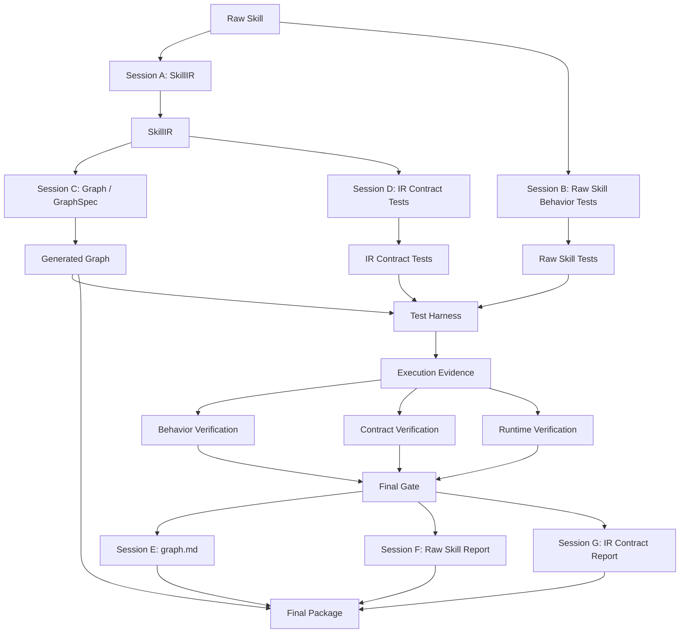

# skill2langgraph 工作流执行指南

> 适用对象：Codex、Claude Code、Cursor，以及其他能够读写仓库文件、启动独立会话、生成代码和运行测试的 AI 编码代理。
>
> 本文说明如何把业务人员编写的 Raw Skill 固化为可执行 LangGraph 流水线。Raw Skill 的写法必须参考 [`可编译业务Skill编写规范.md`](可编译业务Skill编写规范.md)。

## 1. 工作流目标

skill2langgraph 的价值是让不懂代码的业务人员只澄清业务流程、输入输出、规则、异常和验收标准，然后由 AI 编码代理把 Raw Skill 固化为可运行、可测试、可审计的流水线。

最终交付物必须包括：

```text
outputs/<run_id>/
├── graph.py 或 graph.json
├── graph.md
├── raw-skill-behavior-report.json
└── ir-contract-report.json
```

其中：

- `graph.py` 或 `graph.json` 是生成的 LangGraph 流水线或 GraphSpec。
- `graph.md` 是测试后生成的图文档，包含节点、路由、LLM、工具、HITL、缺失能力和警告。
- `raw-skill-behavior-report.json` 检查最终 graph 是否保留 Raw Skill 的业务语义。
- `ir-contract-report.json` 检查最终 graph 是否忠实实现 SkillIR。

运行稳定性验证是内部 Final Gate 输入，不作为第三份独立检测报告交付。

## 2. 通用执行原则

### 2.1 Raw Skill 是语义真源

Raw Skill 决定“业务上什么是正确”。行为测试必须直接基于 Raw Skill 生成，不能基于 SkillIR 推导。

### 2.2 SkillIR 是执行真源

SkillIR 是 Raw Skill 的结构化执行表示。Graph 生成和 IR 契约测试都必须基于 SkillIR。

### 2.3 构建会话与测试会话必须隔离

各 AI 会话只能读取自己允许的输入。不得为了方便把 Raw Skill、SkillIR、测试和 Graph 全部塞给同一个会话。

### 2.4 最终 Graph 执行不调用构建代理

Codex、Claude Code、Cursor 只参与构建阶段。Graph 在 Test Harness 中运行时，只能使用 provided LLM、toolbox、数据中心 API、状态和 HITL 运行时，不能再调用构建代理补逻辑。

### 2.5 人类管理员只观察

管理员可以查看流程、产物、日志、警告、暂停、终止或重跑整个流程，但不能编辑 SkillIR、Graph、测试、报告，也不能覆盖 Final Gate。

## 3. 代理适配说明

本文中的“Session A-G”不是特指 Codex。它表示隔离的 AI 执行会话。

| 执行工具 | 对应实现方式 |
| --- | --- |
| Codex | 使用独立 Codex thread/session；每个 session 只传允许输入 |
| Claude Code | 使用独立任务上下文或新会话；按本文输入/输出边界传文件 |
| Cursor | 使用独立 Agent / Composer 任务；限制可见上下文和目标产物 |

无论使用哪种工具，都必须满足：

- 每个 session 有明确 system prompt。
- 每个 session 有明确输入文件列表。
- 每个 session 有明确输出 schema 或输出文件。
- 每个 session 不读取禁止输入。
- 每个 session 产物必须落盘并带 producer 信息。
- 测试后报告由新的独立 session 生成，不由测试生成 session 自己改写。

<a id="pipeline-flow"></a>

## 4. 总体流程



## 5. 输入要求

执行前必须准备：

```text
1. Raw Skill
2. Raw Skill 编写规范
3. SkillIR schema
4. GraphSpec schema 或 graph.py 生成要求
5. Test Harness 契约
6. toolbox 工具清单和 config 契约
7. 数据中心 API 契约
8. 输出目录
```

Raw Skill 必须符合 [`可编译业务Skill编写规范.md`](可编译业务Skill编写规范.md)。如果 Raw Skill 缺少关键输入、输出、步骤、成功标准或测试场景，Session A 和 Session B 必须把缺失项写入警告，不得假装信息完整。

## 6. Session A：Raw Skill -> SkillIR

### 允许输入

- Raw Skill 全文
- Raw Skill 编写规范
- SkillIR schema
- 数据中心 API 能力摘要
- toolbox 工具能力摘要

### 禁止输入

- 行为测试
- Graph / GraphSpec
- IR 契约测试
- Harness 执行证据
- 最终检测报告

### 输出

```text
skill_ir.json
skill_ir_summary.md
```

### 职责

Session A 必须抽取：

- skill 基本信息
- 业务目标
- 输入和输出
- step 列表
- step 依赖
- guard / gate / HITL
- LLM 使用点
- 工具能力需求
- 状态字段
- 错误、重试和 warning 规则
- 成功标准
- 测试场景摘要

SkillIR 中的工具字段应表达能力需求和候选工具，不得把不存在的工具当成可调用工具。

## 7. Session B：Raw Skill -> 行为测试

### 允许输入

- Raw Skill 全文
- Raw Skill 编写规范
- 行为测试 schema

### 禁止输入

- SkillIR
- Graph / GraphSpec
- IR 契约测试
- Harness 执行证据

### 输出

```text
raw_skill_behavior_tests.json
```

### 职责

行为测试必须从业务语义出发，覆盖：

- happy path
- 必需输入缺失
- 业务规则分支
- HITL 补料或确认
- 非阻断 warning
- 失败和恢复
- 最终输出要求

行为测试不能依赖 SkillIR 的步骤名，除非 Raw Skill 本身显式声明该步骤名。

## 8. Session C：SkillIR -> Graph

### 允许输入

- SkillIR
- SkillIR summary
- GraphSpec schema 或 graph.py 生成要求
- Test Harness 契约
- toolbox 工具清单
- 数据中心 API 能力摘要

### 禁止输入

- Raw Skill 全文
- Raw Skill 行为测试
- IR 契约测试
- Harness 执行证据

### 输出

```text
graph.py 或 graph.json
graph_build_summary.md
```

### 职责

Session C 必须生成可在 Harness 中运行的 Graph，并说明：

- Graph 简介
- 节点列表
- 边与路由
- state reads / writes
- provided LLM 调用点
- 使用的工具
- 缺失工具处理
- HITL 行为
- 警告列表

### 缺失工具处理顺序

当需要的工具不在 toolbox 中时，必须按顺序处理：

1. 识别所需能力。
2. 尝试用已有工具替代。
3. 替代成功则记录能力损失。
4. 替代失败则尝试 graph 内自实现受限能力。
5. 自实现成功则记录边界和警告。
6. 无法自实现则写入无法实现警告。

不允许静默忽略缺失工具。不允许把不存在的工具写成可调用工具。

## 9. Session D：SkillIR -> IR 契约测试

### 允许输入

- SkillIR
- IR 契约测试 schema
- Graph / Harness 契约摘要

### 禁止输入

- Raw Skill 全文
- Raw Skill 行为测试
- Graph / GraphSpec
- Harness 执行证据

### 输出

```text
ir_contract_tests.json
```

### 职责

IR 契约测试必须检查：

- 每个 SkillIR step 是否有 graph node
- 依赖是否映射为 edge 或执行顺序
- guard 是否执行
- HITL 是否使用 state soft interrupt
- LLM 调用点是否保留
- 工具能力是否解析
- 状态字段是否读写正确
- 输出节点是否可达

## 10. Test Harness 执行

Harness 应尽量直接使用真实 AIDA 场景。

推荐 E2E 模式：

```text
Test Harness
-> 数据中心 API 准备项目和文件
-> AIDA Agent API 启动 run
-> toolbox 执行工具
-> provided LLM 执行模型调用
-> 收集 graph evidence / tool evidence / HITL evidence
```

Harness 必须输出：

```text
execution_evidence.json
runtime_report.json
```

执行证据至少包含：

- node trace
- state diffs
- final state
- steps
- logs
- LLM calls
- tool calls
- HITL events
- artifacts
- errors
- warnings

<a id="pipeline-verify"></a>

## 11. 三类验证

### 11.1 行为验证

输入：

- Raw Skill 行为测试
- Harness 执行证据

目的：

- 判断最终 Graph 是否符合 Raw Skill 业务语义。

### 11.2 契约验证

输入：

- IR 契约测试
- Graph metadata
- Harness 执行证据

目的：

- 判断最终 Graph 是否忠实实现 SkillIR。

### 11.3 运行稳定性验证

输入：

- Harness 执行证据

目的：

- 判断 graph 是否在运行环境中稳定执行。

检查项包括：

- graph 是否完成或进入预期 HITL
- state diff 是否合规
- LLM 调用是否成功或有合理 retry
- 工具调用是否返回统一 ToolResult
- 缺 config 时是否返回错误和 guidance
- HITL 是否可恢复
- 输出 artifact 是否存在

## 12. Session E：生成 Graph 文档

### 允许输入

- Raw Skill
- Session A 文档，包含 SkillIR 摘要
- Session C 文档，包含 Graph 简介、节点、边、LLM、工具、HITL、警告
- Harness 执行证据
- Final Gate 状态

### 输出

```text
graph.md
```

### 必须包含

```text
1. Graph 简介
2. Raw Skill 摘要
3. SkillIR 摘要
4. 节点列表
5. 边与路由
6. provided LLM 使用说明
7. 工具使用说明
8. 数据中心 API 使用说明
9. 缺失工具处理
10. HITL 行为
11. 警告列表
12. 已知限制
13. 检测报告摘要
```

## 13. Session F：生成 Raw Skill 行为检测报告

### 允许输入

- Raw Skill 行为测试
- 行为验证结果
- Harness 执行证据

### 输出

```text
raw-skill-behavior-report.json
```

报告只整理和解释测试结果，不修改测试、不修改 Graph。

## 14. Session G：生成 IR 契约检测报告

### 允许输入

- IR 契约测试
- 契约验证结果
- Graph metadata
- Harness 执行证据

### 输出

```text
ir-contract-report.json
```

报告只整理和解释契约结果，不修改测试、不修改 Graph。

## 15. toolbox 边界

toolbox 是公共运行时，不区分 AIDA、Test Harness 或 skill2langgraph 宿主。

工具按标签分类：

```text
generic       通用工具，不绑定 skill
skill:<name>  与某个 skill 绑定
integration   对接外部系统或数据中心 API
```

工具必须统一返回 `ToolResult`：

```json
{
  "ok": true,
  "data": {},
  "error": null,
  "warnings": [],
  "artifacts": [],
  "metadata": {}
}
```

有个人参数或外部集成参数的工具必须从 config 读取。读取不到时返回 `ok=false`，并在 guidance 中告诉 agent 应引导用户获取什么信息、写入哪个 config key。

toolbox 不支持 dry-run。测试环境如果不希望真实发送，应使用测试 config 或禁用该工具，而不是依赖 dry-run。

## 16. 数据中心 API 边界

与项目资产、组织资产、项目管理、人员管理相关的能力，应优先参考 `docs/数据中心API调用规范.md`。

常用能力包括：

- 项目列表和详情
- 项目目录树
- 文件列表
- 文件上传
- 文件下载
- 组织资产树

业务 skill 不要求直接写 API 路径，但 Session A 和 Session C 必须把“项目资产 / 组织资产 / 用户 / 项目”类需求映射到数据中心 API 或对应 toolbox integration 工具。

## 17. Final Gate

最终通过条件：

```python
accepted = (
    behavior_report.passed
    and contract_report.passed
    and runtime_report.passed
)
```

AI 构建会话说“完成”不等于通过。只有测试和执行证据决定最终状态。

## 18. 执行检查清单

执行代理在结束前必须确认：

- Raw Skill 符合编写规范，或缺失项已记录 warning。
- Session A-G 产物都已落盘。
- 会话输入隔离没有破坏。
- Graph 已在 Harness 中执行。
- 两份检测报告已生成。
- `graph.md` 明确列出工具、LLM、HITL、数据中心 API 和警告。
- 缺失工具已按“替代 -> 自实现 -> 无法实现”顺序处理。
- Final Gate 状态清晰，不由人工覆盖。

