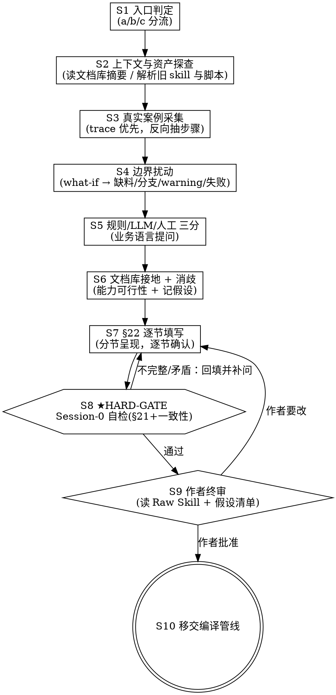

# Skill 引导编写流程 · 完整设计

> 状态：Draft v1（2026-06-08）
> 适用对象：AIDA 工作流开发者、引导 skill 实现者、交付业务专家（被引导对象）
> 上游参考：`docs/skill2langgraph/可编译业务Skill编写规范.md`（目标产物规格，下称《编写规范》）、`docs/30_skill开发/31_手写规范/AIDA-RUNTIME-CONTRACT.md`、`docs/ux/`
> 下游衔接：Session 0 契约校验闸门 → skill 编译管线（Raw Skill → SkillIR → Graph → 测试 → Harness → 报告）

---

## 0. 一句话定位

这是把**业务专家脑中低确定性的隐性流程**，逼成一份**能通过 Session 0 闸门、可被编译成高确定性 LangGraph 的业务契约**的引导流程。它是整个范式的**前门**，也是范式里唯一的 **build-time 作者在环（author-in-the-loop）+ 消歧定型**环节。作为一个**独立程序**，它与 skill2langgraph 流水线解耦，仅通过交付契约相连（见 §13）。

它的产出不是"一份文档"，而是**两件物证**：

1. 一份符合《编写规范》§22 模板、且通过 Session 0 校验的 **Raw Skill**。
2. 一份 **已确认假设清单（Confirmed Assumptions Log）**——记录每一处"把模糊收紧成确定"的决定，由业务作者本人确认。

> 核心原则的转变：在旧管线里"原始 Skill 是语义真源"。本流程把语义真源从『那份模糊草稿』升级为『草稿 + 已确认假设清单』，从而解决"低确定性来源无法充当精确 oracle"的根本矛盾。

---

## 1. 设计目标与非目标

### 1.1 目标

- 让不懂开发的业务人员，仅凭描述业务，就能产出合规 Raw Skill。
- 把"完整性校验 + 一致性校验 + 消歧定型"前移到**写作期**，使 Session 0 几乎只做确认而非发现。
- 同时支持**两类来源**：已有 skill（纯文本，或文本 + 脚本/附件）改写；从头新建。
- 每一处确定性收紧都**显式、可追溯、经作者确认**，绝不由 AI 静默替业务做主。
- 在写作期就对照**文档库**（toolbox / 数据中心 API / 文件结构）验证能力可行性，把"工具做不到"暴露在编译之前。

### 1.2 非目标

- 不生成 LangGraph、不写 Python、不碰编译——那是下游管线的事。
- 不替业务人员决定业务规则的对错（阈值、分支、风险判定由作者拍板，本流程只负责"问清楚、写明确、记下来"）。
- 不做运行时 HITL（运行时人类只观察）。本流程的人类在环发生在 **build-time**，与运行时 observer 是不同角色、不同阶段，互不冲突。

---

## 2. 与现有资产的关系

| 资产 | 角色 | 本流程如何使用 |
| --- | --- | --- |
| 《编写规范》（§1–§22） | 目标产物规格 + §21 检查清单 + §22 模板 | 作为产出结构与校验项的权威来源 |
| AIDA-RUNTIME-CONTRACT | 运行时契约 | 在能力接地与 HITL 表达上对齐，避免写出运行时无法实现的语义 |
| 文档库（toolbox / 数据中心 API / 文件结构） | 能力与对象目录 | 写作期能力接地、缺口检测的依据（**当前在建，见《文档库需求文档》**） |
| obra/superpowers `brainstorming` skill | 方法论范式 | 借其"带硬闸门的状态机 + 一次一问 + 分节确认 + spec 自审"骨架 |
| 设计偏好文档 | 前端/呈现偏好 | 引导界面的视觉与信息架构（领导汇报视角、渐进式披露、企业冷静） |

> 注：旧四会话管线的两份 prior-art 设计文档（`prior-skill2langgraph设计`、`prior-four-session-aida-harness-design`）未随本文档集导入，作为被取代的历史参考，留存于原始来源。

---

## 3. 总体流程（双入口 → 统一主干 → 双产出）

```text
                       ┌─────────────────────────────────────────────┐
   入口分流            │           统一主干（消歧定型）               │      产出
 ─────────────        │                                             │   ──────────
                       │                                             │
 [A] 已有 skill ──┐    │  S3 真实案例采集（trace 优先）             │
   (纯文本/带脚本) │    │  S4 边界扰动（what-if → 缺料/分支/warning）│
                  ├──▶ │  S5 规则/LLM/人工 三分（业务语言）         │ ──▶ Raw Skill (§22)
 [B] 从头新建 ────┘    │  S6 文档库接地 + 消歧 + 记假设             │ ──▶ 假设清单
                       │  S7 §22 逐节填写（分节确认）              │
   S1 入口判定         │  S8 ★HARD-GATE：Session-0 自检（内联修）  │
   S2 上下文/资产探查  │  S9 作者终审                              │
                       │                                             │
                       └─────────────────────────────────────────────┘
                                          │
                                          ▼
                              S10 移交 Session 0 / 编译管线
```

主干对所有来源一致；差异只在 S1→S2 的"原料预处理"。

---

## 4. 入口分流：两类 Raw Skill 来源

业务人员带进来的东西分两类，预处理策略不同，但都必须汇入同一条主干、过同一道闸门。

### 4.1 入口 A：已有 skill（纯文本，或文本 + 脚本/附件）

典型来源：业务人员此前写的 SKILL.md、流程说明 Word、夹带的 Python/SQL 脚本、Excel 模板、历史报告样例。

预处理步骤（S2 阶段）：

1. **解析与归类**：把带进来的材料分成『流程叙述』『隐含规则』『脚本逻辑』『输入输出样例』四类。
2. **脚本逆向为业务语义**：脚本是宝贵的"确定性证据"，但不能直接当实现塞进去。要把脚本读成业务规则——例如一段 `if load_rate > 0.8: level='高'` 必须被翻译成业务规则候选"配电负载率 > 80% → 风险等级高"，并在 S6 让作者确认阈值（脚本里的 magic number 极可能是某次拍脑袋）。脚本里调用的外部能力（读文件、发邮件、调 API）登记为**能力需求候选**，进入 S6 接地。
3. **缺口与矛盾初筛**：对照《编写规范》§21，标出原 skill 缺哪些章节（常见：缺成功标准、缺测试场景、缺缺失处理）。把原文里互相矛盾的地方（脚本行为 vs 文字描述不一致是高发区）登记为**待消歧项**。
4. **改写模式选择**：
   - *评审/挑刺模式*（默认，针对较完整的旧 skill）：把缺口与矛盾逐条变成 S3–S7 的提问，不推翻原作。
   - *重采模式*（针对过于残缺或纯口语的旧文本）：只把旧材料当背景，走完整 trace 采集。

> 关键红线：**脚本的存在不等于业务正确**。脚本经常把一次性 hack 固化成"看起来确定"的逻辑。引导流程要把脚本里的每个常量、每个分支、每个外部调用都翻成业务问题回问作者，而不是默认它对。

### 4.2 入口 B：从头新建

没有任何既有材料。直接进入主干，以 S3 的"讲一个真实案例"为起点。对完全没有现成案例的新业务，退化为：先让作者口述"理想中这件事应该怎么走一遍"，再用 S4 扰动补边界。

### 4.3 入口判定（S1）

引导 skill 开场用一个选择题完成分流：

```text
你想怎么开始？
  (a) 我有现成的 skill / 流程文档 / 脚本，想改造它      → 入口 A
  (b) 我有现成材料，但很零散，想重新理一遍              → 入口 A·重采
  (c) 从零开始，我来讲，你来记                          → 入口 B
```

---

## 5. 状态机（节点级）

引导 skill 内部维护一个**进度状态**，知道每个章节是否已采集、是否已确认、是否仍缺/仍矛盾。它**不到 S8 闸门通过且 S9 作者批准，不产出 Raw Skill**。



### 5.1 节点职责表

| 节点 | 输入 | 动作 | 输出/状态写入 | 退出条件 |
| --- | --- | --- | --- | --- |
| S1 入口判定 | 用户选择 | 分流到 A / A·重采 / B | `source_mode` | 选定 |
| S2 上下文探查 | 文档库能力摘要；（A）旧 skill + 脚本 | 读 toolbox/API/文件结构摘要；解析旧材料为四类；缺口/矛盾初筛 | `context`, `legacy_assets`, `gap_list[]`, `conflict_list[]` | 材料已归类 |
| S3 案例采集 | 作者口述 | 让作者完整叙述一个真实案例，反向抽 step、输入、输出、规则 | `steps[]`(草稿)、`io`(草稿)、`rules[]`(草稿) | 至少一条 happy-path 成形 |
| S4 边界扰动 | S3 草稿 | 对真实案例做 what-if 扰动，逼出缺失处理、分支、warning、失败态 | 补全 `steps[].on_missing`、`branches[]`、`warnings[]`、`failures[]`、`test_scenarios[]` | 四类测试场景齐备 |
| S5 三分 | steps | 对每步问"明文规则/专家判断/人工确认"，映射 rule / LLM / HITL | `steps[].kind`, `llm_points[]`, `hitl[]` | 每步已分类 |
| S6 接地+消歧 | 能力需求候选；待消歧项 | 对照文档库验证每个能力需求；模糊处给 2–3 解读让作者选；记假设 | `tool_needs[]`(已接地)、`assumptions[]`、新 `gap_list`（能力缺口） | 能力全部有结论、消歧项清零 |
| S7 逐节填写 | 以上全部 | 按 §22 十五节组织，分节呈现，逐节求确认 | `raw_skill_draft`（结构化） | 十五节均经确认 |
| S8 HARD-GATE | raw_skill_draft | 跑 §21 完整性 + 一致性规则，内联报缺/报矛盾 | `gate_report` | 全部通过 |
| S9 作者终审 | raw_skill_draft + assumptions | 让作者通读全文与假设清单 | 批准/打回 | 作者批准 |
| S10 移交 | 通过的产物 | 输出 Raw Skill(md) + 假设清单(json)，交 Session 0 | 交付包 | — |

---

## 6. 提问技巧库（S3–S6 的核心 know-how）

这是引导 skill 真正的价值所在。面向"领域强、开发弱"的人，**不能用技术问法**。

### 6.1 具体先于抽象——用"讲一个真实案子"代替"请定义你的输入"

业务人员说不出一般规则，但能把"上次做 K1903 怎么做的"讲得很清楚。让其叙述一个真实完整案例，引导 skill 从叙述里**反向抽取** step / 输入 / 输出 / 规则。从特例归纳通则，远比直接问通则有效。

话术：
> "别急着定义。先给我讲一个你最近真做过的案子，从拿到资料那一刻讲到交付，中间你都干了什么。"

### 6.2 用"如果……会怎样"扰动真实案例，逼出边界

| 扰动 | 逼出的章节 |
| --- | --- |
| "那次要是没拿到 BOQ 呢？" | 缺失处理 / HITL 补料（§4、§11、§15） |
| "要是负载率特别高呢？" | 业务规则分支 + 风险判定（§10） |
| "要是没配审批人呢？" | 非阻断 warning（§15） |
| "要是报告生成到一半失败呢？" | 失败态 + 重试范围（§15） |

§17 要求的四类测试场景（happy / 缺输入 / 业务分支 / warning），本质就是对一个真实案例做四种扰动后自然掉出来的。

### 6.3 把"要不要用 LLM"翻译成业务语言（S5 三分）

不要问技术问题。对每一步问：

> "这一步——
> （A）有明文规则照着做、**换谁来都该是同一个答案**？
> （B）得**有经验的人看资料判断、不同专家可能给不同结论**？
> （C）**必须现场或人工确认**才能往下？"

映射：A → 规则节点（不交给模型）；B → LLM 判断点（§13，且必须要求"给出依据"）；C → HITL（§11）。这是从非技术语言里榨出 §10/§13 的唯一靠谱办法，也顺手实现了范式追求的"去 LLM 化 / 提确定性"。

### 6.4 每遇模糊词，当场钉死，并记进假设清单（S6 消歧）

作者说"负载高就标风险"，引导 skill 必须追：

> "'高'=负载率超过多少？我先按 **80%** 记，对吗？还是 85 / 90？"

多个合法解读时，给 2–3 个具体选项 + 推荐（借 brainstorming 的"propose 2-3 approaches"），让作者选。每次确认产出一条假设记录（见 §8）。

### 6.5 文档库接地（S6）

作者说"我要读 BOQ"，引导 skill 去查文档库回敬：

> "BOQ 在数据中心里属于『项目资产』，可以用 `doc_read_xlsx` 读取——对吗？"

这既正确填了 §9/§19，又**在写作期暴露能力缺口**：如果作者要的事 toolbox 根本做不到，现在就发现，记成能力缺口移交（而不是编译到一半才炸）。**这条把引导 skill 和文档库真正绑定**，也是它能泛化、不沦为 zhgk 专用的关键——能力解析必须由文档库驱动，不得在引导 skill 里硬编码工具映射。

---

## 7. HARD-GATE：S8 的 Session-0 自检

借 brainstorming 的"spec 自审"，但升级为**形式化、可机器执行**的校验，而非凭感觉。分两层。

### 7.1 完整性校验（对应《编写规范》§21）

逐项检查，缺一不可（节选）：

- 有稳定 `name`；有业务目标；有适用范围与非目标。
- 输入表 / 输出表 / 流程步骤表完整（每行字段齐）。
- 至少列出关键业务规则；写明 HITL 行为；写明工具能力需求；写明 LLM 使用点。
- 写明状态字段；写明错误/重试/warning；写明成功标准。
- 至少四类测试场景（happy / 缺输入 / 业务分支 / warning；有 HITL 则加 HITL 场景）。
- 不含代码实现细节（不点名 Python 函数）。

### 7.2 一致性 / 可满足性校验（旧管线完全缺失的部分）

这是比"缺失"更隐蔽、必须机器检测的一类：

| 规则 | 含义 |
| --- | --- |
| 步骤输入可达 | 每个 step 的输入必须来自"已声明输入"或"某个上游 step 的输出"，不得凭空引用 |
| 成功标准可映射 | 每条成功标准必须能落到某个可验证的输出/状态字段上，不得只写"结果正确" |
| 状态字段已声明 | 被任何 step 引用的 state 字段必须在 §11 状态字段里声明 |
| HITL 触发有据 | 每个 HITL 触发条件必须指向真实存在的输入/步骤 |
| 失败处理不自相矛盾 | "缺 X 进补料/不得继续" 与 "成功标准要求有 X 的产物" 不得冲突 |
| 依赖无环 | step 依赖图必须是 DAG |
| LLM 点有结构要求 | 每个 LLM 使用点必须声明输出结构；高风险判断必须要求依据 |

校验失败 → 回 S7 定点补问（"第 X 步的输入『勘测摘要』没有任何上游产出它，是漏了一步，还是它其实是输入？"），**绝不带病放行**。

### 7.3 闸门纪律（照搬 brainstorming 的 HARD-GATE 与反模式）

- 在 S8 通过且 S9 批准前，**不产出最终 Raw Skill、不移交编译**。
- 内置"这太简单不用写这么细"反模式应答：越简单的流程越容易藏未审问的假设；最小产物也要过闸门，只是篇幅可以短。

---

## 8. 产出物规格

### 8.1 产物一：Raw Skill（§22 模板）

按《编写规范》§22 的十五节结构输出 markdown。保存路径默认 `outputs/<skill_name>/SKILL.md`（或交由编译管线约定）。

### 8.2 产物二：已确认假设清单（Confirmed Assumptions Log）

机器可读 JSON，逐条记录每一次"把模糊收紧成确定"的决定与作者确认。这是把语义真源从『草稿』升级为『草稿 + 确认』的物证，也供下游可追溯。

```json
{
  "skill_name": "zhgk",
  "authored_at": "2026-06-08T10:00:00+08:00",
  "source_mode": "legacy_with_scripts",
  "assumptions": [
    {
      "id": "A001",
      "section": "业务规则",
      "kind": "threshold_pinned",
      "question": "负载高的阈值是多少？",
      "options_presented": ["80%", "85%", "90%"],
      "resolved_value": "80%",
      "evidence": "来源脚本 risk.py 第 42 行 load_rate>0.8；作者确认沿用",
      "confirmed_by": "作者",
      "confirmed_at": "2026-06-08T10:12:00+08:00"
    },
    {
      "id": "A002",
      "section": "流程步骤",
      "kind": "branch_chosen",
      "question": "无法判断场景时，走人工确认还是默认液冷？",
      "options_presented": ["人工确认(present_choices)", "默认液冷"],
      "resolved_value": "人工确认",
      "evidence": "作者口述：判断不了一定要人来定",
      "confirmed_by": "作者"
    },
    {
      "id": "A003",
      "section": "工具能力需求",
      "kind": "capability_gap",
      "question": "需要实时 HTTP 健康检查 /healthz",
      "resolved_value": "toolbox 暂无 HTTP 工具 → 记为能力缺口，移交文档库/工具开发",
      "confirmed_by": "作者",
      "downstream": "doc_library_request"
    }
  ]
}
```

`kind` 取值建议：`threshold_pinned`（阈值钉死）、`branch_chosen`（分支选定）、`step_kind`（规则/LLM/人工三分结论）、`capability_substituted`（能力替代）、`capability_gap`（能力缺口）、`ambiguity_resolved`（一般消歧）、`scope_decision`（范围/非目标）。

---

## 9. 与下游的衔接（S10）

- 移交对象是 **Session 0 契约校验闸门**（见旧管线批评中提出的前置闸门），而非直接进编译。因为 S8 已在写作期跑过同一套 §21 + 一致性校验，Session 0 在此退化为"复核 + 把关"，重复但廉价，作为第二道保险。
- 假设清单随 Raw Skill 一并移交。编译管线生成 Graph 时，凡涉及被收紧的点，应能回溯到对应假设 ID（可追溯性）。
- 能力缺口（`capability_gap`）分两路：一路进编译管线的缺失工具策略（替代/自实现/警告）；一路**回流文档库**作为工具/接口需求（见《文档库需求文档》§7 缺口反馈）。

---

## 10. 引导 skill 自身的形态与部署

- **形态**：本身是一个**独立程序**（standalone）——不是跑在 Codex / Claude Code / Cursor 里的 skill 或插件，而是有自己部署、自己状态、自己 LLM 后端的前门系统，也是范式的第一个"build-time 人类在环"样板。底层可建于 Claude Agent SDK 或 LangGraph 之上（节点即 S1–S10）；但"用 SDK 实现"与"作为编码工具内的 skill"是两回事——前者是实现细节，后者已排除。详见 §13。
- **部署面**：业务人员多半不在 IDE，首选对话侧（AIDA 的 ClawRail）。
- **呈现（对齐设计偏好文档）**：把"正在成形的 Raw Skill 与流程图"实时显示给作者（共享画布感）；宏观先于细节、渐进式披露、企业冷静精确；让作者感到"在和一个资深交付专家结对"，而非填表。
- **红线**：凡实质内容只能"我帮你起草、你来确认"，每条进假设清单。silent invent 与下游 silent fix 同样致命。

---

## 11. 分阶段交付（降低业务人员心智负担）

不要一上来甩十五节。分三阶段，每阶段都留一个"当前可用的最小产物"，作者随时能停：

1. **阶段一·骨架**：name + 业务目标 + 一条 happy-path（S3）。
2. **阶段二·加固**：分支、缺料处理、warning、失败态（S4–S5）。
3. **阶段三·形式化**：成功标准、测试场景、状态字段、能力接地与消歧（S6–S7），然后过闸门。

---

## 12. 开放问题（待与文档库开发并行敲定）

- 文档库的**机器可读能力清单**格式未定（见《文档库需求文档》）——S6 接地强依赖它；在它就绪前，S6 先用人工确认 + 占位，并把每次接地记成假设，待清单就绪后批量校验。
- Session 0 与 S8 的校验规则应**同源**（同一份规则定义，两处调用），避免双实现漂移。
- 假设清单 schema 需与编译管线的可追溯需求对齐后冻结。

---

## 13. 系统边界与交付契约（与 skill2langgraph 流水线的关系）

本范式由**两个解耦的系统**组成，本流程（引导编写系统）是其一。两者只通过一份交付契约相连：

```text
┌─────────────────────────┐     交付契约（唯一接缝）     ┌──────────────────────────┐
│  引导编写系统（本程序）  │  Raw Skill + 已确认假设清单  │  skill2langgraph 流水线    │
│  · 独立程序，业务人员侧  │ ──────────────────────────▶ │  · 开发者 / CI 侧          │
│  · 对话式、HITL 密集     │      →  Session 0 闸门  →    │  · build agent 驱动、可无头│
│  · build-time 人在环     │                             │  · 产出确定性 LangGraph    │
└─────────────────────────┘                             └──────────────────────────┘
```

### 13.1 交付契约（唯一接缝，需冻结）

- 产物：`SKILL.md`（《编写规范》§22 模板）+ `assumptions.json`（本文 §8.2 已确认假设清单）。
- 移交方式：写出文件 → 交 Session 0 校验闸门，**不做进程内调用**。
- 流水线接受**任何来源**的合规 Raw Skill：本程序产出的，或懂《编写规范》的开发者手写的。契约一旦冻结，两系统各自独立演进；本程序即使不接编译，单独产出一份合规 skill 本身也有价值。

### 13.2 职责切分

| | 引导编写系统（本程序） | skill2langgraph 流水线 |
| --- | --- | --- |
| 面向 | 业务专家（领域强、开发弱） | 开发者 / CI |
| 形态 | 独立对话式程序 | 可无头自动化的编译管线 |
| 人在环 | build-time，HITL 密集 | 仅 observer 只读 |
| 用谁的智能 | **自带模型 / agent 循环** | **Codex / Claude Code / Cursor 三选一** |

### 13.3 关键澄清：谁需要 agent-中立？

"适配 Codex / Claude Code / Cursor"这条要求**只对流水线成立**——流水线的 build 会话（A–G）由可插拔的 **BuildAgent 适配器**驱动。三者皆有确认可用的无头单发模式（`codex exec` / `claude -p` / `cursor-agent -p`），一次调用即一个天然隔离的会话；产物统一写约定文件供适配器读取（不依赖各家 stdout 格式）。agent-中立之所以安全，是因为下游有 agent-中立的验证门把关，确定性来自被生成的 LangGraph，而非生成它的 agent。

**本引导程序不在此列**：它嵌自己的模型后端，不骑在这三家之上。再次强调："用 Claude Agent SDK 实现"与"作为编码工具内的 skill"是两回事——前者是实现细节，后者已排除。

> BuildAgent 适配器的完整设计（三家无头入口、文件式产物提取、会话隔离、provenance、命名去 Codex 化）属于**流水线侧设计文档**，单独成篇，不在本文展开。

---

## 附录 A：借鉴 obra/superpowers `brainstorming` 的映射

| brainstorming 机制 | 本流程对应 | 改造点 |
| --- | --- | --- |
| HARD-GATE（设计未批准不实现） | S8+S9（未过闸门/未批准不产出不移交） | 照搬 |
| "太简单不用设计"反模式 | S8 闸门纪律 | 照搬话术 |
| 一次一问、优先选择题 | S3–S7 全程 | 照搬 |
| checklist 按序完成 | S1–S10 状态机 | 换成 §22 十五节 + 一致性 |
| propose 2–3 approaches | S6 消歧给 2–3 解读 | 用途从"技术选型"改为"消歧" |
| 分节呈现、逐节批准 | S7 逐节确认 | 节 = §22 固定 schema |
| spec 自审（占位/矛盾/范围/歧义） | S8 形式化校验 | 从凭感觉升级为机器可执行 |
| 用户审 spec | S9 作者终审 | 加审"假设清单" |
| 探查代码库 | S2/S6 探查**文档库** | 对象从代码换成 toolbox/API |
| 终态 invoke writing-plans | S10 移交**编译管线** | 终态换成 Session 0 |
| 大范围先分解 | S2 复杂业务先拆子 skill | 照搬 |
