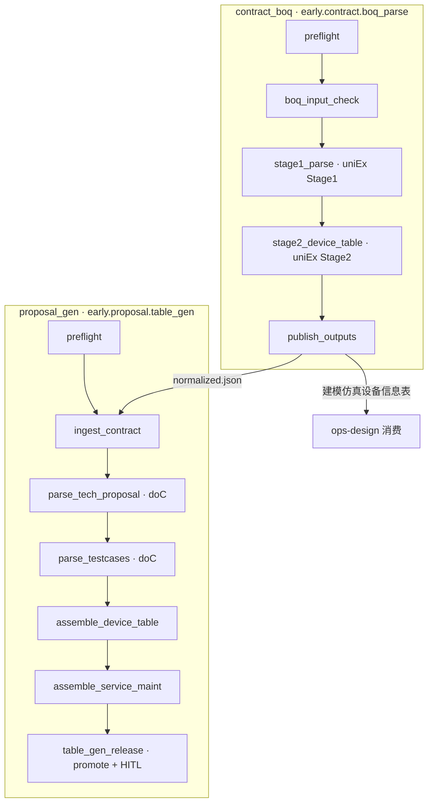

# 交付预案 LangGraph 转化设计

> v0.2 · 2026-06-16 · Skill ID: `contract_boq` + `proposal_gen`

## 总览



## 数据流（IPO SSOT）

```
上游 step → 早期介入/交付预案/解析结果/{子目录}/*.json
table_gen_release → 早期介入/交付预案/输出结果/*.xlsx
HITL release → 预案版本信息表.xlsx
```

**不使用** REST 内部路径 `解析结果/预案草稿/`。

## Step IO 契约

完整定义见 `agent/skills/early_io/contracts.py`（`CONTRACT_BOQ_STEPS` / `PROPOSAL_GEN_STEPS`）。

### 合同侧（写入）

| Step | moduleCode | fileStage | folderSubPath | 产物 |
|------|------------|-----------|---------------|------|
| stage1_parse | contract | 解析结果 | BOQ设备解析原始结果 | `*.normalized.json` |
| stage2_device_table | contract | 输出结果 | 建模仿真 | `建模仿真设备信息表.md` |

### 交付预案侧

| Step | 读 | 写 |
|------|----|----|
| ingest_contract | `合同/解析结果/BOQ设备解析原始结果/` | — |
| parse_tech_proposal | `交付预案/输入文件/技术建议书/` | `交付预案/解析结果/服务建议书解析结果/` |
| parse_testcases | `交付预案/输入文件/测试用例/` | `交付预案/解析结果/测试用例解析结果/` |
| assemble_device_table | 合同 BOQ 解析 | `交付预案/输出结果/设备信息表.xlsx`（**上游**） |
| table_gen_release | `交付预案/解析结果/*` | `交付预案/输出结果/*.xlsx`（§4.2 全表） |

## 代码落点

| 组件 | 路径 |
|------|------|
| §4.2 输出表注册 | `agent/skills/early_io/output_tables.py` |
| promote 层 | `agent/skills/early_io/promote.py` |
| 版本记录 | `agent/skills/proposal_gen/release_meta.py` |
| IPO 路径常量 | `agent/constants/project_paths.py` → `contract_paths()` |
| 物理路径解析 | `agent/skills/early_io/paths.py` |
| Step IO 表 | `agent/skills/early_io/contracts.py` |
| 合同 Skill | `agent/skills/contract_boq/` |
| 预案 Skill | `agent/skills/proposal_gen/` |
| 注册 | `agent/skills/__init__.py` |
| 交接文档（本地） | `docs/30_skill开发/proposal-langgraph-交接.local.md` |

## 环境变量

```bash
# agent/.env
AIDA_BUSINESS_ROOT=d:/path/to/data
UNIEX_BENCH_ROOT=d:/path/to/uniEx-bench
DATA_CENTER_BASE_URL=http://127.0.0.1:9000
```

## 待办（v0.3+）

- [ ] DOCX 全文导出
- [ ] 全链路 `DataCenterClient.upload_file`
- [ ] 前端链式触发 skill
- [ ] 服务 BOQ 独立子链
- [ ] HLD 解析 step（`early.proposal.hld_parse`）
