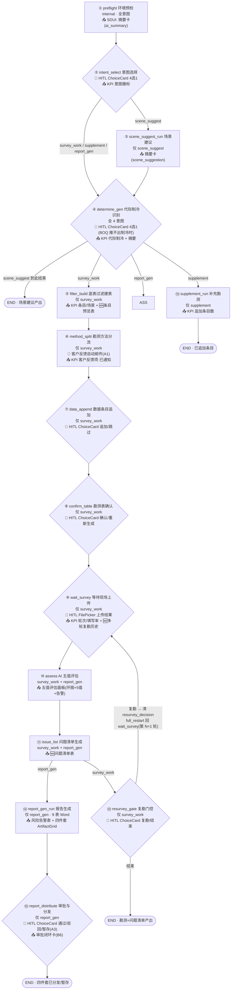
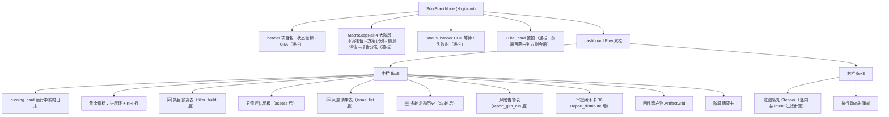

# 智慧工勘（zhgk）· 细分步骤 × SDUI 推送流程图

> 从 v4 源码抽离：`agent/skills/zhgk/skill.py`（步骤顺序）· `steps/_intent_guard.py`（意图路由）· `sdui.py`（SDUI 投影）。
> 15 步单流水线支撑 4 种意图，每步内部 `should_skip()` 决定是否跳过；每步完成后投影器把 `SkillState` 投成一棵 SDUI 树经 SSE 推给前端。

---

## 一、主管线流程图（15 步 · HITL 门 · 意图路由 · 复勘环）

> 🙋=HITL 人工介入门　📤=该步完成后 SDUI 推送的主面板　🆕=本轮新增（B 阶段）　📧=外发副作用

---

## 二、4 条意图路径（实际跑哪些步）

```mermaid
flowchart LR
    subgraph SC["scene_suggest 场景建议"]
        direction TB
        sc1[preflight] --> sc2[intent_select] --> sc3[scene_suggest_run] --> sc4[determine_gen] --> scE([END])
    end
    subgraph SW["survey_work 全流程工勘（主入口）"]
        direction TB
        sw1[preflight]-->sw2[intent_select]-->sw3[determine_gen]-->sw4[filter_build]-->sw5[method_split]-->sw6[data_append]-->sw7[confirm_table]-->sw8[wait_survey]-->sw9[assess]-->sw10[issue_list]-->sw11{resurvey_gate}
        sw11 -.复勘.-> sw8
        sw11 -.结束.-> swE([END])
    end
    subgraph RP["report_gen 报告生成"]
        direction TB
        rp1[preflight]-->rp2[intent_select]-->rp3[determine_gen]-->rp4[assess]-->rp5[issue_list]-->rp6[report_gen_run]-->rp7{report_distribute}-->rpE([END])
    end
    subgraph SU["supplement 补充勘测"]
        direction TB
        su1[preflight]-->su2[intent_select]-->su3[determine_gen]-->su4[supplement_run]-->suE([END])
    end
```

---

## 三、每步 → 写入 metrics → SDUI 推送面板（投影契约）

| # | 步骤 | 意图 | HITL | 写入 metrics/state | SDUI 推送面板 |
|---|------|------|------|-------------------|--------------|
| ① | preflight 环境预检 | 全 | — | `ai_summary` | 阶段摘要卡 |
| ② | intent_select 意图选择 | 全 | ChoiceCard 4选1 | `project.intent` | KPI 意图徽标 · HITL 卡 |
| ③ | scene_suggest_run 场景建议 | scene_suggest | — | `scene_suggestion` | 摘要卡 |
| ④ | determine_gen 代际制冷识别 | 全 4 意图 | ChoiceCard 4选1（BOQ 推不出时）★ | `generation_cooling` · `gen_cooling_source` | KPI 代际制冷 · 摘要 · HITL 卡 |
| ⑤ | filter_build 底表过滤建表 | survey_work | — | `filtered_count` · `sub_scenes` · **`preview_rows`** | KPI 条目/场景 · **🆕条目预览表(DataTable)** |
| ⑥ | method_split 勘测方法分流 | survey_work | —（自动发邮件 A1） | `customer_feedback_count` · `customer_feedback_emailed` | KPI 客户反馈项·已通知/待通知 |
| ⑦ | data_append 数据条目追加 | survey_work | ChoiceCard 追加/跳过 | `data_append_choice` | HITL 卡 · KPI 追加数 |
| ⑧ | confirm_table 勘测表确认 | survey_work | ChoiceCard 确认/重新生成 | `table_confirmed` | HITL 卡 |
| ⑨ | wait_survey 等待现场上传 | survey_work | FilePicker 上传结果 | `survey_round` · `filled_count` · **`survey_round_history`** · `fill_pct`/`todo_*` | KPI 轮次/填写率/待办 · **🆕多轮复勘历史(DataTable)** · HITL 卡 |
| ⑩ | assess AI 五值评估 | survey_work · report_gen | — | `assess_total` · `assess_{满足/不满足/不涉及/未勘测/无法识别}` | 五值评估面板（环图 + 5 值 + 告警） |
| ⑪ | issue_list 问题清单生成 | survey_work · report_gen | — | `issue_count` · **`issue_rows`** · `issue_list_path` | **🆕问题清单表(DataTable)** |
| ⑫ | resurvey_gate 复勘门控 | survey_work | ChoiceCard 复勘/结束 | `project.resurvey_decision` | HITL 卡（复勘→回 ⑨） |
| ⑬ | supplement_run 补充勘测 | supplement | ChoiceCard 追加/跳过 | `supplement_rows` · `supplement_choice` | KPI 追加条目 · HITL 卡 |
| ⑭ | report_gen_run 报告生成 | report_gen | — | `risk_hit` · `risks[]` · `report_path` | 风险告警表(RiskList) · 四件套 ArtifactGrid |
| ⑮ | report_distribute 审批与分发 | report_gen | ChoiceCard 通过/驳回/暂存 ★A3 | `approval_status` · `email_sent` · `recipients` · `attachments` · `project_name` | 审批闭环卡(B6) · 分发摘要 · HITL 卡 |

> ★ = 本会话引擎修复点：④ determine_gen 的 run() 返回 HITL 现已被 base.py 正确识别（原先被吞，导致死在 ⑤）；⑮ 三选一审批闭环为 A3 新增。

---

## 四、SDUI 页面布局（每帧投影出的整棵树 · `sdui.py::project()`）

> 每个中栏面板都是「按需渲染」：源 metrics 不存在 → 该段返回 `None` 不渲染。
> idle 态（未启动）只渲染 header + 任务说明引导卡。
> full_restart 重放期间不推中间帧、`/ui` 与 SSE 快照用 `display_state` 兜底（避免回退到环境准备）。

---

## 五、关键机制注脚

- **意图路由**：`should_skip(step_key, project.intent)` — intent 不在 `STEP_INTENTS[step_key]` 则该步 `status=skipped`，Stepper 与 MacroStepRail 自动隐藏。
- **HITL 软中断**：`check_inputs()` 或 `run()` 返回 `hitl{step,need_inputs/need_files}` → router 路由到 END 暂停；前端补齐后 `/resume` → `apply_resume_payload` 把选择写入 project → full_restart 续跑。
- **多轮复勘环**：`resurvey_gate` 选「复勘」→ 清 `resurvey_decision` → full_restart → `wait_survey.check_inputs` 检出 `resurvey_pending` → 再次 FilePicker（第 N+1 轮）→ 结果归档「第 N 轮」列，`assess` 基于「最新检查结果」重评。
- **投影器纯函数**：`project(state)` 无磁盘 IO / 无 LLM；要在 SDUI 展示的数据，step 必须写进 `metrics` 或 `project`。

*源码对应：`agent/skills/zhgk/skill.py` · `steps/_intent_guard.py` · `steps/*.py` · `sdui.py` · `agent/sdui/projector_base.py`*
