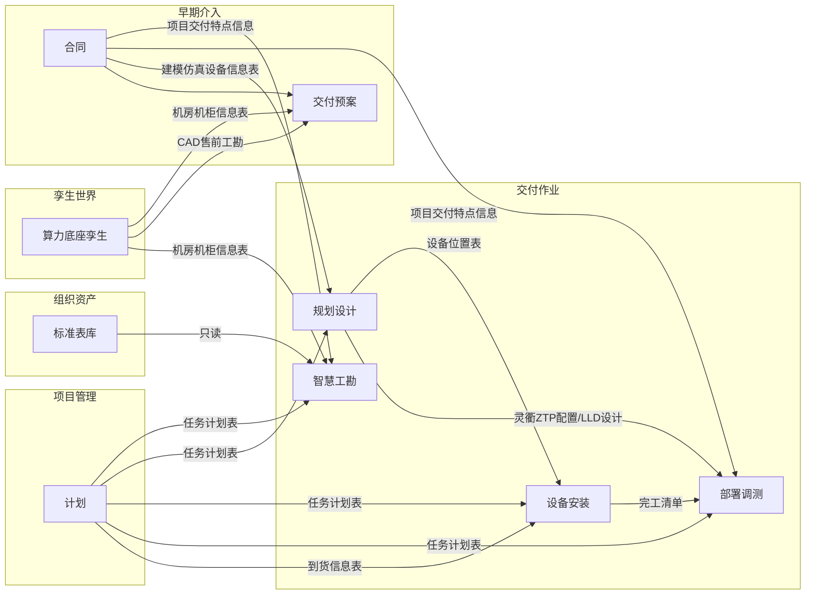

# AIDA 业务数据规范

> **版本**：v2.1 · 2026-06-08
> **定位**：业务数据的总纲（数据存在哪、谁能读写、新增数据放哪、如何演进）。本规范在《项目数据规范 v1.2》基础上补齐数据总体架构、控制面数据库、版本演进与开发自检等内容，并保留原有的目录 Taxonomy、IPO、握手、字段与权限设计。
> **目的**：让人和 AI（skill）都读得懂——每个业务模块该**从哪里读数据、把数据写到哪里、会产出哪些数据、如何命名、模块之间如何流转**。从而保证任何人/AI 开发或修改 skill 时，数据读写落点一致、模块间数据能正确衔接、不产生混乱。
> **读者**：写 skill 的业务开发、模块数据 Owner、TD/PD、平台/数据中心开发
> **配套**：数据操作的接口调用方式见《AIDA 数据中心 API 调用规范》。

---

## 目录

- [第 1 章 数据总体架构](#第-1-章-数据总体架构)
- [第 2 章 组织资产规范（参考/主数据）](#第-2-章-组织资产规范参考主数据)
- [第 3 章 项目级资产规范（业务数据面）](#第-3-章-项目级资产规范业务数据面)
- [第 4 章 数据生命周期与模块 IPO](#第-4-章-数据生命周期与模块-ipo)
- [第 5 章 产物目录与字段规范](#第-5-章-产物目录与字段规范)
- [第 6 章 控制面数据库规范](#第-6-章-控制面数据库规范)
- [第 7 章 命名、版本字段与并发](#第-7-章-命名版本字段与并发)
- [第 8 章 来源、质量与血缘](#第-8-章-来源质量与血缘)
- [第 9 章 角色与目录权限（RBAC）](#第-9-章-角色与目录权限rbac)
- [第 10 章 版本与演进](#第-10-章-版本与演进)
- [第 11 章 开发数据自检清单](#第-11-章-开发数据自检清单)
- [附录 A 模块握手矩阵](#附录-a-模块握手矩阵)
- [附录 B 全量字段表索引](#附录-b-全量字段表索引)
- [附录 C 预案章节 ↔ 输出表索引](#附录-c-预案章节--输出表索引)

---

## 第 1 章 数据总体架构

### 1.1 三处存储与定位

AIDA 的数据分三处存放，按业界概念可归为「两个数据面 + 一个控制面」：

| 存储 | 物理位置 | 业界定位 | 关键属性 |
| --- | --- | --- | --- |
| **组织资产** | `{BUSINESS_ROOT}/org-assets/` | 参考数据 / 主数据（Reference & Master Data） | 跨项目共享、只读、SSOT、管理员维护 |
| **项目级资产** | `{BUSINESS_ROOT}/projects/{project_id}/...` | 业务数据面（Data Plane），分层数据湖（Medallion） | 项目隔离、按模块 Owner、输入→解析→输出三层 |
| **数据库** | PostgreSQL（`aida_database`） | 控制面 / 元数据面（Control Plane） | 不存业务数据本体，存目录索引、血缘、注册表、项目/人员/权限 |

> Skill 文件单独存于 `{SKILL_ROOT}/{org|project|personal}/...`，与业务文件分库管理（语义不同）。Skill 在物理上也是文件，其存放与操作规则见本规范第 6 章与配套 API 规范。

### 1.2 基本原则

1. **数据本体在文件，数据库存元数据**：业务数据的本体（文件、表格）存于组织资产与项目级资产。数据库存的是两样东西——①文件的**位置与属性信息**（叫什么、存在哪个路径、属于哪个项目/模块/阶段、多大、谁传的、与谁有血缘）；②项目、人员、权限等**本身就不是文件的业务实体**。即：要拿数据内容去文件里取，要知道数据在哪、有哪些则查数据库。
2. **统一经由数据中心 API**：对文件与 Skill 的**上传 / 下载 / 删除 / 查看**，以及对项目、人员等业务数据的**增删改查**，都通过数据中心服务接口完成，不直接读写磁盘、不直连数据库。原因见 §6.3（文件本体与库内目录索引、血缘必须成对变更才能保持一致）。
3. **组织资产只读**：业务模块只读引用组织资产，写权限仅管理员。
4. **跨模块只取「输出结果」**：一个模块要用另一个模块的数据时，只读对方的 `输出结果`（成品），不要去翻对方的 `解析结果`（中间态）或其它内部目录。即"上游 `输出结果` → 下游 `输入文件`（或直接引用）"，不走旁路。例：智慧工勘读合同的 `输出结果`，而不是合同的 `解析结果`。
5. **三层落点由 skill 逻辑决定**：业务运行产生的文件，放 `解析结果`（中间态）还是 `输出结果`（对外成品），由业务 skill 自行判断，不强制人工确认。个别模块若有显式发布动作（如交付预案 Release），按该模块自身规则执行。
6. **SSOT**：目录 Taxonomy 以本规范为准；模块清单以代码常量 `app/constants/modules.py` 为准；接口字段以数据中心 OpenAPI（`/docs`）为准——文档不重复抄会漂移的细节。

### 1.3 物理路径与逻辑路径映射

| 视图 | 用途 | 示例 |
| --- | --- | --- |
| 逻辑路径（展示） | 前端导航、用户可见、握手引用 | `孪生世界/算力底座孪生/输出结果/机房机柜信息表` |
| 物理路径（存储） | 磁盘实际落点 | `{BUSINESS_ROOT}/projects/{project_id}/孪生世界/算力底座孪生/输出结果/...` |

- 项目根物理目录用 `project_id`（UUID32），项目名仅作展示列；项目内层目录中文名与物理一致。
- 组织资产逻辑根 `组织资产/...` 映射到物理 `{BUSINESS_ROOT}/org-assets/...`。
- 路径常量集中维护（后端 `app/constants/project_paths.py`、`skill_paths.py`），禁止散落硬编码。

---

## 第 2 章 组织资产规范（参考/主数据）

### 2.1 定位与特征

- 存放各业务模块共用的标准库、配套表、评估标准等参考数据。
- 跨项目共享、对业务模块只读、不进入项目导航；实施模块通过 API 只读挂载引用。
- 维护者：管理员；写操作仅管理员可执行。

### 2.2 内容清单（Taxonomy）

> 叶子节点格式：`名称 · 类型 · module_id · 本期|暂不`

```text
组织资产/（org-assets）
├── 智算部件配置标准库            · table · org-assets · 本期
├── AI平台白名单                  · table · org-assets · 本期
├── 三方系统配套表                · table · org-assets · 本期
├── 解决方案版本配套表            · table · org-assets · 本期
├── 昇腾训练版本标准表            · table · org-assets · 本期
├── 昇腾推理版本标准表            · table · org-assets · 本期
│   └── 字段：版本号、分类、类别、产品与解决方案、版本号、support-E、support
├── 入场评估标准表                · table · org-assets · 本期
├── 工勘常见高风险库              · table · org-assets · 本期
├── 标准勘测条目说明              · file+md · org-assets · 本期   # 勘测指导、压缩示例图
├── 工勘条目示例图文件夹/         · folder · org-assets · 本期   # 智慧工勘
├── 湿材质审核评估标准.xlsx       · table · org-assets · 本期   # 智慧工勘
├── 通液电子流信息收集表.xlsx     · table · org-assets · 本期   # 智慧工勘
├── 活动依赖表                    · table · org-assets · 本期
└── 活动定义表                    · table · org-assets · 本期
```

### 2.3 引用与维护规则

| 场景 | 规则 |
| --- | --- |
| 业务模块引用 | 只读；通过 API 读取，不在项目内修改 |
| 新增公共表 | 先评审确认确为多模块共用，再加入组织资产，并更新本章清单与附录 B |
| 元数据维护 | 维护人（maintainer）、描述由管理员通过组织资产接口更新 |
| 不出现在项目导航 | 组织资产仅供实施模块只读挂载，不进项目用户导航 |

---

## 第 3 章 项目级资产规范（业务数据面）

### 3.1 项目根与标识

```
{项目根} = {BUSINESS_ROOT}/projects/{project_id}/
```

- `project_id`：UUID32，物理目录名。
- 展示用「项目ID」映射 `{投标编码}_{客户名称}_{项目名称}_{项目编码}`。

路径记号：

```
{项目根}/{一级域}/[{二级模块}/][{子模块}/]{输入文件|解析结果|输出结果}/[{产物文件名}]
```

### 3.2 目录 Taxonomy（0 级）

```text
{项目根}/
├── 孪生世界/                                · folder · 本期
│   ├── 项目孪生/                            · twin-project · 暂不
│   └── 算力底座孪生/                        · twin-foundation · 本期
│       ├── 输入文件/  ├─ CAD/  ├─ 售前工勘/  └─ 机房勘测视频/
│       ├── 解析结果/
│       └── 输出结果/  └─ 机房机柜信息表       # 消费者：proposal
│
├── 早期介入/
│   ├── 合同/                                · contract · 本期
│   │   ├── 输入文件/  ├─ 合同文件/  └─ BOQ/
│   │   ├── 解析结果/  └─ 项目交付特点信息
│   │   └── 输出结果/  ├─ 设备信息表  └─ 建模仿真设备信息表
│   └── 交付预案/                            · proposal · 本期
│       ├── 输入文件/  ├─ HLD/  ├─ 服务建议书/  └─ 维保建议书/
│       ├── 解析结果/  ├─ HLD解析结果/  ├─ 服务建议书解析结果/  └─ 维保建议书解析结果/
│       └── 输出结果/                         # 见 §5.2、附录 C（含 预案版本号）
│
├── 交付方案/                                · delivery-scheme · 暂不
│   ├── 输入文件/  ├── 解析结果/  └── 输出结果/
│
├── 项目管理/
│   ├── 基本信息/（flat）                     · pm-basic · 本期   # 交付项目信息、项目任命、合同
│   ├── 计划/                                · pm-plan · 本期
│   │   ├── 输入文件/  ├─ 到货信息表  └─ 资源信息表
│   │   ├── 解析结果/
│   │   └── 输出结果/  └─ 任务计划表
│   ├── 任务/        · pm-task · 本期         └─ 输出结果/任务信息表
│   ├── 风险/        · pm-risk · 本期         └─ 输出结果/风险信息表
│   ├── 假设/        · pm-assumption · 暂不
│   ├── 问题/        · pm-issue · 本期        └─ 输出结果/问题信息表
│   └── 变更/        · pm-change · 暂不
│
├── 交付作业/
│   ├── 智慧工勘/                            · ops-survey · 本期
│   │   ├── 输入文件/  ├─ 勘测图片文件夹/  ├─ 视频勘测结果文件夹/  ├─ 邮件/
│   │   │              ├─ 人员信息表.xlsx  ├─ 机房信息表.xlsx  ├─ WE码
│   │   │              ├─ 湿材质清单.xlsx  ├─ 湿材质报告.pdf（OCR） └─ 通液电子流信息收集表.xlsx
│   │   │              └─ {项目}_{机房}_全量勘测结果表 / 视频勘测结果表
│   │   ├── 解析结果/
│   │   └── 输出结果/  ├─ 机房仿真数据表
│   │                  ├─ {项目}_{机房}_全量勘测结果表_Rx / 问题清单表_Rx / 工勘报告_Rx
│   │                  ├─ {项目}_工勘报告
│   │                  ├─ 湿材质审核汇总表.xlsx  └─ 通液电子流数据汇总表.xlsx
│   ├── 规划设计/                            · ops-design · 本期
│   │   ├── 输入文件/  └─ 项目信息收集表
│   │   ├── 解析结果/
│   │   └── 输出结果/
│   │       ├── 建模仿真/  └─ 建模仿真输出文档001~010（设备信息/位置/汇总/落位/连线/线缆/标签）
│   │       └── 系统设计/  ├─ LLD设计  ├─ ZTP配置文件  └─ 计算子系统验收用例Word
│   ├── 设备安装/                            · ops-install · 本期
│   │   ├── 输入文件/
│   │   ├── 解析结果/  ├─ 责任人信息  ├─ 安装任务集  ├─ 型号→设备大类映射  └─ SN扫码分组
│   │   └── 输出结果/  ├─ 责任人信息表模板  ├─ 设备安装全量计划  ├─ 设备安装实施计划
│   │                  ├─ SN扫码表_{机房}_{设备大类}  ├─ 完工清单_{机房}_{设备大类}  └─ 设备安装完工报告
│   └── 部署调测/                            · ops-deploy · 本期
│       ├── 输入文件/  └─ CloudOps任务参数模板
│       ├── 解析结果/  ├─ 二级任务规范化集  ├─ 三级调测活动集  ├─ 设备底表长表
│       │              ├─ 设备完工宽表索引  ├─ CloudOps初配/完整工作簿  └─ Toolkit可执行设备列表
│       └── 输出结果/  ├─ 全量设备完工清单列表_{项目}  ├─ CloudOps初始配置
│                      ├─ CloudOps配置_手工补充  ├─ CloudOps完整配置文件  └─ 验收测试报告
│
├── 项目复盘/        · retro · 暂不           ├── 输入文件/  ├── 解析结果/  └── 输出结果/
└── 项目文档/（flat）· program-docs · 本期    # 归档，非模块 IPO
```

<a id="data-ipo"></a>

### 3.3 IPO 三层数据区（= Bronze / Silver / Gold）

| 层 | 目录后缀 | Medallion | 写入者 | 读者 | 落点规则 |
| --- | --- | --- | --- | --- | --- |
| 输入 | `输入文件` | Bronze（原料） | 人工上传 / 上游引用 | 本模块 skill | 原始文件不覆盖，同名加时间戳 |
| 解析 | `解析结果` | Silver（中间态） | 本模块 skill / 解析服务 | 本模块 skill | 可反复生成；仅本模块内部使用，不作下游数据来源 |
| 输出 | `输出结果` | Gold（成品） | 本模块 skill | 下游模块（只读） | 对外成品；发布版需版本号或 Rx，禁止静默覆盖 |

放 `解析结果` 还是 `输出结果`，由业务 skill 逻辑决定（中间态→解析结果，对外成品→输出结果），不强制人工确认。仅允许这三层后缀；`flat` 模块（pm-basic、program-docs）不建三层，直接在模块目录下放文件。

### 3.4 模块清单（SSOT 指向代码）

19 个模块的 `module_id`、中文名、本期/暂不阶段，以代码常量 `app/constants/modules.py`（`MODULES`）为单一事实来源，本规范不重复罗列，避免两侧漂移。新增模块在该常量与本章 Taxonomy 同步登记。

---

## 第 4 章 数据生命周期与模块 IPO

<a id="data-handshake"></a>

### 4.1 握手总图



### 4.2 分模块 IPO 摘要

| module_id | 关键输入 | 解析结果 | 输出结果（下游消费者） |
| --- | --- | --- | --- |
| `contract` 合同 | 合同文件、BOQ | 项目交付特点信息 | 设备信息表、建模仿真设备信息表 → proposal/ops-survey/ops-design/ops-deploy |
| `proposal` 交付预案 | 组织资产；HLD/服务建议书/维保建议书；孪生 CAD/售前工勘；合同输出 | HLD/服务/维保 解析结果 | §5.2 全部 *信息表（含预案版本号）；**跨写** 孪生/输出结果/机房机柜信息表 |
| `twin-foundation` 算力底座孪生 | CAD、售前工勘、机房勘测视频 | CAD/视频解析中间态 | 机房机柜信息表 → proposal |
| `pm-plan` 计划 | 到货信息表、资源信息表 | — | 任务计划表 → ops-survey/ops-design/ops-install/ops-deploy |
| `ops-survey` 智慧工勘 | 组织资产；合同/解析结果；计划/输出结果；孪生/机房机柜信息表；本模块输入文件 | — | §5.4 工勘 Rx 系列、机房仿真数据表、湿材质/通液汇总表 |
| `ops-design` 规划设计 | 合同/建模仿真设备信息表；计划/任务计划表；本模块建模仿真001/004/007 | — | 建模仿真001~010；LLD设计、ZTP配置、验收用例 |
| `ops-install` 设备安装 | 计划/任务计划表、到货信息表；规划设计/设备位置表 | 责任人信息、安装任务集、型号映射、SN分组 | 责任人模板、安装全量/实施计划、SN扫码表、完工清单、完工报告 |
| `ops-deploy` 部署调测 | 计划/任务计划表；合同/项目交付特点信息；规划设计 LLD/ZTP；安装/完工清单；CloudOps模板 | 任务规范化集、调测活动集、设备底表、工作簿等 | 完工清单列表、CloudOps配置系列、验收测试报告 |

> 完整 IPO 字段、触发、业务规则沿用《项目数据规范 v1.2》§3.3，本章为摘要视图。

### 4.3 跨模块写白名单

唯一允许的跨模块写：`proposal` 写 `孪生世界/算力底座孪生/输出结果/机房机柜信息表`（由 CAD/工勘解析产出，归属孪生输出、预案消费）。除白名单外，模块只写本模块目录。

---

## 第 5 章 产物目录与字段规范

> 字段表对齐 Table Schema 风格（字段 / 类型 / 必填 / 说明）。完整索引见附录 B；预案章节对照见附录 C。

**关于本章详细程度（重要）**：本章字段表分两种成熟度，请勿误读——

| 成熟度 | 含义 | 涉及 |
| --- | --- | --- |
| **已定义到字段** | 给出「字段 / 类型 / 必填 / 说明」完整表 | §5.1 合同、§5.3 机房机柜信息表 |
| **仅定义到列名** | 只列出表的列名，类型/必填/逐字段含义**尚未确定**（业务表 schema 待评审落定后补全；当前任何来源——含《05-项目数据&Skill规范》与数据中心代码——均只有列名） | §5.2 预案 17 表、§5.5 建模仿真、§5.6 安装/调测 |

> 原则：业务表 schema 未定稿前，**不臆造类型/必填**；待各模块 skill 定稿其输出表后，再升级为「已定义到字段」。这与数据中心 API 字段"以真实为准"的口径一致。

### 5.1 合同模块

**项目交付特点信息（解析结果）**

| 字段 | 类型 | 必填 | 说明 |
| --- | --- | --- | --- |
| 项目ID | string | Y | 项目唯一标识（project_id） |
| 项目名称 | string | Y | 项目名称 |
| 产品代际 | enum | Y | 产品代际：A2 / A3 |
| 制冷方式 | enum | Y | 机房制冷方式：液冷 / 风冷 |
| 训推类型 | enum | Y | 算力用途：训 / 推 / 训推 |
| Pod形态 | enum | Y | 组网形态：单Pod / 多Pod |

**设备信息表（输出结果）**

| 字段 | 类型 | 必填 | 说明 |
| --- | --- | --- | --- |
| 设备类型 | string | Y | 设备类型分类（如服务器/交换机/存储等） |
| 厂家 | string | Y | 设备厂家 |
| 设备型号 | string | Y | 设备型号 |
| 设备U高 | number | Y | 单台设备占用机柜的 U 数 |
| 机房 | string | N | 所属机房；同类型设备数量按机房自动聚合（规则 BR-CONTRACT-01） |

**建模仿真设备信息表（输出结果）**：与设备信息表字段对齐或超集；供 ops-design 建模仿真唯一 BOQ 设备输入。

### 5.2 交付预案输出表（输出结果）

所有下表均含 `预案版本号`（及适用的 `项目ID`、`项目名称`、`数据来源`）。

| 逻辑表名 | 核心字段 |
| --- | --- |
| 项目基础信息表 | 项目ID、项目名称、项目编码、Proposal号 |
| 预案版本信息表 | 预案版本号、创建人、文档摘要、修改记录、更新日期/人 |
| 项目背景信息表 | 项目背景、客户目标/范围/计划需求、预案版本号 |
| 算力底座配置信息表 | 设备类型/厂家/型号、产品编码、版本、数量、数据来源、预案版本号 |
| 智算部件配置信息表 | 类型、部件编码/名称、数据来源、预案版本号 |
| 软件配置信息表 | 类型、是否华为软件、软件型号/版本、数据来源、预案版本号 |
| 网络平面配置信息表 | 类型、设备厂家/型号/版本、数量、数据来源、预案版本号 |
| 服务配置信息表 | 类型、服务型号/版本、数量、数据来源、预案版本号 |
| 预集成预验证需求信息表 | 分类、需求描述、硬件/软件需求、责任人、完成状态/时间、预案版本号 |
| 服务配置 / 服务内容 | 服务大类/细项/交付界面；服务名称/内容/数量/单位；预案版本号 |
| 维护策略 / 维保SLA要求 | 保修/维保策略、EOS、问题级别、响应/恢复/解决时间、预案版本号 |
| 责任矩阵 | 技术栈、活动分类/活动、GTS/华为云/伙伴/客户、预案版本号 |
| 验收策略 | 分类、验收方案/标准/里程碑/文档、回款条款、预案版本号 |
| 风险 / 假设 | 领域/要素、描述、应对/兑现、责任人、级别/闭环、预案版本号 |

> 规则 BR-PROPOSAL-01：上传 HLD 时若文件名与已有相同 → 系统自动加时间戳保存。

### 5.3 孪生 - 机房机柜信息表（输出结果）

| 字段 | 类型 | 必填 | 说明 |
| --- | --- | --- | --- |
| 机房 | string | Y | 机房名称/编号 |
| 机柜类型 | enum | Y | 液冷柜 / 灵衢柜 / 网络柜 / 存储柜 等 |
| 功率 | number | N | 机柜功率（主要来自 CAD 解析） |
| 数量 | number | N | 该类型机柜数量（主要来自 CAD 解析） |
| 备注 | string | N | 补充说明 |

消费者：proposal（预案第 6 章机房信息）。

### 5.4 智慧工勘（输出结果）

| 产物 | 命名模式 | 说明 |
| --- | --- | --- |
| 机房仿真数据表 | 固定名 | 风冷机柜/桥架实际勘测数据 |
| 全量勘测结果表 | `{项目}_{机房}_全量勘测结果表_R{x}` | 第 x 轮 |
| 问题清单表 | `{项目}_{机房}_问题清单表_R{x}` | 第 x 轮 |
| 工勘报告（机房） | `{项目}_{机房}_工勘报告_R{x}` | 第 x 轮 |
| 工勘报告（项目） | `{项目}_工勘报告` | 多机房汇总 |
| 湿材质审核汇总表 | `湿材质审核汇总表.xlsx` | 湿材质审核结果汇总 |
| 通液电子流数据汇总表 | `通液电子流数据汇总表.xlsx` | 通液电子流数据汇总 |

### 5.5 规划设计 - 建模仿真（输出结果）

| 文档编号 | 逻辑名 |
| --- | --- |
| 001 / 004 / 005 / 006 | 设备信息表 / 设备位置表 / 设备汇总表 / 设备落位图 |
| 007 / 008 / 009 / 010 | 端口连线表 / 物理连线表 / 线缆需求表 / 布线临时标签表 |

系统设计输出：LLD设计、ZTP配置文件、计算子系统验收用例Word。

### 5.6 设备安装 / 部署调测

字段沿用《项目数据规范 v1.2》§4.6 / §4.7；输出见 §3.2 Taxonomy。

---

## 第 6 章 控制面数据库规范

### 6.1 定位

数据库不存业务文件本体，存两类信息——这两类要分开对待：

| 类别 | 表 | 性质 | 操作约束 |
| --- | --- | --- | --- |
| **文件元数据**（描述文件的数据） | `fs_nodes`、`files`、`file_lineage`、`skills`、`skill_versions`、`skill_bindings`、`skill_fusion_records` | 与文件强绑定 | 必须与磁盘文件成对变更，统一经 API |
| **独立业务数据** | `projects`、`users`、`user_project_role`、`roles`、`permissions`、`role_permissions`、`model_configs`、`audit_logs` | 独立实体 | 经数据中心接口 CRUD |

### 6.2 表清单与职责

| 表 | 职责（一句话） |
| --- | --- |
| `users` | 平台账号（用户名、口令哈希、邮箱、状态） |
| `projects` | 项目（project_id=UUID32、名称、投标/客户/编码、状态、阶段、交付特点） |
| `user_project_role` | 项目内「人员-角色」绑定（成员配置） |
| `roles` / `permissions` / `role_permissions` | RBAC：角色、权限点、角色-权限映射 |
| `fs_nodes` | **目录树权威来源**（邻接表，目录+文件统一为节点，记 parent_id、module_code、file_stage、phase、logical_path） |
| `files` | 文件元数据（逻辑名、物理 storage_path、ext、大小、checksum、来源、上传/维护人） |
| `file_lineage` | 文件血缘（upstream_id、downstream_id、relation：derived_from / referenced_by） |
| `skills` / `skill_versions` | Skill 注册表与版本（scope、绑定模块、状态、package_path、manifest） |
| `skill_bindings` | 项目-模块的 Skill 绑定与编排（skill_policy、pipeline） |
| `skill_fusion_records` | Skill 融合记录 |
| `model_configs` | 模型配置（provider、model_id、base_url、api_key、params、enabled） |
| `audit_logs` | 审计日志（操作人、动作、对象、项目、明细、时间） |

> 表结构以代码 `app/models/**` 与 Alembic 迁移为 SSOT；本章只描述职责与约束，不抄字段定义。

### 6.3 文件与元数据的同步约束

- **fs_nodes 是目录索引，不是数据本体**：目录树查库不扫盘；建项目时本期模块同步 `mkdir`、暂不模块仅建库行。
- **成对变更**：上传文件 = 写磁盘 + 写 `files` + 写/复用 `fs_nodes`；删除 = 级联删 `fs_nodes` 子树 + `files` 行 + 物理文件。任一侧单独修改都会导致索引与磁盘不一致。
- 因此：**skill / 业务模块不得直接操作磁盘或数据库，必须经数据中心 API**——这是同步约束在开发侧的体现。

---

## 第 7 章 命名、版本字段与并发

### 7.1 文件命名

```
{逻辑名}[_{时间戳}][_{版本}].{ext}
```

| 场景 | 规则 |
| --- | --- |
| HLD 重名 | 系统自动加 `{时间戳}`（BR-PROPOSAL-01） |
| 工勘轮次 | `_R1`、`_R2`… 递增，不覆盖历史轮次 |
| 预案版本信息表 | 逻辑表名固定，版本由 `预案版本号` 字段区分 |
| 建模仿真文档 | 固定前缀 `建模仿真输出文档{三位序号}-` |
| 预案文档 | `{标识}_V{x.y}_{时间戳}.md`；DTRB 前 x=1、DRB 前 x=2、合同签署前 x=3，y 自增 |

### 7.2 版本与发布

- 预案：Release → 生成/冻结 `预案版本号`；触发决策评估；下发任务/风险至项目管理。
- 已 Release 的行/文件禁止静默覆盖，需新版本号或新 Rx。

### 7.3 并发

- 同目录同名上传 → 自动加时间戳后缀（推荐）。
- 同一输入文件的解析以最新上传版本为准，旧解析结果标记 `superseded`。

---

## 第 8 章 来源、质量与血缘

### 8.1 数据来源

| 值 | 说明 |
| --- | --- |
| `auto_parse` | 自动解析 |
| `manual` | 人工录入 |

### 8.2 数据可用性分层

| 数据 | 存放位置 | 可否作下游数据来源 |
| --- | --- | --- |
| 中间态 / 临时产物 | 解析结果 | 否（仅本模块内部使用） |
| 对外成品 | 输出结果 | 是（供下游模块只读引用） |

是否需要人工确认 / 发布，由各模块自身业务决定（如交付预案的 Release），不是全局强制环节。

### 8.3 血缘

加工产出（如解析、汇总、跨模块引用）落 `输出结果` 时，应通过血缘接口登记 `derived_from` / `referenced_by`，以支撑影响分析与追溯。

---

## 第 9 章 角色与目录权限（RBAC）

### 9.1 角色

| 角色 | 说明 |
| --- | --- |
| TD | 技术交付 |
| PD / PCM | 项目总监（计划、成员、实施信息） |
| 勘测工程师 | 智慧工勘作业 |
| TL | 技术专家 |
| 管理员 | 系统管理、组织资产维护 |

> 角色清单随业务调整，以平台 RBAC 配置为准。

### 9.2 通用规则

1. 计划排程角色一对一（唯一）；业务场景 Skill角色可一对多。
2. 可修改本角色权限内作业内容，可只读其他角色作业内容。
3. 一人可担多角色，权限取并集。
4. 权限服务端校验，不只靠前端隐藏。

### 9.3 权限动词

以代码 `app/constants/rbac.py` 为单一事实来源（SSOT），分文件域与业务域。

**文件 / Skill 文件域**：权限点编码 `file:{module_code}:{动作}`，按模块 + 动作判定。

| 动作 | 含义 |
| --- | --- |
| list | 查看文件列表 |
| read | 读取文件内容 |
| upload | 上传 |
| download | 下载 |
| delete | 删除 |

**一般业务数据域**：权限点编码 `{资源域}:{动作}`。

| 资源域 | 支持动作 |
| --- | --- |
| user 人员 | create / read / list / update / delete |
| project 项目 | create / read / list / update / approve / archive |
| role 角色 | create / read / list / update / delete |
| permission 权限 | create / read / list / update |
| member 成员 | create / list / delete |
| model 模型 | create / read / list / update / delete |
| skill Skill | create / read / list / update / delete / publish |
| lineage 血缘 | read |
| audit 审计 | read |

> 说明：原设计中的 `parse_trigger`、`release`、`export`、`write` 当前代码未实现——发布/审批相关由 skill 域 `publish`、项目域 `approve`/`archive` 承担。新增动作须先在 `rbac.py` 的动作集登记。

### 9.4 目录 ACL（TD / 管理员示例，其他角色待评审补全）

| 角色 | 组织资产 | 早期介入/* | 孪生世界/* | 项目管理/* | 交付作业/* |
| --- | --- | --- | --- | --- | --- |
| TD | 查看/下载 | 上传/下载/查看/删除 | 查看/下载 | 上传/下载/查看 | 上传/下载/查看；作业目录可写 |
| 管理员 | 上传/下载/查看/删除 | — | — | — | — |

> PD/PCM、勘测工程师、TL 的细粒度 ACL 待评审补全。

---

## 第 10 章 版本与演进

本规范及其约束的数据结构会随业务持续演进。以下约定保证「加法自由、破坏可控」。

### 10.1 分水岭：有无消费者

- 一张表 / 一个目录约定，在**还没有任何下游模块或 skill 依赖它**之前，处于探索期（0.x），可自由修改甚至推翻，仅需在改动记录中登记。
- 一旦有下游消费，它成为「契约」，此后遵守 §10.3 的兼容性约定。
- 标记为「暂不」的模块与表处于探索期，§10.3/§10.4 不强制；正式接入握手矩阵并产生消费者后转入契约管理。

### 10.2 版本号（SemVer）

整份文档采用 `MAJOR.MINOR.PATCH`：

| 位 | 含义 | 例 |
| --- | --- | --- |
| MAJOR | 破坏性变更 | 删字段、改字段含义、改三层语义、删模块 |
| MINOR | 向后兼容新增 | 新表、新字段、新模块、新组织资产 |
| PATCH | 措辞订正、补说明 | 不影响数据结构 |

契约级数据表可在字段表中独立标注 `schemaVersion`，与文档大版本解耦，便于单表演进。

### 10.3 兼容性约定（对已有消费者）

1. **只增不改**：要改字段含义，新增字段，不复用旧字段。
2. **不复用已删字段名**：删除的列名不得改作他用。
3. **加法即向后兼容**：新增列可选，允许下游忽略。
4. **宽容读取**：消费方遇到不认识的新列忽略、不报错。
5. 破坏性改动走 §10.4 废弃流程，不静默删除/改义。

### 10.4 废弃与迁移（Expand–Contract）

1. **Expand**：新旧并存，旧的标 `deprecated` 并注明预计移除版本。
2. **Migrate**：通知并协助下游迁移。
3. **Contract**：确认无消费者后，在声明版本移除旧结构。

废弃登记建议表：`对象 | 废弃版本 | 计划移除版本 | 替代物 | 现存消费者`。

### 10.5 决策记录（ADR）

每次 MAJOR 变更或重要推翻，记录一条 ADR：`背景 / 决定 / 理由 / 被取代的旧决策`。一句话索引置于附录，正文可存 `docs/adr/NNNN-*.md`。目的：让演进可追溯，推翻是被记录的决策而非事故。

---

## 第 11 章 开发数据自检清单

改 / 加 skill 涉及数据时，建议对照勾选：

- [ ] 我读的数据来自上游 `输出结果` 或组织资产，没有去读别人的 `解析结果`（半成品）？
- [ ] 我写的位置只在本模块目录，或属于 §4.3 跨模块写白名单？
- [ ] 中间态文件放 `解析结果`、对外成品放 `输出结果`，落点符合 skill 逻辑？
- [ ] 输出文件命名带版本 / Rx，没有静默覆盖旧结果？
- [ ] 新增了表 / 目录 → 已同步 Taxonomy、附录 B、`modules.py`？
- [ ] 引用组织资产是只读，没有尝试写入？
- [ ] 我通过数据中心 API 读写，没有直接操作磁盘或数据库？
- [ ] 加工产出已登记血缘（derived_from / referenced_by）？

---

## 附录 A 模块握手矩阵

| 模块 | 输入来源 | 输出结果目录 | 跨模块写 |
| --- | --- | --- | --- |
| 合同 | 本模块输入文件 | `早期介入/合同/输出结果` | — |
| 交付预案 | 组织资产；本模块输入；孪生 CAD/售前工勘；合同输出 | `早期介入/交付预案/输出结果` | `孪生/输出结果/机房机柜信息表` |
| 算力底座孪生 | 本模块输入文件 | `孪生世界/算力底座孪生/输出结果` | — |
| 智慧工勘 | 组织资产；合同/解析结果；计划/输出结果；孪生/机房机柜信息表；本模块输入 | `交付作业/智慧工勘/输出结果` | — |
| 计划 | 组织资产；本模块输入文件 | `项目管理/计划/输出结果` | — |
| 规划设计 | 合同/建模仿真设备信息表；计划/任务计划表；本模块建模仿真 001/004/007 | `交付作业/规划设计/输出结果/{建模仿真\|系统设计}` | — |
| 设备安装 | 计划/输入与输出；规划设计/设备位置表 | `交付作业/设备安装/输出结果` | — |
| 部署调测 | 计划/任务计划表；合同/项目交付特点信息；规划设计 LLD/ZTP；安装/完工清单 | `交付作业/部署调测/输出结果` | — |

## 附录 B 全量字段表索引

| 表逻辑名 | 规范章节 | 存储建议 |
| --- | --- | --- |
| 项目交付特点信息 | §5.1 | json/xlsx |
| 设备信息表 / 建模仿真设备信息表 | §5.1 | xlsx |
| 预案输出 17+ 表 | §5.2 | xlsx/库表 |
| 机房机柜信息表 | §5.3 | xlsx |
| 工勘 Rx 系列 | §5.4 | xlsx/docx |
| 建模仿真 001–010 | §5.5 | xlsx/图纸 |
| 安装/调测套件 | §5.6 | xlsx |

## 附录 C 预案章节 ↔ 输出表索引

| 预案章节 | 输出表（§5.2） |
| --- | --- |
| 元数据信息 | 预案版本信息表 |
| 1 客户需求 | 项目基础信息表、项目背景信息表 |
| 2 设备配置 | 算力底座配置信息表 |
| 3 部件配置 | 智算部件配置信息表 |
| 4 软件配置 | 软件配置信息表 |
| 5 组网配置 | 网络平面配置信息表 |
| 6 机房信息 | 机房机柜信息表（孪生输出，预案引用） |
| 7.1–7.2 服务 | 服务配置、服务内容 |
| 7.3–7.4 维保 | 维护策略、维保SLA要求 |
| 8 责任矩阵 | 责任矩阵 |
| 9.1 / 9.2 | 风险 / 假设 |
| 10 集成验证 | 预集成预验证需求信息表 |
| 11 验收策略 | 验收策略 |
| 12 计划 | 对接 pm-plan（任务计划表） |

---

## 改动记录

| 版本 | 日期 | 说明 |
| --- | --- | --- |
| v2.0 | 2026-06-08 | 在《项目数据规范 v1.2》基础上新增第 1 章数据总体架构、第 6 章控制面数据库、第 10 章版本与演进、第 11 章自检清单；保留全部目录 Taxonomy、IPO、字段与 RBAC 设计 |
| v2.1 | 2026-06-08 | 字段表体检：补齐 §5.1/§5.3/§5.4 缺失的字段含义；§5.3 升为四列（字段/类型/必填/说明）；第 5 章新增"详细程度分级"说明，明确 §5.2/§5.5/§5.6 当前"仅定义到列名"、不臆造类型/必填 |
