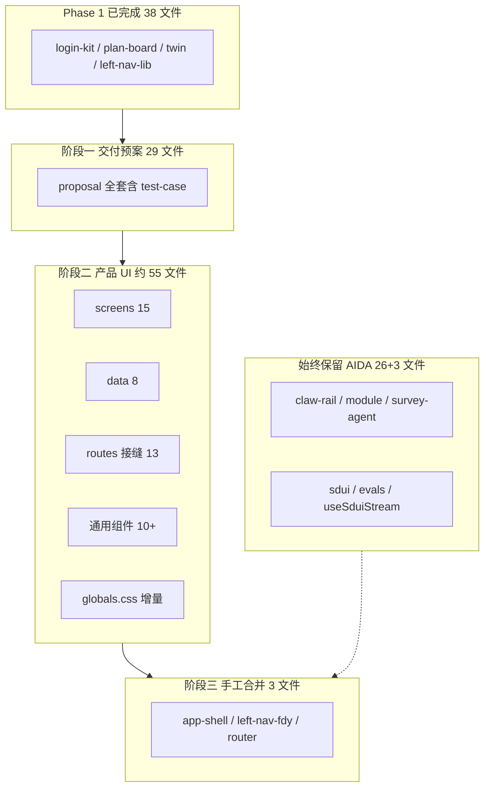

# delivery 前端 Phase 2 合并实施计划

> **For Claude:** REQUIRED SUB-SKILL: Use superpowers:executing-plans to implement this plan task-by-task.

**Goal:** 在 Phase 1（侧栏/排期/登录/Twin，已完成 38 文件）基础上，将 `aida-delivery` main 最新产品 UI 余下 ~60 文件合并进 `D:\aida\frontend`，同时完整保留 AIDA 后端对接能力（SDUI、多 Skill、ClawRail Agent API、评测中心）。

**Architecture:** 「delivery UI 进 aida 壳」——产品页/数据/样式整目录复制；红线文件（claw-rail、module、survey-agent、SDUI、evals）禁止整文件覆盖；app-shell / left-nav / router 以 delivery 为底手工补回 AIDA 独有入口与 Claw 注入。

**Tech Stack:** Vite 8 + React 19 + TypeScript；源 `D:\aida-delivery\03_前端效果\04_前端实现`；目标 `D:\aida\frontend`；后端 FastAPI `:7401`。

**分支:** `feat/merge-delivery-frontend`（延续 Phase 1，或从当前 HEAD 新建 `feat/merge-delivery-phase2`）

---

## 差异基线（2026-06-05 扫描）

| 指标 | 数值 |
|------|------|
| 同名 `src/` 文件 | 134 |
| 已对齐（内容相同） | **38** ← Phase 1 完成，跳过 |
| 内容不同 | **96** |
| 仅 delivery 有 | **1**（`test-case-chapter.tsx`） |
| 仅 aida 有 | **26**（SDUI / Evals / useSduiStream 等，禁止删除） |



---

## 红线清单（整文件禁止用 delivery 覆盖）

| 文件 | 原因 |
|------|------|
| `src/hooks/useSduiStream.ts` | `/agent/{skillId}/*` SSE + REST |
| `src/components/sdui/*`（7 个） | SDUI 渲染树 |
| `src/components/screens/survey-agent.tsx` | 泛化 `SkillAgentScreen` |
| `src/routes/module.tsx` | `MODULE_TO_SKILL`: survey→zhgk, modeling→guihua |
| `src/components/claw-rail.tsx` | 真实 Agent API（1352 行 vs delivery 628 行） |
| `src/routes/evals.tsx` + `src/components/screens/evals/*` | 评测中心 `/agent/evals/*` |
| `src/lib/eval-refresh.ts` | ClawRail 触发评测刷新 |
| `src/lib/sdui.ts` / `sduiKeys.ts` / `sduiCompliance.ts` | SDUI 协议 |

**package.json 合并规则：** 以 delivery 为底，**必须保留** aida 独有的 `recharts`、`react-is`。

---

## 阶段 0：合并前基线（每阶段重复）

**Step 1:** 确认 delivery 已是最新 main

```powershell
cd D:\aida-delivery
git pull origin main
git log -1 --oneline
# 预期：d6fb125 或更新
```

**Step 2:** 确认 aida 在合并分支

```powershell
cd D:\aida
git checkout feat/merge-delivery-frontend   # 或新建 feat/merge-delivery-phase2
```

**Step 3:** 记录基线

```powershell
cd D:\aida\frontend
npm run typecheck    # 预期：exit 0
npm run dev          # 预期：http://localhost:5173 可访问
```

**Step 4:** 后端回归基线（`:7401` 需已启动）

| 场景 | 预期 |
|------|------|
| `/module/survey` | SDUI + 启动按钮 |
| `/module/modeling` | guihua SDUI |
| `/evals` | 评测页加载 |
| ClawRail 对话 | `POST /agent/chat/stream` 非 404 |

---

## 阶段一：交付预案（Proposal）— 29 文件

**优先级最高。** delivery 已重构章节 1–13，新增第 12 章测试用例；aida 仍为旧版 1–12。

### Task 1.1：复制 proposal 目录

**源 → 目标：**

```
D:\aida-delivery\03_前端效果\04_前端实现\src\components\proposal\
  → D:\aida\frontend\src\components\proposal\
```

**文件清单（29 个）：**

```
proposal-data.ts
proposal-deliverability-modal.tsx
proposal-navigation.ts
proposal-outline-rail.tsx
proposal-screen.tsx
proposal-source-badge.tsx
proposal-version-dropdown.tsx
proposal-navigation.ts          # 已列
chapters/acceptance-chapter.tsx
chapters/customer-chapter.tsx
chapters/device-chapter.tsx
chapters/integration-chapter.tsx
chapters/meta-chapter.tsx
chapters/network-chapters.tsx
chapters/parts-chapter.tsx
chapters/plan-chapter.tsx
chapters/raci-chapter.tsx
chapters/risk-chapter.tsx
chapters/room-chapter.tsx
chapters/secondary-panels.tsx
chapters/service-chapters.tsx
chapters/software-chapter.tsx
chapters/topo-appendix.tsx
chapters/test-case-chapter.tsx   ← 仅 delivery 有，新增
primitives/index.ts
primitives/proposal-chapter-card.tsx
primitives/proposal-chapter-header.tsx
primitives/proposal-data-table.tsx
primitives/proposal-field-grid.tsx
primitives/proposal-kpi-banner.tsx
```

**命令：**

```powershell
$src = "D:\aida-delivery\03_前端效果\04_前端实现\src\components\proposal"
$dst = "D:\aida\frontend\src\components\proposal"
Copy-Item -Recurse -Force $src\* $dst
```

**注意：** `proposal-navigation.ts` 在 delivery 中为新版锚点（含 `panel-testcase`、章节 1–13）；覆盖后旧版 PBI/DTOB 附面板导航消失，属预期行为。

### Task 1.2：同步 proposal 路由接缝

**Modify:** `src/routes/proposal.tsx`、`src/components/screens/proposal.tsx`

```powershell
Copy-Item -Force "D:\aida-delivery\03_前端效果\04_前端实现\src\routes\proposal.tsx" "D:\aida\frontend\src\routes\proposal.tsx"
Copy-Item -Force "D:\aida-delivery\03_前端效果\04_前端实现\src\components\screens\proposal.tsx" "D:\aida\frontend\src\components\screens\proposal.tsx"
```

### Task 1.3：合并 proposal 相关 CSS

从 delivery `globals.css` 提取以下选择器块，**增量**追加到 aida `globals.css`（禁止整文件覆盖）：

- `.testcase-*`（测试用例章）
- `.proposal-outline-rail` 增量（delivery 版约 10KB，aida 约 6.5KB）
- 交付预案章节重构后的 token / 布局类

**对比命令：**

```powershell
# 人工 diff 或 Beyond Compare
code --diff "D:\aida-delivery\03_前端效果\04_前端实现\src\styles\globals.css" "D:\aida\frontend\src\styles\globals.css"
```

### Task 1.4：验证

```powershell
cd D:\aida\frontend
npm run typecheck
npm run dev
```

| 场景 | 预期 |
|------|------|
| `/proposal` | 页面加载，大纲 1–13 章可见 |
| 第 12 章 | 「测试用例」卡片 + `panel-testcase` 锚点 |
| 大纲跳转 | 点击章节滚动到对应 Card |
| `/module/survey` | SDUI 仍正常（未动红线） |
| `/evals` | 评测页仍正常 |

### Task 1.5：提交

```bash
git add frontend/src/components/proposal frontend/src/routes/proposal.tsx frontend/src/components/screens/proposal.tsx frontend/src/styles/globals.css
git commit -m "$(cat <<'EOF'
feat(proposal): sync delivery main proposal v2 with test-case chapter

EOF
)"
```

---

## 阶段二：产品页 + 数据 + 路由 + 通用组件 + CSS

**约 55 个文件，风险低（纯产品 UI / mock 数据）。**

### Task 2.1：复制 screens（排除 survey-agent）

**复制：**

```
components/screens/admin.tsx
components/screens/cockpit.tsx
components/screens/commissioning.tsx
components/screens/create.tsx
components/screens/dashboard.tsx
components/screens/design.tsx
components/screens/journey.tsx
components/screens/landing.tsx
components/screens/milestones.tsx
components/screens/plan.tsx
components/screens/preview.tsx
components/screens/sandbox.tsx
components/screens/system.tsx
components/screens/login.tsx          # screen 接缝（routes/login.tsx 已用 login-kit，可同步或跳过）
```

**禁止复制：**

```
components/screens/survey-agent.tsx   ← 保留 AIDA SkillAgentScreen
components/screens/evals/*            ← 保留 AIDA 评测
components/screens/_archive/*         ← 保留 aida 归档
components/screens/plan-board/*       ← Phase 1 已对齐
components/screens/plan-init.tsx
components/screens/plan-adjust.tsx
```

```powershell
$srcRoot = "D:\aida-delivery\03_前端效果\04_前端实现\src\components\screens"
$dstRoot = "D:\aida\frontend\src\components\screens"
$files = @('admin','cockpit','commissioning','create','dashboard','design','journey','landing','milestones','plan','preview','sandbox','system')
foreach ($f in $files) { Copy-Item -Force "$srcRoot\$f.tsx" "$dstRoot\$f.tsx" }
```

### Task 2.2：复制 data 层

```powershell
$src = "D:\aida-delivery\03_前端效果\04_前端实现\src\data"
$dst = "D:\aida\frontend\src\data"
$files = @('journey-data.ts','dispatch-data.ts','contract-data.ts','sandbox-data.ts','modules-data.ts','landing-data.ts','claw-seeds.ts','app-data.ts')
foreach ($f in $files) { Copy-Item -Force "$src\$f" "$dst\$f" }
```

**禁止覆盖：** `data/zhgk-mock.ts`、`data/twin/room104.ts`（Phase 1 已对齐）

### Task 2.3：复制 routes 接缝（排除 module / evals / twin / plan-init / plan-adjust / login）

```powershell
$src = "D:\aida-delivery\03_前端效果\04_前端实现\src\routes"
$dst = "D:\aida\frontend\src\routes"
$files = @('assets','cockpit','commissioning','config','create','design','journey','landing','milestones','onboard','plan','preview','proposal','sandbox','admin')
foreach ($f in $files) { Copy-Item -Force "$src\$f.tsx" "$dst\$f.tsx" }
```

### Task 2.4：复制通用组件

```powershell
$src = "D:\aida-delivery\03_前端效果\04_前端实现\src\components"
$dst = "D:\aida\frontend\src\components"
$files = @(
  'create-modal.tsx','dispatch-tracker.tsx','war-room.tsx','topology-diagram.tsx',
  'embed-views.tsx','chat.tsx','drawer.tsx','admin-shell.tsx','action-footer.tsx',
  'icons.tsx','module-route.tsx','right-rail.tsx','primitives.tsx','particle-bg.tsx',
  'version-bar.tsx','tweaks-panel.tsx','ui'
)
# ui 为目录
foreach ($f in $files) {
  $sp = Join-Path $src $f; $dp = Join-Path $dst $f
  if (Test-Path $sp -PathType Container) { Copy-Item -Recurse -Force $sp $dp }
  elseif (Test-Path $sp) { Copy-Item -Force $sp $dp }
}
```

**禁止覆盖：** `claw-rail.tsx`、`left-nav-fdy.tsx`、`app-shell.tsx`、`sdui/`、`login-kit/`、`twin/`、`plan-board/`

### Task 2.5：同步 types

```powershell
$src = "D:\aida-delivery\03_前端效果\04_前端实现\src\types"
$dst = "D:\aida\frontend\src\types"
Copy-Item -Force "$src\domain.ts" "$dst\domain.ts"
Copy-Item -Force "$src\components.ts" "$dst\components.ts"
Copy-Item -Force "$src\global.d.ts" "$dst\global.d.ts"
# 禁止覆盖 types/zhgk.ts
```

### Task 2.6：globals.css 全量增量合并

delivery `globals.css` 6210 行 vs aida 6080 行。按模块 diff 合并：

1. **cockpit / landing / dashboard** 样式块
2. **proposal** 余下增量（若阶段一未完全合并）
3. **通用 token / 组件** 更新

**原则：** 用 diff 工具逐块合并，禁止整文件覆盖（避免冲掉 Phase 1 nav v2 定制）。

### Task 2.7：compat / main 接缝

```powershell
Copy-Item -Force "D:\aida-delivery\03_前端效果\04_前端实现\src\compat\link.tsx" "D:\aida\frontend\src\compat\link.tsx"
Copy-Item -Force "D:\aida-delivery\03_前端效果\04_前端实现\src\main.tsx" "D:\aida\frontend\src\main.tsx"
Copy-Item -Force "D:\aida-delivery\03_前端效果\04_前端实现\src\lib\cn.ts" "D:\aida\frontend\src\lib\cn.ts"
```

### Task 2.8：验证

```powershell
cd D:\aida\frontend
npm run typecheck
npm run build
```

**产品 UI 回归：**

| 路径 | 预期 |
|------|------|
| `/cockpit` | 项目孪生看板，布局/样式与 delivery 一致 |
| `/landing` | 项目列表 |
| `/proposal` | 与阶段一一致 |
| `/plan-init` `/plan-adjust` | 排期仍正常（Phase 1） |
| `/login` | 双风格登录仍正常 |
| `/twin` | 3D 孪生仍正常 |

**后端回归（同阶段 0）：** `/module/survey`、`/module/modeling`、`/evals`、ClawRail 对话。

### Task 2.9：提交（可拆 2–3 个 commit）

```bash
# commit A
git add frontend/src/components/screens frontend/src/data frontend/src/types
git commit -m "feat(ui): sync delivery screens and data layer"

# commit B
git add frontend/src/routes frontend/src/components/*.tsx frontend/src/components/ui
git commit -m "feat(ui): sync delivery routes and shared components"

# commit C
git add frontend/src/styles/globals.css frontend/src/compat frontend/src/main.tsx frontend/src/lib/cn.ts
git commit -m "style: merge delivery globals.css and compat seams"
```

---

## 阶段三：手工合并接缝（3 文件）

**以 delivery 为底，补回 AIDA 独有逻辑。**

### Task 3.1：`router.tsx`

**基底：** delivery 版（含 `/twin`、`/plan-init`、`/plan-adjust`、`/foundation` redirect）

**追加：**

```tsx
import EvalsPage from '@/routes/evals';
// ...
{ path: '/evals', element: <EvalsPage /> },
```

**最终路由表应同时包含：**

- delivery 全部路由
- `/evals`（AIDA 独有）
- `/foundation` → redirect `/twin`（Phase 1 已有）

### Task 3.2：`left-nav-fdy.tsx`

**基底：** delivery 版（576 行，含最新排期/孪生导航）

**补回 AIDA 定制：**

1. footer 或「项目复盘」区 `{ name: '评测中心', href: '/evals' }`
2. `isEvals` 判断：`pathname.startsWith('/evals')`
3. `navTwin` 链接指向 `/twin`（与 delivery 一致，确认即可）

**禁止：** 删 delivery 新版章节导航项。

### Task 3.3：`app-shell.tsx`

**基底：** delivery 版（293 行）

**保留 AIDA 逻辑：**

1. `clawRail` prop 注入与 `enrichedClawRail`（module 页依赖）
2. `TopBar` / `SystemStatusBadge` / WELINK drawer（若 delivery 版已含则对齐，缺则补）
3. `withClaw` 布局槽

**对比参考：** 当前 aida 版 297 行，diff 后确认 Claw 挂载路径不变。

### Task 3.4：确认红线文件未被覆盖

```powershell
# 行数守门 — 若显著变短说明被 delivery 覆盖
(Get-Content D:\aida\frontend\src\components\claw-rail.tsx).Count      # 预期 ~1352
(Get-Content D:\aida\frontend\src\routes\module.tsx).Count             # 预期 ~57
(Get-Content D:\aida\frontend\src\components\screens\survey-agent.tsx).Count  # 预期 ~155
Select-String -Path D:\aida\frontend\src\routes\module.tsx -Pattern "MODULE_TO_SKILL"
Select-String -Path D:\aida\frontend\src\components\screens\survey-agent.tsx -Pattern "SkillAgentScreen"
```

### Task 3.5：提交

```bash
git add frontend/src/router.tsx frontend/src/components/left-nav-fdy.tsx frontend/src/components/app-shell.tsx
git commit -m "$(cat <<'EOF'
feat(shell): merge delivery app shell with AIDA evals and ClawRail slots

EOF
)"
```

---

## 阶段四：收尾与全量回归

### Task 4.1：package.json

确认 `recharts`、`react-is` 仍在 dependencies；其余与 delivery 对齐。

```powershell
cd D:\aida\frontend
npm install
```

### Task 4.2：@ts-nocheck baseline

```powershell
npm run lint:no-ts-nocheck
# 若新增 @ts-nocheck 文件 → 去掉 nocheck 或更新 baseline（禁止无故新增）
```

delivery baseline = 38；合并后预期持平或仅因删除文件而减少。

### Task 4.3：全量构建

```powershell
npm run typecheck   # exit 0
npm run build       # exit 0，bundle 含 three ~2.4MB 可接受
```

### Task 4.4：后端呈现回归（必须通过）

| 场景 | 预期 |
|------|------|
| `/module/survey` | `SkillAgentScreen` + SDUI；`/agent/zhgk/start` |
| `/module/modeling` | guihua SDUI；`/agent/guihua/start` |
| ClawRail 对话 | `POST /agent/chat/stream` 流式响应 |
| `/evals` | `/agent/evals/report` 数据拉取 |
| HITL 续跑 | upload + resume 端点正常 |

### Task 4.5：产品 UI 回归

| 场景 | 预期 |
|------|------|
| `/proposal` | 1–13 章 + 测试用例 |
| `/cockpit` `/landing` | 与 delivery 视觉一致 |
| 侧栏 v2 | 展开/收起、主题、/evals 入口 |
| `/plan-init` `/plan-adjust` `/login` `/twin` | Phase 1 能力无回归 |

### Task 4.6：最终提交

```bash
git add frontend/package.json frontend/package-lock.json frontend/.ts-nocheck-baseline
git commit -m "chore: verify phase2 merge typecheck/build and update baseline"
```

---

## 建议提交粒度（共 7–9 个 commit）

1. `feat(proposal): sync delivery main proposal v2 with test-case chapter`
2. `feat(ui): sync delivery screens and data layer`
3. `feat(ui): sync delivery routes and shared components`
4. `style: merge delivery globals.css and compat seams`
5. `feat(shell): merge delivery app shell with AIDA evals and ClawRail slots`
6. `chore: verify phase2 merge typecheck/build and update baseline`

---

## 冲突处理速查

| 冲突 | 处理 |
|------|------|
| `claw-rail.tsx` | **保留 AIDA** |
| `survey-agent.tsx` | **保留 AIDA** |
| `module.tsx` | **保留 AIDA** |
| `globals.css` | **增量合并** |
| `left-nav-fdy.tsx` | delivery 底 + **补 /evals** |
| `router.tsx` | delivery 底 + **补 /evals** |
| `package.json` | delivery 底 + **保留 recharts/react-is** |
| 排期 `aida:claw-send` vs 通用 ClawRail | 两套事件共存，互不覆盖 |

---

## 不在本次范围

- 用 delivery 覆盖 `claw-rail.tsx`（会破坏 Agent API）
- 删除 AIDA `evals` / `sdui` 模块
- 将 `/plan-init` 收编进 `/plan?view=plan`（delivery 手册阶段三，后续可选）
- 后端 `agent/` 代码变更

---

## 执行方式

**Plan 保存位置：** `D:\aida\docs\plans\2026-06-05-delivery-frontend-phase2-merge.md`

**两种执行选项：**

1. **本会话 Subagent-Driven** — 按 Task 逐段实施，每阶段验证后继续
2. **新会话 executing-plans** — 另开会话引用本计划批量执行
