# zhgk 续跑路由与卡死修复 · Implementation Plan

> **For agentic workers:** REQUIRED: Use superpowers:subagent-driven-development (if subagents available) or superpowers:executing-plans to implement this plan. Steps use checkbox (`- [ ]`) syntax for tracking.

**Goal:** 消除 zhgk 在 HITL 续跑（full_restart）时的 `route_to` 死循环与假死状态，并修复跳步/无 HITL 的关联缺陷，使「选全流程 → 代际识别 → 建表链」可稳定推进。

**Architecture:** 参照 `system_design.pipelines.delivery.resolve_resume_route_to`，在 zhgk 层新增**显式续跑路由表**（按 `hitl_step + choice + intent` 决定 `route_to`），并在 step 执行完成后**清除或消费** `route_to`；`_resume_route_from_previous_state` 仅作无 HITL 的兜底。前端解冻/HITL 读取改为优先 SSE 实时态，避免 frozen 快照掩盖后端 HITL。

**Tech Stack:** Python 3 · FastAPI/LangGraph · pytest (`agent/evals/eval_gkclaw.py`) · React/TS (`survey-agent.tsx`)

**非目标（本计划不做）：** `report_gen_run` mock 改真实现、`identify_risks` 接入 step、四件套产物完整性（另开任务）。

---

## 问题根因摘要

| ID | 现象 | 根因 |
|----|------|------|
| R1 | 选 survey_work 后 18% 卡死 | `build_resume_init_state` → `route_to=intent_select` + `route_to` 不清 → `intent_select`↔`scene_suggest_run` 振荡 |
| R2 | steps 上万条、UI 极慢 | `_merge_langgraph_diff_into_state` 对 `steps` 仅 extend，死循环时膨胀 |
| R3 | scene_suggest 意图无法完成 | 流水线顺序 `scene_suggest_run` 在 `determine_gen` 之前，但前者依赖后者产出 |
| R4 | confirm_table「重新生成」无效 | redo 未 `route_to=filter_build` |
| R5 | 复勘后可能回跳 | `resurvey_gate` 写入 `route_to` 残留，后续 step 可能被拉回 |
| F1 | 有 HITL 但界面像卡死 | frozen `displayDoc` 遮罩 + `phase=running` + overview 隐藏作业区 |

---

## 文件结构（变更地图）

| 文件 | 职责 |
|------|------|
| `agent/skills/zhgk/pipelines/resume.py` | **新建** · zhgk 专用 `resolve_resume_route_to()` |
| `agent/skills/zhgk/skill.py` | 改用新路由；精简/废弃 `_resume_route_from_previous_state` 的主路径 |
| `agent/skills/base.py` | step 完成后清除 `route_to`（到达目标 step 时） |
| `agent/main.py` | `steps` merge 去重；可选 init_state 默认 `route_to=""` |
| `agent/evals/eval_gkclaw.py` | 新增/修正单测（intent_select、determine_gen、redo、振荡回归） |
| `frontend/src/components/screens/survey-agent.tsx` | HITL 读 live doc；Choice 后切 work；doResume phase 逻辑 |
| `docs/30_skill开发/zhgk_步骤与SDUI流程图.md` | 同步 scene_suggest 顺序说明（若改 step 顺序） |

---

## Chunk 1: P0 · 续跑路由（后端核心）

### Task 1: 新建 `resolve_resume_route_to`

**Files:**
- Create: `agent/skills/zhgk/pipelines/resume.py`
- Create: `agent/skills/zhgk/pipelines/__init__.py`（若不存在）
- Modify: `agent/skills/zhgk/skill.py`

- [ ] **Step 1: 写失败单测 — intent_select 续跑**

在 `agent/evals/eval_gkclaw.py` 增加：

```python
def test_intent_select_resume_routes_to_determine_gen_not_intent_select():
    from agent.skills.zhgk.skill import ZhgkSkill

    skill = ZhgkSkill(work_root=tmpdir())
    prev = {
        "current_step": "intent_select",
        "overall_progress": 6,
        "project": {},
        "steps": [
            {"key": "preflight", "status": "completed"},
            {"key": "intent_select", "status": "hitl"},
        ],
        "hitl": {"step": "intent_select"},
    }
    project = skill.apply_resume_payload({}, {"choice": "survey_work"}, "intent_select")
    extras, _ = skill.build_resume_init_state(
        prev, project, "intent_select", {"choice": "survey_work"},
    )
    assert extras.get("route_to") == "determine_gen"
    assert extras.get("route_to") != "intent_select"
```

- [ ] **Step 2: 跑测试确认 FAIL**

```bash
cd agent && python -m pytest evals/eval_gkclaw.py::test_intent_select_resume_routes_to_determine_gen_not_intent_select -v
```

Expected: FAIL（当前返回 `intent_select`）

- [ ] **Step 3: 实现 `resolve_resume_route_to`**

`agent/skills/zhgk/pipelines/resume.py` 路由表（最小集）：

```python
def resolve_resume_route_to(
    *,
    hitl_step: str,
    project: dict,
    payload: dict,
    prev_state: dict,
) -> str | None:
    choice = str((payload or {}).get("choice") or "").strip()
    intent = str((project or {}).get("intent") or "").strip()

    if hitl_step == "intent_select" and choice:
        # 意图已写入 project；跳过 intent_select，进入代际识别
        return "determine_gen"

    if hitl_step == "determine_gen" and choice:
        return "determine_gen"  # 代际已写入，重跑本步即可

    if hitl_step == "confirm_table" and choice == "redo":
        return "filter_build"

    if hitl_step == "resurvey_gate":
        if choice == "resurvey":
            return "resurvey_gate"
        if choice == "dispatch":
            return "task_dispatch"
        if choice == "skip":
            return "wait_survey"

    # report_gen / supplement / data_append 等：按 hitl_step 映射到「下一合法 step」
    # 见 Chunk 1 Task 2 完整表

    return None  # 无显式路由 → 走兜底（见 Task 4）
```

- [ ] **Step 4: 修改 `ZhgkSkill.build_resume_init_state`**

```python
from .pipelines.resume import resolve_resume_route_to

def build_resume_init_state(...):
    choice = str((payload or {}).get("choice") or "")
    if hitl_step == "resurvey_gate" and choice in {...}:
        ...  # 保留现有 resurvey 分支或并入 resolve_resume_route_to

    route = resolve_resume_route_to(
        hitl_step=hitl_step,
        project=project,
        payload=payload or {},
        prev_state=prev,
    )
    if route:
        return {"route_to": route}, project

    # 兜底：仅当无 hitl_step 时用 _resume_route_from_previous_state
    fallback = _resume_route_from_previous_state(prev, [s.key for s in self.steps])
    if fallback:
        return {"route_to": fallback}, project
    return {}, project
```

- [ ] **Step 5: 跑测试 PASS**

- [ ] **Step 6: Commit**（用户要求时）

---

### Task 2: 补全续跑路由表（全 HITL 步）

**Files:**
- Modify: `agent/skills/zhgk/pipelines/resume.py`
- Test: `agent/evals/eval_gkclaw.py`

| hitl_step | choice / 条件 | route_to |
|-----------|---------------|----------|
| `intent_select` | 任意 intent | `determine_gen`（scene_suggest 亦先走 determine_gen，见 Chunk 2） |
| `determine_gen` | 手选代际 | `determine_gen` |
| `data_append` | append / skip | `data_append` 或下一 step `confirm_table` |
| `confirm_table` | confirm | `task_dispatch`（或线性下一 `confirm_table` 完成后自然推进） |
| `confirm_table` | redo | `filter_build` |
| `task_dispatch` | dispatch / skip | `wait_survey` |
| `wait_survey` | 上传完成 | `assess` |
| `supplement_run` | append_all / skip | `assess` |
| `report_gen_run` | download / send_approval | `report_gen_run` |
| `resurvey_gate` | 见 Task 1 | 保持现有单测行为 |

- [ ] **Step 1:** 为 `confirm_table redo`、`determine_gen` 各写一条 pytest
- [ ] **Step 2:** 实现映射
- [ ] **Step 3:** 全量跑 `eval_gkclaw.py` 中与 resume 相关用例

```bash
cd agent && python -m pytest evals/eval_gkclaw.py -k "resume or route_to" -v
```

---

### Task 3: `route_to` 消费/清除（防振荡）

**Files:**
- Modify: `agent/skills/base.py` — `execute_step` 成功返回前
- Modify: `agent/skills/base.py` — `_make_router` 注释与行为对齐

**策略（二选一，推荐 A）：**

**A. 在 `execute_step` 返回 diff 时清除（推荐）**

当 `step.key == state.get("route_to")` 且 step 正常完成（非 HITL、非 error）：

```python
if str(state.get("route_to") or "") == step.key:
    result["route_to"] = ""
```

**B. 在 router 内跳转后清除** — 改动面大，不推荐。

- [ ] **Step 1:** 修正 `route_to_is_cleared_after_target_step_executes` 单测，使其对真实 `execute_step` 行为有效
- [ ] **Step 2:** 新增回归测：`intent_select` 完成后若 state 仍有 `route_to=intent_select`，下一步 `scene_suggest_run` **不得**再跳回（图级集成测或模拟 router 调用链）
- [ ] **Step 3:** 实现清除逻辑
- [ ] **Step 4:** pytest PASS

---

### Task 4: 收紧 `_resume_route_from_previous_state` 兜底

**Files:**
- Modify: `agent/skills/zhgk/skill.py`

规则：

1. **有 `hitl_step` 时禁止走兜底**（已由 `resolve_resume_route_to` 覆盖）
2. 兜底时：`completed_idx + 1` 若指向 **status=hitl 的 step**，改为该 step 本身而非 re-enter 已完成的前序
3. 删除或 guard：`if current in keys: return current` 在 current 已完成时不应返回早于 `determine_gen` 的 step

- [ ] **Step 1:** 单测 `zhgk_resume_before_resurvey_routes_to_last_position` 保持 PASS
- [ ] **Step 2:** 实现 guard
- [ ] **Step 3:** 跑完整 `eval_gkclaw.py -k resume`

---

## Chunk 2: P1 · 步骤顺序与 redo

### Task 5: 修复 `scene_suggest` 意图顺序

**方案（推荐 B，改动最小）：**

**A. 调整 `skill.steps` 顺序** — `determine_gen` 移到 `scene_suggest_run` 之前（影响 step 索引与 progress 计算，需回归 macro-rail）。

**B. 路由层解决（推荐）** — `resolve_resume_route_to` 与 `should_skip` 不变；在 `scene_suggest_run.check_inputs` 中：若 intent=`scene_suggest` 且无 `generation_cooling`，返回 `ok=True` + run 内 fast-fail 改为 **router 级 skip** 不现实。

**实际推荐：A + 文档更新**

将 `skill.py` steps 调整为：

```python
IntentSelectStep(),
DetermineGenStep(),       # 提前
SceneSuggestRunStep(),    # 后移，此时已有 generation_cooling
SupplementRunStep(),
...
```

- [ ] **Step 1:** 单测 scene_suggest 路径：mock project intent=scene_suggest，generation_cooling 在 determine_gen 后 scene_suggest_run 可 completed
- [ ] **Step 2:** 调整 steps 顺序
- [ ] **Step 3:** 更新 `docs/30_skill开发/zhgk_步骤与SDUI流程图.md` 第二节 mermaid
- [ ] **Step 4:** 跑 `agent/tests/test_zhgk_sdui_projection.py`（若有 step 顺序假设则修）

---

### Task 6: `confirm_table` redo 端到端

**Files:**
- Modify: `agent/skills/zhgk/pipelines/resume.py`（Task 2 已含 `filter_build`）
- Test: `agent/evals/eval_gkclaw.py`

- [ ] **Step 1:** 单测 redo → `route_to == "filter_build"`
- [ ] **Step 2:** 集成测（可选）：redo 后 `filter_build` 会重建 xlsx（mock work_root）
- [ ] **Step 3:** 手动验证：Output 表时间戳/行数变化

---

### Task 7: `resurvey_gate` 的 `route_to` 仅用于同 run 跳转

**Files:**
- Modify: `agent/skills/zhgk/steps/resurvey_gate.py`
- Modify: `agent/skills/base.py`（Task 3 清除逻辑）

行为：

1. `resurvey_gate` 返回 `route_to=task_dispatch|wait_survey` 保持不变
2. `task_dispatch` / `wait_survey` **完成并离开**后 `route_to` 必须为空
3. 新增单测：模拟 `wait_survey` completed 后 router 下一跳为 `assess` 而非 `task_dispatch`

- [ ] **Step 1:** 写 router 模拟测试（或扩展现有 `step_retry_followup` 测）
- [ ] **Step 2:** 确认 Task 3 清除逻辑覆盖该链
- [ ] **Step 3:** PASS

---

## Chunk 3: P0 · steps merge 防膨胀

### Task 8: `_merge_langgraph_diff_into_state` 按 key 去重

**Files:**
- Modify: `agent/main.py`
- Test: `agent/evals/eval_gkclaw.py` — 已有 `langgraph_accumulated_list_diff_does_not_duplicate_steps`，扩展为 oscillation 场景

**算法：**

```python
def _merge_steps(existing: list, incoming: list) -> list:
    if _list_has_prefix(incoming, existing):
        return list(incoming)
    # 按 step key 保留最后一次 status 的记录（或 append-only 但同 key+同 status 不重复）
    by_key = {s["key"]: s for s in existing if isinstance(s, dict)}
    for s in incoming:
        if isinstance(s, dict) and s.get("key"):
            by_key[s["key"]] = s  # 或 append 若允许多轮 history
    return list(by_key.values())  # 或 ordered merge 按 ZHGK_STEP_ORDER
```

**注意：** 复勘多轮可能需要**同一 key 多条 history** — 用 `(key, started_at)` 或 round 字段去重，而不是单 key 覆盖。与产品确认：

- **MVP：** 同 key 只保留最后一条（防死循环爆炸）
- **后续：** 显式 `survey_round` 字段保留多轮

- [ ] **Step 1:** 扩展单测：5000 次重复 intent_select 合并后 steps.len ≤ 20
- [ ] **Step 2:** 实现 merge
- [ ] **Step 3:** PASS

---

## Chunk 4: P2 · 前端防「假卡死」

### Task 9: HITL 读取 SSE 实时态

**Files:**
- Modify: `frontend/src/components/screens/survey-agent.tsx` ~1797

```typescript
// 改前
const hitlDoc = usesDeliveryWorkbench ? sduiDoc : displayDoc;

// 改后（zhgk）
const hitlDoc = usesDeliveryWorkbench ? sduiDoc : (sduiDoc ?? displayDoc);
```

- [ ] **Step 1:** 改动
- [ ] **Step 2:** 手动：resume 后左栏应出现 determine_gen ChoiceCard

---

### Task 10: Choice 提交后进入作业台

**Files:**
- Modify: `survey-agent.tsx` — `handleChoiceSubmit`

```typescript
const handleChoiceSubmit = useCallback(async (value: string, stepId?: string) => {
  setViewMode('work');
  await doResume(...);
}, [...]);
```

- [ ] **Step 1:** 改动
- [ ] **Step 2:** 手动：左栏选意图后右侧可见 status_banner / 作业区

---

### Task 11: doResume 期间 phase 处理

**Files:**
- Modify: `survey-agent.tsx` — `doResume` frozen 分支

**规则：** 若 frozen 快照含 `hitl-card`，**不要**强制 `phase: 'running'`，保持 `hitl` 直至 SSE 更新。

```typescript
const hadHitl = !!findNodeById(curDoc.root, 'hitl-card');
if (skillId === 'device_install') { ... }
else if (frozenProgressRef.current > 0 && !hadHitl) {
  updateSkillRun({ ...extractProgressFromSdui(curDoc), phase: 'running', hitlType: null });
}
```

- [ ] **Step 1:** 改动
- [ ] **Step 2:** 左栏在续跑等待期仍显示「待选择」而非仅「执行中 18%」

---

### Task 12: `handleIntent` 边界（可选 P2）

当 `activeRunId && !atIntentHitl` 且 macro 阶段为 prep/identify 时，若 live doc 有 hitl-card，仍应 `doResume` 而非 silent return。

- [ ] **Step 1:** 用 `sduiDocRef` 判断 hitl，弱化 `JSON.stringify` 包含 intent 的 fragile 检测
- [ ] **Step 2:** 手动点击 3D 入口与左栏 Choice 行为一致

---

## Chunk 5: 验证与发布

### Task 13: 自动化验证清单

```bash
# 后端
cd D:\.cursor_workplace\aida\aida_6.15\agent
python -m pytest evals/eval_gkclaw.py -k "resume or route_to or merge" -v
python -m pytest tests/test_zhgk_sdui_projection.py -v

# 前端
cd ..\frontend
npm run build
```

- [ ] **Step 1:** 全部 PASS
- [ ] **Step 2:** 记录失败项回修

---

### Task 14: 手工 E2E 脚本（7 条）

| # | 操作 | 期望 |
|---|------|------|
| 1 | 启动 → 选 survey_work | ≤5s 内出现 determine_gen HITL 或 BOQ 自动识别完成，**非** 18% 假死 |
| 2 | `/agent/zhgk/status/{id}` | `route_to` 空或 `determine_gen`；`steps.length` < 30 |
| 3 | 选手动代际 → 进入 filter_build | macro 阶段 3「建表确认」 |
| 4 | confirm_table redo | Output 表重建 |
| 5 | scene_suggest 意图 | 能完成场景建议，不卡在空 HITL |
| 6 | resurvey 下发 → 上传 | 进入 assess，不回跳 task_dispatch |
| 7 | 左栏 Choice vs overview | 均能看到 HITL 或 status_banner |

- [ ] **Step 1:** 执行并填结果表
- [ ] **Step 2:** 阻塞项 reopen Task

---

### Task 15: 文档同步

**Files:**
- Modify: `docs/30_skill开发/zhgk_步骤与SDUI流程图.md`
- Modify: `skills/zhgk/SKILL.md` — 补充「续跑 route_to 语义」一小节

- [ ] **Step 1:** 更新 scene_suggest 顺序图
- [ ] **Step 2:** 注明 survey_work 不含 report_gen（或引导 report_gen 意图）

---

## 实施顺序（推荐）

```mermaid
gantt
    title zhgk 修复实施顺序
    dateFormat X
    axisFormat %s

    section P0
    Task1-4 续跑路由+清除     :0, 1
    Task8 steps merge         :1, 1

    section P1
    Task5 scene_suggest 顺序  :2, 1
    Task6-7 redo/resurvey     :2, 1

    section P2
    Task9-12 前端             :3, 1

    section 验证
    Task13-15                 :4, 1
```



**最小可发布（MVP）：** Task 1 + 3 + 8 + 9 + 10 + 14-项1~2 —— 即可修复「选全流程卡死」。

**完整发布：** 全部 Task。

---

## 风险与回滚

| 风险 | 缓解 |
|------|------|
| step 顺序调整破坏 progress % | 跑 SDUI projection 单测；对照 macro-rail |
| steps 去重丢失复勘历史 | MVP 只防爆炸；round 历史另表 |
| route_to 清过早导致 skip 失效 | 仅在 `step.key == route_to` 且 completed 时清 |
| 前端 hitl 双份 | 仍 strip 右侧 hitl-card，只改 skillHitl 数据源 |

回滚：按 Task 独立 revert；P0 与 P2 可分开上线（先后端后前端）。

---

## 完成定义（Definition of Done）

- [ ] `intent_select` + `survey_work` 续跑不再出现 `route_to=intent_select` 振荡
- [ ] 任意 run 的 `steps.length` 在单次 full_restart 后 < 50（正常路径 < 20）
- [ ] scene_suggest / confirm_table redo / resurvey 三条路径单测 + 手工通过
- [ ] 前端选意图后 10s 内可见下一 HITL 或阶段推进
- [ ] `eval_gkclaw.py -k resume` 全绿

---

*Plan authored: 2026-06-15 · 关联 issue: zhgk 全流程 18% 卡死*
