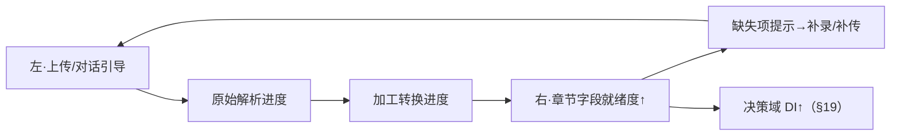
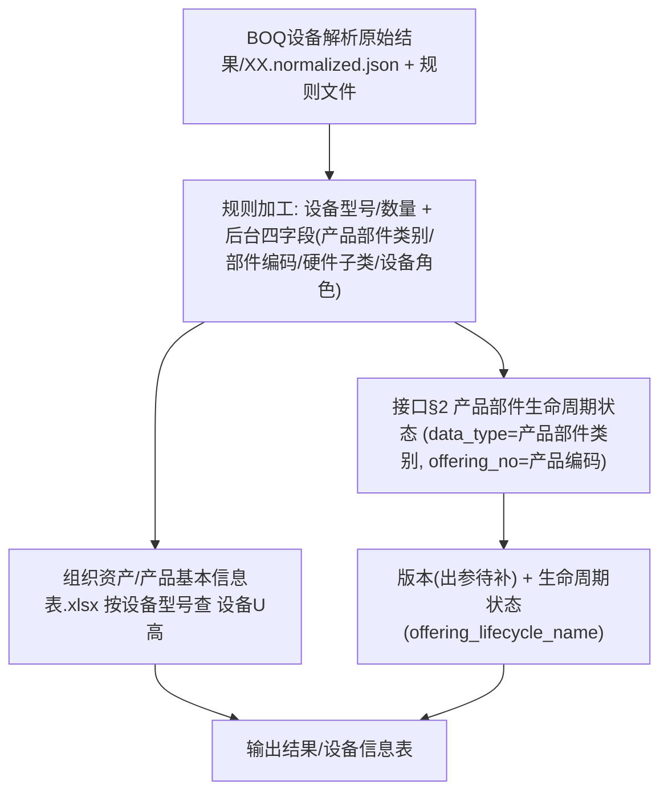
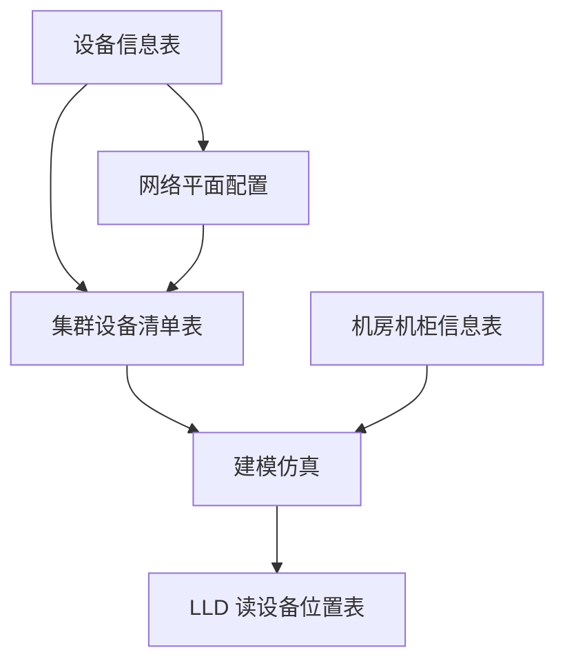
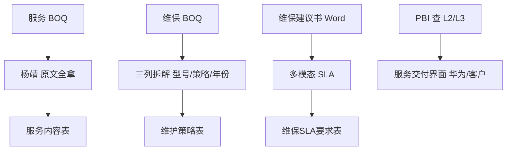
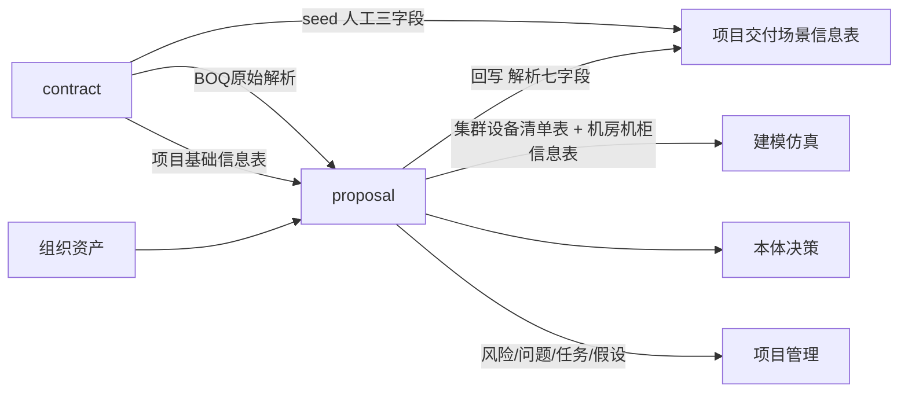

# 预案上下文（业务设计 · 全量与预案决策）

> **版本**：v2.2 · 2026-06-08
> **状态**：「交付预案」模块 **完整业务设计 SSOT**（自洽全量：元数据 + 全局引导式交互 + 第 1–12 章 + 计划 + 预案决策引擎）。**已并入** 原 [04-预案上下文](./04-预案上下文.md) 的第 1–8 章切片内容，团队可 **单文件** 据此开发。
> **读者**：前端/后端/Agent 开发、模块数据 Owner、TD/PD、BOQ/解析能力方（陈卓/张志峰/杨靖/寅齐）。
> **上游规范**：[05-数据目录与平台规范](../../00_Rules/05-数据目录与平台规范.md)（§2 目录 / §4 产物表 / 附录 C）、[03-合同上下文](../03_合同/03-合同上下文.md)（BOQ 原始解析 → 预案握手）、[预案文档外部接口](../05_外部系统接口/预案文档外部接口.md)（OCC/DataMarket 接口）。
> **业务来源（研讨还原，非开发 SSOT）**：[06-集群设备清单表与设备命名](../../02_交付梳理结果/03_交付预案业务上下文/06-集群设备清单表与设备命名业务上下文.md)、[07-服务与维保BOQ解析及服务建议书](../../02_交付梳理结果/03_交付预案业务上下文/07-服务与维保BOQ解析及服务建议书业务上下文.md)、[04-DRB交付配置信息解析](../../02_交付梳理结果/03_交付预案业务上下文/04-DRB交付配置信息解析业务上下文.md)。
> **下游衔接**：建模仿真（集群设备清单表 + 机房机柜信息表 → 落柜/落位/分 IP）、LLD、本体决策推理（四域可交付性）、项目管理（风险/问题/任务/假设下发）。

---

## 目录

- [0. 文档定位与阅读约定](#0-文档定位与阅读约定)
- [1. 术语与角色](#1-术语与角色)
- [2. 预案总览 · 章节 ↔ 输出表 ↔ 子决策点](#2-预案总览--章节--输出表--子决策点)
- [3. 全局交互范式 · 引导式作业（§5.0）](#3-全局交互范式--引导式作业50)
- [4. 元数据·版本·日志（§5.1）](#4-元数据版本日志51)
- [5. 架构七字段统一加工（项目交付场景）](#5-架构七字段统一加工项目交付场景)
- [6. 第 1 章 · 项目背景（§5.2）](#6-第-1-章--项目背景52)
- [7. 第 2 章 · 设备配置（§5.3）](#7-第-2-章--设备配置53)
- [8. 第 3 章 · 部件配置（§5.4）](#8-第-3-章--部件配置54)
- [9. 第 4 章 · 软件配置（§5.5）](#9-第-4-章--软件配置55)
- [10. 第 5 章 · 组网配置（§5.6）](#10-第-5-章--组网配置56)
- [11. 第 6 章 · 集成验证需求（§5.7）](#11-第-6-章--集成验证需求57)
- [12. 第 7 章 · 机房信息（§5.8）](#12-第-7-章--机房信息58)
- [13. 第 8 章 · 服务&维保（§5.9–5.12）](#13-第-8-章--服务维保5912)
- [14. 第 9 章 · 责任矩阵（§5.13）](#14-第-9-章--责任矩阵513)
- [15. 第 10 章 · 计划（§5.14）](#15-第-10-章--计划514)
- [16. 第 11 章 · 验收策略（§5.15）](#16-第-11-章--验收策略515)
- [17. 第 12 章 · 测试用例（§5.16）](#17-第-12-章--测试用例516)
- [18. 风险&假设落库（决策产物 → 项目管理）](#18-风险假设落库决策产物--项目管理)
- [19. 预案决策引擎（§5.17）](#19-预案决策引擎517)
- [20. 数据落盘路径总表](#20-数据落盘路径总表)
- [21. 接口契约与待补出参](#21-接口契约与待补出参)
- [22. 权限与 RBAC](#22-权限与-rbac)
- [23. 校验与异常规则](#23-校验与异常规则)
- [24. 上下游握手](#24-上下游握手)
- [25. 验收标准 / 测试要点](#25-验收标准--测试要点)
- [26. 责任人 & 待确认台账](#26-责任人--待确认台账)
- [27. 已确认决策 / 仍待确认](#27-已确认决策--仍待确认)

---

## 0. 文档定位与阅读约定

### 0.1 适用范围

本文定义 **算力底座交付智能体平台（AIDA）「交付预案」模块**（`module_id = proposal`，路由 `/proposal`，目录 `早期介入/交付预案`）的 **完整业务上下文**，覆盖：元数据/版本、第 1–12 章（项目背景、设备/部件/软件/组网/集成验证/机房/服务&维保/责任矩阵/计划/验收策略/测试用例）、风险&假设（落项目管理）、全局引导式交互、以及 **预案决策引擎（可交付性判定 + 风险规则库 + 门控）**。

**一句话边界**：交付预案承接合同页「进入交付预案」后的 **架构七字段统一加工、配置多版本、人工改稿、结构化落盘、决策评估**；合同页 **只做 BOQ 原始解析落盘**（见 [03-合同上下文](../03_合同/03-合同上下文.md) §7）。

### 0.2 与上游规范/上下文的关系

| 上游 | 引用内容 |
| --- | --- |
| `05-数据目录与平台规范` §4.1.1 | 项目交付场景信息表（人工三字段 + 解析七字段） |
| `05` §4.2 / 附录 C | 交付预案输出表清单、章节↔表索引（含 **共平面类型表、测试用例表**） |
| `03-合同上下文` §7/§13 | BOQ 原始解析 → 预案握手；架构七字段转交本模块；项目基础信息表 seed |
| `预案文档外部接口` | 生命周期、物料供应、机会点/客户、DTRB/DRB、假设等 OCC/DataMarket 接口 |
| `06` / `07` / `04-DRB`（研讨还原） | 集群设备命名、服务/维保 BOQ 解析、配置解析链路的业务原话锚点 |

### 0.3 标签说明

| 标签 | 含义 |
| --- | --- |
| `本期实现` | vibecoding 必须实现 |
| `接口对接` | 依赖外部/平台接口（部分 **待开发**，见 §21） |
| `决策产物` | 由 `early.proposal.decision_eval` 决策评估产出，非直接解析 |
| `待确认` | 规则/口径/责任人未闭环，见 §26 台账 |

### 0.4 章节级「九维」描述模板

第 1–12 章统一沿用 **九维**，确保业务规则无遗漏：① 定位与输出表 · ② 字段清单（前台 vs 后台）· ③ 数据来源 · ④ 解析与加工规则 · ⑤ 落盘 · ⑥ 人工交互 · ⑦ 校验规则 · ⑧ 关联决策与风险 · ⑨ 待确认 + 责任人。

---

## 1. 术语与角色

### 1.1 术语

| 术语 | 含义 |
| --- | --- |
| 设备信息表 | 第 2 章输出；读 `合同/解析结果/BOQ设备解析原始结果` 经 BOQ SKILL 转换 + 产品基本信息表/陈卓接口 enrichment；落 `交付预案/输出结果/设备信息表` |
| 产品基本信息表 | 组织资产；TD 预置；含 **设备型号、设备U高** |
| offering 编码 / productId | BOQ 隐藏列；查版本与生命周期、PBI 服务目录的钥匙 |
| 集群设备清单表 | 第 5.3 章；建模仿真 **消费** 的设备集群输入之一（与合同 **建模仿真设备信息表** 并存） |
| 设备用途 | 集群设备清单表字段；**替代** 前端「设备角色」，与建模仿真自有角色 **解耦** |
| 只能少不能多 | 数量校验：分配之和 **< BOQ** → 报风险可提交；**>** → 报错不可提交 |
| 解析两步法 | 第一步原文全拿 → 第二步加工/展示（服务 BOQ、维保 BOQ 等） |
| 架构七字段 | 产品代际、制冷方式、算力规模、产品规模、算力集群交付模式、PoD 形态、**卡数**；交付预案统一加工回写场景表（§5） |

### 1.2 角色定义（本期）

| 角色标识 | 中文名 | 在本模块能力 |
| --- | --- | --- |
| `td` | TD | 编辑各章节、分配数量/集群/命名区间、Release、触发决策；**不负责** 建模仿真用设备角色 |
| `pd` | PD | 同 TD |
| BOQ/解析 | 陈卓 / 张志峰 | BOQ 解析、设备型号转换、版本/生命周期接口、部件/网管逻辑、决策风险代码 |
| HLD/服务解析 |  | HLD 解析、服务 BOQ 解析、维保建议书多模态、测试用例/验收建议书多模态 |
| 建模仿真 |  | 消费集群设备清单表 + 机房机柜信息表；反推角色；可改输出文件 |
| 枚举定标 | 田杨敏 / 张志峰 / 张磊 | 网络平面 **设备角色** 枚举值表 |
| 服务/数据补充 | 汪伟 | 服务大类细项枚举、产品基本信息表 U高、HCS 逻辑、实测数据、客户历史合同 |
| 部件编码 |  | 部件编码细节 |

---

## 2. 预案总览 · 章节 ↔ 输出表 ↔ 子决策点

> 编号口径 canonical：**机房=7、服务=8、责任矩阵=9、计划=10、验收=11、测试用例=12**（风险&假设 **不入预案章节**，落项目管理）（与 [03-预案章节映射](../../02_交付梳理结果/03_交付预案业务上下文/03-预案章节目录与子决策点映射.md)、`05` 附录 C 一致）。

| 章节（canonical） | 用户 §5.x  | §4.2 输出表                          | 子决策点      | 本文位置 |
| ------------- | -------- | --------------------------------- | --------- | ---- |
| 元数据           | 5.1      | 预案版本信息表                           | 全局输入      | §4   |
| 1 项目背景        | 5.2      | 项目背景信息表                           | 全局输入      | §6   |
| 2 设备配置        | 5.3      | 设备信息表                             | 设备②       | §7   |
| 3 部件配置        | 5.4      | 智算部件配置信息表                         | 设备②       | §8   |
| 4 软件配置        | 5.5      | 软件配置信息表                           | 组网①       | §9   |
| 5 组网配置        | 5.6      | 共平面类型表、网络平面配置信息表、网管服务器配置表、集群设备清单表 | 组网①       | §10  |
| 6 集成验证需求      | 5.7      | 预集成预验证需求信息表                       | 组网①       | §11  |
| 7 机房信息        | 5.8      | 机房机柜信息表（孪生输出，预案引用/补）              | 设备②       | §12  |
| 8 服务&维保       | 5.9–5.12 | 服务配置、服务内容、维护策略、维保SLA要求            | 服务③       | §13  |
| 9 责任矩阵        | 5.13     | 责任矩阵                              | 服务③       | §14  |
| 10 计划         | 5.14     | —（引用 pm-plan 任务计划表，不落盘）           | 全局输入      | §15  |
| 11 验收策略       | 5.15     | 验收策略                              | 验收④       | §16  |
| 12 测试用例       | 5.16     | 测试用例表                             | 验收④       | §17  |
| 风险&假设（非预案章节）  | §5.17 产物 | 落 `项目管理/风险`、`项目管理/假设`             | 全局（决策产物）  | §18  |
| 决策：方案可交付性     | 5.17     | 风险/问题/任务（下发项目管理）                  | 核心 + 四子决策 | §19  |

**全局输入章节**（四子决策共同输入）：元数据、项目背景、计划（第 10 章）；**风险&假设** 读 `项目管理/风险`、`项目管理/假设`。

---

## 3. 全局交互范式 · 引导式作业（§5.0）

进入 `/proposal` 即进入 **引导式作业**：左侧对话框（交付Claw）实时播报、右侧预案章节页联动，**"补一格、亮一片"**。

### 3.1 进入即态势（对话框首屏）

| 区块       | 内容                                    | 数据来源                  |
| -------- | ------------------------------------- | --------------------- |
| BOQ 解析进度 | 合同页 BOQ 解析的 **进度 + 总结结果**（产品/服务/卡数概览） | `合同/解析结果/BOQ设备解析原始结果` |
| 已获取信息    | 已解析到位的输入：HLD、服务建议书、维保建议书等             | 各 `解析结果/*` 就绪度        |
| 待上传清单    | 还缺哪些文件，**按文件类别分门别类卡片** 引导上传到对应位置      | §20 输入文件矩阵            |

### 3.2 每文件双进度 + 缺失补全

每个上传文件互动展示 **两条进度**：① **原始信息解析进度**（多模态/BOQ → `解析结果/`）；② **信息加工转换进度**（解析结果 → 章节字段 → `输出结果/`）。缺失信息两条补全路径：继续上传补充文档 / 在 **右侧对应章节页人工录入**。

### 3.3 左右联动闭环

左对话框 ↔ 右章节页 **双向联动**；章节字段点亮 → 决策域可交付指数（DI）实时上涨。`待确认`：进度/卡片视觉文案随原型落地（§5.0 为交互原则）。

---

## 4. 元数据·版本·日志（§5.1）

**①定位/输出表**：预案版本信息表（= 用户「预案日志表」，`05` §4.2.2）。

**②字段**：项目ID、项目名称、预案版本号、创建人（仅人名）、创建时间、最后修改人（仅人名）、修改时间、本次修改描述、累计修改记录、文档摘要。

**④加工/⑥交互**：

| 字段 | 语义 | 取数 |
| --- | --- | --- |
| 本次修改描述 | 只记本次 | 编辑表单 |
| 累计修改记录 | 每次 Release **追加** | 页面/列表 **取累计** |

**版本规则**：`V{x.y}_{时间戳}_{标识}.md`；x 从 1 起、y 0→9 后 x 进位、Release 冻结；**评审标签** 按天定期查 DTRB/DRB 评审接口（[预案文档外部接口](../05_外部系统接口/预案文档外部接口.md) **§9** `occ_bid_dtrb_review_info_f` / **§10** `occ_bid_drb_review_info_f`；入参 `project_code`，出参 `review_status` / `review_conclusion` / `start_time` + 单号 `dtr_no`(DTRB)·`drx_number`(DRB)；），DTRB 评审前加 `DTRB`、DRB 评审前加 `DRB`，标签与主版本解耦叠加。

**⑤落盘**：`交付预案/输出结果/预案版本信息表`（逻辑表名固定，版本由 `预案版本号` 区分）。

---

## 5. 架构七字段统一加工（项目交付场景）

> 已登记 `05` §4.1.1。**触发**：进入 `/proposal` 且可读 `合同/解析结果/BOQ设备解析原始结果`（合同页必须已完成 BOQ 解析能力调用，见 [03-合同上下文](../03_合同/03-合同上下文.md) §7.2）。

**输入**

| 来源 | 路径 | 用途 |
| --- | --- | --- |
| BOQ 原始解析 | `合同/解析结果/BOQ设备解析原始结果` | 七字段 + 设备/部件/服务 BOQ 装配的统一输入 |
| 人工三字段 seed | `合同/解析结果/项目交付场景信息表` | 只读 **部署阶段、集群形态、大EP类型**；**禁止覆盖** |

**加工字段（解析七字段）**

| 字段 | 取值 | 推导规则（锚定数据） |
| --- | --- | --- |
| 产品代际 | A2 / A3（可扩展 A5） | `normalized.json` 的 `product_head` 含 `A2/A3/A5` 关键字（例：`Atlas 900 A3 SuperPoD(空白模块)` → A3） |
| 制冷方式 | 风冷 / 液冷 | BOQ 原始要素 + 架构规则（参考交付智能体 1.0 工程代码） |
| 算力规模 | 标准项目 / 小规模项目 | 据 `建模仿真设备信息表.md`【超节点概述】Pod 数：Pod≥1 → 标准项目，否则小规模；用于计划排程 |
| 产品规模 | 百卡 / 千卡 / 万卡 | 据 **卡数** 归桶（百/千/万卡）；**本期暂不做**（选型/筛选直接用卡数） |
| 卡数 | 整数（如 384） | 据 `cluster_expansion` 各加速卡型号 `total_qty` **求和**（1×SuperPoD=384×Ascend910）；**驱动组网选型矩阵（§19 NET-PLN-01）与测试用例卡规模筛选（§17）**；亦可参 BOQ 接口 `card_num` |
| 算力集群交付模式 | 集群集成 / 集群集成+HCS | 默认 `集群集成`；是否含 HCS **待汪伟确认** |
| PoD形态 | 单PoD / 多PoD | Pod>1 → 多PoD，Pod=1 → 单PoD |

**落盘**：加工后 **跨模块回写** `合同/解析结果/项目交付场景信息表`（合并解析七字段，保留人工三字段）。

| 规则 ID | 说明 |
| --- | --- |
| BR-PROPOSAL-ARCH-01 | 解析七字段 **仅** 在交付预案加工；**禁止** 合同模块写入 |
| BR-PROPOSAL-ARCH-02 | 加工须基于 `BOQ设备解析原始结果`；**禁止** 跳过合同侧 BOQ 解析直接造数 |
| BR-PROPOSAL-ARCH-03 | 回写时 **不得覆盖** 人工三字段 |

---

## 6. 第 1 章 · 项目背景（§5.2）

**①/⑤**：项目背景信息表 → `交付预案/输出结果/项目背景信息表`。

**②要素**：项目背景、客户项目目标、客户项目范围需求、客户计划需求（+ 项目名称、项目编码）。

**③/④**：来源 HLD（`交付预案/输入文件/HLD/` → 解析 `解析结果/HLD解析结果/`）；HLD 解析四要素 → 可编辑。**新增引导**：四要素若未在 HLD 解析到，对话框 **引导 TD 补充**（§3.2）。设备型号/数量背景可参照 `合同/输出结果/建模仿真设备信息表`（或 `device_info_table.v0.json`，与建模仿真握手口径为准）。

**⑥交互**：HLD 重名 → 系统自动加时间戳（BR-PROPOSAL-01）。**⑨待确认**：四要素 HLD 抽取率与缺失阈值（杨靖）。

---

## 7. 第 2 章 · 设备配置（§5.3）

**①/⑤**：设备信息表 → `交付预案/输出结果/设备信息表`。

### 7.1 数据模型

| 字段 | 类型 | 必填 | 前台 | 来源 / 说明 |
| --- | --- | --- | --- | --- |
| 厂家 | string | Y | 展示 | 默认华为，可改 |
| 设备型号 | string | Y | 展示 | BOQ → **张志峰 SKILL** 转换 |
| 产品编码 | string | Y | 展示 | BOQ 隐藏列 offering/productId |
| 数量 | number | Y | 展示 | 据 `normalized.json` + 规则文件加工，可编辑 |
| 版本 | string | Y | 展示 | **接口 §2 产品部件生命周期状态**（`occ_prod_lifecycle_status_info_f`，入参 `data_type`=产品部件类别 + `offering_no`=产品编码）；**版本出参待接口补充**（§21、§26 #6） |
| 生命周期状态 | string | Y | 展示 | **接口 §2** 同上 → `offering_lifecycle_name` |
| 设备U高 | number | Y | 展示 | `组织资产/产品基本信息表.xlsx`（含 设备型号、设备U高，TD 预置）按 **设备型号** 查；**待确认项 · 汪伟补数据** |
| 来源 | enum | Y | 展示 | `自动解析` / `人工录入` |
| 预案版本号 | string | Y | — | Release |
| **产品部件类别** | enum | Y | **后台** | 值仅 `产品`/`部件`；据 `normalized.json` + 规则文件加工 |
| **部件编码** | string | Y | **后台** | 据 `normalized.json` + 规则文件加工 |
| **硬件子类** | enum | Y | **后台** | 5 类：主设备 / 板卡·线卡·主控 / 网卡·CPU 等部件 / 光模块 / 电源·风机·硬盘；据 `normalized.json` + 规则文件加工 |
| **设备角色** | string | Y | **后台** | 据 `normalized.json` + 规则文件加工 |

> **加工来源统一**：设备型号、数量及后台四字段（产品部件类别、部件编码、硬件子类、设备角色）均据 `合同/解析结果/BOQ设备解析原始结果/XX boq文件名.normalized.json` 及其 **规则文件** 加工转换获得。后台四字段 **不前台展示**，供部件章节筛选、组网/网管筛选、决策风险使用。**设备类型字段不需要**。

### 7.2 解析与转换链

| 步 | 说明 |
| --- | --- |
| 1 | 读 `合同/解析结果/BOQ设备解析原始结果/XX boq文件名.normalized.json` 及其 **规则文件** |
| 2 | 规则加工：**设备型号、数量** + 后台四字段（**产品部件类别、部件编码、硬件子类、设备角色**） |
| 3 | 用 **设备型号** 查 `组织资产/产品基本信息表.xlsx` 得 **设备U高**（待确认 · 汪伟补数据） |
| 4 | 以 **产品部件类别**(`data_type`) + **产品编码**(`offering_no`) 调 **接口 §2 产品部件生命周期状态** → **生命周期状态**(`offering_lifecycle_name`) + **版本**（**出参待接口补充**） |
| 5 | **数量** 来自规则加工；页面可编辑，带来源标记 |
| 6 | Release 写入设备信息表（带预案版本号） |

**⑧关联决策**：喂 **设备②**；触发 §19 生命周期风险（TR5/EOM/EOS、ESS、光模块/端口一致性）。**⑨待确认**：U高数据（汪伟）；HCS（汪伟）；`建模仿真设备信息表.md` 是否含【超节点概述】PoD 数段。

---

## 8. 第 3 章 · 部件配置（§5.4）

**①/⑤**：智算部件配置信息表 → `交付预案/输出结果/智算部件配置信息表`。

| 字段 | 类型 | 必填 | 来源 / 规则 |
| --- | --- | --- | --- |
| 部件类型 | enum | Y | **手工选**，仅 CPU / RAID卡 / PCIE卡 / 网卡 |
| 部件编码 | string | Y | 从 **设备配置** 筛 **硬件子类「网卡/CPU 等部件」** 得到（带出产品编码、产品部件类型） |
| 厂商 | string | Y | 默认华为，可改 |
| 部件名称 | string | Y | 据 产品编码 + 产品部件类型 查 **生命周期接口** `offering_name` |
| 数据来源 | enum | Y | `自动解析` / `人工录入` |
| 预案版本号 | string | Y | Release |

**⑥交互**：支持 **添加/删除行**。**逻辑**：详细解析与转换 **找陈卓** 对齐历史 GIC 实现。**⑧关联决策**：喂 **设备②**；触发 §19 部件兼容性风险。**⑨待确认**：部件编码详情（金晓军）。

---

## 9. 第 4 章 · 软件配置（§5.5）

**①/⑤**：软件配置信息表 → `交付预案/输出结果/软件配置信息表`。

| 字段 | 类型 | 必填 | 来源 |
| --- | --- | --- | --- |
| 类型 | string | Y | 组织资产（昇腾训练/推理等） |
| 是否为华为软件 | boolean | Y | 手工 |
| 软件型号 / 软件版本 | string | Y | 组织资产 |
| 数据来源 | enum | Y | 本期 **人工录入** 为主 |
| 预案版本号 | string | Y | Release |

**③来源**：`组织资产/昇腾训练版本配套表`、`组织资产/昇腾推理版本配套表`。**④**：参考 **陈卓** 逻辑加工后 TD **人工修改**；界面允许手工录入。**⑧关联决策**：喂 **组网①**；触发 §19 服务器网络 CCAE 配套、C/R 版本风险。

---

## 10. 第 5 章 · 组网配置（§5.6）

### 10.1 网络平面配置（含共平面类型）

**共平面类型**：手工选择，落 **共平面类型表**（共平面类型平面列表 + 预案版本号）。

**网络平面配置信息表**：

| 字段 | 来源 | 说明 |
| --- | --- | --- |
| 设备角色 | 枚举，手工选 | **田杨敏/张志峰 定标**（待确认） |
| 设备厂家 / 型号 / 版本 / 数量 | **设备信息表** 筛设备角色含「交换机」带入 | 数量可分配 |
| 数据来源 / 预案版本号 | enum / Release | |

**⑥/⑦交互校验**：每行「+」复制上一行，人工改并 **分配数量**；按型号校验各行之和：**=BOQ 正常；< → 报风险可提交；> → 报错不可提交**。

### 10.2 网管服务器配置

| 字段 | 来源 | 说明 |
| --- | --- | --- |
| 服务器角色 | BOQ 解析 | 枚举仅 **NCE、CCAE、DME** |
| 服务器型号 | 获取 | 通算服务器（如 TaiShan xx、Kunpeng xx） |
| 数量 | 陈卓代码 | 允许手工修改、添加行 |
| 数据来源 / 预案版本号 | | |

**⑤**：`交付预案/输出结果/网管服务器配置表`。

### 10.3 集群设备清单表

> 对齐 [06-集群设备清单表与设备命名](../../02_交付梳理结果/03_交付预案业务上下文/06-集群设备清单表与设备命名业务上下文.md)。

| 字段 | 必填 | 来源 | 说明 |
| --- | --- | --- | --- |
| 集群ID / 集群类型 / 超节点ID / 存储集群ID / ZONE ID / CCAE集群ID / DME集群ID | Y | **手工** | 多 ID 列必填、不可缺失 |
| 设备类型 | Y | 网络平面/网管服务器等前表 | |
| 厂家 / 设备型号 / 数量 | Y | 设备信息表 + 网络平面 带入 | 分配 |
| 设备用途 | Y | TD 录入 | **非** 建模仿真设备角色 |
| 起始/截止设备命名 | Y | TD / 人工录入 | 如 `AT900_A3_001`…`AT900_A3_128` |
| 预案版本号 | Y | Release | |

**⑥/⑦**：每行「+」复制上一行；前面 ID 列必须手工填；数量校验同 §10.1（只能少不能多）。

**⑤/⑧**：`交付预案/输出结果/集群设备清单表`；**建模仿真消费本表 + 机房机柜信息表**；角色问题由建模仿真改输出，**TD 不负责** 建模仿真设备角色。与合同 **建模仿真设备信息表** **并存**。喂 **组网①**；触发 §19 网络设备缺失类风险。**⑨待确认**：设备角色枚举值表（田杨敏/张志峰）。

---

## 11. 第 6 章 · 集成验证需求（§5.7）

**①/⑤**：预集成预验证需求信息表 → `交付预案/输出结果/预集成预验证需求信息表`。

**性质**：`决策产物`，由 `early.proposal.decision_eval` 据组网配置产出。

**②字段**：分类、预集成预验证需求描述、硬件需求、软件需求、责任人（默认 TD）、完成状态、完成时间、预案版本号。

**⑧关联决策**：喂 **组网①**；版本匹配风险（C 版本 / R 版本，**逻辑待确认**，§19）。

---

## 12. 第 7 章 · 机房信息（§5.8）

**①/⑤**：机房机柜信息表（孪生输出，预案引用/补）→ 跨写 `孪生世界/算力底座孪生/输出结果/机房机柜信息表`。

| 字段 | 来源 | 说明 |
| --- | --- | --- |
| PoD名称 | 建模仿真设备信息表 | 读【超节点概述】**超节点序号** → 格式 `PoD[序号]`（PoD1、PoD2…），**只读** |
| 机房名称 | 手工 | |
| 计算柜 / 总线柜 / 参数面Leaf柜 / 样本面Leaf柜 / 业务面Leaf柜 / 管理面柜 | 手工 | 每列可多个机柜编号（如 `A18,A17`） |

**⑥交互**：PoD 行数与【超节点概述】序号 **一一对应**；支持下载模板→填写→上传（待实现）。**⑧关联决策**：喂 **设备②**；触发 §19 机房风险（接地线/MPO16/1分2 线长与工勘差异>50%）。

---

## 13. 第 8 章 · 服务&维保（§5.9–5.12）

> 业务来源 [07-服务与维保BOQ解析及服务建议书](../../02_交付梳理结果/03_交付预案业务上下文/07-服务与维保BOQ解析及服务建议书业务上下文.md)。

### 13.1 服务交付界面（§5.9）

**服务配置表**（大类/细项/界面）：服务大类、服务细项 **写死枚举**；交付界面（华为/客户/渠道）人工可改。

| 服务大类（写死） | 服务细项（写死） |
| --- | --- |
| 硬件安装 | 数通设备安装、存储设备安装、昇腾服务器安装 |
| 规划设计与实施 | 数通设备 / 存储设备 / 昇腾服务器 规划设计与实施 |
| 技术集成服务 | 数通设备 / 存储设备 / 昇腾服务器 技术集成服务 |
| 使能服务 | AI 使能服务 |
| 运维服务 | 数通设备 / 存储设备 / 昇腾服务器 运维服务 |

**交付界面判定逻辑**：① 取 BOQ **第三级（无则第二级）productId**；② 去 **PBI** 查对应 L2/L3 是否命中预设映射验表；③ **命中→「华为」**；**未命中→空，默认「客户」**，允许人工改；④ BOQ 无对应条目 **不可标华为**。

### 13.2 服务内容（§5.10）

**服务内容表**：服务名称、服务内容、数量、单位、预案版本号。

**取数**（锚 `*.normalized.json`，`is_service_boq_product()` 筛服务 BOQ）：
1. **一级**：服务内容 = `categories` 中 `level=2` 的 `name`；一级数量 = 该 level=2 的 `total_qty`（**待与杨靖握手**）；
2. **二级**：服务内容 = `leaves` 的 `description`；二级数量 = `leaves` 的 `total_qty`；
3. **⑥** 二级默认 **折叠**，单击倒三角展开；销售编码 **取存不展示**（解析两步法）。

**⑤**：`交付预案/输出结果/服务内容`（+ 服务配置）。

### 13.3 维保策略（§5.11）

**维护策略表**字段与 BOQ 拆解（`is_service_boq_product()` 筛服务 BOQ）：

| 字段 | 来源 | 规则 |
| --- | --- | --- |
| 产品型号 | BOQ | **黄色行 1.1.1 描述** 取 `xxx,xxx,xx` **逗号分割中间段** ，即.normalized.json文件的leaves下的description|
| 数量 | BOQ | **黄色行 1.1.1** 的 `total_qty` ，即.normalized.json文件的leaves下的total_qty|
| 维保策略 | BOQ | **白色行 1.1.1.1 描述** 取「xx服务」+ {数量}年 |
| 保修策略 | 固定 | 「按华为标准保修政策」 |
| 维保开始时间 | 计算 | **当前时间 + 6 个月**（可人工改） |
| 维保结束时间 | 计算 | 开始时间 + 维保策略年数（= 数量） |
| 产品EOS时间 | 接口 | 据产品ID查 **PBI**（**待开发**，wiki 264887） |
| 是否超EOS服务 | 计算 | EOS时间 < 维保结束时间 → 是，否则否 |
| 超EOS审批结论 | 人工 | 人工录入 |

**⑤**：`交付预案/输出结果/维保策略.xlsx`。**⑨**：维保起始人工改后结束时间联动（待开发定）。

### 13.4 维保 SLA（§5.12）

**②要素**：问题等级、服务覆盖时间、响应时间、回复时间、解决时间、硬件支持（+ 服务类型 金牌/银牌/金牌+）。

**③/④**：上传「维保解决方案服务建议书.doc」→ `交付预案/输入文件/维保建议书/`；调 **多模态解析** → `交付预案/解析结果/维保建议书/维保建议书解析结果.json` → 取要素。**「定义」列不要**；SLA 表与 Word 严格对应。

**⑤**：`交付预案/输出结果/维保SLA.xlsx`。

**⑧关联决策**：喂 **服务③**；触发 §19 服务漏配、维保 GA、SLA 超标/等级不一致。

---

## 14. 第 9 章 · 责任矩阵（§5.13）

**①/⑤**：责任矩阵 → `交付预案/输出结果/项目责任矩阵.xlsx`。

**②要素**：技术栈、活动分类、活动、GTS、华为云、伙伴、客户。

**③/④/⑥**：直接加载 `组织资产/责任矩阵标准模板.xlsx`（预置）；TD 可手工修改 GTS/华为云/伙伴/客户 列（**R=负责，S=支撑**）。

**⑧关联决策**：喂 **服务③**；触发 §19 责任矩阵风险（标准模板华为为 R 的活动被改为非华为 → 中）。

---

## 15. 第 10 章 · 计划（§5.14）

**②要素**：活动名称、开始/结束日期、实际开始/结束日期、责任人、管理单元、任务状态、进度。

**③/⑤**：来源 `项目管理/计划/项目计划进度表.xlsx`（pm-plan 输出）；**不落盘**（引用展示）。

**⑧关联决策**：全局输入；为 §19 生命周期风险提供 **首批到货时间**（基准时间 = 首批到货 − 1 月，本质生产时间）。

---

## 16. 第 11 章 · 验收策略（§5.15）

**①/⑤**：验收策略 → `交付预案/输出结果/验收策略.xlsx`。

**②要素**：分类、验收方案、验收标准、验收里程碑、验收文档、回款条款、回款里程碑。

**③/④**：上传「技术建议书.doc」「合同.doc」→ `交付预案/输入文件/{技术建议书,合同}/`；调 **多模态解析** → `交付预案/解析结果/…/解析结果.json` → 取要素。

**⑧关联决策**：喂 **验收④**；触发 §19 验收策略风险（分类=「到货」的验收里程碑为空 → 高）。

---

## 17. 第 12 章 · 测试用例（§5.16）

**①/⑤**：测试用例表 → `交付预案/输出结果/测试用例.xlsx`。

**②要素**：一级分类、二级分类、三级分类、用例编号、测试目的、测试组网、预置条件、测试步骤。

**③/④**：上传「A3超节点验收测试用例-液冷场景.doc」（亦支持存储/网络/通算用例）→ `交付预案/输入文件/测试用例/`；多模态解析 → `交付预案/解析结果/测试用例/…xlsx` → 取要素。

**⑥/⑦ 筛选原则**：① 三级分类对应用例 **可勾选**；② 计算子系统 **默认全选**；灵衢子系统 **默认全选**；③ 据 **PoD形态 + 卡规模**（16 节点 = 2×8×8 = 128 卡）筛选：仅保留 **≤ 卡数** 的「集群集合通信测试」「模型集群训练性能测试」；④ 支持 **批量导入 / 人工修改**。**范围**：存储/网络/通算测试用例 **本期暂不实现**。

**⑧关联决策**：喂 **验收④**；触发 §19 测试用例风险（与 `Atlas 900 A3超节点大模型预训练实测数据.md` 比对性能）。**⑨待确认**：实测数据.md 来源/时机（汪伟）。

---

## 18. 风险&假设落库（决策产物 → 项目管理）

> 风险&假设 **不作为预案章节**；由预案决策引擎（§19）产出后，**落盘到项目管理模块**，预案页只读引用展示。

**①/⑤**：`项目管理/风险/输出结果/风险信息表`、`项目管理/假设/输出结果/假设信息表`（pm-risk / pm-assumption；假设细表 TBD）。

**②**：风险（编号、风险点、描述、影响、类型、等级、来源、识别/关闭时间、操作）；假设（假设项 / 描述 / 责任人 / 兑现方式 / 闭环情况）。

**③接口**：风险走风险生成/查询接口；假设可由 `occ_bid_assumption_info_f` 数据湖读取 + 手工录入。

**④落库分流（§19 门控产物）**：导致「不通过」的硬风险 → 录入 **项目管理/问题**；其他风险 → **项目管理/任务** 跟踪；决策快照（四域 DI + 选定策略 + 假设 + 遗留项）随版本存档。

---

## 19. 预案决策引擎（§5.17）

> 决策由 `early.proposal.decision_eval` 产出；**风险/假设落 §18（项目管理/风险、项目管理/假设）**。前端四域映射：组网=network、设备=device、服务=service、验收=acceptance。

### 19.1 核心 + 四子决策点

| 项 | 内容 |
| --- | --- |
| 核心决策点 | **方案可交付性** — 决策方案是否可交付 |
| 判定依据 | 全章节快照（As-Is）与目标（Should-Be）匹配度 |
| 输出 | 可交付结论、四域可交付指数、Gap、任务/问题/风险 |

| 子决策点       | 决策问题                                             |
| ---------- | ------------------------------------------------ |
| ① 组网配置可交付性 | 组网（网络平面/服务器网络/软件版本配套/预集成验证）能否满足连通性/带宽/平面隔离/器件可交付 |
| ② 设备配置可交付性 | 设备/部件清单/版本/生命周期/空间功耗能否在目标机房落地                    |
| ③ 服务配置可交付性 | 服务交付界面/内容/维保/SLA/责任矩阵能否覆盖合同并按期交付                 |
| ④ 验收可交付性   | 验收策略能否与客户需求匹配并形成可签收闭环                            |
|            |                                                  |

### 19.2 决策点 ↔ 章节映射

| 子决策点 | 章节                                   |
| ---- | ------------------------------------ |
| 设备②  | 2 设备配置、3 部件配置、7 机房信息                 |
| 组网①  | 4 软件配置、5.1 网络平面配置、5.2 网管服务器配置        |
| 服务③  | 8.1 服务交付界面、8.3 维保策略、8.4 维保SLA、9 责任矩阵 |
| 验收④  | 11 验收策略、12 测试用例                      |

### 19.3 风险规则库

> 统一前置：除注明外适用 **所有智算项目**。生命周期类基准时间：有计划用 **首批到货时间 − 1 个月**（生产时间），否则当前时间。

**设备② · 生命周期/部件/机房/网络设备**

| 编号         | 条件                                    | 等级  | 来源                |
| ---------- | ------------------------------------- | --- | ----------------- |
| DEV-LC-01  | >1 华为物理产品：基准+2 月 早于 **TR5**           | 高   | TR5 ← PBI（待开发）    |
| DEV-LC-02  | >1 华为物理产品：基准+2 月 早于 **EOM**           | 高   | EOM ← PBI（待开发）    |
| DEV-LC-03  | >1 华为物理产品：基准+6 月+BOQ维保服务时间 早于 **EOS** | 高   | EOS ← 维保策略（§13.3） |
| DEV-LC-04  | >1 华为物理产品的部件有 **ESS** 风险且无产品线审批       | 高   | 部件/审批             |
| DEV-LC-05  | 光模块/光纤/服务器端口 **不一致**（张志峰 BOQ SKILL）   | 风险  | BOQ SKILL         |
| DEV-CMP-01 | 部件不在 **部件兼容性表**（查 support 网址对比）       | 高   | support           |
| DEV-RM-01  | 配接地线，长度与工勘差异 >50%                     | 低   | 工勘                |
| DEV-RM-02  | 配 MPO16/1分2 线，长度与工勘差异 >50%            | 中   | 工勘                |
| DEV-NET-01 | A3/A5 未配 **灵渠总线设备**                   | 高   | 陈卓逻辑              |
| DEV-NET-02 | 含华为云缺 样本面接入/带外管理/参数面 交换机              | 高   | 陈卓逻辑              |
| DEV-NET-03 | 不含华为云 任一网络平面无数据配置                     | 高   | 陈卓逻辑              |
| DEV-NET-04 | 超节点>1 未配参数面交换机（=1 可不配）                | 高   | 陈卓逻辑              |
| DEV-SEL-01 | 产品/昇腾设备不在 **三方集成配套表**                 | 高   | 集成验证风险            |
| DEV-SEL-02 | 产品/昇腾设备不在 **解决方案配套表**                 | 高   | 选型不正确             |

**服务③ · 漏配/维保/SLA/责任矩阵**（项目分类：中国非互联网/海外/配 AI 使能/中国互联网）

| 编号 | 条件 | 等级 |
| --- | --- | --- |
| SVC-MIS-A | 中国非互联网 & 昇腾>8 台：需 规划/集成/维保/使能 四项，缺一 | 高 |
| SVC-MIS-B | 中国非互联网 & 昇腾<8 台：需 规划/维保/使能 三项，缺一 | 高 |
| SVC-MIS-C | 配 AI 使能 & 中路需求列表无录入（源头服务建议书，**暂不考虑**） | 中 |
| SVC-MIS-D | 中国互联网：需 规划/集成/维保 三项，缺一 | 高 |
| SVC-MIS-E | 存储/网络/CCAE/DME/NCE 设备无对应 集成服务且维保服务，少一 | 高 |
| SVC-WB-01 | 产品 **GA** 晚于维保开始日期（GA 是否=版本，待确认） | 重大 |
| SVC-SLA-01 | 标准 vs 项目维保SLA，覆盖时段/响应/恢复/解决 任一超标 | 中 |
| SVC-SLA-02 | 服务类型（金牌/银牌/金牌+）与 BOQ 服务等级不一致 | 中 |
| SVC-RSM-01 | 标准模板华为为 R 的活动，项目改为非华为 | 中 |

> SVC-SLA：首次运行若无 `组织资产/维保服务建议书/输出结果/标准维保SLA.xlsx`，先多模态解析标准服务建议书并落盘，再与项目 SLA 比对。

**组网①**

| 编号 | 条件 | 等级 |
| --- | --- | --- |
| NET-PLN-01 | 据 `Atlas 900 A3集群组网规范.md` 参数面全规模选型矩阵 + **卡数**（§5 解析七字段），leaf/spine 选型不在标准范围 | 风险 |
| NET-SRV-01 | 昇腾训练/推理配套表 vs 软件配置信息表，**网络 CCAE 配套不一致** | 高 |
| NET-VER-01 | 组网版本匹配（C 版本 / R 版本，**逻辑待确认**） | 待定 |

**验收④ · 供应/验收/测试用例**（供应范围：中国区所有 / 海外 A2 / 中国区非华为直服）

| 编号         | 条件                                                  | 等级  |
| ---------- | --------------------------------------------------- | --- |
| ACC-SUP-01 | 中国区，昇腾设备 >125 台 → 设备 DOA                            | 高   |
| ACC-SUP-02 | 中国区非华为直服 & BOQ 无 线缆/存储/网络/通算 → 物料齐套性                | 高   |
| ACC-CHK-01 | 验收策略分类=「到货」的验收里程碑为空                                 | 高   |
| ACC-TC-01  | `Atlas 900 A3超节点大模型预训练实测数据.md` vs 测试用例.xlsx 预期性能不达标 | 风险  |

**任务跟踪类（非阻塞，落任务列表）**

| 编号     | 范围                | 条件                                 | 等级  |
| ------ | ----------------- | ---------------------------------- | --- |
| TRK-01 | 海外                | 伙伴硬件更换/维护技能不足                      | 中   |
| TRK-02 | 单客户群首个智算          | 验收标准未确认                            | 高   |
| TRK-03 | 海外                | 伙伴 B/C 不具备 清关/物流/仓储/本地交付/维护热线 5 能力 | 高   |
| TRK-04 | 所有智算              | 光模块丢失风险                            | 中   |
| TRK-05 | 单客户群首个智算 & >125 台 | 分包商能力不足（查客户历史合同 A2/A3 且 24 年后；汪伟）  | 中   |

### 19.4 通过 / 带风险通过 / 不通过 门控

| 结论 | 判定 |
| --- | --- |
| **通过** | 无风险 |
| **带风险通过** | 有风险（非硬阻塞）→ 落 **项目管理/任务** 跟踪 |
| **不通过** | 命中下列硬阻塞 → 录入 **项目管理/问题** |

**硬阻塞（→ 不通过）**：服务③ **服务漏配**（SVC-MIS-*）；组网① **部件不兼容**（DEV-CMP-01）；设备② **生命周期风险**（DEV-LC-01~04）或 **光模块/端口校验不一致**（DEV-LC-05）。

---

## 20. 数据落盘路径总表

| 章节              | 输入文件                  | 解析结果                            | 输出结果                                              |
| --------------- | --------------------- | ------------------------------- | ------------------------------------------------- |
| 元数据             | —                     | —                               | `输出结果/预案版本信息表`                                    |
| 1 项目背景          | `输入文件/HLD/`           | `解析结果/HLD解析结果/`                 | `输出结果/项目背景信息表`                                    |
| 2 设备            | （读合同 BOQ 原始结果）        | —                               | `输出结果/设备信息表`                                      |
| 3 部件            | —                     | —                               | `输出结果/智算部件配置信息表`                                  |
| 4 软件            | （读组织资产昇腾版本表）          | —                               | `输出结果/软件配置信息表`                                    |
| 5 组网            | —                     | —                               | `输出结果/{共平面类型表,网络平面配置信息表,网管服务器配置表,集群设备清单表}`        |
| 6 集成验证          | —                     | （决策产物）                          | `输出结果/预集成预验证需求信息表`                                |
| 7 机房            | —                     | —                               | 跨写 `孪生/输出结果/机房机柜信息表`                              |
| 8 服务&维保         | `输入文件/{服务建议书,维保建议书}/` | `解析结果/{服务建议书,维保建议书}/`           | `输出结果/{服务配置.xlsx,服务内容.xlsx,维保策略.xlsx,维保SLA.xlsx}` |
| 9 责任矩阵          | （读组织资产责任矩阵标准模板）       | —                               | `输出结果/项目责任矩阵.xlsx`                                |
| 10 计划           | （引用 pm-plan 任务计划表）    | —                               | **不落盘**                                           |
| 11 验收策略         | `输入文件/{技术建议书,合同}/`    | `解析结果/…解析结果.json`               | `输出结果/验收策略.xlsx`                                  |
| 12 测试用例         | `输入文件/测试用例/`          | `解析结果/测试用例/`                    | `输出结果/测试用例.xlsx`                                  |
| 风险&假设（非章节·决策产物） | —                     | —                               | 落 `项目管理/风险/输出结果/风险信息表`、`项目管理/假设/输出结果/假设信息表`       |
| 跨模块写            | —                     | `合同/解析结果/项目交付场景信息表`（回写解析七字段，§5） | `孪生/输出结果/机房机柜信息表`（§12）                            |

**只读上游**：`合同/解析结果/BOQ设备解析原始结果`、`合同/解析结果/项目交付场景信息表`（seed 人工三字段）、`合同/输出结果/{项目基础信息表,建模仿真设备信息表}`、`组织资产/{产品基本信息表,昇腾训练/推理版本配套表,责任矩阵标准模板}`。

> 所有交付预案输出表带 `预案版本号`。路径常量：`src/data/project-paths.ts` → `ProjectPaths.proposal(root)`（含 `commonPlaneTypeOut`、`testCaseOut`）。

---

## 21. 接口契约与待补出参

| 接口 / 能力 | 编码 | 用途 | 状态 |
| --- | --- | --- | --- |
| 产品部件生命周期状态（§2） | `occ_prod_lifecycle_status_info_f` | 入参 `data_type`(产品/部件=产品部件类别)+`offering_no`(产品编码) → 生命周期 `offering_lifecycle_name`、名称 `offering_name`(→部件名称) | **缺「版本」出参** |
| 产品及部件数量 | `occ_bid_prod_spart_num_f` | 产品/部件编码与数量 | 可用 |
| 物料供应信息 | `occ_proj_item_supply_info_f` | **首批到货时间**(CRD/CPD)、供应 SLA | 可用（生命周期基准时间） |
| 项目机会点 / 客户 | `occ_proj_opportunity_info_f` / `occ_oppt_cust_info_f` | 机会点、客户（互联网/非互联网分类） | 可用 |
| 项目假设 | `occ_bid_assumption_info_f` | 假设数据湖读取 | 可用 |
| DTRB 评审 [§9](../05_外部系统接口/预案文档外部接口.md#9-DTRB评审信息) / DRB 评审 [§10](../05_外部系统接口/预案文档外部接口.md#10-DRB评审相关信息) | `occ_bid_dtrb_review_info_f` / `occ_bid_drb_review_info_f` | 入参 `project_code`；出参 `review_status`/`review_conclusion`/`start_time`/`dtr_no`·`drx_number` → 版本评审标签 | 可用（陈卓/蒋子涵） |
| **PBI 产品日期** | — | **TR5 / EOM / EOS 时间** | **待开发**（§13.3、§19；wiki 264887） |
| PBI 服务目录 | — | L2/L3 ↔ itemcode 服务交付界面判定 | 映射验表 **待落盘** |
| 多模态文件解析 | `doc.parse.multimodal` | HLD/维保建议书/技术建议书/合同/测试用例 | 杨靖 |
| 设备型号转换 SKILL | — | 设备型号/类型/数量 | 张志峰 |

> 接口字段级以 [预案文档外部接口](../05_外部系统接口/预案文档外部接口.md) 为准。

---

## 22. 权限与 RBAC

| 操作 | TD | PD | 非成员 |
| --- | --- | --- | --- |
| 进入交付预案 | Y | Y | 403 |
| 编辑第 1–12 章 | Y | Y | — |
| 编辑集群 ID/命名区间 | Y | Y | — |
| Release / 触发决策 | Y | Y | — |

> 服务端强制校验（对齐规范 §6）；前端隐藏不可替代鉴权。

---

## 23. 校验与异常规则

| # | 规则 | 处理 |
| --- | --- | --- |
| V1 | HLD 重名 | BR-PROPOSAL-01 加时间戳 |
| V2 | 网络平面/集群清单/网管 数量分配 | 只能少不能多（少→风险可提交；多→报错） |
| V3 | 集群命名区间交叉 | 报错 |
| V4 | 标华为但 BOQ 无对应条目 | 不允许 |
| V5 | 已 Release 输出 | 禁止静默覆盖（新版本/Rx） |
| V6 | 接口不可用（PBI/EOS 待开发等） | 标记 `[SYS_DEPENDENCY]`，不阻断草稿 |
| V7 | 测试用例卡规模筛选 | 仅保留 ≤ 卡数的集合通信/训练性能用例 |
| V8 | 决策硬阻塞 | 录入「问题」，结论「不通过」（§19.4） |

---

## 24. 上下游握手

| 方向 | 交接项 |
| --- | --- |
| 上游（合同） | **BOQ设备解析原始结果**（必读）、项目基础信息表、项目交付场景信息表（seed 人工三字段） |
| 上游（组织资产） | 产品基本信息表、昇腾训练/推理版本配套表、责任矩阵标准模板、组网规范 |
| 下游（建模仿真） | 集群设备清单表 + 机房机柜信息表 |
| 下游（项目管理） | 决策产出的 风险/问题/任务/假设 |

---

## 25. 验收标准 / 测试要点

| # | 用例 | 期望 |
| --- | --- | --- |
| T1 | 元数据/版本 | 累计修改记录追加；DTRB/DRB 标签 |
| T2 | 项目背景 | HLD 四要素解析；缺失对话引导补录 |
| T3 | 架构七字段 | 读 BOQ 原始结果加工七字段回写 `项目交付场景信息表`；人工三字段不变 |
| T4 | 设备信息表 | 张志峰转换 + 产品基本信息表 U高 + 陈卓版本/生命周期；后台四字段加工 |
| T5 | 部件表 | 由设备配置筛硬件子类得编码；部件名称取生命周期 `offering_name`；增删行 |
| T6 | 组网网络平面 | 设备信息表筛「交换机」带入；数量校验只能少不能多；共平面类型落表 |
| T7 | 网管服务器 | NCE/CCAE/DME；可改/加行 |
| T8 | 集群清单 | 多 ID 必填；建模仿真可消费；命名区间不交叉 |
| T9 | 服务交付界面 | PBI 命中→华为；未命中→客户；BOQ 无条目不可标华为 |
| T10 | 服务内容 | normalized.json 一级(categories level2)/二级(leaves)；二级折叠 |
| T11 | 维保策略 | 三列拆解；起始=当前+6月；结束=起始+N年；是否超EOS=EOS<结束 |
| T12 | 维保 SLA | 多模态解析对齐 Word；无「定义」列；服务等级 |
| T13 | 责任矩阵 | 加载标准模板；R/S 可改 |
| T14 | 验收策略 | 技术建议书/合同多模态解析；到货里程碑为空报高风险 |
| T15 | 测试用例 | 多模态解析；按 PoD/卡规模(128)筛集合通信/训练性能；计算/灵衢默认全选 |
| T16 | 决策门控 | 服务漏配/部件不兼容/生命周期·端口不一致 → 不通过→问题；其余→任务 |

---

## 26. 责任人 & 待确认台账

| #   | 事项                                                                 | 责任人      | 关联                 |
| --- | ------------------------------------------------------------------ | -------- | ------------------ |
| 1   | 设备U高数据补 `产品基本信息表`                                                  | 汪伟       | §7                 |
| 2   | 算力集群交付模式（HCS）逻辑                                                    | 汪伟       | §5                 |
| 3   | 设备角色/用途 枚举值表                                                       | 田杨敏/张志峰/ | §10                |
| 4   | 一级服务内容 `total_qty` 口径握手                                            | 杨靖       | §13.2              |
| 5   | `device_info_table` 用 .md vs .json                                 | 与建模仿真握手  | §6                 |
| 6   | 生命周期接口补「**版本**」出参                                                  | 陈卓       | §7、§21             |
| 7   | 生命周期接口「部件名称」= `offering_name` 确认                                   | 陈卓       | §8                 |
| 8   | **PBI 产品日期接口**（TR5/EOM/EOS）开发                                      | 陈卓/平台    | §13.3、§19、§21      |
| 9   | DTRB/DRB 评审接口对接联调（[预案文档外部接口](../05_外部系统接口/预案文档外部接口.md) §9/§10，已订阅） | 陈卓/蒋子涵   | §4、§21             |
| 10  | GA 是否 = 产品版本                                                       | 待确认      | §19 SVC-WB-01      |
| 11  | 组网 C 版本 / R 版本 逻辑                                                  | 待确认      | §11、§19 NET-VER-01 |
| 12  | `Atlas 900 A3超节点大模型预训练实测数据.md` 来源/时机                               | 汪伟       | §17、§19 ACC-TC-01  |
| 13  | F 条客户历史合同表 & 逻辑                                                    | 汪伟       | §19 TRK-05         |
| 14  | 部件编码详情                                                             | 金晓军      | §8                 |
| 15  | `建模仿真设备信息表.md`【超节点概述】PoD 数段                                        | 建模仿真/杨靖  | §5、§12             |
| 16  | 维保起始人工改后结束时间联动                                                     | 待开发定     | §13.3              |
| 17  | 服务大类/细项 枚举补充                                                       | 汪伟       | §13.1              |
| 18  | PBI 服务目录 L2/L3 映射验表落盘                                              | 平台/PBI   | §13.1              |
| 19  | 维保起始「当前」vs「当前+6 月」口径定稿                                             | 待确认      | §13.3              |

---

## 27. 已确认决策 / 仍待确认

### 27.1 已确认

| # | 决策 | 锚点 |
| --- | --- | --- |
| 1 | 本文为 **完整自洽全量**；并入原 04 切片 ch1–8；团队据本文单文件开发 | §0.1 |
| 2 | 编号 canonical：机房=7、服务=8、责任矩阵=9、计划=10、验收=11、测试用例=12（风险&假设不入预案章节） | §2 |
| 3 | **设备信息表** 落 `交付预案/输出结果/设备信息表`（不再使用「算力底座配置信息表」别名） | §7 |
| 4 | **架构七字段** 在交付预案统一加工、回写场景表；合同仅 BOQ 原始解析 | §5、[03-合同上下文](../03_合同/03-合同上下文.md) §7 |
| 5 | 设备后台四字段（产品部件类别/部件编码/硬件子类/设备角色）不前台展示 | §7 |
| 6 | 部件编码 ← 设备配置筛硬件子类「网卡/CPU 等部件」；部件名称 ← 生命周期 `offering_name` | §8 |
| 7 | 共平面类型 **独立成表**；测试用例 **独立成章/表** | §10.1、§17 |
| 8 | 数量校验 **只能少不能多** | §10、§23 |
| 9 | 服务 BOQ **原文全拿、收折展示** | §13.2 |
| 10 | 维保起始 **当前+6 月**；结束 **起始+N 年**；是否超EOS = EOS<结束 | §13.3 |
| 11 | **集群设备清单表** 与合同 **建模仿真设备信息表** 并存；TD 不负责建模仿真设备角色 | §10.3 |
| 12 | 决策门控：服务漏配/部件不兼容/生命周期·端口不一致 → **不通过→问题**；其余 → **任务列表** | §19.4 |
| 13 | 产品规模（百/千/万卡）分桶 **暂不做**；选型/测试用例筛选直接用 **卡数**（解析七字段第 7 项，据 `cluster_expansion` 求和） | §5 |
| 14 | **风险&假设不作为预案章节**；决策产物落 `项目管理/风险`、`项目管理/假设`（硬风险→问题，其余→任务）；**计划 = 第 10 章**（引用 pm-plan，不落盘） | §15、§18、§19.4 |

### 27.2 仍待确认

见 §26 台账（接口待补出参/待开发、枚举定标、来源握手等 19 条）。

---

*文档结束 · v2.2 · 完整自洽全量（元数据 + 第 1–12 章 + 计划 + 预案决策引擎 + 全局交互）· 解析七字段（六场景字段 + 卡数）· 设备配置后台四字段据 normalized.json+规则文件加工、版本/生命周期走接口§2 · 已并入原 [04-预案上下文](./04-预案上下文.md) 切片 · 对齐 [05-数据目录与平台规范](../../00_Rules/05-数据目录与平台规范.md)、[03-合同上下文](../03_合同/03-合同上下文.md)*
