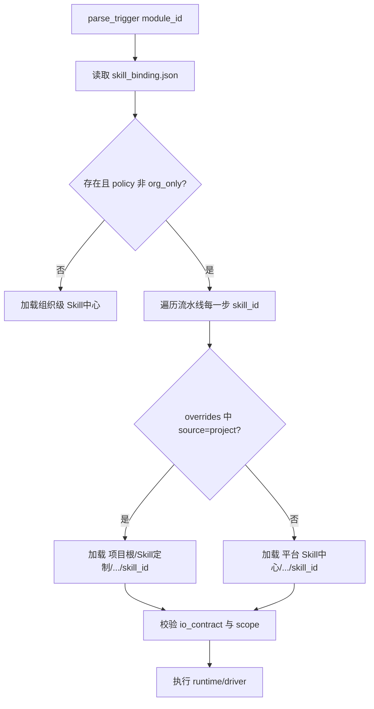
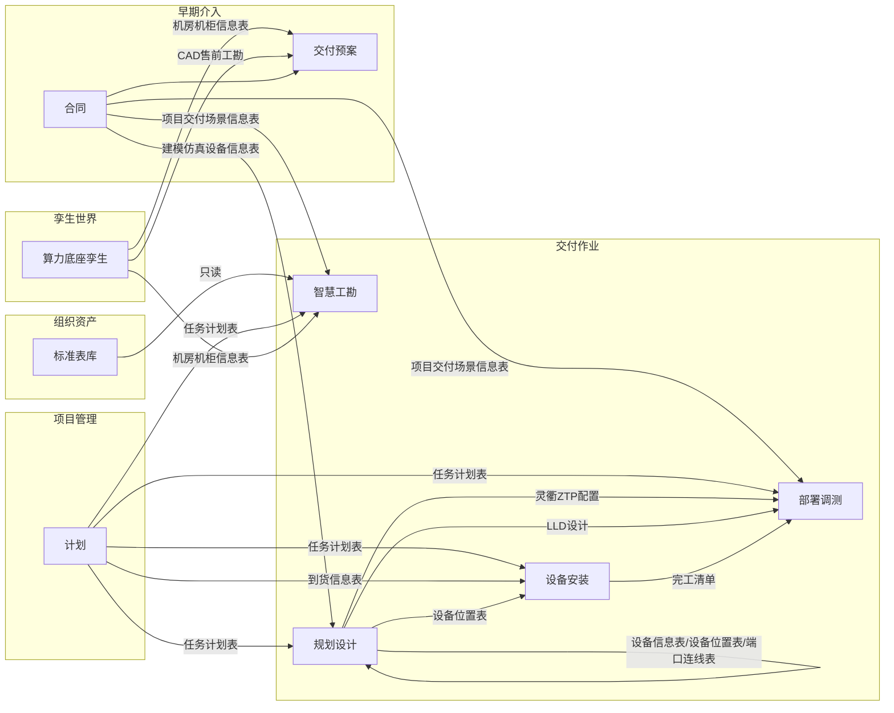

# AIDA 数据目录与平台规范

> **版本**：v1.17 · 2026-06-08  
> **状态**：vibecoding Rule 主文档（SSOT Single Source of Truth）  
> **读者**：前端/后端/Agent 开发、模块数据 Owner、TD/PD  
> **配套数据规范**：数据标准（原则/字典/值域/质量/血缘/分级/生命周期/交换口径/数据治理）见 [00-AIDA数据规范](./00-AIDA数据规范.md)；**本文为 目录 Taxonomy / IPO / 产物实例 / Skill 封装 / RBAC 的细则 SSOT**（数据标准在数据规范、目录与产物实例在本文、代码工程在 AGENTS.md）。  

---

## 目录

- [第 0 章 范围、读者与治理](#第-0-章-范围读者与治理)
- [第 1 章 术语与标识](#第-1-章-术语与标识)
- [第 2 章 物理目录 Taxonomy（SSOT）](#第-2-章-数据物理目录-taxonomy)
  - [2.3 平台能力目录（系统管理）](#23-平台能力目录系统管理)
    - [2.3.5 审批中心](#235-审批中心sys-mgr-approval)
  - [2.4 Skill 包目录规范](#24-skill-包目录规范)
  - [2.5 项目内 Skill 运行态目录](#25-项目内-skill-运行态目录)
  - [2.6 项目 Skill 定制（覆盖组织级）](#26-项目-skill-定制覆盖组织级)
- [第 3 章 数据生命周期与模块 IPO](#第-3-章-数据生命周期与模块-ipo)
  - [3.4 Skill 与项目数据 IPO 绑定](#34-skill-与项目数据-ipo-绑定)
- [第 4 章 产物目录（Artifact Catalog）](#第-4-章-产物目录artifact-catalog)
  - [4.1 合同模块](#41-合同模块)
  - [4.8 审批中心](#48-审批中心平台能力--sys-mgr-approval)
- [第 5 章 模块任务注册表](#第-5-章-模块任务注册表)
- [第 6 章 角色与目录权限（RBAC）](#第-6-章-角色与目录权限rbac)
- [第 7 章 命名、版本与并发](#第-7-章-命名版本与并发)
- [第 8 章 来源、质量与血缘](#第-8-章-来源质量与血缘)
- [第 9 章 导航与目录一致性](#第-9-章-导航与目录一致性)
- [第 10 章 vibecoding 实现约束（Rule 摘要）](#第-11-章-vibecoding-实现约束rule-摘要)
- [附录 A 模块握手矩阵](#附录-a-模块握手矩阵)
- [附录 B 全量字段表索引](#附录-b-全量字段表索引)
- [附录 C 预案章节 ↔ 输出表索引](#附录-c-预案章节--输出表索引)
- [附录 D Skill 注册表索引](#附录-d-skill-注册表索引)

---

## 第 0 章 范围、读者与治理

### 0.1 适用范围

本规范定义 **算力底座交付智能体平台（AIDA）** 在 vibecoding 阶段必须遵守的：

1. **跨项目**「组织资产」目录及只读引用规则；
2. **跨项目**「平台能力 / 系统管理」下的 **Skill 中心、本体中心、可观测中心、配置中心、审批中心** 目录（与项目数据目录解耦）；
3. **单项目 0 级**空间下的目录树、三层数据区命名（`输入文件` / `解析结果` / `输出结果`）及 **Skill 运行态**落盘；
4. **模块任务**的输入来源、解析落点、输出落点及跨模块握手；
5. **Skill 包**与 `module_id` 的绑定、输入/输出契约（引用项目路径，禁止旁路）；
6. **产物表/文件**的逻辑 Schema、命名与版本贯穿字段；
7. **角色-目录**读写权限的结构与 TD 示例（其他角色待评审补全）。

### 0.2 治理原则

| 原则 | 说明 |
| --- | --- |
| IPO 登记 | 任何进入项目空间的数据必须归属某模块的 `输入文件` / `解析结果` / `输出结果` 之一 |
| 握手唯一 | 跨模块数据流仅允许 **上游 `输出结果` → 下游 `输入文件`（或解析引用）**，禁止旁路目录 |
| 人工 Check | AI/Agent 写入 `解析结果`；经人工确认后才可 promote 为 `输出结果`（对齐会议纪要 §3.9） |
| SSOT | 目录树必须以 **本规范第 2 章** 为准；|
| 变更流程 | 新增表/目录须更新本章 + 附录 B/C，并在 WeLink 数据规范评审稿中登记 |

### 0.3 本期边界

| 标签 | 含义 |
| --- | --- |
| `本期实现` | vibecoding 必须实现的目录与握手 |
| `暂不实现` | 目录占位，IPO 字段 TBD
| `外部系统` | 本系统只读接口或登记，不产生解析流水线 |

---

## 第 1 章 术语与标识

### 1.1 项目 0 级根目录

```
{项目ID}/
```
**规则** 项目ID 映射 {投标编码}_{客户名称}_{项目名称}_{项目编码}

记为 `{项目根}`。

### 1.2 路径记号

```
{项目根}/{一级域}/[{二级模块}/][{子模块}/]{输入文件|解析结果|输出结果}/[{产物文件名}]
```

**组织资产**（跨项目，无 `{项目根}` 前缀）：

```
组织资产/{资产表逻辑名}[.{xlsx|csv|md}]
```

**平台能力**（跨项目，管理员 / Skill 运维；无 `{项目根}` 前缀）：

```
平台能力/系统管理/{中心名}/...
```

**Skill 运行态**（项目内，绑定 `module_id`）：

```
{项目根}/交付作业/{模块名}/Skill运行态/...
```

### 1.3 模块任务 ID（module_id）

| module_id | 中文名 |
| --- | --- |
| `org-assets` | 组织资产（只读库） |
| `twin-project` | 项目孪生 |
| `twin-foundation` | 算力底座孪生 |
| `contract` | 合同 |
| `proposal` | 交付预案 |
| `delivery-scheme` | 交付方案 |
| `pm-basic` | 项目管理-基本信息 |
| `pm-plan` | 项目管理-计划 |
| `pm-task` | 项目管理-任务 |
| `pm-risk` | 项目管理-风险 |
| `pm-assumption` | 项目管理-假设 |
| `pm-issue` | 项目管理-问题 |
| `pm-change` | 项目管理-变更 |
| `ops-survey` | 智慧工勘 |
| `ops-design` | 规划设计 |
| `ops-install` | 设备安装 |
| `ops-deploy` | 部署调测 |
| `retro` | 项目复盘 |
| `program-docs` | 项目文档 |
| `sys-mgr-onto` | 本体中心 |
| `sys-mgr-skill` | Skill中心 |
| `sys-mgr-obs` | 可观测中心 |
| `sys-mgr-config` | 配置中心 |
| `sys-mgr-approval` | 审批中心 |

### 1.4 Skill 标识（skill_id）

| 字段 | 格式 | 示例 |
| --- | --- | --- |
| `skill_id` | `{域}.{子域}.{动作}` 小写英文+点分 | `ops.survey.report_gen` |
| `skill_version` | `semver` 或 `v{major}` | `v1.2.0` |
| `binds_module_id` | 必填，对应 §1.3 | `ops-survey` |
| `skill_scope` | `org` \| `project` | 组织级默认 `org`；项目副本为 `project` |
| `extends_skill_id` | 可选，与组织级同 ID | 项目定制时指向被覆盖的组织级 `skill_id` |

**命名原则**：Skill 目录名用 **动作语义**；与项目 **业务目录名（中文）** 解耦，通过 `binds_module_id` 与 `输入契约/输出契约` 挂载。

**项目定制原则**：项目定制 Skill **沿用同一 `skill_id`**（与组织级槽位一致），通过更高版本或 `skill_binding.json` 的 `source: project` 覆盖；**不得**擅自改 `skill_id` 导致模块流水线断链。

### 1.5 术语补充

| 术语 | 含义 |
| --- | --- |
| Skill 包 | 平台注册的可执行能力单元（脚本 + SKILL.md + 契约） |
| Skill 运行态 | 某项目某次执行时的 Output/RunTime 落盘 |
| 基础能力 Skill | 不绑定单一业务模块、可被多模块复用的平台 Skill |
| 领域 Skill | 绑定 `早期介入/*`、`交付作业/*` 等业务 `module_id` |
| **组织级 Skill** | 存放在 `平台能力/系统管理/Skill中心/`，**所有项目默认加载** |
| **项目定制 Skill** | 存放在 `{项目根}/Skill定制/`，按 `skill_binding.json` **覆盖**同 `skill_id` 的组织级实现 |
| Skill 解析 | 运行时按「项目覆盖 → 组织默认」决定加载哪个 Skill 包路径 |

---

## 第 2 章 数据物理目录 Taxonomy

> 叶子节点格式：`名称` · `类型` · `module_id` · `本期|暂不`

### 2.1 组织资产（跨项目，`org-assets`）

```text
组织资产/
├── 智算部件配置标准库          · table · org-assets · 本期
├── AI平台白名单          · table · org-assets · 本期
├── 三方系统配套表          · table · org-assets · 本期
├── 解决方案版本配套表          · table · org-assets · 本期
├── 昇腾训练版本标准表          · table · org-assets · 本期
│   └── 09 Ascend Training Solution 25.3.1 版本配套表.xlsx
├── 昇腾推理版本标准表          · table · org-assets · 本期
│   └── 字段：版本号、分类、类别、产品与解决方案、版本号、support-E、support
├── 入场评估标准表              · table · org-assets · 本期
├── 工勘常见高风险库            · table · org-assets · 本期
├── 标准勘测条目说明            · file+md · org-assets · 本期  # 勘测指导、压缩示例图
├── 活动依赖表                  · table · org-assets · 本期
└── 活动定义表                  · table · org-assets · 本期
├── 产品基本信息表.xlsx                  · table · org-assets · 本期
├── 维保建议书
│   └──维保解决方案 服务建议书（通用模板） 02-zh.docx
├── 责任矩阵
│   └──责任矩阵模板.xlsx
```

**规则**：不进项目导航；实施模块 **只读** 引用（见 [第 6 章](#第-6-章-角色与目录权限rbac)）。

### 2.2 项目空间（0 级）

```text
{项目根}/
├── 孪生世界/                              · folder · 本期
│   ├── 项目孪生/                          · folder · twin-project · 暂不  # IPO 待补，见附录 D
│   └── 算力底座孪生/
│       ├── 输入文件/
│       │   ├── CAD/                       · file · twin-foundation · 本期  # 操作：预案
│       │   │   ├── JXX GA液冷二次侧深化图纸V1.1 20260112.dwg
│       │   │   ├── JXX-500KW-CDU机柜和管路总装图.DWG
│       │   ├── 售前工勘/                  · file · twin-foundation · 本期  # 操作：预案
│       │   │   ├── JD HC项目世纪互联机房工勘结果- 1209.xlsx
│       │   └── 机房勘测视频/              · file · twin-foundation · 本期  # 操作：智慧工勘
│       ├── 解析结果/                      · folder · twin-foundation · 本期
│       └── 输出结果/
│           └── 机房机柜信息表.xlsx           file · twin-foundation · 本期  #操作：预案；消费者：proposal
│
├── 早期介入/
│   ├── 合同/
│   │   ├── 输入文件/
│   │   │   ├── 合同文件/                  · file · contract · 本期
│   │   │   ├── BOQ/                 · file · contract · 本期  # 仅预销售自传 zip/rar 落此
│   │   │       └──JXX 服务BOQ.rar
│   │   │       └──JXX三期BOQ（数通和智算）.rar
│   │   ├── 解析结果/
│   │   │   ├── BOQ/   · file · contract · 本期  # BOQ 解析公共能力原始要素，见 §4.1.4
│   │   │   └── 项目交付场景信息表.xlsx            · file · contract · 本期
│   │   └── 输出结果/
│   │       ├── 项目基础信息表.xlsx   file · contract · 本期  # 合同页项目信息区落盘，见 §4.1.5
│   │       └── 建模仿真/          · file · contract · 本期
│   │       │   └── 建模仿真设备信息表.md          · file · contract · 本期
│   │       │   └── device_info_table.json
│   │       │   └── device_info_table.v0.json
│   │       │   └── device_info_table.v0.md
│   │       ├── 合同BOQ列表.xlsx    file · contract · 本期  勾选清单：BOQ名称/编号/版本号/链接
│   │       └── BOQ信息表.xlsx            · file · contract · 本期  # BOQ 元信息（必存）
│   │
│   └── 交付预案/
│       ├── 输入文件/
│       │   ├── HLD/                       · file · proposal · 本期
│       │       └── 02 JXX项目HLD_0114精简版1.0.pptx file · proposal · 本期
│       │   ├── 服务建议书/                · file · proposal · 本期
│       │   ├── 维保建议书/                · file · proposal · 本期
│       │       └── 维保解决方案 服务建议书（通用模板） 02-zh.docx
│       │   ├── 技术建议书/                · file · proposal · 本期  # 验收策略 多模态解析输入
│       │       └── DSXW算力服务器项目_技术建议书(含算力服务器、网络、存储、机房租赁) -不含人员信息.docx
│       │   ├── 合同/                       · file · proposal · 本期  # 验收策略 多模态解析输入（合同.doc）
│       │   └── 测试用例/                  · file · proposal · 本期  # 测试用例 多模态解析输入
│       │       └── A3超节点验收测试用例-液冷场景V1.2.docx
│       ├── 解析结果/
│       │   ├── HLD解析结果/               · folder · proposal · 本期
│       │   ├── 服务建议书解析结果/        · folder · proposal · 本期
│       │   ├── 维保建议书解析结果/        · folder · proposal · 本期
│       │   ├── 技术建议书解析结果/        · folder · proposal · 本期
│       │   ├── 测试用例解析结果/          · folder · proposal · 本期  # → §4.2 测试用例表
│       │   └── 验收策略解析结果/          · folder · proposal · 本期  # 技术建议书/合同 解析 → 验收策略
│       ├── 输出结果/                      · file 集合 · proposal · 本期  # 见 §4.2、附录 C；
│       │   └── 预案版本信息表.xlsx
│       │   └── 项目背景信息表.xlsx
│       │   └── 设备信息表.xlsx
│       │   └── 智算部件配置信息表.xlsx
│       │   └── 软件配置信息表.xlsx
│       │   └── 共平面类型表.xlsx
│       │   └── 网络平面配置信息表.xlsx
│       │   └── 网管服务器配置表.xlsx
│       │   └── 集群设备清单表.xlsx
│       │   └── 预集成预验证需求信息表.xlsx
│       │   └── 服务配置表.xlsx
│       │   └── 服务内容表.xlsx
│       │   └── 维保策略表.xlsx
│       │   └── 维保SLA表.xlsx
│       │   └── 项目责任矩阵.xlsx
│       │   └── 验收策略.xlsx
│       │   └── 测试用例.xlsx
│
├── 交付方案/                              · folder · delivery-scheme · 暂不  # 见附录 D
│   ├── 输入文件/
│   ├── 解析结果/
│   └── 输出结果/
│
├── 项目管理/
│   ├── 基本信息/                          · folder · pm-basic · 本期
│   │   └── 交付项目信息、项目任命、合同     ·    file · pm-basic · 本期
│   ├── 计划/
│   │   ├── 输入文件/
│   │   │   └── 到货信息表                  · file · pm-plan · 本期
│   │   │   └── 资源信息表                  · file · pm-plan · 本期
│   │   ├── 解析结果/                      · folder · pm-plan · 本期
│   │   └── 输出结果/
│   │       └── 交付计划表.xlsx                  · file · pm-plan · 本期
│   │       └── 草稿表.xlsx                  · file · pm-plan · 本期
│   ├── 任务/                              · pm-task · 本期
│   │   ├── 输入文件/ · 
│   │   ├── 解析结果/
│   │   └── 输出结果/ 
│   │       └── 任务信息表.xlsx
│   │       └── 任务信息_历史进展.xlsx
│   ├── 风险/                              · pm-risk · 本期
│   │   ├── 输入文件/ · 
│   │   ├── 解析结果/
│   │   └── 输出结果/ 
│   │       └── 风险信息表.xlsx
│   │       └── 风险信息_应对措施.xlsx
│   ├── 假设/                              · pm-assumption · 本期  # IPO 细表 TBD
│   ├── 问题/                              · pm-issue · 本期
│   │   ├── 输入文件/ · 
│   │   ├── 解析结果/
│   │   └── 输出结果/ 
│   │       └── 问题信息表.xlsx
│   │       └── 问题信息_历史进展.xlsx
│   └── 变更/                              · pm-change · 本期  # IPO 细表 TBD
│
├── 交付作业/
│   ├── 智慧工勘/                          · ops-survey · 本期
│   │   ├── 输入文件/
│   │   │   └── 勘测图片文件夹/                  · folder ·ops-survey · 本期
│   │   │   └── 项目名称_机房名称_全量勘测结果表      file · ops-survey · 本期
│   │   │   └── 项目名称_机房名称_视频勘测结果表      file · ops-survey · 本期
│   │   ├── 解析结果/
│   │   └── 输出结果/
│   │       └── 机房仿真数据表
│   │       └── {项目名称}_{机房名称}_全量勘测结果表_Rx
│   │       └── {项目名称}_{机房名称}_问题清单表_Rx
│   │       └── {项目名称}_{机房名称}_工勘报告_Rx
│   │       └── {项目名称}_工勘报告
│   ├── 规划设计/                          · ops-design · 本期
│   │   ├── 输入文件/
│   │   │   └── 项目信息收集表.xlsx                  · file · ops-design · 本期
│   │   ├── 解析结果/
│   │   └── 输出结果/
│   │       ├── 建模仿真/                  · folder · 本期
│   │          └── 建模仿真输出文档001-设备信息表    file · ops-design · 本期
│   │          └── 建模仿真输出文档004-设备位置表    file · ops-design · 本期
│   │          └── 建模仿真输出文档005-设备汇总表    file · ops-design · 本期
│   │          └── 建模仿真输出文档006-设备落位图    file · ops-design · 本期
│   │          └── 建模仿真输出文档007-端口连线表    file · ops-design · 本期
│   │          └── 建模仿真输出文档008-物理连线表    file · ops-design · 本期
│   │          └── 建模仿真输出文档009-线缆需求表    file · ops-design · 本期
│   │          └── 建模仿真输出文档010-布线临时标签表 file · ops-design · 本期
│   │       └── 系统设计/                  · folder · 本期
│   │          └── LLD设计                       file · ops-design · 本期
│   │          └── ZTP配置文件                    file · ops-design · 本期
│   │          └── 计算子系统验收用例Word           file · ops-design · 本期
│   ├── 设备安装/                          · ops-install · 本期
│   │   ├── 输入文件/ 
│   │   ├── 解析结果/ ·
│   │   │   └── 责任人信息                  · file · ops-install · 本期·
│   │   │   └── 安装任务集                  · file · ops-install · 本期·
│   │   │   └── 型号→设备大类映射                  · file · ops-install · 本期·
│   │   │   └── SN扫码分组                  · file · ops-install · 本期·
│   │   ├── 输出结果/ ·
│   │   │   └── 责任人信息表模板                  · file · ops-install · 本期·
│   │   │   └── 设备安装全量计划                  · file · ops-install · 本期·
│   │   │   └── 设备安装实施计划                  · file · ops-install · 本期·
│   │   │   └── SN扫码表_{机房}_{设备大类}           file · ops-install · 本期·
│   │   │   └── 完工清单_{机房}_{设备大类}           file · ops-install · 本期·
│   │   │   └── 设备安装完工报告                  · file · ops-install · 本期·
│   └── 部署调测/                          · ops-deploy · 本期
│   │   ├── 输入文件/ 
│   │   │   └── CloudOps任务参数模板                  · file · ops-deploy · 本期·
│   │   ├── 解析结果/ ·
│   │   │   └── 二级任务规范化集                  · file · ops-deploy · 本期·
│   │   │   └── 三级调测活动集                  · file · ops-deploy · 本期·
│   │   │   └── 设备底表长表                  · file · ops-deploy · 本期·
│   │   │   └── 设备完工宽表索引                  · file · ops-deploy · 本期·
│   │   │   └── CloudOps初配工作簿                  · file · ops-deploy · 本期·
│   │   │   └── CloudOps完整工作簿                  · file · ops-deploy · 本期·
│   │   │   └── Toolkit可执行设备列表                  · file · ops-deploy · 本期·
│   │   ├── 输出结果/ ·
│   │   │   └── 全量设备完工清单列表_{项目名称}                  · file · ops-deploy · 本期·
│   │   │   └── CloudOps初始配置                  · file · ops-deploy · 本期·
│   │   │   └── CloudOps配置_手工补充                  · file · ops-deploy · 本期·
│   │   │   └── CloudOps完整配置文件                  · file · ops-deploy · 本期·
│   │   │   └── 验收测试报告                  · file · ops-deploy · 本期·
│   │   │   └── Atlas 900 A3超节点大模型预训练实测数据.md                  · file · ops-deploy · 本期·
├── 项目复盘/                              · retro · 暂不
│   ├── 输入文件/ · 
│   ├── 解析结果/ · 
│   └── 输出结果/
├── Skill定制/                              · folder · 本期  # 可选；见 §2.6
│   ├── skill_binding.json                 · index · 本期  # 本项目覆盖声明（无则 100% 组织级）
│   └── {域}/…/{skill_id}/                · skill包 · 与 §2.3.1 域结构镜像
└── 项目文档/                              · program-docs · 本期  # 归档，非模块 IPO
```

> **说明**：`系统管理` **不属于** `{项目根}`，见 §2.3「平台能力」。`Skill定制` 与组织级 `Skill中心` **域目录镜像**，便于按模块替换。项目成员等配置可 **投影** 到 `配置中心/项目投影/{项目ID}`。

### 2.3 平台能力目录（系统管理）

与 `组织资产/` **并列**，前缀为 `平台能力/`；**配置中心 / Skill中心 / 本体中心 / 可观测中心** 仅管理员等可写；**审批中心** 由 **OCC** 读写（见 §6.4）；项目用户 **不可见**审批中心导航（导航见 §9）。

```text
平台能力/
└── 系统管理/
    ├── Skill中心/                         · sys-mgr-skill · 本期
    ├── 本体中心/                          · sys-mgr-onto · 本期
    ├── 可观测中心/                        · sys-mgr-obs · 本期
    ├── 配置中心/                          · sys-mgr-config · 本期
    └── 审批中心/                          · sys-mgr-approval · 本期
```

#### 2.3.1 Skill中心 — 组织级 Skill（`sys-mgr-skill`，默认供给）

**所有项目**在未声明覆盖时，按 `module_id` 加载本目录下对应域已发布（`status=published`）的 Skill 包。目录按 **能力分层 + 业务域** 组织，与 §1.3 `module_id` 对齐。

```text
# 解析优先级（默认）：组织级 Skill中心 → 项目 Skill定制（仅当 skill_binding 声明覆盖时）
```

```text
平台能力/系统管理/Skill中心/
├── 注册表/
│   ├── skill_registry.json              · index · 本期  # 组织级：skill_id、版本、binds_module_id、scope=org
│   ├── skill_deprecation.json           · index · 本期  # 废弃与替代关系
│   └── module_default_pipelines.json    · index · 本期  # 各 module_id 默认 Skill 链（组织级）
├── 基础能力/                            · folder · 本期  # 跨模块复用，binds_module_id=null 或 multi
│   ├── 文档解析/                        · skill包 · doc.parse.multimodal
│   ├── 表格抽取/                        · skill包 · doc.parse.table_extract
│   └── 报告生成/                        · skill包 · content.report.generate
├── 早期介入/
│   ├── 合同/
│   │   ├── BOQ解析/                     · skill包 · early.contract.boq_parse · binds: contract
│   │   └── 合同要素抽取/                · skill包 · early.contract.extract · binds: contract
│   └── 交付预案/
│       ├── HLD解析/                     · skill包 · early.proposal.hld_parse · binds: proposal
│       ├── 交付预案生成/                  · skill包 · early.proposal.table_gen · binds: proposal
│       └── 决策评估/                    · skill包 · early.proposal.decision_eval · binds: proposal
├── 孪生世界/
│   └── 算力底座孪生/
│       ├── CAD解析/                     · skill包 · twin.foundation.cad_parse · binds: twin-foundation
│       └── 机柜表生成/                  · skill包 · twin.foundation.rack_table · binds: twin-foundation
├── 项目管理/
│   ├── 计划/
│   │   ├── 倒排正排/                    · skill包 · pm.plan.schedule_cpm · binds: pm-plan
│   │   └── 到货驱动/                    · skill包 · pm.plan.arrival_drive · binds: pm-plan
│   ├── 任务/                            · skill包 · pm.task.sync · binds: pm-task
│   └── 风险/                            · skill包 · pm.risk.scan · binds: pm-risk
├── 交付作业/
│   ├── 智慧工勘/
│   ├── 规划设计/
│   │   ├── 建模仿真/
│   │   └── 系统设计/
│   ├── 设备安装/
│   └── 部署调测/
├── 沙箱/                                · folder · 本期
│   └── {skill_id}/{用例ID}/             · 萃取验证用例、黄金样本
└── 萃取流水线/                          · folder · 本期
    ├── wiki萃取/                        · 从 Wiki 大脑生成 Skill 草稿
    └── 运行回放/                        · 生产 trace → 改进 Skill
```

#### 2.3.2 本体中心（`sys-mgr-onto`）

DORA（Decision / Object / Relation / Action）语义资产的 **版本化仓库**（对齐 [AI 架构梳理](../02_交付梳理结果/02_AI智能化系统架构/01_AI智能化系统架构梳理.md)）。

```text
平台能力/系统管理/本体中心/
├── 注册表/
│   └── ontology_registry.json           · index · 本期
├── 领域本体/                            · 本期  # 按交付域拆分 OPLA 包
├── 决策本体/                            · 本期  # 预案四域、子决策点、Gap 类型
│   ├── 决策点关联/                      · 对齐 03-预案章节映射
│   └── 动作模板/                        · 上传/指派/Release 等 Action
├── 版本库/
│   └── {ontology_id}/v{x.y.z}/          · 不可变发布版本
├── 评测集/
│   ├── 用例/                            · 回归问答、抽取准确率
│   └── 评测报告/
└── 沙箱/
    └── 本体试验/                        · 未发布草稿
```

**消费关系**：Skill 包通过 `ontology_refs[]` 引用本体版本；项目 **业务数据** 仍落项目 IPO 目录，本体 **不替代** 业务表存储。

#### 2.3.3 可观测中心（`sys-mgr-obs`）

```text
平台能力/系统管理/可观测中心/
├── 数据飞轮/                            · 本期
│   ├── 流水线定义/
│   └── 数据集快照/
├── 运行日志/                            · 本期
│   ├── skill_runtime/                   · 按 skill_id + 项目ID 分区
│   └── agent_trace/
├── 算力计量/                            · 本期
│   ├── 按Skill/
│   └── 全局/
└── 告警与SLO/                           · 暂不
```

平台侧日志为 **聚合副本**；项目内细粒度执行日志仍以 §2.5 `Skill运行态` 为准。

#### 2.3.4 配置中心（`sys-mgr-config`）

```text
平台能力/系统管理/配置中心/
├── 全局策略/                            · 本期
│   ├── 权限模板/                        · RBAC 模板，投影到 §6
│   ├── 模块开关/                        · 本期/暂不 功能裁剪
│   └── AI路由/                          · 模型路由策略
├── 组织集成/                            · 本期
│   └── 外部系统接口登记/
├── 项目配置/                            · 本期  # 平台 DB 逻辑域：project_info、project_delivery_scenario（见 [01-我的项目列表上下文](../04_详细业务梳理/01_我的项目列表/01-我的项目列表上下文.md) §6.1、§6.3）
└── 项目投影/                            · 本期
    └── {项目ID}/
        ├── 成员与角色/                  · PD 维护；
        ├── 模块成员/                    · 工勘工程师等多人作业
        ├── 特性开关/                    · 单项目覆盖全局
        └── skill_binding.json           · 可选 · 与 {项目根}/Skill定制/skill_binding.json 同步或为主副本
```

#### 2.3.5 审批中心（`sys-mgr-approval`）

OCC 角色 **项目创建审批** 工作台；业务细节见 [02-审批中心上下文](../04_详细业务梳理/02_审批中心/02-审批中心上下文.md)。

```text
平台能力/系统管理/审批中心/
└── 项目审批信息表.xlsx              · file · sys-mgr-approval · 本期  # 全量审批流水，字段见 §4.8.1
```

| 项 | 内容 |
| --- | --- |
| 触发 | 「我的项目列表」提交审批（`project_info.status=pending`） |
| 读 | 配置中心 DB `project_info`、`project_delivery_scenario`（§2.3.4 项目配置） |
| 写（本目录） | `项目审批信息表.xlsx`（提交/通过/驳回流水，可多轮） |
| 写（跨模块 · 审批通过） | ① 创建 `{项目根}` 目录空间；② seed `{项目根}/早期介入/合同/解析结果/项目交付场景信息表`；③ 写 `配置中心/项目投影/{项目ID}/成员与角色/项目人员信息表`；④ 更新 `project_info.status=approved` |
| **不在本模块** | **Claw 容器**拉起（用户从「我的项目列表」**进入已审批项目**时触发，见模块上下文 §4.6） |

> 审批通过 **不** 拉起 Claw；仅完成项目空间与成员/交付场景 seed。

### 2.4 Skill 包目录规范（组织级与项目级通用）

每个 **已注册** Skill 在 `Skill中心` 对应域下的叶子目录中，采用统一包结构（与 nanobot / driver 运行时对齐）：

**组织级包路径**：

```text
平台能力/系统管理/Skill中心/{域路径}/{Skill显示名}/   # 目录名中文可读
└── {skill_id}/                          # 与 registry 中 ID 一致
```

**项目定制包路径**（结构相同，`skill_scope=project`）：

```text
{项目根}/Skill定制/{域路径}/{skill_id}/   # 域路径与 §2.3.1 镜像，如 交付作业/智慧工勘/
```

**包内统一结构**：

```text
{上述根}/{skill_id}/
    ├── SKILL.md                         · file · 必填  # Agent/人读：目标、步骤、约束
    ├── skill.manifest.json              · file · 必填  # 机器可读元数据，见下表
    ├── module.json                      · file · 必填  # 运行时能力：hitl/uploads/taskProgressAutoSync
    ├── guide_tasks.json                 · file · 可选  # 引导卡片：trigger、driver action
    ├── 输入契约/
    │   └── io_contract.json             · file · 必填  # 只声明项目路径，见 §3.4
    ├── 输出契约/
    │   └── io_contract.json             · file · 必填
    ├── runtime/                         · folder · 本期
    │   ├── driver.py                    · 编排入口
    │   ├── scripts/                     · 子步骤脚本
    │   └── 依赖声明/                    · requirements 或等价
    └── 测试与样例/
        ├── fixtures/                    · 黄金输入样本
        └── expected/                    · 期望解析/输出快照
```

**skill.manifest.json 最小字段**：

| 字段 | 类型 | 说明 |
| --- | --- | --- |
| `skill_id` | string | 全局唯一 |
| `skill_version` | string | semver |
| `display_name` | string | 中文展示名 |
| `binds_module_id` | string \| null | §1.3；基础能力可为 null |
| `ontology_refs` | string[] | 本体版本引用，如 `decision.proposal/v1.2` |
| `org_asset_refs` | string[] | 只读组织资产表名 |
| `status` | enum | `draft` / `sandbox` / `published` / `deprecated` |
| `owner` | string | 模块 Owner |
| `skill_scope` | enum | `org`（组织级）/ `project`（项目定制） |
| `extends_skill_id` | string | 项目定制时必填，等于被覆盖的组织级 `skill_id` |
| `project_id` | string | `skill_scope=project` 时必填 |

**发布门禁**：

| scope | 发布方 | 可被生产加载 |
| --- | --- | --- |
| `org` | 管理员 / Skill 运维 | 全项目默认（未被覆盖时） |
| `project` | TD 提交 + 管理员或项目策略审批 | **仅** `skill_binding.json` 中声明的本项目 |

仅 `status=published` 的 Skill 可被 `parse_trigger` 调用；`sandbox` 仅限沙箱或绑定 `sandbox_project_ids` 的项目。

### 2.5 项目内 Skill 运行态目录

交付作业（及需要 EmbeddedWeb 看板的模块）在 **项目内** 增加运行态目录，与业务 IPO **并列**，供 driver 轮询与看板展示。

```text
{项目根}/交付作业/{智慧工勘|规划设计|设备安装|部署调测}/Skill运行态/
├── Output/
│   ├── skill_result.json                · 看板真值（指标、步骤状态）
│   ├── exec_log.json                    · 执行日志
│   └── artifacts/                       · 本轮临时产物（确认后 promote 到 输出结果）
├── RunTime/
│   ├── progress.json                    · 断点续跑
│   └── *.flag                           · 特性开关，如 show_survey_table.flag
└── dashboard/                           · 可选
    ├── module.json                      · 可覆盖平台包内 module.json
    └── workbench.html                   · EmbeddedWeb 工作台
```

**早期介入 / 项目管理** 若仅有表单+解析、无作业看板，可不建 `Skill运行态/`，由平台直连写 `解析结果`（须在 `skill.manifest` 注明 `runtime_mode: headless`）。

**落盘规则（Skill 运行态 vs IPO）**：

| 数据性质 | 写入位置 | promote |
| --- | --- | --- |
| 原始上传 | `输入文件/` | — |
| Agent 中间结果 | `解析结果/` 或 `Output/artifacts/` | 人审后 → `输出结果/` |
| 看板指标/步骤 | `Skill运行态/Output/skill_result.json` | 不当作业务 SSOT |
| 已确认交付件 | `输出结果/` | 下游唯一消费 |

### 2.6 项目 Skill 定制（覆盖组织级）

部分项目需在**不改变业务 IPO 路径**的前提下，替换某模块下的执行逻辑（提示词、脚本、阈值、客户模板等）。通过 `{项目根}/Skill定制/` 实现 **按槽位覆盖**，未覆盖的 Skill 仍走组织级。

#### 2.6.1 目录与绑定文件

```text
{项目根}/Skill定制/
├── skill_binding.json                   · 必填（启用定制时）
├── 早期介入/                            · 镜像 §2.3.1 域
│   └── 合同/…/early.contract.boq_parse/
├── 交付作业/
│   └── 智慧工勘/…/ops.survey.report_gen/
└── …
```

**skill_binding.json 示例**：

```json
{
  "project_id": "PRJ-2026-001",
  "skill_policy": "org_default_with_override",
  "module_pipelines": {
    "ops-survey": {
      "pipeline_source": "org",
      "steps": [
        "ops.survey.scene_filter",
        "ops.survey.aggregate",
        "ops.survey.report_gen",
        "ops.survey.approval_loop"
      ]
    }
  },
  "overrides": {
    "ops-survey": {
      "ops.survey.report_gen": {
        "source": "project",
        "skill_version": "1.2.0-prj",
        "package_path": "{项目根}/Skill定制/交付作业/智慧工勘/ops.survey.report_gen",
        "approved_by": "TD",
        "approved_at": "2026-05-31T10:00:00Z"
      }
    }
  }
}
```

| 字段 | 说明 |
| --- | --- |
| `skill_policy` | `org_only`（禁止项目包，默认）、`org_default_with_override`（推荐）、`project_pipeline`（整链替换，慎用） |
| `module_pipelines` | 可引用组织级 `module_default_pipelines.json`，或项目自建 `steps` |
| `overrides.{module_id}.{skill_id}` | `source: project` 时加载项目包；缺省则组织级 |

#### 2.6.2 运行时解析规则（SSOT）



| 规则 ID | 说明 |
| --- | --- |
| BR-SKILL-06 | **默认组织级**：无 `Skill定制/skill_binding.json` 或 `skill_policy=org_only` 时，禁止加载项目 Skill 包 |
| BR-SKILL-07 | 项目定制包 **`skill_id` 必须与组织级槽位相同**（`extends_skill_id` 一致）；仅版本与包内容可不同 |
| BR-SKILL-08 | 项目定制 `io_contract` 的 `writes_output_after_confirm` **不得新增** §4 未登记产物；`reads` 可增加项目内路径，不可减少组织规定的最小读集（待确认可标 `附录 D`） |
| BR-SKILL-09 | 同一 `skill_id` 同时存在组织级与项目级时，**仅** `skill_binding.overrides` 中 `source=project` 的项走项目包，其余步骤仍组织级 |
| BR-SKILL-10 | 项目定制 Skill 发布前须 diff 组织级同 ID 包的 `io_contract`；审批记录写入 `skill_binding` 或配置中心投影 |

#### 2.6.3 谁可以维护

| 对象 | 组织级 Skill | 项目定制 Skill |
| --- | --- | --- |
| 管理员 / Skill 运维 | 发布、废弃 | 审批、强制回退组织级 |
| TD | 只读、沙箱试用 | 上传草稿、`skill_binding` 申请覆盖 |
| PD | — | 只读（可见绑定，一般不改包） |
| AIDA | 执行组织级已发布包 | 仅执行已审批的 `source=project` 包 |

**回退**：删除 `overrides` 中对应项或设 `source: org` 即可恢复组织级，**无需**迁移业务 IPO 数据。

---

## 第 3 章 数据生命周期与模块 IPO(Input-Parsing-Output)

### 3.1 统一 IPO 模板

每个 `module_id` 遵循：

| 阶段 | 目录后缀 | 写入者 | 读者 | 晋升规则 |
| --- | --- | --- | --- | --- |
| 输入 | `输入文件` | 人工作业 / 上游模块引用 | 解析服务、Agent | 原始文件不覆盖，同名加时间戳 |
| 解析 | `解析结果` | Agent / 解析服务 | 人审、下游只读 | 可反复解析；不直接给下游作 SSOT |
| 输出 | `输出结果` | 人工确认后系统 | 下游模块 `输入文件` | 发布版需版本号或 Rx，禁止静默覆盖 |

### 3.2 握手总图



### 3.3 分模块 IPO 摘要

#### 3.3.1 合同（`contract`）

| 项 | 内容 |
| --- | --- |
| 触发 | 创建项目/ 上传合同文件 / BOQ；进入交付预案（后台解析） |
| 输入文件 | 见 §4.1 一览：`合同BOQ列表.xlsx`、`BOQ信息表`、`BOQ/`（预销售自传） |
| 解析结果 | `BOQ设备解析原始结果`、`项目交付场景信息表` |
| 输出结果 | `项目基础信息表`、`设备信息表`、`建模仿真设备信息表` |
| 跨模块写 | 无 |
| 下游 | `proposal`（读合同输出/解析结果）、`ops-survey`、`ops-design`、`ops-deploy` |

**项目交付场景信息表** 字段见 §4.1.1：创建期由「我的项目列表」写入**部署阶段、集群形态、大EP类型**（人工）；合同/BOQ 解析加工后回填**产品代际、制冷方式、算力规模、产品规模、算力集群交付模式、PoD形态、卡数**（解析）。平台 DB 与项目内 IPO 文件双形态见 [01-我的项目列表上下文](../04_详细业务梳理/01_我的项目列表/01-我的项目列表上下文.md) §5.2、§6.3。
#### 3.3.2 交付预案（`proposal`）

| 项 | 内容 |
| --- | --- |
| 触发 | 上传 HLD / 服务建议书 / 维保建议书 / CAD / 售前工勘；解析；Release |
| 输入文件 | `HLD`、`服务建议书`、`维保建议书`、`技术建议书`、`合同`、`测试用例`；**另读** `孪生世界/算力底座孪生/输入文件/{CAD,售前工勘}` |
| 输入-合同 | `早期介入/合同/解析结果/{BOQ设备解析原始结果,项目交付场景信息表}`；`早期介入/合同/输出结果/项目基础信息表` |
| 解析结果 | `HLD解析结果`（四要素：项目背景/客户项目目标/客户项目范围需求/客户计划需求）、`服务建议书解析结果`、`维保建议书解析结果`、`测试用例解析结果`、`验收策略解析结果`（技术建议书/合同 多模态） |
| 输出结果 | §4.2 全部 `*信息表`；含 **设备信息表** §4.2.1、**网管服务器配置表** §4.2.4、**集群设备清单表** §4.2.5 及各章表；见 [04-预案上下文-全量与决策](../04_详细业务梳理/04_交付预案/04-预案上下文-全量与决策.md) |
| 跨模块写 | ① **写** `孪生世界/算力底座孪生/输出结果/机房机柜信息表`（CAD/工勘解析产出，孪生输出、预案消费）；② **回写** `合同/解析结果/项目交付场景信息表` 的**解析七字段**（合同页不写，见 §4.1.1、[03-合同上下文](../04_详细业务梳理/03_合同/03-合同上下文.md) §7.3） |  
| 业务规则 | HLD **同名** → 系统自动加 **时间戳**（BR-PROPOSAL-01）；预案版本 `V{x.y}` + DTRB/DRB 标签解耦，见 §7.1、[04-预案上下文-全量与决策](../04_详细业务梳理/04_交付预案/04-预案上下文-全量与决策.md) §4 |

#### 3.3.3 算力底座孪生（`twin-foundation`）

| 项 | 内容 |
| --- | --- |
| 输入文件 | CAD、售前工勘（操作：预案）、机房勘测视频（操作：智慧工勘） |
| 解析结果 | CAD/视频解析中间态（结构 TBD） |
| 输出结果 | `机房机柜信息表` → `proposal` |

#### 3.3.4 项目管理-计划（`pm-plan`）

| 项 | 内容 |
| --- | --- |
| 输入文件 | `到货信息表`、`资源信息表`  |
| 输出结果 | `任务计划表` → `ops-survey`、`ops-design`、`ops-install`、`ops-deploy` |

#### 3.3.5 智慧工勘（`ops-survey`）

| 项 | 内容 |
| --- | --- |
| 输入-组织资产 | `入场评估标准表`、`工勘常见高风险库`、`标准勘测条目说明`（只读） |
| 输入-项目 | `合同/解析结果/项目交付场景信息表`；`项目管理/计划/输出结果/任务计划表`；手工上传`项目名称_机房名称_全量勘测结果表` 、`项目名称_机房名称_视频勘测结果表`、`项目名称_机房名称_图片`、`项目名称_机房名称_视频`、`孪生世界/算力底座孪生/输出结果/机房机柜信息表`|
| 输入-孪生 | `算力底座孪生/输入文件/机房勘测视频`（可引用） |
| 解析结果 |  |
| 跨模块写 | **写** `算力底座孪生/输入文件/机房勘测视频`（由 算力底座孪生消费） |  
| 输出结果 | 见 §4.4 |

#### 3.3.6 规划设计（`ops-design`）

子模块：**建模仿真**、**系统设计**。

| 子模块 | 关键输入（路径） | 关键输出 |
| --- | --- | --- |
| 建模仿真 | `早期介入/合同/输出结果/建模仿真设备信息表`；`计划/输出结果/任务计划表` | `建模仿真输出文档001~010` |
| 系统设计 | `项目信息收集表`（人工）；`任务计划表`；建模仿真 `001/004/007` | `LLD设计`、`ZTP配置文件`、`计算子系统验收用例Word` |

#### 3.3.7 设备安装（`ops-install`）

| 项 | 内容 |
| --- | --- |
| 输入文件 | `计划/输出结果/任务计划表`、`计划/输入文件/到货信息表`、`交付作业/规划设计/输出结果/建模仿真/建模仿真输出文档004-设备位置表` |
| 解析结果 | `责任人信息`、`安装任务集`、`型号→设备大类映射`、`SN扫码分组` |
| 输出结果 | `责任人信息表模板.xlsx`、`设备安装全量计划.xlsx`、`设备安装实施计划.xlsx`、`SN扫码表_{机房}_{设备大类}`、`完工清单_{机房}_{设备大类}`、`设备安装完工报告.xlsx` |

#### 3.3.8 部署调测（`ops-deploy`）

| 项 | 内容 |
| --- | --- |
| 输入文件 | `计划/输出结果/任务计划表` 、`CloudOps任务参数模板`（人工上传）、`早期介入/合同/解析结果/项目交付场景信息表`、 `交付作业/规划设计/输出结果/系统设计/LLD设计`、`交付作业/规划设计/输出结果/系统设计/灵衢ZTP配置文件`、`交付作业/设备安装/输出结果/完工清单_{机房}_{设备大类}`|
| 解析结果 | `二级任务规范化集`、`三级调测活动集`、`设备底表长表`、`设备完工宽表索引`、`CloudOps初配/完整工作簿`、`Toolkit可执行设备列表` |
| 输出结果 | `全量设备完工清单列表_{项目}.xlsx`、`CloudOps初始配置.xlsx`、`CloudOps配置_手工补充.xlsx`、`CloudOps完整配置文件.xlsx` |

### 3.4 Skill 与项目数据 IPO 绑定

#### 3.4.1 加载来源（组织默认 + 项目覆盖）

执行某 `module_id` 的流水线前，运行时 **必须先** 解析 Skill 包路径（§2.6.2）：

1. 读取 `{项目根}/Skill定制/skill_binding.json`（及配置中心投影副本，以项目根为准）；
2. 对流水线中每个 `skill_id`：若 `overrides.*.source === "project"` → 包路径 = `{项目根}/Skill定制/.../{skill_id}/`；
3. 否则 → 包路径 = `平台能力/系统管理/Skill中心/.../{skill_id}/`（查 `skill_registry.json`）；
4. 加载包内 `输入契约` / `输出契约`，再访问项目 IPO 目录。

**业务数据路径不受 Skill 来源影响**：无论组织级还是项目定制 Skill，读写仍落在同一套 `{项目根}/…/输入文件|解析结果|输出结果`。

#### 3.4.2 io_contract 与 IPO

Skill **不得**自定义项目存储根路径；所有读写通过 `输入契约/io_contract.json` 与 `输出契约/io_contract.json` 声明，路径模板使用 `{项目根}` 占位符。

**io_contract.json 示例（`ops.survey.report_gen`）**：

```json
{
  "skill_id": "ops.survey.report_gen",
  "binds_module_id": "ops-survey",
  "reads": [
    "组织资产/入场评估标准表",
    "组织资产/工勘常见高风险库",
    "组织资产/标准勘测条目说明",
    "{项目根}/早期介入/合同/解析结果/项目交付场景信息表",
    "{项目根}/项目管理/计划/输出结果/任务计划表",
    "{项目根}/交付作业/智慧工勘/输入文件/**"
  ],
  "writes_parse": [
    "{项目根}/交付作业/智慧工勘/解析结果/**"
  ],
  "writes_runtime": [
    "{项目根}/交付作业/智慧工勘/Skill运行态/Output/**",
    "{项目根}/交付作业/智慧工勘/Skill运行态/RunTime/**"
  ],
  "writes_output_after_confirm": [
    "{项目根}/交付作业/智慧工勘/输出结果/{项目名称}_{机房名称}_工勘报告_R{round}.docx",
    "{项目根}/交付作业/智慧工勘/输出结果/{项目名称}_工勘报告.docx"
  ],
  "ontology_refs": ["decision.proposal/v1.0"],
  "org_asset_refs": ["入场评估标准表", "工勘常见高风险库", "标准勘测条目说明"]
}
```

**绑定规则**：

| 规则 ID | 说明 |
| --- | --- |
| BR-SKILL-01 | `binds_module_id` 与 Skill 在 §2.3.1 中的业务域目录一致 |
| BR-SKILL-02 | `writes_output_after_confirm` 的路径必须是该 `module_id` 下 §4 已登记产物 |
| BR-SKILL-03 | 基础能力 Skill 的 `reads/writes` 由调用方 Skill 在运行时注入上下文，不得写项目目录（除非显式委托） |
| BR-SKILL-04 | 同一 `module_id` 可绑定多个 Skill（流水线），由 `guide_tasks.json` 定义顺序 |
| BR-SKILL-05 | Claw/driver 事件 `artifact.publish` 的目标路径必须匹配 `writes_*` 之一 |
| BR-SKILL-06～10 | 见 §2.6.2（组织默认、项目覆盖、契约不变性） |

**解析实现伪代码**：

```typescript
function resolveSkillPackage(projectRoot: string, moduleId: string, skillId: string) {
  const binding = loadJson(`${projectRoot}/Skill定制/skill_binding.json`, { optional: true });
  const override = binding?.overrides?.[moduleId]?.[skillId];
  if (override?.source === 'project') {
    return override.package_path.replace('{项目根}', projectRoot);
  }
  return lookupOrgRegistry(skillId); // 平台能力/系统管理/Skill中心/...
}
```

---

## 第 4 章 产物目录（Artifact Catalog）

> 完整字段见 [附录 B](#附录-b-全量字段表索引)；预案章节对照见 [附录 C](#附录-c-预案章节--输出表索引)。

### 4.1 合同模块

> 业务 SSOT：[03-合同上下文](../04_详细业务梳理/03_合同/03-合同上下文.md)。路径常量见 `src/data/project-paths.ts` → `ProjectPaths.contract(root)`。

**合同模块落盘文件一览**（IPO 三层）：

| 逻辑表/文件 | IPO 层 | 路径（相对 `{项目根}/早期介入/合同/`） | 规范章节 |
| --- | --- | --- | --- |
| 合同BOQ列表 | 输入文件 | `输入文件/合同BOQ列表.xlsx` | §4.1.6 |
| BOQ信息表 | 输入文件 | `输入文件/BOQ信息表` | §4.1.7 |
| BOQ 原文件 | 输入文件 | `输入文件/BOQ/` | §4.1.7（仅预销售自传 zip/rar） |
| BOQ设备解析原始结果 | 解析结果 | `解析结果/BOQ设备解析原始结果` | §4.1.4 |
| 项目交付场景信息表 | 解析结果 | `解析结果/项目交付场景信息表` | §4.1.1 |
| 项目基础信息表 | 输出结果 | `输出结果/项目基础信息表` | §4.1.5 |
| 设备信息表 | 输出结果 | `输出结果/设备信息表` | §4.1.2 |
| 建模仿真设备信息表 | 输出结果 | `输出结果/建模仿真设备信息表` | §4.1.3 |

> **设备信息表** 不在合同模块落盘；交付预案读 `BOQ设备解析原始结果` 后组装，落 `交付预案/输出结果/设备信息表`（见 §4.2.1）。

#### 4.1.1 项目交付场景信息表（解析结果）

> **统一实体**：与「我的项目列表」创建弹窗「项目交付场景」为同一逻辑表；**人工三字段**创建期写入，**解析七字段**合同/BOQ 解析加工后回填。物理形态：平台 DB（跨项目查询）+ 项目内 IPO 文件（下游握手），见 [01-我的项目列表上下文](../04_详细业务梳理/01_我的项目列表/01-我的项目列表上下文.md) §5.2、§6.3。

| 字段 | 类型 | 必填 | 说明 |
| --- | --- | --- | --- |
| 项目ID | string | Y | 对齐 §1.1 `{项目ID}` |
| 项目名称 | string | Y | |
| 部署阶段 | enum | Y（创建期） | `新建` / `节点扩容`；创建弹窗组1 二选一 |
| 集群形态 | enum | Y（创建期） | `训练` / `推理` / `训推一体`；创建弹窗组2 选一 |
| 大EP类型 | enum | Y（创建期） | `大EP` / `非大EP`；组3 勾选「大EP」→ `大EP`，未勾选 → `非大EP`（**BR-EP-01**） |
| 产品代际 | enum | 条件 | `A2` / `A3`（可扩展 `A5`）；**合同解析加工后**必填 |
| 制冷方式 | enum | 条件 | `风冷` / `液冷`；**合同解析加工后**必填 |
| 算力规模 | enum | 条件 | `标准项目` / `小规模项目`；**合同解析加工后**必填；用于计划排程 |
| 产品规模 | enum | 条件 | `百卡` / `千卡` / `万卡`；**合同解析加工后**必填；据卡数归桶，本期**暂不做** |
| 卡数 | number | 条件 | 加速卡总数（如 384）；**合同解析加工后**必填；据 BOQ `cluster_expansion` 求和；驱动组网选型/测试用例筛选 |
| 算力集群交付模式 | enum | 条件 | `集群集成` / `集群集成+HCS`；**合同解析加工后**必填；默认 `集群集成` |
| PoD形态 | enum | 条件 | `单PoD` / `多PoD`；**合同解析加工后**必填 |
| 数据来源 | enum | Y | `manual`（仅人工三字段）/ `parse`（解析字段已回填）/ `mixed`（常见终态） |
| 更新时间 | datetime | Y | ISO8601 |

**填充阶段**：

| 阶段 | 写入方 | 填充字段 |
| --- | --- | --- |
| 创建/编辑草稿 | 我的项目列表 | 项目ID、项目名称、部署阶段、集群形态、大EP类型 |
| 审批通过建空间 | 审批中心 | 将 DB 人工三字段 **投影 seed** 至 `{项目根}/早期介入/合同/解析结果/项目交付场景信息表` |
| 交付预案加工 | **交付预案（proposal）** | 产品代际、制冷方式、算力规模、产品规模、算力集群交付模式、PoD形态、卡数（读合同 BOQ 原始解析后加工、**跨模块回写**本表；合同页不写，见 §3.3.2、[03-合同上下文](../04_详细业务梳理/03_合同/03-合同上下文.md) §7.3） |

**创建弹窗 UI → 字段映射** — 与 [01-我的项目列表上下文](../04_详细业务梳理/01_我的项目列表/01-我的项目列表上下文.md) §4.3 对齐：

| 表单组 | UI 选项 | 落库字段 | 取值 |
| --- | --- | --- | --- |
| 组1 | 新建、节点扩容 | 部署阶段 | `新建` / `节点扩容` |
| 组2 | 推理、训练、训推一体 | 集群形态 | `推理` / `训练` / `训推一体` |
| 组3 | 大EP（可选） | 大EP类型 | 勾选 → `大EP`；未勾选 → `非大EP` |

| 规则 ID | 说明 |
| --- | --- |
| BR-EP-01 | 保存时：组3 未勾选「大EP」→ `大EP类型` = `非大EP`；勾选 → `大EP` |
| BR-SCEN-06 | 组1、组2 各须选一项；组3 可选 |
| BR-SCEN-07 | IPO seed 时人工三字段与 DB 一致；解析字段待合同模块回填 |

#### 4.1.2 设备信息表（输出结果）

| 字段 | 类型 | 必填 | 说明 |
| --- | --- | --- | --- |
| 厂家 | string | Y | |
| 设备型号 | string | Y | |
| 设备U高 | number | Y | |
| 机房 | string | N | 
**易用性规则**：同类型设备数量按机房自动聚合生成 |

**规则 BR-CONTRACT-01**：解析 BOQ 后，同 `型号` 的数量可拆分到各 `机房` 行，减少 TD 手工录入。

#### 4.1.3 建模仿真设备信息表（输出结果）

与设备信息表字段对齐或超集；供 `ops-design` 建模仿真 **唯一** BOQ 设备输入（路径见 §5）。

#### 4.1.4 BOQ设备解析原始结果（解析结果）

> 业务 SSOT：[03-合同上下文](../04_详细业务梳理/03_合同/03-合同上下文.md) §7.2。BOQ 解析公共能力接口返回的 **原始要素**（json/xlsx），合同模块 **只落盘、不加工**。`数据来源` 固定 `自动解析`。

**落盘**：`{项目根}/早期介入/合同/解析结果/BOQ设备解析原始结果`

> **设备信息表** 的转换组装 **不在合同模块**；交付预案读本表后组装，见 §4.2.1。

#### 4.1.5 项目基础信息表（输出结果）

> 业务 SSOT：[03-合同上下文](../04_详细业务梳理/03_合同/03-合同上下文.md) §8.1。合同页 **项目信息区** 对应本表；调公司侧接口（标准合同）或反查（预销售）后 **须落盘** `{项目根}/早期介入/合同/输出结果/项目基础信息表`。与平台 DB `project_info`（我的项目列表）**并存**：DB 管创建/审批/列表；IPO 文件供交付预案 §1 章握手。

| 字段 | 类型 | 必填 | 说明 |
| --- | --- | --- | --- |
| 项目ID | string | Y | 对齐 §1.1 |
| 项目名称 | string | Y | |
| 项目编码 | string | Y | 来自 `project_info` |
| Proposal号 | string | 条件 | 标准合同必填；预销售为空 |
| 客户 | string | Y | 公司侧接口；合同页展示，落盘冗余 |
| 待交付合同 | number | Y | 过滤后合同数 |

> 交付预案读取本表后，带 `预案版本号` 投影至 `早期介入/交付预案/输出结果/项目基础信息表`（见 §4.2）。

#### 4.1.6 合同BOQ列表（输入文件）

> 勾选结果清单；**仅已勾选** BOQ 行写入。解析能力方只读此清单按链接取文件。

| 字段 | 类型 | 必填 | 说明 |
| --- | --- | --- | --- |
| BOQ 名称 | string | Y | |
| BOQ 编号 | string | Y | 界面可不展示但必存 |
| 版本号 | string | Y | |
| 链接 | string | Y | 解析时按链接现拉现解 |

**落盘**：`{项目根}/早期介入/合同/输入文件/合同BOQ列表.xlsx`

#### 4.1.7 BOQ信息表（输入文件）

> BOQ **元信息必存**；含全量 BOQ↔合同↔附件映射。标准合同 BOQ 原文件按需拉起不长期存；预销售自传 BOQ 落 `输入文件/BOQ/`。

| 字段 | 类型 | 必填 | 说明 |
| --- | --- | --- | --- |
| BOQ 名称 | string | Y | |
| BOQ 编号 | string | Y | |
| 版本号 | string | Y | |
| 链接 | string | Y | 下载/预览地址 |
| 合同号 | string | 条件 | 反查/归属 |
| 附件清单 | string[] | N | BOQ↔附件映射 |
| 状态 | enum | N | 草稿 / 发布 |

**落盘**：`{项目根}/早期介入/合同/输入文件/BOQ信息表`（xlsx/json）；预销售 BOQ 原文件 → `输入文件/BOQ/`

### 4.2 交付预案输出表（输出结果）

所有下表均含 `预案版本号`（及适用的 `项目ID`、`项目名称`、`数据来源`）。

| 逻辑表名 | 核心字段（列） |
| --- | --- |
| 项目基础信息表 | 项目ID、项目名称、项目编码、Proposal号、客户、待交付合同 | 合同模块 **首次 seed**（§4.1.5）；预案带 `预案版本号` 投影 |
| 预案版本信息表 | 项目ID、项目名称、预案版本号、创建人、创建时间、最后修改人、修改时间、本次修改描述、累计修改记录、文档摘要 | 元数据/日志；页面取 **累计修改记录**；**无角色字段**；见 §4.2.2 |
| 项目背景信息表 | 项目名称、项目编码、项目背景、客户项目目标、客户项目范围需求、客户计划需求、预案版本号 | §4.2.3 |
| 设备信息表 | 厂家、设备型号、产品编码、版本、生命周期、数量、U高、来源、预案版本号 | 第 2 章输出（§4.2.1）；读 BOQ 原始解析后转换 enrichment |
| 智算部件配置信息表 | 部件类型、部件编码、厂商、部件名称、数据来源、预案版本号 | CPU/RAID卡/PCIE卡/网卡；陈卓逻辑 §4.2.6 |
| 软件配置信息表 | 类型、是否为华为软件、软件型号、软件版本、数据来源、预案版本号 | 组织资产昇腾版本表；手工录入 §4.2.7 |
| 网络平面配置信息表 | 设备角色、设备厂家、设备型号、设备版本、数量、数据来源、预案版本号 | 取自设备信息表；数量校验 §4.2.8 |
| 共平面类型表 | 共平面类型平面列表、预案版本号 | 第 5.1 章手工选择；详见 [04-预案上下文-全量与决策](../04_详细业务梳理/04_交付预案/04-预案上下文-全量与决策.md) §8.1 |
| 网管服务器配置表 | 服务器角色、服务器型号、数量、数据来源、预案版本号 | NCE/CCAE/DME §4.2.4 |
| 集群设备清单表 | 集群ID、集群类型、超节点ID、存储集群ID、ZONE ID、CCAE集群ID、DME集群ID、设备类型、厂家、设备型号、设备用途、起始设备命名、截止设备命名、数量、预案版本号 | 建模仿真消费 §4.2.5 |
| 预集成预验证需求信息表 | 分类、预集成预验证需求描述、硬件需求、软件需求、责任人、完成状态、完成时间、预案版本号 |
| 服务配置 | 服务大类、服务细项、交付界面、预案版本号 | 大类/细项写死；PBI 判华为/客户 §4.2.9 |
| 服务内容 | 服务名称、服务内容、数量、单位、预案版本号 | 服务 BOQ 解析；收折展示 §4.2.9 |
| 维护策略 | 序号、产品型号、保修策略、维保策略、维保开始时间、维保截止时间、产品EOS时间、是否超EOS服务、超EOS审批结论、预案版本号 | BOQ 三列拆解 §4.2.10 |
| 维保SLA要求 | 问题等级、服务覆盖时间段、响应时间、恢复时间、解决时间、硬件支持、预案版本号 | 维保建议书多模态 §4.2.11；**无「定义」列** |
| 责任矩阵 | 技术栈、活动分类、活动、GTS、华为云、伙伴、客户、预案版本号 |
| 验收策略 | 分类、验收方案、验收标准、验收里程碑、验收文档、回款条款、预案版本号 |
| 测试用例表 | 一级分类、二级分类、三级分类、用例编号、测试目的、测试组网、预置条件、测试步骤、预案版本号 | 第 12 章；多模态解析 + PoD/卡规模筛选；详见 [04-预案上下文-全量与决策](../04_详细业务梳理/04_交付预案/04-预案上下文-全量与决策.md) §15 |

> **风险、假设不在交付预案输出表**：由预案决策引擎产出后落 `项目管理/风险/输出结果/风险信息表`、`项目管理/假设/输出结果/假设信息表`（pm-risk / pm-assumption 模块），预案页只读引用。
> **去重说明（v1.17）**：原「服务配置信息表（类型/服务型号/服务版本/数量）」系 04 重构前旧行，已**废弃**并并入 **服务配置**（服务大类/细项/交付界面）+ **服务内容**（服务名称/内容/数量/单位），统一见 §4.2.9。

**规则 BR-PROPOSAL-01**：上传 HLD 时若文件名与已有文件相同 → **系统**自动加时间戳后保存。

#### 4.2.1 设备信息表（输出结果 · 第 2 章）

> **不在合同模块产出**。逻辑表名 **设备信息表**，落 `{项目根}/早期介入/交付预案/输出结果/设备信息表`。交付预案（`proposal`）读取 `早期介入/合同/解析结果/BOQ设备解析原始结果`，经张志峰 SKILL 转换、组织资产/接口 enrichment 后落盘。业务 SSOT：[04-预案上下文-全量与决策](../04_详细业务梳理/04_交付预案/04-预案上下文-全量与决策.md) §7。

| 字段 | 类型 | 必填 | 说明 |
| --- | --- | --- | --- |
| 厂家 | string | Y | 默认华为；可手工改 |
| 设备型号 | string | Y | BOQ → **张志峰 SKILL** 转换 |
| 产品编码 | string | Y | offering/productId（BOQ 隐藏列） |
| 版本 | string | Y | **接口§2 产品部件生命周期状态**（入参 `data_type`=产品部件类别 + `offering_no`=产品编码）；**出参待补充** |
| 生命周期状态 | string | Y | **接口§2** → `offering_lifecycle_name` |
| 数量 | number | Y | 据 `normalized.json` + 规则文件加工 |
| 设备U高 | number | Y | `组织资产/产品基本信息表.xlsx` 按设备型号查（**待确认 · 汪伟**） |
| 来源 | enum | Y | `自动解析` / `人工录入` |
| 预案版本号 | string | Y | 见 §4.2 通用规则 |

**落盘**：`{项目根}/早期介入/交付预案/输出结果/设备信息表`。

> **后台四字段**（产品部件类别=`产品`/`部件`、部件编码、硬件子类5类、设备角色）据 `BOQ设备解析原始结果/XX.normalized.json` + 规则文件加工，**不前台展示**，供部件/组网/网管筛选与决策；详见 [04-预案上下文-全量与决策](../04_详细业务梳理/04_交付预案/04-预案上下文-全量与决策.md) §7。

#### 4.2.2 预案版本信息表（输出结果 · 元数据/日志）

> 用户所称「预案日志表」与本表为 **同一实体**。业务 SSOT：[04-预案上下文-全量与决策](../04_详细业务梳理/04_交付预案/04-预案上下文-全量与决策.md) §4。

| 字段 | 类型 | 必填 | 说明 |
| --- | --- | --- | --- |
| 项目ID | string | Y | |
| 项目名称 | string | Y | |
| 预案版本号 | string | Y | `V{x.y}`，Release 时冻结 |
| 创建人 | string | Y | **仅人名** |
| 创建时间 | datetime | Y | 首次创建 |
| 最后修改人 | string | Y | **仅人名** |
| 修改时间 | datetime | Y | 最近保存/Release |
| 本次修改描述 | string | N | **只记本次** |
| 累计修改记录 | string / json[] | Y | 每次 Release **追加**；页面修改记录列表 **取累计** |
| 文档摘要 | string | N | 可选 |

**落盘**：`{项目根}/早期介入/交付预案/输出结果/预案版本信息表`（逻辑表名固定，版本由 `预案版本号` 区分）。

#### 4.2.3 项目背景信息表（输出结果 · HLD 章节）

> 业务 SSOT：[04-预案上下文-全量与决策](../04_详细业务梳理/04_交付预案/04-预案上下文-全量与决策.md) §6。

| 字段 | 类型 | 必填 | 说明 |
| --- | --- | --- | --- |
| 项目名称 | string | Y | 页面落盘（可来自合同投影） |
| 项目编码 | string | Y | |
| 项目背景 | text | Y | HLD 解析 → 可编辑 |
| 客户项目目标 | text | Y | HLD 解析 → 可编辑 |
| 客户项目范围需求 | text | Y | HLD 解析 → 可编辑 |
| 客户计划需求 | text | Y | HLD 解析 → 可编辑 |
| 预案版本号 | string | Y | Release 写入 |

**落盘**：`{项目根}/早期介入/交付预案/输出结果/项目背景信息表`。

#### 4.2.4 网管服务器配置表（输出结果 · 第 5.2 章）

> 业务 SSOT：[04-预案上下文-全量与决策](../04_详细业务梳理/04_交付预案/04-预案上下文-全量与决策.md) §10.2。

| 字段 | 类型 | 必填 | 说明 |
| --- | --- | --- | --- |
| 服务器角色 | enum | Y | **NCE、CCAE、DME**；从 BOQ 解析 |
| 服务器型号 | string | Y | 通算服务器 |
| 数量 | number | Y | 陈卓代码；可手工改/加行 |
| 数据来源 | enum | Y | |
| 预案版本号 | string | Y | |

**落盘**：`{项目根}/早期介入/交付预案/输出结果/网管服务器配置表`。

#### 4.2.5 集群设备清单表（输出结果 · 第 5.3 章）

> 业务 SSOT：[04-预案上下文-全量与决策](../04_详细业务梳理/04_交付预案/04-预案上下文-全量与决策.md) §10.3、[06-集群设备清单表与设备命名业务上下文](../02_交付梳理结果/03_交付预案业务上下文/06-集群设备清单表与设备命名业务上下文.md)。**建模仿真消费**；与合同 **建模仿真设备信息表** §4.1.3 **并存**。

| 字段 | 类型 | 必填 | 说明 |
| --- | --- | --- | --- |
| 集群ID | string | Y | 手工 |
| 集群类型 | enum | Y | 训练/推理/训推 |
| 超节点ID | string | Y | 手工 |
| 存储集群ID | string | Y | 手工 |
| ZONE ID | string | Y | 手工 |
| CCAE集群ID | string | Y | 手工 |
| DME集群ID | string | Y | 手工 |
| 设备类型 | string | Y | 网络平面/网管服务器等前面表结果 |
| 厂家 | string | Y | |
| 设备型号 | string | Y | |
| 设备用途 | string | Y | TD 录入；**非**建模仿真设备角色 |
| 起始设备命名 | string | Y | TD / skill 生成 |
| 截止设备命名 | string | Y | |
| 数量 | number | Y | 分配；只能少不能多 |
| 预案版本号 | string | Y | |

**落盘**：`{项目根}/早期介入/交付预案/输出结果/集群设备清单表`。

#### 4.2.6 智算部件配置信息表（规则摘要）

部件类型 **CPU、RAID卡、PCIE卡、网卡**（手工选择）；厂商默认华为；详细逻辑 **陈卓**。见 [04-预案上下文-全量与决策](../04_详细业务梳理/04_交付预案/04-预案上下文-全量与决策.md) §8。

#### 4.2.7 软件配置信息表（规则摘要）

源 `组织资产/昇腾训练版本标准表`、`组织资产/昇腾推理版本标准表`；**手工录入**为主。见 [04-预案上下文-全量与决策](../04_详细业务梳理/04_交付预案/04-预案上下文-全量与决策.md) §9。

#### 4.2.8 网络平面配置信息表（规则摘要）

设备角色 **枚举**（田杨敏/张志峰定标）；厂家/型号/版本/数量取自 **设备信息表**；加行分配；**只能少不能多**。见 [04-预案上下文-全量与决策](../04_详细业务梳理/04_交付预案/04-预案上下文-全量与决策.md) §10.1。

#### 4.2.9 服务配置与服务内容（规则摘要）

服务大类/细项 **写死**；交付界面 PBI 查 L2/L3 判华为/客户；服务 BOQ **原文全拿、收折展示**。见 [07-服务与维保BOQ解析及服务建议书业务上下文](../02_交付梳理结果/03_交付预案业务上下文/07-服务与维保BOQ解析及服务建议书业务上下文.md)、[04-预案上下文-全量与决策](../04_详细业务梳理/04_交付预案/04-预案上下文-全量与决策.md) §13。

#### 4.2.10 维护策略（规则摘要）

产品型号/维保策略 BOQ 拆解；起始 **当前+6个月**；结束 **起始+N年**。见 [04-预案上下文-全量与决策](../04_详细业务梳理/04_交付预案/04-预案上下文-全量与决策.md) §13.3。

#### 4.2.11 维保SLA要求（规则摘要）

维保建议书 **多模态解析**；列与 Word 严格对应；**无定义列**；含硬件支持。见 [04-预案上下文-全量与决策](../04_详细业务梳理/04_交付预案/04-预案上下文-全量与决策.md) §13.4。

### 4.3 孪生-机房机柜信息表（输出结果）

| 字段 | 说明 |
| --- | --- |
| 机房 | |
| 机柜类型 | 液冷柜 / 灵衢柜 / 网络柜 / 存储柜 等 |
| 功率、数量 | 主要来自 CAD 解析 |
| 备注 | |

消费者：`proposal`（预案第 6 章机房信息）。

### 4.4 智慧工勘（输出结果）

| 产物 | 命名模式 | 说明 |
| --- | --- | --- |
| 机房仿真数据表 | 固定名 | 风冷机柜/桥架实际勘测数据 |
| 全量勘测结果表 | `{项目名称}_{机房名称}_全量勘测结果表_R{x}` | 第 x 轮 |
| 问题清单表 | `{项目名称}_{机房名称}_问题清单表_R{x}` | 第 x 轮 |
| 工勘报告（机房） | `{项目名称}_{机房名称}_工勘报告_R{x}` | 第 x 轮 |
| 工勘报告（项目） | `{项目名称}_工勘报告` | 多机房汇总 |

**输入文件清单**：

- `项目管理/计划/输出结果/任务计划表`
- `勘测图片文件夹/`（`folder_batch`）
- `勘测视频文件夹/`（`folder_batch`）
- `{项目名称}_{机房名称}_全量勘测结果表`（模板或上轮）
- `{项目名称}_{机房名称}_视频勘测结果表`

### 4.5 规划设计-建模仿真（输出结果）

| 文档编号 | 逻辑名 |
| --- | --- |
| 001 | 建模仿真输出文档001-设备信息表 |
| 004 | 建模仿真输出文档004-设备位置表 |
| 005 | 建模仿真输出文档005-设备汇总表 |
| 006 | 建模仿真输出文档006-设备落位图 |
| 007 | 建模仿真输出文档007-端口连线表 |
| 008 | 建模仿真输出文档008-物理连线表 |
| 009 | 建模仿真输出文档009-线缆需求表 |
| 010 | 建模仿真输出文档010-布线临时标签表 |

**建模仿真输入**：`早期介入/合同/输出结果/建模仿真设备信息表`；`项目管理/计划/输出结果/任务计划表`。

**系统设计输入**：`项目信息收集表`（人工上传）；`项目管理/计划/输出结果/任务计划表`；`交付作业/规划设计/输出结果/建模仿真/{001,004,007}`。
**系统设计输出**：`LLD设计`、`ZTP配置文件`、`计算子系统验收用例Word`。

### 4.6 设备安装（输出结果）

见 §3.3.7；输入含 `到货信息表`、`建模仿真输出文档004-设备位置表`、`任务计划表`。

### 4.7 部署调测（输入/输出）

**输入**：`计划/输出结果/任务计划表` 、`CloudOps任务参数模板`（人工上传）、`早期介入/合同/解析结果/项目交付场景信息表`、 `交付作业/规划设计/输出结果/系统设计/LLD设计`、`交付作业/规划设计/输出结果/系统设计/灵衢ZTP配置文件`、`交付作业/设备安装/输出结果/完工清单_{机房}_{设备大类}`

**输出**：见 §3.3.8。

### 4.8 审批中心（平台能力 · `sys-mgr-approval`）

> 业务 SSOT：[02-审批中心上下文](../04_详细业务梳理/02_审批中心/02-审批中心上下文.md)

#### 4.8.1 项目审批信息表（审批中心输出）

| 字段 | 类型 | 必填 | 说明 |
| --- | --- | --- | --- |
| 项目ID | string | Y | 关联 `project_info.project_id` |
| 项目名称 | string | Y | 冗余便于展示 |
| 时间 | datetime | Y | ISO8601 |
| 操作类型 | enum | Y | `提交` / `通过` / `驳回` |
| 操作人 | string | Y | 工号（提交=创建人；通过/驳回=OCC） |
| 备注 | string | 条件 | 驳回必填 |

**落盘**：`平台能力/系统管理/审批中心/项目审批信息表.xlsx`（§2.3.5）

#### 4.8.2 项目人员信息表（审批通过 · 配置中心投影）

审批通过后写入；字段见 [02-审批中心上下文](../04_详细业务梳理/02_审批中心/02-审批中心上下文.md) §6.2。

| 字段 | 类型 | 必填 | 说明 |
| --- | --- | --- | --- |
| 项目ID | string | Y | |
| 姓名 | string | Y | |
| 工号 | string | Y | |
| 角色 | enum | Y | `TD` / `PD` / `PCM` |

**落盘**：`配置中心/项目投影/{项目ID}/成员与角色/项目人员信息表.xlsx`

---

## 第 5 章 模块任务注册表

| module_id | 中文名 | 读路径（摘要） | 写路径（摘要） | 依赖 | 绑定 Skill（platform） |
| --- | --- | --- | --- | --- | --- |
| `org-assets` | 组织资产 | — | 组织资产/*（管理员） | — | — |
| `twin-foundation` | 算力底座孪生 | 输入文件 | 解析结果、输出结果 | — | `twin.foundation.*` |
| `contract` | 合同 | 公司侧接口；`project_info`；本模块输入文件 | 解析结果（BOQ设备解析原始结果、项目交付场景信息表）；输出结果（项目基础信息表、设备信息表、建模仿真设备信息表） | — | `early.contract.*` |
| `proposal` | 交付预案 | 组织资产（含产品基本信息表、昇腾版本表）；本模块输入；**合同**解析结果/输出；孪生 CAD/售前工勘 | 解析结果、输出结果（§4.2 含设备信息表/网管服务器/集群设备清单等）；**跨写** 孪生/输出结果/机房机柜信息表 | contract, twin-foundation, org-assets | `early.proposal.*` |
| `delivery-scheme` | 交付方案 | TBD | TBD | proposal | TBD |
| `pm-plan` | 计划 | 组织资产、输入文件 | 解析结果、输出结果 | contract, org-assets | `pm.plan.*` |
| `pm-task` | 任务 | TBD | 输出/任务信息表 | pm-plan, proposal | `pm.task.sync` |
| `pm-risk` | 风险 | TBD | 输出/风险信息表 | proposal | `pm.risk.scan` |
| `pm-assumption` | 假设 | TBD | TBD | proposal | TBD |
| `pm-issue` | 问题 | TBD | 输出/问题信息表 | — | TBD |
| `pm-change` | 变更 | TBD | TBD | — | TBD |
| `ops-survey` | 智慧工勘 | 组织资产；合同/解析结果；计划/输出结果；本模块输入文件 | 解析结果、输出结果；Skill运行态 | org-assets, contract, pm-plan, twin-foundation | `ops.survey.*` |
| `ops-design` | 规划设计 | 合同/输出结果；计划/输出结果；本模块建模仿真输出；本模块输入文件 | 建模仿真+系统设计 输出；Skill运行态 | contract, pm-plan | `ops.design.*` |
| `ops-install` | 设备安装 | 计划/输入文件，计划/输出结果；规划设计/输出结果；本模块输入文件 | 解析+输出；Skill运行态 | pm-plan, ops-design | `ops.install.*` |
| `ops-deploy` | 部署调测 | 合同/解析结果；规划设计/系统设计；设备安装/输出结果 | 解析+输出；Skill运行态 | contract, ops-design, ops-install | `ops.deploy.*` |
| `retro` | 项目复盘 | TBD | TBD | 全流程 | TBD |
| `sys-mgr-skill` | Skill中心 | 平台 Skill 包 | 注册表、沙箱、萃取 | org-assets | — |
| `sys-mgr-onto` | 本体中心 | 本体版本库 | 版本库、评测 | sys-mgr-skill | — |
| `sys-mgr-obs` | 可观测中心 | 运行日志副本 | 飞轮、计量 | 各 Skill 运行时 | — |
| `sys-mgr-config` | 配置中心 | 全局策略、项目配置 DB | 项目投影/{项目ID} | sys-mgr-approval（读 project_info） | — |
| `sys-mgr-approval` | 审批中心 | 配置中心/项目配置 DB（project_info、project_delivery_scenario） | 审批中心/项目审批信息表；**跨写** `{项目根}`、合同/解析结果/项目交付场景信息表、项目投影/成员与角色 | 我的项目列表（提交 pending） | — |

**路径常量建议**（实现时集中维护，如 `src/data/project-paths.ts`）：

```typescript
export const ProjectPaths = {
  contract: (root: string) => ({
    in: `${root}/早期介入/合同/输入文件`,
    parse: `${root}/早期介入/合同/解析结果`,
    out: `${root}/早期介入/合同/输出结果`,
    boqListIn: `${root}/早期介入/合同/输入文件/合同BOQ列表.xlsx`,
    boqInfoIn: `${root}/早期介入/合同/输入文件/BOQ信息表`,
    boqUploadIn: `${root}/早期介入/合同/输入文件/BOQ`,
    boqDeviceParseRaw: `${root}/早期介入/合同/解析结果/BOQ设备解析原始结果`,
    deliveryScenarioParse: `${root}/早期介入/合同/解析结果/项目交付场景信息表`,
    projectBasicInfoOut: `${root}/早期介入/合同/输出结果/项目基础信息表`,
    deviceTableOut: `${root}/早期介入/合同/输出结果/设备信息表`,
    simulationDeviceOut: `${root}/早期介入/合同/输出结果/建模仿真设备信息表`,
  }),
  proposal: (root: string) => ({
    in: `${root}/早期介入/交付预案/输入文件`,
    parse: `${root}/早期介入/交付预案/解析结果`,
    out: `${root}/早期介入/交付预案/输出结果`,
    hldIn: `${root}/早期介入/交付预案/输入文件/HLD`,
    hldParse: `${root}/早期介入/交付预案/解析结果/HLD解析结果`,
    deviceTableOut: `${root}/早期介入/交付预案/输出结果/设备信息表`,
    versionInfoOut: `${root}/早期介入/交付预案/输出结果/预案版本信息表`,
    projectBackgroundOut: `${root}/早期介入/交付预案/输出结果/项目背景信息表`,
    mgmtServerConfigOut: `${root}/早期介入/交付预案/输出结果/网管服务器配置表`,
    clusterDeviceListOut: `${root}/早期介入/交付预案/输出结果/集群设备清单表`,
    commonPlaneTypeOut: `${root}/早期介入/交付预案/输出结果/共平面类型表`,
    testCaseOut: `${root}/早期介入/交付预案/输出结果/测试用例表`,
  }),
  // ...
} as const;
```

---

## 第 6 章 角色与目录权限（RBAC）

### 6.1 角色枚举

| 角色 | 说明 |
| --- | --- |
| TD | 技术交付；对话中明确对列出的模块任务 **可操作** |
| PD | 项目总监；计划排程、成员、实施信息 |
| PCM | 与 PD 权限等价（本规范表中合并为 PD 行） |
| 勘测工程师 | 智慧工勘作业 |
| TL | 作业人员（安装、调测等） |
| OCC | 远程协同、审核；**审批中心**项目创建审批（通过/驳回） |
| 管理员 | 仅系统管理导航；组织资产维护 |
| AIDA | 系统账号；解析写入；`输出结果` 需人工 promote |

### 6.2 通用规则

1. **计划排程**：一个角色对应 **一个人**（唯一）。
2. **作业模块**（智慧工勘、规划设计、设备安装、部署调测）：一个角色可 **多人**。
3. 可 **修改** 本角色权限范围内作业内容；可 **只读** 其他角色作业内容。
4. 支持 **一人担任多角色**（权限取并集）。

### 6.3 权限动词

| 动词 | 含义 |
| --- | --- |
| `list` | 可见目录列表 |
| `read` | 读文件/表 |
| `write` | 改解析结果、草稿 |
| `upload` | 向 `输入文件` 上传 |
| `parse_trigger` | 触发解析 |
| `release` | 预案 Release / 计划发布 |
| `export` | 导出交付件 |

### 6.4 目录 ACL（TD 示例 · 其他角色 TBD）

路径中 `{...}` 表示项目内任意模块的该层目录。

| 角色 | 组织资产 | 平台能力/系统管理 | 早期介入/* | 孪生世界/* | 项目管理/* | 交付作业/*+Skill运行态 | 交付方案 | 项目复盘 |
| --- | --- | --- | --- | --- | --- | --- | --- | --- |
| **TD** | read | - | upload,read,write,parse_trigger,release,export | read | read,write | parse_trigger；作业 write | TBD | TBD |
| PD | read | 配置中心 write | upload,read,write,parse_trigger,release,export | read | read; write | read；计划 parse_trigger | TBD | TBD |
| PD | read | 配置中心 write | upload,read,write,parse_trigger,release,export | read | read; write | read；计划 parse_trigger | TBD | TBD |
| 勘测工程师 | read | — | - | read | read,write | ops-survey 全写 | TBD | TBD |
| 设备安装TE | read | — | - | read | 计划任务 read,write | ops-install 全写 | TBD | TBD |
| 部署调测TE | read | — | - | read | 计划任务 read,write | ops-deploy 全写 | TBD | TBD |
| 规划设计工程师 | read | — | - | read | 计划任务 read,write | 建模仿真/系统设计LLD 全写 | TBD | TBD |
| **OCC** | read | **审批中心** read,write | — | — | — | — | — | — |
| 管理员 | write | **全写**（Skill发布、本体版本） | — | — | — | — | — | — |
| AIDA | read | sandbox write | parse write→解析结果 | parse write | parse write | parse write + Skill运行态 | — | — |

> PD / 勘测 / TL / OCC 细粒度单元格待评审后替换上表 `TBD`。

---

## 第 7 章 命名、版本与并发

### 7.1 文件命名

```
{逻辑名}[_{时间戳}][_{版本}].{ext}
```

| 场景 | 规则 |
| --- | --- |
| HLD 重名 | 系统自动加 `{时间戳}`（BR-PROPOSAL-01） |
| 工勘轮次 | `_R1`、`_R2`… 仅递增，不覆盖历史轮次 |
| 预案版本信息表 | 逻辑表名固定；版本由 `预案版本号` 字段区分 |
| 建模仿真文档 | 固定前缀 `建模仿真输出文档{三位序号}-` |
| 预案文档 | `V{x.y}_{时间戳}_{标识}.md`；`x` 从 1 起，`y` 0→9 后 `x` 进位；`{标识}` 为 DTRB/DRB **评审标签**（可叠加，与主版本解耦）；定期查询评审接口（[预案文档外部接口](../04_详细业务梳理/05_外部系统接口/预案文档外部接口.md) §9 `occ_bid_dtrb_review_info_f` / §10 `occ_bid_drb_review_info_f`）驱动标签追加，见 [04-预案上下文-全量与决策](../04_详细业务梳理/04_交付预案/04-预案上下文-全量与决策.md) §4 |

### 7.2 版本与 Release

- **预案**：`发布版本(Release)` → 生成/冻结 `预案版本号`；触发决策评估；可下发任务/风险至项目管理
- **输出结果**：已 Release 的行/文件 **禁止静默覆盖**；需新版本号或新 Rx。

### 7.3 并发

- 同目录同文件名上传 → 拒绝或强制时间戳后缀（推荐后者）。
- 解析任务对同一输入文件：以 **最新上传版本** 为准，旧解析结果标记 `superseded`。

---

## 第 8 章 来源、质量与血缘

### 8.1 数据来源枚举

| 值 | 说明 |
| --- | --- |
| `auto_parse` | 自动解析 |
| `manual` | 人工录入 |


### 8.3 质量门禁

| 状态 | 存放位置 | 可否作下游 SSOT |
| --- | --- | --- |
| 草稿解析 | 解析结果 | 否 |
| 待确认 Gap | 解析结果或决策引擎 | 否 |
| 已确认 | 输出结果 | 是 |

---

## 第 9 章 导航与目录一致性

| 一级导航 | 二级导航 | 目录路径 |
| --- | --- | --- |
| 孪生世界 | 项目孪生 | `孪生世界/项目孪生` |
| 孪生世界 | 算力底座孪生 | `孪生世界/算力底座孪生` |
| 早期介入 | 合同 | `早期介入/合同` |
| 早期介入 | 交付预案 | `早期介入/交付预案` |
| 交付方案 | — | `交付方案` |
| 项目管理 | 基本信息/计划/任务/风险/假设/问题/变更 | `项目管理/{同名}` |
| 交付作业 | 智慧工勘/规划设计/设备安装/部署调测 | `交付作业/{同名}` |
| 项目复盘 | — | `项目复盘` |
| 项目文档 | — | `项目复盘/输出结果` |
| 系统管理 | 本体中心 | `平台能力/系统管理/本体中心` |
| 系统管理 | Skill中心 | `平台能力/系统管理/Skill中心` |
| 系统管理 | 可观测中心 | `平台能力/系统管理/可观测中心` |
| 系统管理 | 配置中心 | `平台能力/系统管理/配置中心` |
| 系统管理 | 审批中心 | `平台能力/系统管理/审批中心` |


**规则**：组织资产 **不出现** 在项目用户导航中；仅实施模块通过 API 只读挂载。

---

## 第 11 章 vibecoding 实现约束（Rule 摘要）

1. **SSOT**：目录与握手以本文档为准；不得硬编码与 §2 冲突的路径。
2. **三层后缀**：仅允许 `输入文件`、`解析结果`、`输出结果`。
3. **跨模块**：只读上游 `输出结果`；写入仅限本模块 `解析结果`/`输出结果`，或规范明示的 **跨模块写**（如 `机房机柜信息表`）。
4. **新表**：必须登记 §4 与附录 B，并更新 §5 注册表。
5. **Agent**：默认写 `解析结果`；promote 到 `输出结果` 须有人工确认接口。
6. **组织资产**：实施模块只读；写权限仅管理员。
7. **版本字段**：预案域输出必须带 `预案版本号`。遵循§7.1
8. **工勘 Rx**：输出文件名必须带 `_Rx`，禁止覆盖旧轮次。
9. **安装任务**：仅解析活动 ID `7.*`（排除 `7.0汇总`）。
10. **设备信息表**：实现 BR-CONTRACT-01 机房聚合。
11. **HLD 重名**：实现 BR-PROPOSAL-01 提醒。
12. **路径常量**：集中在 `project-paths.ts`（或等价模块），禁止散落字符串。
13. **权限**：服务端校验 §6 ACL，不只靠前端隐藏。
14. **TBD 目录**：访问 `暂不实现` 目录应返回明确「未开放」而非空成功。
15. **Skill 注册**：组织级 → `skill_registry.json`；项目级 → `skill_binding.json` + `{项目根}/Skill定制/`。
16. **默认组织级**：未在 `overrides` 声明的 `skill_id` 一律加载 `平台能力/Skill中心`（BR-SKILL-06）。
17. **Skill 路径**：禁止写未在 `io_contract` 声明的 `{项目根}` 路径（BR-SKILL-02）。
18. **运行态**：看板 JSON 只写 `Skill运行态/Output/`；业务 SSOT 只在 IPO `输出结果`。
19. **包位置**：组织 Skill 在 `平台能力/`；项目定制 Skill 在 `{项目根}/Skill定制/`；业务 IPO 仍在各业务模块下。
20. **项目覆盖**：同 `skill_id` 项目包不得破坏流水线与输出契约（BR-SKILL-07～09）。

---

## 附录 A 模块握手矩阵

| 模块 | 输入来源 | 解析结果目录 | 输出结果目录 | 跨模块写 |
| --- | --- | --- | --- | --- |
| 合同 | 本模块输入文件（`合同BOQ列表.xlsx`、`BOQ信息表`、`BOQ/`）；公司侧接口 | `早期介入/合同/解析结果`（`BOQ设备解析原始结果`、`项目交付场景信息表`） | `早期介入/合同/输出结果`（`项目基础信息表`、`设备信息表`、`建模仿真设备信息表`） | — |
| 预案生成 | 组织资产（含产品基本信息表）；本模块输入；**合同**解析结果/输出；孪生 CAD/售前工勘 | `早期介入/交付预案/解析结果` | `早期介入/交付预案/输出结果`（含 **设备信息表** §4.2.1 等） | `孪生世界/算力底座孪生/输出结果/机房机柜信息表` |
| 孪生世界 | 本模块输入文件 | `孪生世界/算力底座孪生/解析结果` | `孪生世界/算力底座孪生/输出结果` | — |
| 智慧工勘 | 组织资产3表；`早期介入/合同/解析结果` ；`项目管理/计划/输出结果`；`孪生世界/算力底座孪生/输出结果/机房机柜信息表` ；本模块输入文件 | `交付作业/智慧工勘/解析结果` | `交付作业/智慧工勘/输出结果` | — |
| 计划 | 组织资产；本模块输入文件 | `项目管理/计划/解析结果` | `项目管理/计划/输出结果` | — |
| 规划设计 | `早期介入/合同/输出结果/建模仿真设备信息表`；`项目管理/计划/输出结果/任务计划表`；`交付作业/规划设计/输出结果/建模仿真/{001,004,007}`；本模块输入文件 | `交付作业/规划设计/解析结果` | `交付作业/规划设计/输出结果/{建模仿真\|系统设计}` | — |
| 设备安装 | `项目管理/计划/输入文件`、`交付作业/规划设计/输出结果/建模仿真/建模仿真输出文档004-设备位置表`、`项目管理/计划/输出结果/任务计划表`本模块输入文件。| `交付作业/设备安装/解析结果` | `交付作业/设备安装/输出结果` | — |
| 部署调测 | `计划/输出结果/任务计划表` 、本模块输入文件、`早期介入/合同/解析结果/项目交付场景信息表`、 `交付作业/规划设计/输出结果/系统设计/LLD设计`、`交付作业/规划设计/输出结果/系统设计/灵衢ZTP配置文件`、`交付作业/设备安装/输出结果/完工清单_{机房}_{设备大类}` | `交付作业/部署调测/解析结果` | `交付作业/部署调测/输出结果` | — |
| **审批中心** | 配置中心/项目配置 DB（`project_info`、`project_delivery_scenario`）；我的项目列表提交 | `平台能力/系统管理/审批中心/`（项目审批信息表） | — | `{项目根}`；`早期介入/合同/解析结果/项目交付场景信息表`；`配置中心/项目投影/{项目ID}/成员与角色/项目人员信息表`；`project_info.status` |

---

## 附录 B 全量字段表索引

| 表逻辑名 | 规范章节 | 存储建议 |
| --- | --- | --- |
| 项目交付场景信息表 | §4.1.1 | json/xlsx；DB `project_delivery_scenario` |
| 项目审批信息表 | §4.8.1 | xlsx |
| 项目人员信息表 | §4.8.2 | xlsx（配置中心投影） |
| 设备信息表 | §4.1.2 | xlsx（**合同**/输出结果） |
| 设备信息表（预案/输出结果） | §4.2.1 | xlsx（**交付预案**/输出结果/设备信息表） |
| 建模仿真设备信息表 | §4.1.3 | xlsx |
| BOQ设备解析原始结果 | §4.1.4 | json/xlsx（合同/解析结果） |
| 项目基础信息表 | §4.1.5 | xlsx（合同/输出结果；预案/输出结果带版本号投影） |
| 合同BOQ列表 | §4.1.6 | xlsx（合同/输入文件，勾选清单） |
| BOQ信息表 | §4.1.7 | xlsx/json（合同/输入文件，BOQ 元信息必存） |
| 预案版本信息表 | §4.2.2 | xlsx/json（交付预案/输出结果） |
| 项目背景信息表 | §4.2.3 | xlsx（交付预案/输出结果） |
| 网管服务器配置表 | §4.2.4 | xlsx（交付预案/输出结果） |
| 集群设备清单表 | §4.2.5 | xlsx（交付预案/输出结果；建模仿真消费） |
| 共平面类型表 | §4.2（第 5.1 章） | xlsx（交付预案/输出结果） |
| 测试用例表 | §4.2（第 12 章） | xlsx（交付预案/输出结果） |
| 产品基本信息表 | §2.1 | xlsx（组织资产；TD 预置） |
| 预案输出 17+ 表 | §4.2 | xlsx/库表 |
| 机房机柜信息表 | §4.3 | xlsx |
| 工勘 Rx 系列 | §4.4 | xlsx/docx |
| 建模仿真 001–010 | §4.5 | xlsx/图纸 |
| 安装/调测套件 | §4.6–4.7 | xlsx |

---

## 附录 C 预案章节 ↔ 输出表索引

| 预案章节（canonical） | 输出表（§4.2） |
| --- | --- |
| 元数据信息 | 预案版本信息表 |
| 1 项目背景（客户需求） | 项目基础信息表（合同 seed → 预案投影）、项目背景信息表 |
| 2 设备配置信息 | **设备信息表**（§4.2.1，落 `交付预案/输出结果/设备信息表`） |
| 3 部件配置信息 | 智算部件配置信息表（§4.2.6） |
| 4 软件配置信息 | 软件配置信息表（§4.2.7） |
| 5 组网配置信息 | 网络平面配置信息表（§4.2.8）、**共平面类型表**、**网管服务器配置表**（§4.2.4）、**集群设备清单表**（§4.2.5） |
| 6 集成验证需求 | 预集成预验证需求信息表（决策结果） |
| 7 机房信息 | 机房机柜信息表（孪生输出，预案引用/手工） |
| 8 服务&维保 | 服务配置、服务内容（§4.2.9）、维护策略（§4.2.10）、维保SLA要求（§4.2.11） |
| 9 责任矩阵 | 责任矩阵 |
| 10 计划 | 对接 pm-plan（任务计划表，不落盘） |
| 11 验收策略 | 验收策略 |
| 12 测试用例 | **测试用例表** |

> 编号口径以 [04-预案上下文-全量与决策](../04_详细业务梳理/04_交付预案/04-预案上下文-全量与决策.md) §2 为准（机房=7、服务=8、责任矩阵=9、**计划=10**、验收=11、测试用例=12）。**风险&假设不入预案章节**，落 `项目管理/风险`、`项目管理/假设`。

---

## 附录 D Skill 注册表索引

> 完整包路径见 §2.3.1；新增 Skill 须同步本表与 `skill_registry.json`。

| skill_id | 显示名 | binds_module_id | 平台目录（域） | 项目 IPO 写 | 本期 |
| --- | --- | --- | --- | --- | --- |
| `doc.parse.multimodal` | 多模态文档解析 | — | 基础能力/文档解析 | 解析结果（委托） | 实现 |
| `early.contract.boq_parse` | BOQ解析 | contract | 早期介入/合同 | 解析+输出 | 实现 |
| `early.proposal.hld_parse` | HLD解析 | proposal | 早期介入/交付预案 | 解析结果 | 实现 |
| `early.proposal.decision_eval` | 决策评估 | proposal | 早期介入/交付预案 | 解析；任务/风险下发 | 实现 |
| `twin.foundation.cad_parse` | CAD解析 | twin-foundation | 孪生世界/算力底座孪生 | 解析+孪生输出 | 实现 |
| `ops.survey.scene_filter` | 场景筛选 | ops-survey | 交付作业/智慧工勘 | 解析+运行态 | 实现 |
| `ops.survey.report_gen` | 报告生成 | ops-survey | 交付作业/智慧工勘 | 输出结果 Rx | 实现（**常被项目定制覆盖**，见 §2.6） |
| `ops.design.model_topo` | 建模仿真拓扑 | ops-design | 交付作业/规划设计/建模仿真 | 输出 001–010 | 实现 |
| `ops.design.lld_gen` | LLD生成 | ops-design | 交付作业/规划设计/系统设计 | LLD 输出 | 实现 |
| `ops.install.task_split` | 安装任务拆解 | ops-install | 交付作业/设备安装 | 解析+输出 | 实现 |
| `ops.deploy.cloudops` | CloudOps编排 | ops-deploy | 交付作业/部署调测 | 解析+输出 | 实现 |
| `pm.plan.schedule_cpm` | 计划排程 | pm-plan | 项目管理/计划 | 任务计划表 | 实现 |

**本体包索引（节选）**：

| ontology_id | 说明 | 关联 Skill |
| --- | --- | --- |
| `decision.proposal` | 预案四域决策、Gap | `early.proposal.decision_eval` |
| `domain.ops.survey` | 工勘对象/评估项 | `ops.survey.*` |
| `domain.pm.plan` | 计划活动、依赖 | `pm.plan.*` |

---

*文档结束 · v1.17 · 目录与 04/03/02 落盘对齐（proposal 输入补 技术建议书/合同/测试用例、解析补 测试用例/验收策略、跨模块回写 项目交付场景信息表、其解析七字段写入方=交付预案）；设备版本/生命周期走接口§2；解析七字段（+卡数）；计划=第10章；风险&假设落项目管理*
