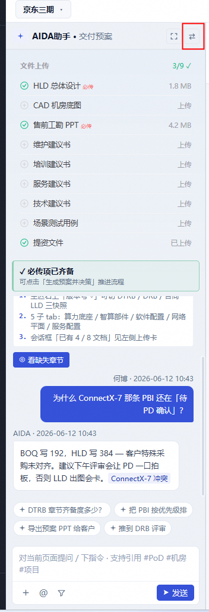

# 0612 bug修复说明

- 收起侧边栏

参考图片信息，修改交付预案页面中，左侧边栏红框处的UI为向左收起侧边栏按钮，当收起后，按钮变成向右展开侧边栏

- 更改右侧边栏目录：
当前交付预案展示页面中，有5.3章节 集群设备配置，但是右侧边栏没有目录，你将目录加上，并且，再确认一下目录中有有没有缺失的章节

- 拖拽窗口操作方式：
当前交付预案页面中，拖拽左侧边栏右侧，改变边框大小的拖拽逻辑有问题，当前拖拽逻辑为，点击侧边，向左拖拽，面板宽度变大，反之变小，需要将操作修改为，点击侧边向右拖拽，面板宽度变大，反之变小

- 去掉左侧边栏建议问题：
当前交付预案页面中，左侧边栏有class=“claw-suggests”的一些建议问题，现在我需要去掉这些问题，不再显示

- 去掉文本框问题：
当前交付预案页面中，左侧边栏输入框，未输入文字时有默认文本，我现在需要去掉该默认文本
