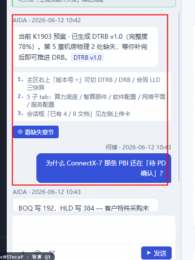

# 修改项目路径
当前暂无后端接口，因此数据暂时mock到本地，关于交付预案模块，对于文件读取和输出的保存，你都需要按照以下路径进行代码更改。
根目录为：D:\reposity\yuan\AIDA\aida\data\delivery\mock
在根目录下有 “组织资产”文件夹以及各个“xxx”的文件夹，“xxx”表示具体项目名称

-  组织资产文件夹路径如下：
组织资产/
├── 智算部件配置标准库          · table · org-assets · 本期
├── AI平台白名单          · table · org-assets · 本期
├── 三方系统配套表          · table · org-assets · 本期
├── 解决方案版本配套表          · table · org-assets · 本期
├── 昇腾训练版本标准表          · table · org-assets · 本期
│   └── 09 Ascend Training Solution 25.3.1 版本配套表.xlsx
├── 昇腾推理版本标准表          · table · org-assets · 本期
│   └── 字段：版本号、分类、类别、产品与解决方案、版本号、support-E、support
├── 入场评估标准表              · table · org-assets · 本期
├── 工勘常见高风险库            · table · org-assets · 本期
├── 标准勘测条目说明            · file+md · org-assets · 本期  # 勘测指导、压缩示例图
├── 活动依赖表                  · table · org-assets · 本期
└── 活动定义表                  · table · org-assets · 本期
├── 产品基本信息表.xlsx                  · table · org-assets · 本期
├── 维保建议书
│   └──维保解决方案 服务建议书（通用模板） 02-zh.docx
├── 责任矩阵
│   └──责任矩阵模板.xlsx

-  项目名称文件夹路径如下：
{项目名称}/
├── 孪生世界/                              · folder · 本期
│   ├── 项目孪生/                          · folder · twin-project · 暂不  # IPO 待补，见附录 D
│   └── 算力底座孪生/
│       ├── 输入文件/
│       │   ├── CAD/                       · file · twin-foundation · 本期  # 操作：预案
│       │   │   ├── JXX GA液冷二次侧深化图纸V1.1 20260112.dwg
│       │   │   ├── JXX-500KW-CDU机柜和管路总装图.DWG
│       │   ├── 售前工勘/                  · file · twin-foundation · 本期  # 操作：预案
│       │   │   ├── JD HC项目世纪互联机房工勘结果- 1209.xlsx
│       │   └── 机房勘测视频/              · file · twin-foundation · 本期  # 操作：智慧工勘
│       ├── 解析结果/                      · folder · twin-foundation · 本期
│       └── 输出结果/
│           └── 机房机柜信息表.xlsx           file · twin-foundation · 本期  #操作：预案；消费者：proposal
│
├── 早期介入/
│   ├── 合同/
│   │   ├── 输入文件/
│   │   │   ├── 合同文件/                  · file · contract · 本期
│   │   │   ├── BOQ/                 · file · contract · 本期  # 仅预销售自传 zip/rar 落此
│   │   │       └──JXX 服务BOQ.rar
│   │   │       └──JXX三期BOQ（数通和智算）.rar
│   │   ├── 解析结果/
│   │   │   ├── BOQ/   · file · contract · 本期  # BOQ 解析公共能力原始要素，见 §4.1.4
│   │   │   └── 项目交付场景信息表.xlsx            · file · contract · 本期
│   │   └── 输出结果/
│   │       ├── 项目基础信息表.xlsx   file · contract · 本期  # 合同页项目信息区落盘，见 §4.1.5
│   │       └── 建模仿真/          · file · contract · 本期
│   │       │   └── 建模仿真设备信息表.md          · file · contract · 本期
│   │       │   └── device_info_table.json
│   │       │   └── device_info_table.v0.json
│   │       │   └── device_info_table.v0.md
│   │       ├── 合同BOQ列表.xlsx    file · contract · 本期  勾选清单：BOQ名称/编号/版本号/链接
│   │       └── BOQ信息表.xlsx            · file · contract · 本期  # BOQ 元信息（必存）
│   │
│   └── 交付预案/
│       ├── 输入文件/
│       │   ├── HLD/                       · file · proposal · 本期
│       │       └── 02 JXX项目HLD_0114精简版1.0.pptx file · proposal · 本期
│       │   ├── 服务建议书/                · file · proposal · 本期
│       │   ├── 维保建议书/                · file · proposal · 本期
│       │       └── 维保解决方案 服务建议书（通用模板） 02-zh.docx
│       │   ├── 技术建议书/                · file · proposal · 本期  # 验收策略 多模态解析输入
│       │       └── DSXW算力服务器项目_技术建议书(含算力服务器、网络、存储、机房租赁) -不含人员信息.docx
│       │   ├── 合同/                       · file · proposal · 本期  # 验收策略 多模态解析输入（合同.doc）
│       │   └── 测试用例/                  · file · proposal · 本期  # 测试用例 多模态解析输入
│       │       └── A3超节点验收测试用例-液冷场景V1.2.docx
│       ├── 解析结果/
│       │   ├── HLD解析结果/               · folder · proposal · 本期
│       │   ├── 服务建议书解析结果/        · folder · proposal · 本期
│       │   ├── 维保建议书解析结果/        · folder · proposal · 本期
│       │   ├── 技术建议书解析结果/        · folder · proposal · 本期
│       │   ├── 测试用例解析结果/          · folder · proposal · 本期  # → §4.2 测试用例表
│       │   └── 验收策略解析结果/          · folder · proposal · 本期  # 技术建议书/合同 解析 → 验收策略
│       ├── 输出结果/                      · file 集合 · proposal · 本期  # 见 §4.2、附录 C；
│       │   └── 预案版本信息表.xlsx
│       │   └── 项目背景信息表.xlsx
│       │   └── 设备信息表.xlsx
│       │   └── 智算部件配置信息表.xlsx
│       │   └── 软件配置信息表.xlsx
│       │   └── 共平面类型表.xlsx
│       │   └── 网络平面配置信息表.xlsx
│       │   └── 网管服务器配置表.xlsx
│       │   └── 集群设备清单表.xlsx
│       │   └── 预集成预验证需求信息表.xlsx
│       │   └── 服务配置表.xlsx
│       │   └── 服务内容表.xlsx
│       │   └── 维保策略表.xlsx
│       │   └── 维保SLA表.xlsx
│       │   └── 项目责任矩阵.xlsx
│       │   └── 验收策略.xlsx
│       │   └── 测试用例.xlsx
│
├── 交付方案/                              · folder · delivery-scheme · 暂不  # 见附录 D
│   ├── 输入文件/
│   ├── 解析结果/
│   └── 输出结果/
│
├── 项目管理/
│   ├── 基本信息/                          · folder · pm-basic · 本期
│   │   └── 交付项目信息、项目任命、合同     ·    file · pm-basic · 本期
│   ├── 计划/
│   │   ├── 输入文件/
│   │   │   └── 到货信息表                  · file · pm-plan · 本期
│   │   │   └── 资源信息表                  · file · pm-plan · 本期
│   │   ├── 解析结果/                      · folder · pm-plan · 本期
│   │   └── 输出结果/
│   │       └── 交付计划表.xlsx                  · file · pm-plan · 本期
│   │       └── 草稿表.xlsx                  · file · pm-plan · 本期
│   ├── 任务/                              · pm-task · 本期
│   │   ├── 输入文件/ · 
│   │   ├── 解析结果/
│   │   └── 输出结果/ 
│   │       └── 任务信息表.xlsx
│   │       └── 任务信息_历史进展.xlsx
│   ├── 风险/                              · pm-risk · 本期
│   │   ├── 输入文件/ · 
│   │   ├── 解析结果/
│   │   └── 输出结果/ 
│   │       └── 风险信息表.xlsx
│   │       └── 风险信息_应对措施.xlsx
│   ├── 假设/                              · pm-assumption · 本期  # IPO 细表 TBD
│   ├── 问题/                              · pm-issue · 本期
│   │   ├── 输入文件/ · 
│   │   ├── 解析结果/
│   │   └── 输出结果/ 
│   │       └── 问题信息表.xlsx
│   │       └── 问题信息_历史进展.xlsx
│   └── 变更/                              · pm-change · 本期  # IPO 细表 TBD
│
├── 交付作业/
│   ├── 智慧工勘/                          · ops-survey · 本期
│   │   ├── 输入文件/
│   │   │   └── 勘测图片文件夹/                  · folder ·ops-survey · 本期
│   │   │   └── 项目名称_机房名称_全量勘测结果表      file · ops-survey · 本期
│   │   │   └── 项目名称_机房名称_视频勘测结果表      file · ops-survey · 本期
│   │   ├── 解析结果/
│   │   └── 输出结果/
│   │       └── 机房仿真数据表
│   │       └── {项目名称}_{机房名称}_全量勘测结果表_Rx
│   │       └── {项目名称}_{机房名称}_问题清单表_Rx
│   │       └── {项目名称}_{机房名称}_工勘报告_Rx
│   │       └── {项目名称}_工勘报告
│   ├── 规划设计/                          · ops-design · 本期
│   │   ├── 输入文件/
│   │   │   └── 项目信息收集表.xlsx                  · file · ops-design · 本期
│   │   ├── 解析结果/
│   │   └── 输出结果/
│   │       ├── 建模仿真/                  · folder · 本期
│   │          └── 建模仿真输出文档001-设备信息表    file · ops-design · 本期
│   │          └── 建模仿真输出文档004-设备位置表    file · ops-design · 本期
│   │          └── 建模仿真输出文档005-设备汇总表    file · ops-design · 本期
│   │          └── 建模仿真输出文档006-设备落位图    file · ops-design · 本期
│   │          └── 建模仿真输出文档007-端口连线表    file · ops-design · 本期
│   │          └── 建模仿真输出文档008-物理连线表    file · ops-design · 本期
│   │          └── 建模仿真输出文档009-线缆需求表    file · ops-design · 本期
│   │          └── 建模仿真输出文档010-布线临时标签表 file · ops-design · 本期
│   │       └── 系统设计/                  · folder · 本期
│   │          └── LLD设计                       file · ops-design · 本期
│   │          └── ZTP配置文件                    file · ops-design · 本期
│   │          └── 计算子系统验收用例Word           file · ops-design · 本期
│   ├── 设备安装/                          · ops-install · 本期
│   │   ├── 输入文件/ 
│   │   ├── 解析结果/ ·
│   │   │   └── 责任人信息                  · file · ops-install · 本期·
│   │   │   └── 安装任务集                  · file · ops-install · 本期·
│   │   │   └── 型号→设备大类映射                  · file · ops-install · 本期·
│   │   │   └── SN扫码分组                  · file · ops-install · 本期·
│   │   ├── 输出结果/ ·
│   │   │   └── 责任人信息表模板                  · file · ops-install · 本期·
│   │   │   └── 设备安装全量计划                  · file · ops-install · 本期·
│   │   │   └── 设备安装实施计划                  · file · ops-install · 本期·
│   │   │   └── SN扫码表_{机房}_{设备大类}           file · ops-install · 本期·
│   │   │   └── 完工清单_{机房}_{设备大类}           file · ops-install · 本期·
│   │   │   └── 设备安装完工报告                  · file · ops-install · 本期·
│   └── 部署调测/                          · ops-deploy · 本期
│   │   ├── 输入文件/ 
│   │   │   └── CloudOps任务参数模板                  · file · ops-deploy · 本期·
│   │   ├── 解析结果/ ·
│   │   │   └── 二级任务规范化集                  · file · ops-deploy · 本期·
│   │   │   └── 三级调测活动集                  · file · ops-deploy · 本期·
│   │   │   └── 设备底表长表                  · file · ops-deploy · 本期·
│   │   │   └── 设备完工宽表索引                  · file · ops-deploy · 本期·
│   │   │   └── CloudOps初配工作簿                  · file · ops-deploy · 本期·
│   │   │   └── CloudOps完整工作簿                  · file · ops-deploy · 本期·
│   │   │   └── Toolkit可执行设备列表                  · file · ops-deploy · 本期·
│   │   ├── 输出结果/ ·
│   │   │   └── 全量设备完工清单列表_{项目名称}                  · file · ops-deploy · 本期·
│   │   │   └── CloudOps初始配置                  · file · ops-deploy · 本期·
│   │   │   └── CloudOps配置_手工补充                  · file · ops-deploy · 本期·
│   │   │   └── CloudOps完整配置文件                  · file · ops-deploy · 本期·
│   │   │   └── 验收测试报告                  · file · ops-deploy · 本期·
│   │   │   └── Atlas 900 A3超节点大模型预训练实测数据.md                  · file · ops-deploy · 本期·
├── 项目复盘/                              · retro · 暂不
│   ├── 输入文件/ · 
│   ├── 解析结果/ · 
│   └── 输出结果/
├── Skill定制/                              · folder · 本期  # 可选；见 §2.6
│   ├── skill_binding.json                 · index · 本期  # 本项目覆盖声明（无则 100% 组织级）
│   └── {域}/…/{skill_id}/                · skill包 · 与 §2.3.1 域结构镜像
└── 项目文档/                              · program-docs · 本期  # 归档，非模块 IPO

**你需要做的事情如下**：
1.创建对应文件夹目录，无需创建具体文件，文件可以从该路径获取：D:\reposity\yuan\AIDA\aida\mock数据，对于没有的文件，不用理会，我之后会手动加入
2.屏蔽预制内容：将交付预案界面左侧对话框，预制的这些对话内容暂时屏蔽掉，不要展示，通过一个变量来控制是否展示

